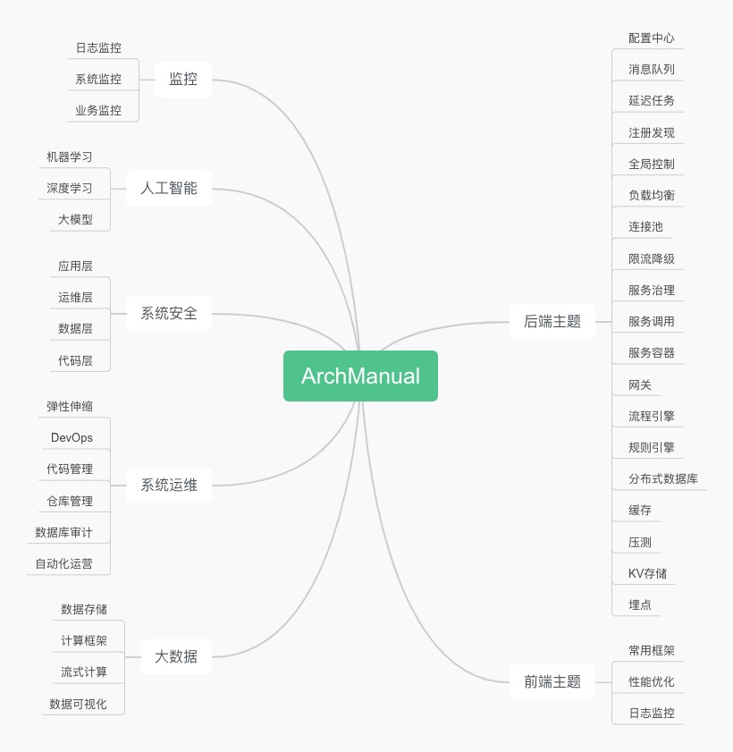

# ArchManual

### 项目介绍
ArchManual  
**不是**：   
某个技术架构的深度剖析  
某个技术框架的源码分析  
某个技术工具的安装运维   
某个技术类库的代码示例   
**而是**：  
常用分布式技术的总体概览  
常用技术主题的归纳总结  
常用技术框架的归类罗列  
常用技术架构的简单分享  
**希望成为**：  
速查手册：平时工作中做技术架构、框架选型时的速查手册    
学习提纲：业余学习或者面试时的一个学习提纲   
技术地图：希望能起到一些指引的作用。也希望每个技术小伙伴都能积极参与，分享知识，丰富`ArchManual`

### 整体概览 
- 概览图：  
  
- 地址：  
[思维导图](https://www.processon.com/view/link/65b74ca5ec61176de3760fc3)

### 导航

- [后端主题](#后端主题)
- [前端主题](#前端主题)
- [系统运维](#系统运维)
- [监控](#监控)
- [大数据](#大数据)
- [系统安全](#系统安全)
- [通用架构](#通用架构)
- [人工智能](#人工智能)  

#### 后端主题
- [配置中心](backend/config/index.md)  
    - [Apollo](https://github.com/apolloconfig/apollo)
    - [Nacos](https://github.com/alibaba/nacos)
    - [Spring Config](https://github.com/spring-cloud/spring-cloud-config)
    - [Disconf](https://github.com/knightliao/disconf)
- [消息队列](backend/mq/index.md)
    - 分布式消息队列
        - [Kafka](https://github.com/apache/kafka)
        - [RocketMQ](https://github.com/RocketMQ)
        - [RabbitMQ](https://github.com/rabbitmq)
        - [ActiveMQ](https://github.com/apache/activemq)
        - [Redis](https://github.com/redis/redis)
    - 内存消息队列（线程间消息传递）
        - [Disruptor](https://github.com/LMAX-Exchange/disruptor)
    - MTTQ（应用于物联网）
        - [EMQX](https://github.com/emqx/emqx)
        - [Mosquitto](https://github.com/eclipse/mosquitto)
        - [NanoMQ](https://github.com/nanomq/nanomq)
- [延迟任务](backend/dq/index.md)
    - 消息队列
        - [RabbitMQ TTL + 死信队列](backend/dq/index.md)
        - [RabbitMQ 延迟队列插件(*推荐)](backend/dq/index.md)
        - [RocketMQ 定时消息(*推荐)](backend/dq/index.md)
    - Redis缓存
        - [定时轮询zset](backend/dq/index.md)
        - [Redis Key过期监听](backend/dq/index.md)
        - [Redisson 分布式延迟队列 RDelayedQueue (*推荐)](backend/dq/index.md)
    - 定时轮询
        - [Spring Task](backend/dq/index.md)
        - [XXL-Job](backend/dq/index.md)
        - [Elastic-Job](backend/dq/index.md)
    - 内存队列
        - [JDK DelayQueue](backend/dq/index.md)
    - 时间轮算法
        - [Netty的HashedWheelTimer](backend/dq/index.md)
        - [Kafka的TimingWheel](backend/dq/index.md)
- [任务调度](backend/task/index.md)
    - [xxl-job](https://github.com/xuxueli/xxl-job)
    - [Elastic-job](https://github.com/apache/shardingsphere-elasticjob)
    - [powerJob](https://github.com/PowerJob/PowerJob)
    - [Saturn](https://github.com/vipshop/Saturn)
    - [Quartz](https://github.com/quartz-scheduler/quartz)
- [分布式ID](backend/id/index.md)
    - [Snowflake(雪花算法）](backend/dq/index.md)
    - [Redis 自增ID](backend/dq/index.md)
    - [美团 Leaf](backend/dq/index.md)
- [分布式锁](backend/lock/index.md)
    - [Redis ](backend/dq/index.md)
    - [Zookeeper](backend/dq/index.md)
    - [Etcd](backend/dq/index.md)
- [分布式事务](backend/transaction/index.md)
    - XA
        - [ShardingSpere]()
        - [MyCat]()
        - [Spring JTA]()
    - 同步调用
        - TCC(Try/Confirm/Cancel)
            - [byteTCC]()
            - [tcc-transaction]()
            - [easy-transaction]()
            - [Hmily]()
        - Saga
            - [Ali Seata]()
    - 异步调用
        - MQ支持可靠消息(RocketMQ)
        - 可靠消息服务+MQ
        - 本地消息表 + MQ 
- [注册发现](backend/registry/index.md)
    - [Eureka + Ribbon]()
    - [Nacos]()
    - [Consul]()
    - [Zookeeper]()
- [限流与降级](backend/fallback/index.md)
    - [Hystrix]()
    - [Sentinel]()
- [负载均衡](backend/loadbalance/index.md)
    - HttpDNS
    - DNS
    - F5(硬件）
    - LVS（4层）
    - Nginx（7层）
    - HAProxy
- [数据库连接池](backend/dbpool/index.md)
    - Druid
    - HikariCP
    - DBCP2
- [流程引擎](backend/workflow/index.md)
    - activiti
    - flowable
    - camunda
- [服务容器](backend/server/index.md)
    - Tomcat
    - Netty
    - Jetty
- [服务调用](backend/rpc/index.md)
    - RPC
        - Dubbo
        - DubboX
    - HTTP
        - OpenFeign
        - RestTemplate
- [网关](backend/gateway/index.md)
    - Nginx + Lua
    - KONG（基于OpenResty)
    - Zuul
    - Ali Sentinel(限流）
- [存储](backend/storage/index.md)
    - 分布式文件系统
        - Ali OSS
        - Ceph
    - NoSQL
        - 文档数据库
            - MongoDB
        - KV
            - Redis（CA模型）
            - etcd（CP模型）
    - NewSQL
        - TiDB
    - 时序
        - InfluxDB
    - 图数据库
        - Neo4J
    - 搜索
        - ElasticeSearch
    - 向量数据库
- [仓库](backend/warehouse/index.md)
    - 代码仓库
        - gitlab
    - maven仓库
        - nexus
    - docker镜像仓库
        - docker registry
- [分布式数据库](backend/rdms/index.md)
    - 分库分表
        - ShardingSphere(Sharding-JDBC)
        - MyCat
    - 存储引擎
        - 事务
            - InnoDB
        - 顺序写
            - TokuDB
    - 高可用
        - MHA
    - 数据同步
        - 阿里云DTS
        - binlog消费订阅
            - canal
            - databus
        - 增量数据同步
            - otter
        - 全量离线数据同步
            - kettle
    - 数据可视化
        - superset
        - Redash
- [集群管理](backend/cluster/index.md)
    - 元数据协调管理
        - Zookeeper
        - gossip
    - IP地址切换
        - VIP
        - Keepalived
- [缓存](backend/cache/index.md)
    - CDN层
        - ATS(Apache Traffic Server）
        - Squid
    - HTTP层
    - 应用层
        - Caffeine
        - Guava
        - ehcache
    - 分布式缓存
        - Redis
        - JD-hotkey
- [压测](backend/stress/index.md)
    - 线下
        - Apache ab
        - Apache Jmeter
    - 线上
        - Tcpcopy
    - 流量存储和回放
        - GoReplay
- [KV存储](backend/kv/index.md)
    - LevelDB
    - RocksDB
    - BeansDB
    - LMDB
    - Riak
- [弹性伸缩](backend/elastic/index.md)
    - K8S + Docker
    - 云计算
        - 阿里云
        - 腾讯云
- [Java工具包](backend/tools/index.md)
    - guava
#### 前端主题
#### 系统运维
- [仓库管理](ops/repo/index.md)
    - 代码仓库
        - gitlab
    - maven仓库
        - nexus
    - docker镜像仓库
        - docker registry
- [部署容器](ops/deploy/index.md)
    - Docker + K8S
        - docker跨主机组网
            - 原生
                - overlay
                - macvlan
            - 第三方
                - Flannel
                - OpenSwitch
                - weave
                - calico
    - 云服务
        - Aliyun ECS
- [DevOps](ops/devops/index.md) 
    - Gitlab CI / CD
    - Jenkins
- [监控](ops/monitor/index.md)
    - [服务器](ops/monitor/server/index.md)
        - OpenFalcon
        - Zabbix + Grafana
    - [调用链](ops/monitor/chain/index.md)
        - Pinpoint
        - Skywalking
        - CAT
        - SpringCloud Sleuth + Zipkin
    - [业务](ops/monitor/biz/index.md)
        - Falcon
        - CAT metrics
        - Micrometer
    - [JVM](ops/monitor/jvm/index.md)
        - arthas
    - [日志](ops/monitor/log/index.md)
        - ELK
            - FileBeats 采集
            - Kafka 日志队列
            - Logstack 计算
            - ElasticSearch 存储
            - Kibana 展示
        - Flume + Hadoop
#### 大数据
- [流式计算](bigdata/stream/index.md)
    - Spark Streaming
    - Apache Storm
    - Flink
- [分布式文件系统](bigdata/fs/index.md)
    - HDFS
- [BigTable](bigdata/bigtable/index.md)
    - HBase
- [计算框架](bigdata/compute/index.md)
    - Hadoop MapReduce
    - Spark
- [流式计算](bigdata/stream/index.md)
    - Spark Streaming
    - Apache Storm
    - Flink
- [数据分析](bigdata/analyze/index.md)
    - Hive
- 数据可视化
#### 系统安全
#### 通用架构
#### 人工智能
