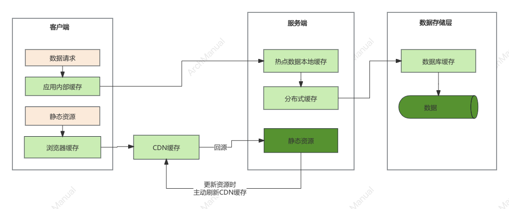
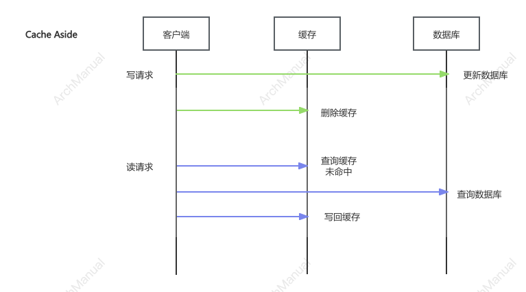
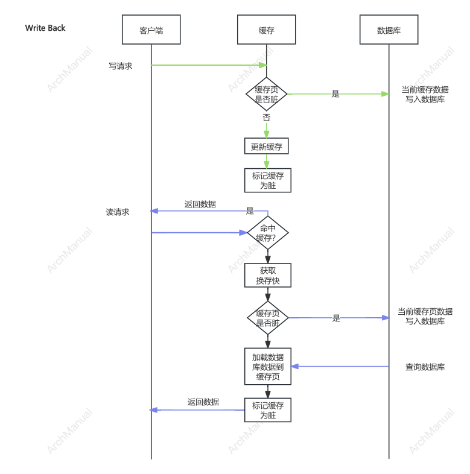

# 缓存
缓存（Cache）是一种高效的数据存储技术，旨在提高数据访问速度。

它将频繁访问或最近使用的数据临时存储在更快速但较小的存储介质（如内存）中，以减少从较慢的存储设备（如硬盘或远程服务器）读取数据的次数。以下是一些关于缓存的关键点：

## 缓存的分类
在系统开发中，缓存可以根据不同的维度进行分类。以下是常见的缓存分类：

### 根据存储介质分类
1. **内存缓存（In-Memory Cache）**：
   - **示例**：Redis、Memcached
   - **特点**：速度快，但容量有限，适用于需要快速访问的数据。

2. **磁盘缓存（Disk Cache）**：
   - **示例**：本地文件系统缓存
   - **特点**：速度较慢，但容量较大，适用于大数据量的缓存需求。

### 根据缓存层级分类
1. **一级缓存（L1 Cache）**：
   - **位置**：通常在CPU内部，靠近处理器核心。
   - **特点**：速度最快，容量最小，用于存储最频繁访问的数据和指令。

2. **二级缓存（L2 Cache）**：
   - **位置**：在CPU内部或外部，介于L1缓存和内存之间。
   - **特点**：速度和容量介于L1缓存和内存之间。

3. **三级缓存（L3 Cache）**：
   - **位置**：通常在多个CPU核心之间共享。
   - **特点**：速度较慢但容量较大，适用于减少不同核心之间的数据访问延迟。

### 根据缓存作用范围分类
1. **本地缓存（Local Cache）**：
   - **特点**：缓存数据存储在本地机器上，适用于单机系统。

2. **分布式缓存（Distributed Cache）**：
   - **示例**：Redis Cluster、Amazon DynamoDB
   - **特点**：缓存数据分布在多个机器上，适用于分布式系统，提高系统的可扩展性和容错能力。

### 根据数据更新策略分类
1. **写通过缓存（Write-Through Cache）**：
   - **特点**：数据在写入缓存的同时也写入后端存储，确保数据一致性。

2. **写回缓存（Write-Back Cache）**：
   - **特点**：数据首先写入缓存，只有在缓存中的数据被替换或过期时才写入后端存储，能提高写入性能，但可能导致数据一致性问题。

### 根据缓存淘汰策略分类
1. **LRU（Least Recently Used）**：
   - **特点**：移除最久未使用的数据。

2. **LFU（Least Frequently Used）**：
   - **特点**：移除访问频率最低的数据。

3. **FIFO（First In, First Out）**：
   - **特点**：按数据进入缓存的顺序进行移除，先进入的先移除。

### 根据应用场景分类
1. **浏览器缓存（Browser Cache）**：
   - **特点**：存储网页资源（如HTML、CSS、JavaScript等），减少页面加载时间。

2. **数据库缓存（Database Cache）**：
   - **示例**：MySQL Query Cache、Oracle Result Cache
   - **特点**：缓存数据库查询结果，提高查询性能。

3. **应用缓存（Application Cache）**：
   - **示例**：Spring Cache、Ehcache
   - **特点**：应用程序内部实现的缓存机制，减少对后端服务的调用。

### 其他分类
1. **会话缓存（Session Cache）**：
   - **特点**：用于存储用户会话数据，如登录状态、购物车等。

2. **对象缓存（Object Cache）**：
   - **特点**：缓存复杂的对象或数据结构，提高对象的创建和访问速度。

## 常见缓存类型
在日常开发中，确实静态缓存、分布式缓存和热点本地缓存是最常见的三种缓存类型。

### 静态缓存
**定义**：静态缓存通常用于缓存静态内容，例如HTML页面、CSS文件、JavaScript文件、图像等。它可以显著减少服务器负载和响应时间。

**应用场景**：
- **网页缓存**：浏览器缓存网页资源，减少对服务器的请求，提高页面加载速度。
- **内容分发网络（CDN）**：CDN缓存网站的静态资源，将内容分发到全球各地的边缘节点，提高用户访问速度。

**实现方式**：
- **HTTP缓存头**：使用Cache-Control、ETag、Last-Modified等HTTP头控制缓存行为。
- **反向代理**：例如Nginx、Varnish等反向代理服务器，用于缓存静态资源并响应请求。

### 分布式缓存
**定义**：分布式缓存是将缓存数据分布在多个服务器节点上，以提高系统的可扩展性和容错能力。它适用于分布式系统或高并发场景。

**应用场景**：
- **大规模Web应用**：如社交网络、电子商务网站，需要处理大量用户请求。
- **分布式系统**：在微服务架构中，各个服务之间共享和缓存数据。

**实现方式**：
- **Redis**：高性能的分布式内存数据库，支持数据持久化和高可用集群。
- **Memcached**：轻量级的分布式内存缓存系统，适用于缓存简单数据结构。

### 热点本地缓存
**定义**：热点本地缓存是指将频繁访问的数据缓存到本地内存中，以提高访问速度和减少对远程服务的依赖。通常用于单机系统或单个服务实例内。

**应用场景**：
- **应用程序内部缓存**：如Java应用中的Ehcache、Guava Cache，用于缓存计算结果或数据库查询结果。
- **临时数据缓存**：如用户会话数据、短期有效的数据等。

**实现方式**：
- **Ehcache**：Java中常用的开源缓存框架，支持多种缓存策略和持久化。
- **Guava Cache**：Google的Guava库提供的轻量级缓存实现，适用于简单缓存需求。

## 缓存的读写策略
选择缓存的读写策略是缓存设计中的关键步骤，它直接影响系统的性能、数据一致性和可用性。以下是几种常见的缓存读写策略及其适用场景：

### 1.旁路 Cache Aside

##### 读旁路（Cache Read-Aside）
**定义**：应用程序首先从缓存读取数据，如果未命中，则从后端数据源读取，并将数据手动写入缓存。

**优点**：
- 简单易实现，适用于现有系统的改造。
- 可以灵活地控制缓存更新策略。

**缺点**：
- 需要在应用程序中添加缓存逻辑，增加了代码复杂度。
- 可能导致缓存与后端数据源的一致性问题。

**适用场景**：
- 读写操作相对均衡的场景。
- 应用程序可以接受一定程度的数据不一致。

##### 写旁路（Cache Write-Aside）
**定义**：应用程序直接将数据写入后端数据源，并删除缓存。

**优点**：
- 简单易实现，适用于现有系统的改造。
- 保证后端数据源的权威性。

**缺点**：
- 读取操作需要额外处理缓存未命中的情况。

**适用场景**：
- 读操作频繁，写操作较少的场景。
- 对数据一致性有较高要求。

### 2.读写穿透 

##### 读穿透（Cache Read-Through）
**定义**：当缓存未命中时，缓存系统自动从后端数据源读取数据，并将其存储在缓存中。

**优点**：
- 简化了应用程序的逻辑，应用只需与缓存交互。
- 确保缓存与后端数据源的一致性。

**缺点**：
- 需要额外的读操作，增加了延迟。
- 复杂性增加，可能需要定制缓存和数据源的集成。

**适用场景**：
- 读取频繁、写入较少的场景。
- 需要保证数据的一致性。

##### 写穿透（Cache Write-Through）
**定义**：当数据写入缓存时，缓存系统同步将数据写入后端数据源。

**优点**：
- 保证数据的一致性。
- 简化应用程序的逻辑，应用只需与缓存交互。

**缺点**：
- 写操作需要同步到后端数据源，增加了写操作的延迟。
- 缓存系统和后端数据源之间的同步可能会影响性能。

**适用场景**：
- 写操作频率较低，读取频繁的场景。
- 需要保证数据一致性的重要数据。

### 3. 写回（Cache Write-Back）

**定义**：数据首先写入缓存，并在一定时间或条件下异步写入后端数据源。

**优点**：
- 提高写操作的性能，减少写入延迟。
- 缓解后端数据源的写压力。

**缺点**：
- 复杂性增加，需处理缓存和后端数据源的一致性问题。
- 可能导致数据丢失或不一致，特别是在系统崩溃或缓存失效时。

**适用场景**：
- 写操作频繁，需要高性能的写入场景。
- 可以容忍一定程度的数据不一致或延迟。

### 如何选择合适的策略？
1. **读写频率**：分析读写操作的频率，如果读多写少，读穿透和读旁路较为适用；如果写多读少，写穿透和写回较为适用。
2. **数据一致性要求**：如果数据一致性要求高，优先考虑读穿透和写穿透策略；如果可以接受一定的一致性延迟，可以选择写回策略。
3. **性能要求**：如果对写入性能要求高，写回策略可以提高写操作的性能；如果对读取性能要求高，读穿透和读旁路可以提高读取速度。
4. **复杂性和实现成本**：考虑实现的复杂性和维护成本，选择合适的策略平衡性能和开发复杂性。
