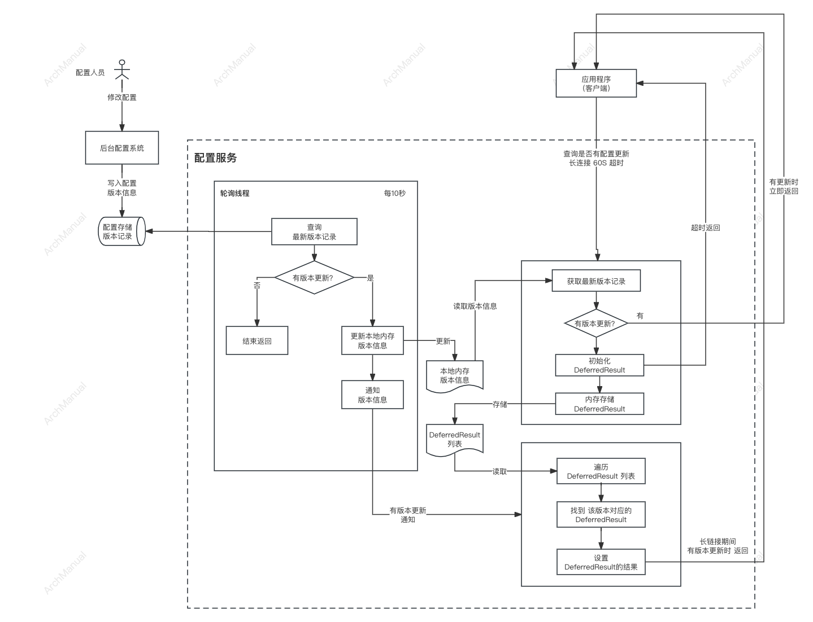

# 配置中心
## 场景
- 系统的两类配置：一类是数据库账号等配置，另外一类是程序中硬编码的一些业务参数（比如：一些阈值、开关等）
- 对账号类的配置，不同环境需要有不同的配置，并且生产环境的一些配置需要保密
- 对业务类参数，随着业务的变化，需要经常调整。而调整时，需要重新发布系统，带来不必要的运维工作

## 功能
- **一致性**：分布式环境下，系统的一些配置进行修改，配置修改后，需要对所有服务节点生效
- **实时性**：配置修改后，需要实时生效，不需要重启应用
- **多环境**：不同环境（DEV、UAT、FAT、PROD）等，需要有不同的配置
- **统一性**：需要有统一的配置界面，对各个系统进行配置
- **安全性**：对生产环境的账号密码，要做到权限隔离
- **稳定性**：配置中心是所有服务都依赖的的中间件，如果配置中心出现问题，可能会影响所有的服务，所以要支持集群部署，以增强其稳定性
- **版本管理**：可以管理多个历史版本，方便及时的回滚到某个版本
- **多格式**：支持Properties、Json、Yaml 等不同文件格式的转换存储，方便系统的配置迁移到配置中心
- **灰度发布**：配置有变更时，需要将配置推送的部分机器上做验证，验证通过后在推送所有的机器上

## 架构
### 1. 配置如何及时推送到应用？
以Apollo为例，流程图如下：    
  
1）后台配置系统修改配置，发布新版本，版本信息写入数据库中，`版本信息表`   
2）`轮询线程`隔一段时间（比如 10秒）查询一个数据库的版本信息表，看是否有版本更新，有版本更新时将最新的版本信息存到本地内存，同时通知客户端  
3）通知客户端的方式，是通过`DeferredResult`，设置`DeferredResult`的`Result`，对应的长连接会立刻返回给客户端   
4）客户端向后端查询版本更新信息，该查询通过`长连接`的方式，超时设置为60秒，超时之后，客户端向后端重新查询   
5）后端的查询接口中，会new一个`DeferredResult`对象，并设置改对象的超时时间和超时的返回值。查询内存中是否有最新的版本信息，如果有最新的版本信息则设置`DeferredResult`的`Result`，
直接返回。如果没有最新的版本信息，则将`DeferredResult`对象放到内存列表中，存储起来，等待后续的通知。
### 2. 如何保证配置中心的稳定性？
1）集群部署  
配置服务采用集群部署，应用客户端通过负载均衡来访问配置服务。  
2）客户端缓存  
应用的客户端本地缓存一份配置，如果配置服务出现故障，无法提供服务，应用还可以继续使用本地的配置  

## 工具
推荐
- Apollo    [官网](https://www.apolloconfig.com/)  [Github](https://github.com/apolloconfig/apollo)  
- Nacos     [官网](https://nacos.io/)  [Github](https://github.com/alibaba/nacos)
- Spring Config [Github](https://github.com/spring-cloud/spring-cloud-config)

其他
- Disconf  [Github](https://github.com/knightliao/disconf)
