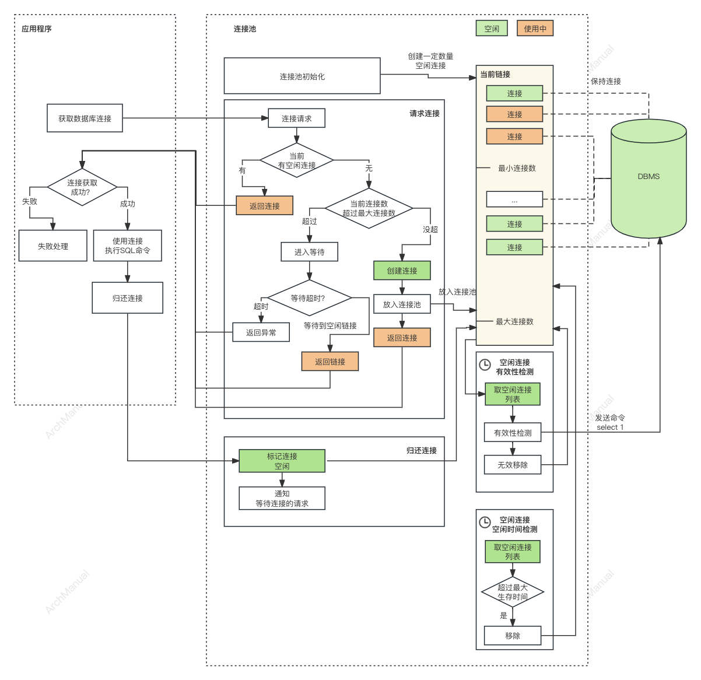

# 数据库连接池
数据库池化技术，也常被称为连接池技术，是一种在数据库应用中广泛使用的技术，旨在减少数据库连接的开销，提高系统的性能和资源利用率。
其核心思想是预先创建一定数量的数据库连接并将这些连接集中管理，形成一个连接池。
当应用程序需要进行数据库操作时，它可以直接从连接池中获取一个已经存在的连接，使用完毕后再将连接返回池中，而不是每次操作都重新建立和销毁连接。

## 目的
使用数据库池化技术的目的包括：

1. **提高性能**：通过重用现有的连接，减少了连接和断开连接所需的时间，从而加快了数据库操作的速度。
2. **节约资源**：连接数据库需要消耗计算机网络和数据库服务器的资源。连接池通过限制打开的连接数，帮助控制资源的使用，防止资源过度使用。
3. **增加稳定性**：连接池可以管理连接的生命周期，包括检测无效的连接并将其替换，这有助于提高应用程序的稳定性。
4. **易于管理**：连接池提供了一套集中的管理机制，使得数据库连接的配置、监控和调整变得更加容易。

数据库连接池通常有几个关键参数来控制其行为，如最小/最大连接数、连接超时时间、空闲连接的生命周期等。合理配置这些参数对于优化应用程序性能至关重要。

## 功能性要求

一些关键的功能性要求：

### 1. **连接复用**
- 能够重用现有的数据库连接，避免频繁地创建和销毁连接，以提高应用程序的性能。

### 2. **连接管理**
- 自动管理连接的生命周期，包括打开、关闭、验证和维护连接的健康状态。
- 能够自动回收长时间未使用的连接以释放资源。
- 在连接因为数据库服务器重启或网络问题失效时，能够自动识别并替换无效连接。

### 3. **并发控制**
- 支持高并发环境下的连接请求，确保连接池在多线程或多进程条件下的线程安全性。

### 4. **配置灵活性**
- 提供灵活的配置选项，允许开发者根据应用需求调整最大连接数、最小空闲连接数、连接超时时间、空闲连接的生命周期等参数。

### 5. **负载均衡**
- 在多数据库实例的环境中，支持负载均衡，合理分配连接请求到不同的数据库实例，以优化资源使用和提高性能。

### 6. **连接泄露检测**
- 能够检测并警告或自动回收那些被客户端获取但未正确返回给连接池的连接，防止连接泄露导致的资源耗尽。

### 7. **异常处理**
- 能够优雅地处理数据库连接过程中的异常，包括提供重试机制或者将错误信息反馈给应用程序。

### 8. **性能监控**
- 提供监控功能，记录关键的性能指标，如连接池的使用情况、连接获取时间、活跃连接数等，帮助开发者优化应用性能。

### 9. **透明性**
- 对于应用程序来说，使用连接池获取数据库连接的过程应该是透明的，不需要对业务代码做大的改动。

### 10. **多种数据库支持**
- 能够支持多种数据库系统，使得开发者可以在不同的数据库产品之间切换，而不需要重写连接池相关的代码。

## 原理

以MySQL连接池为例来说明数据库连接池的地址原理。

MySQL数据库连接池的实现原理基于预先创建和维护一组数据库连接的策略，以优化性能和资源利用。

MySQL连接池有两个重要参数：最大连接数和最小连接数。主要通过这两个来实现连接池中链接的控制和管理。

### 初始化阶段
1. **预创建连接**：在应用启动时，连接池根据配置参数（如最小连接数）预先创建一定数量的数据库连接。这些连接保持打开状态，准备被应用程序使用。

2. **配置参数设置**：连接池的行为可以通过各种参数进行配置，包括最大连接数、最小空闲连接数、连接超时时间、空闲连接的最大生存时间等。

### 运行阶段
1. **连接获取**：当应用程序需要进行数据库操作时，它会从连接池请求一个连接。如果有空闲连接，连接池会立即提供一个现有的连接；
如果没有空闲连接但当前总连接数未达到最大限制，连接池会创建一个新连接并提供给应用程序。
如果当前连接达到了最大限制，则请求等待一段时间，在等待期间仍然没有空闲链接可以使用，则返回异常给应用程序。

2. **连接使用**：应用程序使用获取到的连接进行数据库操作，如查询、更新数据等。

3. **连接返回**：操作完成后，应用程序将连接返回到连接池，而不是关闭它。连接池会将这个连接标记为“空闲”，使其可供后续请求重用。

### 维护阶段
1. **连接验证**：连接池定期检查空闲连接的有效性。无效连接（例如，因为数据库重启而断开的连接）会被关闭并从池中移除。

2. **连接替换**：如果验证失败，连接池会尝试创建一个新的连接以替换无效的连接，保证连接池中的连接总数维持在配置的水平。

3. **空闲连接管理**：为了避免资源浪费，连接池可以配置空闲连接的最大生存时间，超过这个时间的空闲连接会被关闭并从池中移除。

### 实现技术
- **连接池实现**：许多编程语言和框架都提供了内置的或第三方的连接池库。在Java生态中，HikariCP、阿里巴巴的Druid、Apache DBCP和C3P0是广泛使用的MySQL连接池实现。

- **透明性**：对于应用程序来说，使用连接池通常是透明的。应用程序通过标准的数据库连接接口请求连接，而连接池在后台处理连接的管理和分配。

- **性能优化**：通过合理配置连接池参数，如合适的最大/最小连接数、适当的空闲连接生存时间等，可以显著提升数据库操作的性能，同时优化资源的使用。

### 连接数的设置

- **最小连接数**

一般经验公式为：连接数=（核心数*2）+有效磁盘数。

假如服务器CPU是i7的8核，那么连接池连接数大小为 8∗2+1=9 。这仅仅是一个经验公式，具体的还要和线程池数量以及具体业务结合在一起。

- CPU总核数 = 物理CPU个数 * 每颗物理CPU的核数

- 总逻辑CPU数 = 物理CPU个数 * 每颗物理CPU的核数 * 超线程数

或者 一般设置为10 左右

- **最大连接数**

可以将最大连接数设置为数据库服务器允许的最大连接数的50%至70%，然后除以应用服务器的个数。

经验公式为：数据库服务器允许的最大链接数 * 0.7 / 应用服务器个数。

例如，如果MySQL服务器配置允许最多200个连接，有3个客户端，那么连接池的最大连接数可以设置在 200 * 0.7 / 3  = 46

或者 一般设置为20 - 30 即可。

## 工具

推荐
- [HikariCP](https://github.com/brettwooldridge/HikariCP)
- [Druid](https://github.com/alibaba/druid)

其他
- [DBCP2](https://commons.apache.org/proper/commons-dbcp/)
- [C3P0](https://github.com/swaldman/c3p0)