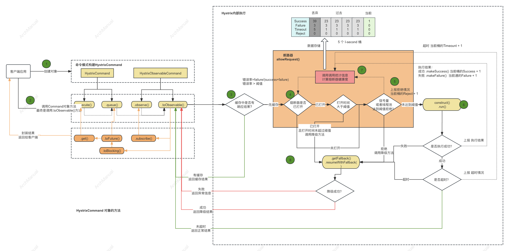
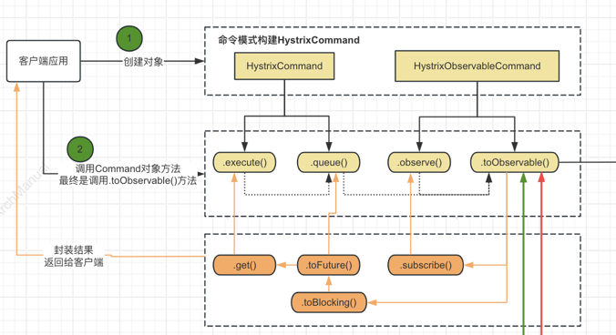
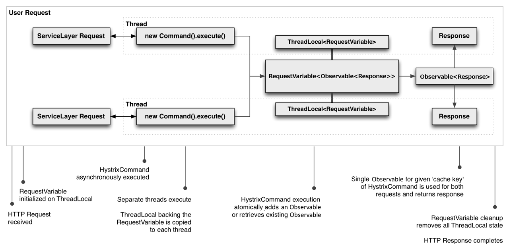
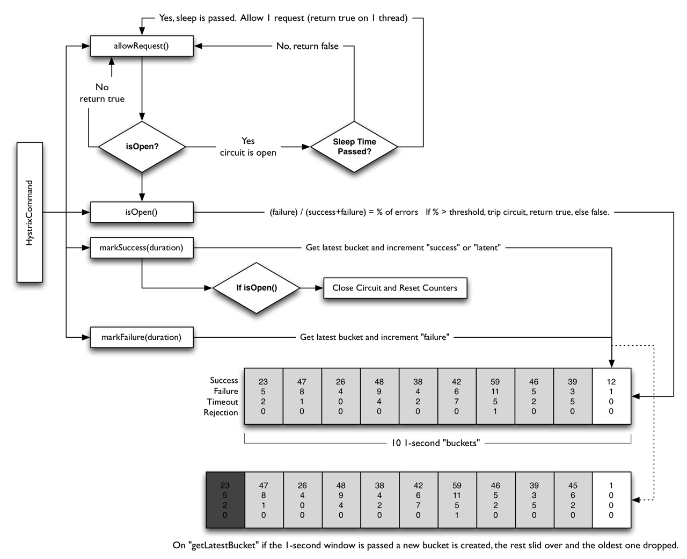
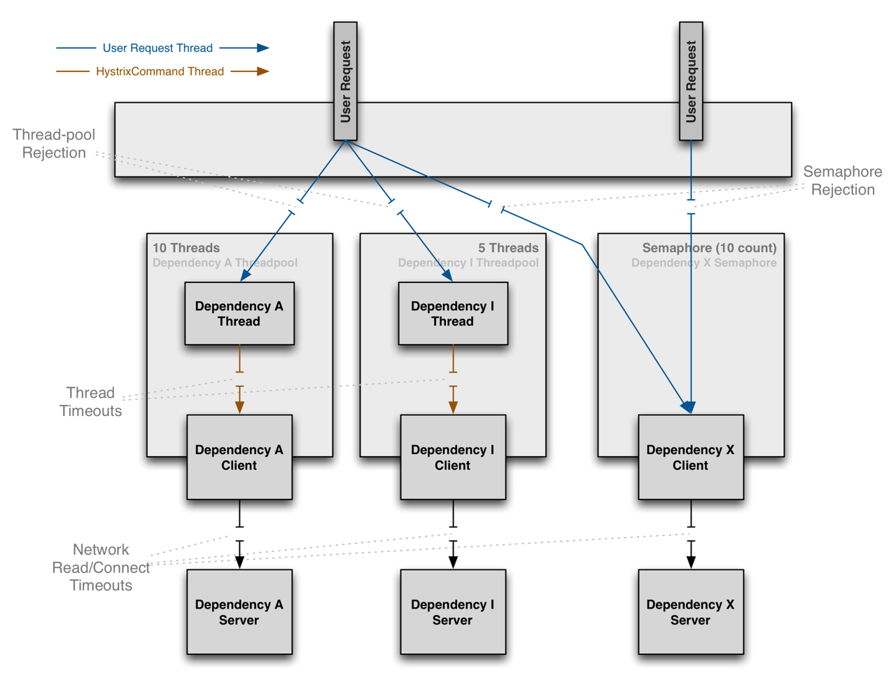
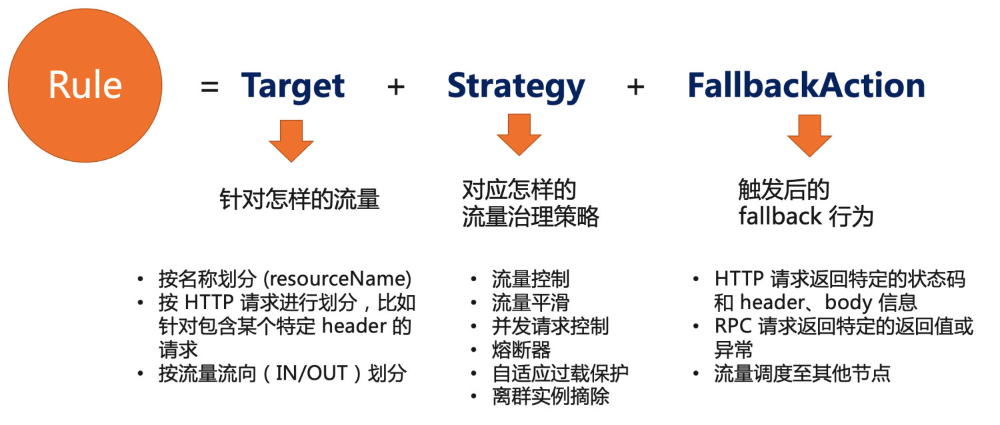

# 服务降级

服务降级是一种常见的应对系统过载或部分系统故障的策略，旨在保证系统的整体可用性和稳定性。

在面对高流量或部分组件故障时，服务降级可以通过减少服务的一部分功能来减轻服务器的负载，从而避免整个系统崩溃，保证核心服务的正常运行。

服务降常见的方式如下：

1. **功能降级**：暂时关闭一些非核心的服务功能，例如搜索引擎的相关搜索结果、电商网站的推荐商品等。
2. **请求降级**：对某些请求进行限流或拒绝，特别是那些计算密集或者对系统影响较大的请求。
3. **数据降级**：简化数据处理流程，比如提供缓存数据而非实时数据。
4. **用户降级**：根据用户级别或请求来源，优先保障VIP用户或内部用户的请求，对于普通用户的请求则可能进行限流或拒绝。

## 场景

在以下场景下可考虑是使用服务降级：

### 1. **高流量场景**
在促销、大型活动或者突发新闻事件期间，网站或应用可能会经历流量激增。

可以在这种情况下通过临时关闭一些非关键功能，如评论、推荐系统等，来减轻服务器负载，确保核心交易或内容访问的流畅。

### 2. **系统部分组件故障**
当系统的某个组件或服务因故障而无法正常工作时，可以通过降低对该组件的依赖，切换到备用流程或提供简化服务来维持系统整体的可用性，如使用缓存数据代替实时数据处理。

### 3. **资源紧张情况**
在服务器资源紧张（如CPU、内存使用率高）或依赖的外部服务响应缓慢时，可以通过降低服务质量，减少资源消耗来防止系统过载。

如:对非核心服务返回缓存内容或者静态内容以减少对数据库的查询和对网服务的访问。

### 4. **维护和部署时期**
在系统维护或部署新版本期间，可能需要临时减少服务负载以避免给正在进行的操作带来影响。

此时，可以实施服务降级策略，如暂停非核心服务，确保关键服务的平稳运行。

### 5. **网络问题**
在网络延迟高或网络连接不稳定时，服务降级可以通过降低对实时数据的依赖，使用本地缓存或降低数据同步频率来改善用户体验。

### 6. **依赖服务限流或不可用**
当系统依赖的外部服务（如第三方API、数据库服务等）限流或暂时不可用时，服务降级可以通过切换到备选方案或提供有限的服务来减少对用户体验的影响。

### 7. **用户级别差异化服务**
对于不同级别的用户，可以实施差异化的服务降级策略，比如在系统负载高时，优先保障VIP用户的服务，对普通用户实施一定程度的服务降级。

## 功能性要求

服务降级的功能性要求主要围绕确保系统的可用性、稳定性以及在高负载和部分服务故障情况下的恢复能力。

实现服务降级策略时，需要考虑以下这些功能点：

### 1. **可配置**
- 服务降级策略应该是可配置的，允许根据不同的场景和需求灵活开启或关闭。
- 支持动态调整降级策略的参数，比如触发服务降级的错误率等。

### 2. **自动触发**
- 能够根据预设的规则或实时的系统指标（如响应时间、错误率、流量、系统负载等）自动触发服务降级。
- 支持自动恢复，当系统指标恢复到正常范围时，能够自动撤销降级状态，恢复正常服务。

### 3. **实时监控与告警**
- 实现对服务降级操作的实时监控，包括哪些服务被降级、降级的程度、触发降级的原因等。
- 提供告警机制，当服务降级被触发或解除时，能够及时通知到相关的运维和开发人员。

### 4. **优雅降级**
- 服务降级时，应确保对用户体验的影响最小化，如提供基础功能页面、展示友好的提示信息等。
- 尽量避免出现服务完全不可用的情况，即使是在非常严重的情况下也要尽量提供核心服务。

### 5. **精细化控制**
- 支持对不同的服务、用户群体或请求类型实施差异化的降级策略。
- 能够根据业务重要性、用户级别等因素来决定降级的优先级和策略。

### 6. **容错与冗余**
- 在服务降级过程中，确保系统的容错性和数据一致性，避免因降级操作引入新的错误或问题。
- 实现服务和数据的冗余策略，即使在部分服务不可用时，也能通过备份或替代方案继续提供服务。

### 7. **性能不受影响**
- 服务降级的实现和管理操作应确保对系统性能的影响降到最低。
- 确保降级逻辑的处理效率，尽可能避免因为降级检查而增加额外的系统负担。

## 实现

常用的一些框架提供了服务降级的功能，包括：Hystrix、Sentinel 等。

### 1. **Hystrix**
Hystrix 工作原理的相关内容参考自 [https://github.com/Netflix/Hystrix/wiki/How-it-Works](https://github.com/Netflix/Hystrix/wiki/How-it-Works)



Hystrix的核心工作机制，包括命令模式、熔断器、资源隔离、降级机制和性能监控。
#### 1.1. **构造Command对象**

构造一个`HystrixCommand` 或者 `HystrixObservableCommand`对象。该对象代码客户端来执行真正的调用请求，调用请求所需的参数作为Command对象构造函数的入参。

如果调用的服务只返回一个响应结果，可以使用`HystrixCommand`。
```java
HystrixCommand command = new HystrixCommand(arg1, arg2);
```
如果通过Observable来返回多个响应，可以使用`HystrixObservableCommand`
```java
HystrixObservableCommand command = new HystrixObservableCommand(arg1, arg2);
```

#### 1.2 **执行命令**

有四个方法可以执行具体命名，分别是`HystrixCommand`对象的`execute()`和`queue()`方法，和 `HystrixObservableCommand`对象的`observe()`和`toObservable()` 方法。
- `execute()` — 阻塞调用，直到依赖的服务返回单个响应或者抛出异常
- `queue()` — 返回一个Future，可以使用Future从依赖的服务中获取单个响应结果
- `observe()` — 订阅方式，通过订阅 `Observable`,可接受来自服务的多个响应结果
- `toObservable()` — 返回一个`Observable`，当订阅它时，会执行具体的 Hystrix 命令并返回具体请求结果

```java
K             value   = command.execute();
Future<K>     fValue  = command.queue();
Observable<K> ohValue = command.observe();         //hot observable
Observable<K> ocValue = command.toObservable();    //cold observable
```
同步调用`execute()`时，在execute中会调用`queue().get()`，在queue()中依次调用`toObservable().toBlocking().toFuture()`。
也就是说，最终每个命令`HystrixCommand`都由实现O`bservable接口的对象返回，即使是返回单个单个值的命令。

如下图所示




#### 1.3 **判断响应是否有缓存**


ystrixCommand 和 HystrixObservableCommand 的实现可以定义一个缓存键，然后在请求中使用该键来去重调用，如果命中缓存健，则直接返回缓存健对应的结果。

以下是涉及 HTTP 请求生命周期的一个示例流程，以及在该请求中进行工作的两个线程：



请求缓存的好处包括：

- 在项目代码的不同地方可以执行 Hystrix 命令，无需担心重复工作。

这在大型项目中特别有益，因为许多开发者会在同一个项目中实现不同的功能模块。

例如，所有需要获取用户的 Account 对象的代码路径可以像这样请求它：

```java
Account account = new UserGetAccount(accountId).execute();

// 或者

Observable<Account> accountObservable = new UserGetAccount(accountId).observe();

```

Hystrix  `RequestCache` 将执行底层的 `run()`, `run()`方法只会被执行一次， 尽管实例化了不同的实例，执行 HystrixCommand 的两个线程将接收到相同的数据返回。

- 数据返回在整个请求中是一致的。

由于第一次响应被缓存，所以同一请求在下次调用时，会返相同的结果。

- 消除了多余线程执行。

由于请求的结果 在 construct() 或 run() 方法调用之前缓存，Hystrix 可以在启动新的执行线程前，将结果返回。这样可以避免产生新的线程，减少线程调用的开销。

如果 Hystrix 没有实现请求缓存功能，那么每个命令都需要在 construct 或 run 方法内部自行实现它，缓存结果的查询要放到新线程创建后，所有无法避免新的线程的创建。


#### 1.4 **判断断路器是否已打开**

当执行该命令时，Hystrix 会检查断路器的开关是否已打开。

如果开关已打开，则 Hystrix 将不会执行该命令，而是快速Fallback(第8步)。

如果开关已打开，则流程跳到 第5步，检查是否有可用线程或者信号量来运行命令。

#### 1.5 **判断线程池/队列/信号量的容量**

如果与该命令关联的线程池和队列（或信号量，如果不在线程中运行）已满，则 Hystrix 将不会执行该命令，但会跳转 第8步，执行 Fallback。

#### 1.6 **执行具体请求**

Hystrix 向依赖的服务触发具体的业务请求，在下面的两个方法中编写具体的业务调用逻辑

- `HystrixCommand.run()` — 返回单个响应或抛出异常
- `HystrixObservableCommand.construct()` — 返回一个 Observable，它发出响应或发送 onError 通知

如果 run() 或 construct() 方法执行工程中超时了，线程将抛出 TimeoutException（或者如果命令本身没有在其自己的线程中运行，则由单独的定时器线程抛出）。
在这种情况下，Hystrix 会跳转到 第 8 步，调用Fallback 降级来返回响应。 

#### 1.7 计算健康状况

Hystrix 向断路器报告成功、失败、拒绝和超时，断路器维护一组用于计算统计数据的滚动计数器。

它使用这些统计数据来确定电路何时应该将开关打开（“跳闸”），如果开关打开了，它会拒绝任何后续请求，直到恢复期结束。

恢复期结束后，在首次检查某些运行状况时，如果新请求通过了，Hystrix将关闭开关。

#### 1.8 降级

Hystrix会在以下情况下尝试降级（Fallback)：
- 执行命令失败包括：`construct()` or `run()`中抛出异常（第6步）。
- 当断路器的开关打开时，导致请求被拒绝（第4步）。
- 当线程池或者信号量满了之后，导致无法处理情况，请求被拒绝（第5步）。
- 当命令执行超时时。

编写降级方法(Fallback)时，在降级方法中中返回一个通用响应，最好不要依赖任何网络请求，这个请求的响应结果可以来自内存的缓存或者某个静态逻辑。
如果必须依赖于网络低啊用，则应该通过另外一个`HystrixCommand`或`ystrixObservableCommand`来实现。

- `HystrixCommand`, 如果 `HystrixCommand`, 则通过实现`HystrixCommand.getFallback() `接口，来编写具体的降级逻辑，该接口返回一个降级的接口。
- `HystrixObservableCommand`，如果是`HystrixObservableCommand`，则通过实现`HystrixObservableCommand.resumeWithFallback() `接口，编辑具体的降级逻辑，返回一个或者多个结果。

Hystrix 将把降级方法返回的结果直接返回给调用者。`HystrixCommand.getFallback()` 和 `HystrixObservableCommand.resumeWithFallback() ` 都返回同一个 `Observable`。

如果未实现降级方法，将破除一个异常，通过 `Observable` 的 `onError` 通知调用者。


#### 1.9 返回成功响应

如果 Hystrix 命令执行成功，将以`Observable`的方式将结果返回给调用者。


- `execute()` — Future以与之前相同的方式获取 `.queue()`，然后调用这个`Future`的`get()` 来从`Observable` 获取单个返回值。
- `queue()`— 将 `Observable`转换成一个 `BlockingObservable`，组中返回一个`Future`。
- `observe()`— 立即订阅`Observable`并开始执行命令的流程；返回一个的`Observable`，当您再次subscribe它时，会重新发送结果通知。
- `toObservable()`— 返回`Observable`,要通过`subscribe`,这样做才能真正开始命令执行的流程。

#### 1.10 熔断器的时序说明



断路器开启和关闭的具体方式如下：

1.在一个滑动窗口内请求数不低于最小请求数（HystrixCommandProperties.circuitBreakerRequestVolumeThreshold()）...

2.并且错误百分比超过了阈值（HystrixCommandProperties.circuitBreakerErrorThresholdPercentage()）...

3.熔断器从 CLOSED 状态转变为 OPEN 状态。

4.当它处于开启状态时，它将直接拒绝该熔断的所有请求。 

5.经过一定时间（HystrixCommandProperties.circuitBreakerSleepWindowInMilliseconds()）后，允许通过下一个单一请求（这是 HALF-OPEN 状态）。
如果请求失败，熔断器将在睡眠窗口期间返回 OPEN 状态。如果请求成功，熔断器转变为 CLOSED 状态，然后第1点中的逻辑再次接管。

#### 1.11 隔离策略

Hystrix通过实施资源隔离策略来保护系统免受单点故障的影响，增强整个系统的健壮性。
隔离策略可以有效避免某一部分的问题扩散整个系统，影响其他部分的功能。 



Hystrix主要提供有两种资源隔离策略：**线程池隔离**和**信号量隔离**。

##### 1. 线程池隔离
线程池隔离是Hystrix的默认隔离策略，也是最常用的一种。
它为每个依赖服务创建一个独立的线程池。这样，即使一个服务的线程池因请求过多或服务延迟而饱和，也不会影响到其他服务的线程池。
具体工作机制如下：
- **独立线程池**：每个Hystrix命令运行在一个独立的线程池中，该线程池完全隔离于Tomcat或应用服务器主线程池。
- **失败隔离**：如果一个服务调用开始超时或失败，那么只有该服务的线程池会受到影响，从而防止这一问题影响到其他服务。
- **线程数和队列大小的限制**：Hystrix可以为每个线程池配置最大线程数和队列大小，这有助于控制并发执行的数量和等待队列的长度，从而防止资源耗尽。

##### 2. 信号量隔离
信号量隔离提供了一种轻量级的隔离方式，不同于线程池隔离，它并不通过创建线程来实现隔离，而是通过限制并发访问的数量。
信号量隔离通常用于不涉及网络调用的本地或内存中的操作。具体工作机制如下：
- **信号量计数**：Hystrix会为每个依赖服务配置一个信号量计数器，该计数器限制了可以同时执行的请求数量。
- **快速失败**：一旦达到最大并发数，所有超出此数量的请求会被快速拒绝，不会进入等待队列。
- **资源占用少**：由于不需要额外的线程和上下文切换，信号量隔离的资源消耗较低，适合对延迟敏感的操作。

##### 隔离策略选择
选择哪种隔离策略取决于具体应用场景：
- **线程池隔离**：适用于依赖远程服务调用的情况，特别是当这些调用可能因网络问题或服务端问题造成较长延迟时。
- **信号量隔离**：适用于需要快速执行的本地操作，这些操作不涉及网络调用，且对系统资源的总体影响较小。

#### 1.12 请求缓存

Hystrix 请求缓存的原理是基于减少对依赖服务的重复调用来提高性能和减轻负载。

这在高并发环境下尤其重要，可以显著减少延迟和外部系统的压力。

Hystrix通过在一个请求上下文中缓存请求结果来实现这一目标。当多个相同的请求在同一个请求上下文中发生时，Hystrix会返回缓存的结果而不是重新执行命令。

##### Hystrix请求缓存的原理
1. **请求上下文初始化**：在请求的生命周期开始时，初始化一个Hystrix请求上下文（`HystrixRequestContext`）。这是请求缓存的存储环境。
2. **命令执行**：每次执行Hystrix命令时，命令会检查是否启用了缓存，并尝试从缓存中获取先前的执行结果。
3. **缓存命中与缓存键**：如果启用了缓存，Hystrix会使用定义的缓存键来查找缓存中是否存在相应的结果。缓存键通常是基于命令的输入参数构建的。
4. **结果返回**：如果缓存中存在对应的结果，Hystrix将直接返回缓存的结果，而不是执行命令的业务逻辑。如果缓存中不存在结果，命令将执行其业务逻辑，并将结果存储在缓存中。

##### 代码示例
假设：有一个根据用户ID获取用户信息的服务。
创建一个Hystrix命令来封装获取用户信息的逻辑，并实现请求缓存：

```java

public class GetUserCommand extends HystrixCommand<User> {

    private final int userId;
    
    public GetUserCommand(int userId) {
        super(HystrixCommandGroupKey.Factory.asKey("ExampleGroup"));
        this.userId = userId;
    }

    @Override
    protected User run() throws Exception {
        // 模拟获取用户信息的逻辑
        return new User(userId, "Name" + userId);
    }

    @Override
    protected String getCacheKey() {
        // 使用用户ID作为缓存键
        return String.valueOf(userId);
    }
    
    public static void main(String[] args) {
        HystrixRequestContext context = HystrixRequestContext.initializeContext();
        try {
            int userId = 1;
            GetUserCommand command1 = new GetUserCommand(userId);
            User user1 = command1.execute();
            System.out.println("User 1: " + user1.getName());

            GetUserCommand command2 = new GetUserCommand(userId);
            User user2 = command2.execute();
            System.out.println("User 2: " + user2.getName());
            // user2 should be retrieved from cache
        } finally {
            context.shutdown();
        }
    }
}

class User {
    private int id;
    private String name;

    public User(int id, String name) {
        this.id = id;
        this.name = name;
    }

    public String getName() {
        return name;
    }
}
```

定义一个`GetUserCommand` Hystrix命令，它通过用户ID获取用户信息。
每次调用都会检查是否有缓存的结果可用，如果有，则直接返回缓存的结果，从而避免重复执行相同的业务逻辑。
这个例子中，当我们第二次执行带有相同用户ID的命令时，结果会从缓存中获取，减少了对后端资源的调用。

### 2. **Sentinel**

以下文章参考[Sentinel官网](https://github.com/opensergo/opensergo-specification/blob/main/specification/zh-Hans/fault-tolerance.md)


流量防护与容错是服务流量治理中关键的一环，以流量为切入点，通过流量控制、流量平滑、熔断降级、自适应过载保护等手段来保障服务的稳定性。

一个容错治理规则 (`FaultToleranceRule`) 由以下三部分组成：

* Target: 针对什么样的请求
* Strategy: 容错或控制策略，如流控、熔断、并发控制、自适应过载保护、离群实例摘除等
* FallbackAction: 触发后的 fallback 行为，如返回某个错误或状态码



#### 2.1 Target

Target 定义该规则针对什么样的请求，如某个 key（可以类比 Sentinel 中的资源名的概念），或者包含某类参数的 HTTP 请求等等。v1alpha1 版本中，Target 先通过 targetResourceName 的方式直接配置资源 key。

#### 2.2 Strategy

Strategy 定义该规则对应的容错或控制策略。在

Strategy 支持流控、匀速排队、并发控制、熔断、系统过载保护等策略。在后续版本中，Strategy 还会支持过载实例摘除/调度、参数流控等能力。

##### 流量控制

流量控制策略 (RateLimitStrategy)，即控制单位时长内的请求量在一定范围内。

多适用于激增流量下保护服务承载能力在容量之内，避免过多流量将服务打垮。RateLimitStrategy 包含以下要素：

| 字段名                 | 是否必填 | 类型            | 描述                                                        |
|---------------------| -------- |---------------|-----------------------------------------------------------|
| metricType          | required     | string (enum) | 指标类型，取值范围 `RequestAmount`                                 |
| limitMode           | required     | string (enum) | 控制模式，单机 `Local`, 集群总体 `Global`, 集群按实例数转单机 `GlobalToLocal` |
| threshold           | required     | double        | 阈值，单位统计时长内最多允许的量                                          |
| statDurationSeconds | required     | int32         | 统计时长（秒），如 1 代表 1s                                         |

以下示例定义了一个集群流控的策略，集群总体维度每秒不超过 10个请求。示例 CR YAML:

```yaml
apiVersion: fault-tolerance.opensergo.io/v1alpha1
kind: RateLimitStrategy
metadata:
  name: rate-limit-foo
spec:
  metricType: RequestAmount
  limitMode: Global
  threshold: 10
  statDurationSeconds: 1
```

##### 流量平滑

流量平滑策略 (ThrottlingStrategy)，以匀速+排队等待控制效果，对并发请求进行平滑。

多适用于异步后台任务（如消息 consumer 批量处理）或对延时不敏感的请求场景。ThrottlingStrategy 包含以下要素：

| 字段名 | 是否必填 | 类型 | 描述 |
| -------- | -------- | -------- | -------- |
| minIntervalOfRequests     | required     |  string (int+timeUnit) | 相邻两个并发请求之间的最短时间间隔    |
| queueTimeout     | required     |  string (int+timeUnit) | 最大排队等待时长   |

以下示例定义了一个匀速排队的策略，相邻两个并发请求的时间间隔不小于 20ms，同时排队平滑的等待时长不超过 500ms。示例 CR YAML:

```yaml
apiVersion: fault-tolerance.opensergo.io/v1alpha1
kind: ThrottlingStrategy
metadata:
  name: throttling-foo
spec:
  minIntervalOfRequests: '20ms'
  queueTimeout: '500ms'
```

##### 并发控制

并发控制 (ConcurrencyLimitStrategy)，即控制同时并发调用请求的数目。多适用于慢调用场景下的软隔离保护，避免调用端线程池被某些慢调用占满，导致服务不可用甚至链路不可用。ConcurrencyLimitStrategy 包含以下要素：

| 字段名 | 是否必填 | 类型 | 描述 |
| -------- | -------- | -------- | -------- |
| maxConcurrency     | required     |  int | 最大并发   |
| limitMode     | required     |  string (enum) | 控制模式，单机 `Local`, 集群总体 `Global`    |

示例 CR YAML:

```yaml
apiVersion: fault-tolerance.opensergo.io/v1alpha1
kind: ConcurrencyLimitStrategy
metadata:
  name: concurrency-limit-foo
spec:
  maxConcurrency: 8
  limitMode: 'Local'
```

##### 熔断保护

CircuitBreakerStrategy 对应微服务设计中标准的断路器模式，单机维度生效。CircuitBreakerStrategy 包含以下要素：

* strategy: 熔断策略，目前支持 慢调用比例 `SlowRequestRatio`、错误比例 `ErrorRequestRatio`
* triggerRatio: 触发比例
* statDuration: 统计时长，如 `1s`, `5min`；也可考虑 timeUnit 形式
* recoveryTimeout: 进入熔断状态后的等待时长，等待后会进入半开启恢复模式
* minRequestAmount: 单位统计时长内，最小请求数
* slowConditions: 慢调用策略下的条件，若熔断策略为“慢调用比例”则必填
  * maxAllowedRt: 慢调用策略下，超出该响应时长的请求认为是慢调用
* errorConditions: 错误策略下的条件，若熔断策略为“错误比例”则必填
  * errorType: 错误类型

以下示例定义了一个慢调用比例熔断策略（在 30s 内请求超过 500ms 的比例达到 60% 时，且请求数达到5个，则会自动触发熔断，熔断恢复时长为 5s），示例 CR YAML:

```yaml
apiVersion: fault-tolerance.opensergo.io/v1alpha1
kind: CircuitBreakerStrategy
metadata:
  name: circuit-breaker-slow-foo
spec:
  strategy: SlowRequestRatio
  triggerRatio: '60%'
  statDuration: '30s'
  recoveryTimeout: '5s'
  minRequestAmount: 5
  slowConditions:
    maxAllowedRt: '500ms'
```

##### 自适应过载保护

实例维度自适应过载保护策略 (AdaptiveOverloadProtectionStrategy)，基于某些系统指标与自适应策略结合来对实例维度的稳定性进行整体兜底保护。注意该策略的维度为某个服务的每个 pod 维度，分别生效，不区分具体条件。

AdaptiveOverloadProtectionStrategy 包含以下要素：

* metricType: 过载保护针对的指标类型，如 CPU usage percentage, system load, memory 等
* triggerThreshold: 触发值，超出此值则按条件进行限制
* adaptiveStrategy: 自适应策略，若不支持或不开启则填 `NONE`；目前 CPU usage 指标支持 `BBR` 策略

示例 CR YAML:

```yaml
apiVersion: fault-tolerance.opensergo.io/v1alpha1
kind: AdaptiveOverloadProtectionStrategy
metadata:
  name: system-overload-foo
spec:
  metricType: 'CpuPercentage'
  triggerThreshold: '70%'
  adaptiveStrategy: 'BBR
```

#### 2.3 FallbackAction

针对 HTTP 请求的 fallbackAction 可以参考下面的示例。

一个 YAML 示例：

```yaml
apiVersion: fault-tolerance.opensergo.io/v1alpha1
kind: RateLimitStrategy
metadata:
  name: rate-limit-foo
spec:
  metricType: RequestAmount
  limitMode: Global
  threshold: 10
  statDurationSeconds: 1
---
apiVersion: fault-tolerance.opensergo.io/v1alpha1
kind: HttpRequestFallbackAction
metadata:
  name: fallback-foo
spec:
  behavior: ReturnProvidedResponse
  behaviorDesc:
    # 触发策略控制后，HTTP 请求返回 429 状态码，同时携带指定的内容和 header.
    responseStatusCode: 429
    responseContentBody: "Blocked by Sentinel"
    responseAdditionalHeaders:
      - key: X-Sentinel-Limit
        value: "foo"
---
apiVersion: fault-tolerance.opensergo.io/v1alpha1
kind: FaultToleranceRule
metadata:
  name: my-rule
  namespace: prod
  labels:
    app: my-app 
spec:
  selector:
    app: my-app # 规则配置生效的应用名
  targets:
    - targetResourceName: '/foo'
  strategies: 
    - name: rate-limit-foo
  fallbackAction: fallback-foo
```

这个规则相当于为 key 为 `/foo` 的请求配置了一个策略（以下假定该资源对应 HTTP 请求），这个策略对应流控策略，全局不超过 10 QPS。

当策略触发时，被拒绝的请求将根据配置的 fallback 返回 429 状态码，返回信息为 `Blocked by Sentinel`，同时返回 header 中增加一个 header，key 为 `X-Sentinel-Limit`, value 为 foo。

### 2. **Resilience4j**
Resilience4j是一个专为Java 8及更高版本设计的轻量级故障恢复库，它是由Netflix的Hystrix启发而来的。

Resilience4j提供了一套丰富的功能，旨在使Java应用更加健壮，包括但不限于熔断器、限流器、重试机制、服务降级和响应式编程支持。

不同于Hystrix的是，Resilience4j更加轻量级，且专注于使用函数式编程风格，并完全依赖Java 8的函数式接口、Lambda表达式和CompletableFuture等特性。

#### 架构原理

**1. 模块化设计**
Resilience4j采用模块化的设计，每一个故障恢复策略（如熔断、重试、限流等）都被设计为一个独立的模块。这样做的好处是用户可以根据需要选择性地使用这些模块，不必引入整个库。

**2. 轻量级**
与Hystrix相比，Resilience4j更加轻量级，没有引入任何额外的线程池管理，而是利用了Java 8的CompletableFuture来支持异步编程。这减少了运行时的资源消耗，同时简化了线程管理。

**3. 函数式编程**
Resilience4j充分利用Java 8的函数式编程特性，例如，所有的故障恢复操作（如重试、熔断）都可以通过Lambda表达式来定义。这使得代码更加简洁，并提高了代码的可读性和可维护性。

**4. 异步和响应式支持**
Resilience4j提供了对异步编程的支持，允许开发者在CompletableFuture的帮助下非阻塞地执行操作。此外，它也提供了与响应式编程库如Reactor和RxJava的集成，使得Resilience4j可以很容易地被整合到响应式流中。

**5. 灵活的配置**
Resilience4j提供了基于代码配置和外部配置（如配置文件）的方式。这为应用的配置提供了极大的灵活性，使得在不同环境下调整策略变得更加方便。

**6. 监控和度量**
Resilience4j内建了监控和度量功能，与Prometheus和Micrometer等监控系统集成。这让开发者可以实时监控应用的状态，评估故障恢复策略的效果。

#### 核心组件

##### 1. 熔断器
熔断器的目的是在确定调用链某部分失败的情况下自动停止当前的操作，防止进一步的故障扩散，改善响应时间。

**代码示例**:
```java
import io.github.resilience4j.circuitbreaker.CircuitBreaker;
import io.github.resilience4j.circuitbreaker.CircuitBreakerConfig;

import java.time.Duration;

public class CircuitBreakerExample {
    public static void main(String[] args) {
        CircuitBreakerConfig config = CircuitBreakerConfig.custom()
                .failureRateThreshold(50)
                .waitDurationInOpenState(Duration.ofMillis(1000))
                .ringBufferSizeInHalfOpenState(2)
                .ringBufferSizeInClosedState(2)
                .build();

        CircuitBreaker circuitBreaker = CircuitBreaker.of("myService", config);

        circuitBreaker.onError(Duration.ofMillis(1000), new RuntimeException("test"));
    }
}
```

##### 2. 限流器 
限流器控制了对资源的访问频率，避免因过高的并发访问导致系统过载。

**代码示例**:
```java
import io.github.resilience4j.ratelimiter.RateLimiter;
import io.github.resilience4j.ratelimiter.RateLimiterConfig;

import java.time.Duration;

public class RateLimiterExample {
    public static void main(String[] args) {
        RateLimiterConfig config = RateLimiterConfig.custom()
                .limitRefreshPeriod(Duration.ofSeconds(1))
                .limitForPeriod(10)
                .timeoutDuration(Duration.ofMillis(25))
                .build();

        RateLimiter rateLimiter = RateLimiter.of("myServiceRateLimiter", config);

        // Use rateLimiter
    }
}
```

##### 3. 重试机制 
通过配置重试机制，可以在操作失败后自动重试预定义次数，可以有效地处理暂时性故障。

**代码示例**:
```java
import io.github.resilience4j.retry.Retry;
import io.github.resilience4j.retry.RetryConfig;

import java.time.Duration;

public class RetryExample {
    public static void main(String[] args) {
        RetryConfig retryConfig = RetryConfig.custom()
                .maxAttempts(4)
                .waitDuration(Duration.ofMillis(100))
                .build();

        Retry retry = Retry.of("myServiceRetry", retryConfig);

        // Use retry
    }
}
```

##### 4. 服务降级 
服务降级处理通过在调用失败时提供一个默认的、预备的响应或行为，从而确保系统的整体可用性和稳定性。

**代码示例**:
```java
import io.github.resilience4j.circuitbreaker.CircuitBreaker;

public class FallbackExample {
    public static void main(String[] args) {
        CircuitBreaker circuitBreaker = CircuitBreaker.ofDefaults("myService");

        String result = circuitBreaker.executeSupplier(() -> {
            throw new RuntimeException("Bam!");
        }, throwable -> "Recovered value");

        System.out.println(result);  // 输出: Recovered value
    }
}
```

##### 5. 时间限制器 
用于限制可能长时间运行的操作的执行时间，配合CompletableFuture使用，以实现异步操作的时间控制。
**代码示例**:
```java
import io.github.resilience4j.timelimiter.TimeLimiter;
import io.github.resilience4j.timelimiter.TimeLimiterConfig;

import java.time.Duration;
import java.util.concurrent.*;

public class TimeLimiterExample {
    public static void main(String[] args) throws ExecutionException, InterruptedException {
        TimeLimiterConfig config = TimeLimiterConfig.custom()
                .timeoutDuration(Duration.ofSeconds(2))
                .build();

        TimeLimiter timeLimiter = TimeLimiter.of(config);
        ExecutorService executor

Service = Executors.newSingleThreadExecutor();

        Callable<String> slowCallable = () -> {
            Thread.sleep(5000);
            return "Hello World from Callable";
        };

        ScheduledExecutorService scheduler = Executors.newScheduledThreadPool(1);
        ScheduledFuture<String> scheduledFuture = scheduler.schedule(slowCallable, 1, TimeUnit.SECONDS);

        Callable<String> limitedCall = TimeLimiter.decorateFutureSupplier(timeLimiter, () -> scheduledFuture);
        Future<String> future = executorService.submit(limitedCall);

        executorService.shutdown();
        try {
            System.out.println(future.get());
        } catch (ExecutionException e) {
            System.out.println("The call was timed out.");
        }
    }
}
```
Resilience4j通过这些组件提供了一个全面的故障恢复机制，使得Java应用能够更加健壮地处理外部调用和内部执行时可能遇到的问题。

### 4. **Spring Cloud Circuit Breaker**
Spring Cloud Circuit Breaker 是 Spring Cloud 的一个项目，提供了一个抽象层，使得在 Spring 应用中整合不同的熔断技术变得简单。

它抽象了熔断器的基本行为，允许通过相同的API接口操作不同的熔断库，如 Resilience4j、Hystrix 等。

#### 原理
Spring Cloud Circuit Breaker 的核心原理是提供一个统一的、抽象化的熔断接口，这些接口定义了熔断器的基本行为和功能。

这使得应用程序可以不依赖于任何特定的熔断器实现。应用程序通过配置可以切换底层熔断器实现，而不需要改动代码。这样的设计提高了代码的可维护性和可移植性。

#### 关键特性
- **抽象接口**：定义了统一的方式来配置和使用熔断器。
- **适配器模式**：通过适配器与具体的熔断库集成，如Resilience4j、Hystrix等。
- **回退机制**：支持配置方法，当调用失败时可以执行特定的回退方法。
- **注解支持**：支持使用注解配置和启动熔断保护，简化开发流程。

#### 示例代码
这个例子将展示如何在一个简单的 Spring Boot 应用中使用 Spring Cloud Circuit Breaker（以 Resilience4j 作为实现）来保护一个可能失败的服务调用。

##### 1. 添加依赖

首先需要在 `pom.xml` 文件中添加 Spring Cloud Circuit Breaker 和 Resilience4j 的依赖。

```xml
<dependencies>
    <dependency>
        <groupId>org.springframework.cloud</groupId>
        <artifactId>spring-cloud-starter-circuitbreaker-resilience4j</artifactId>
        <version>最新版本号</version>
    </dependency>
    <dependency>
        <groupId>org.springframework.boot</groupId>
        <artifactId>spring-boot-starter-web</artifactId>
    </dependency>
</dependencies>
```

##### 2. 配置熔断器

通过 `application.yml` 或 `application.properties` 配置文件设置熔断器参数。

```yaml
resilience4j.circuitbreaker:
  instances:
    backendA:
      registerHealthIndicator: true
      slidingWindowSize: 100
      minimumNumberOfCalls: 10
      permittedNumberOfCallsInHalfOpenState: 3
      automaticTransitionFromOpenToHalfOpenEnabled: true
      waitDurationInOpenState: 5000
      failureRateThreshold: 50
      eventConsumerBufferSize: 10
```

##### 3. 创建服务类

创建一个服务类，使用 `@CircuitBreaker` 注解保护方法。

```java
import org.springframework.stereotype.Service;
import org.springframework.cloud.client.circuitbreaker.CircuitBreaker;
import org.springframework.cloud.client.circuitbreaker.CircuitBreakerFactory;

@Service
public class MyService {

    private final CircuitBreaker circuitBreaker;

    public MyService(CircuitBreakerFactory circuitBreakerFactory) {
        this.circuitBreaker = circuitBreakerFactory.create("backendA");
    }

    public String reliableMethod() {
        return circuitBreaker.run(() -> {
            // 你的受保护的逻辑
            if (Math.random() > 0.5) throw new RuntimeException("Failed!");
            return "Hello, world!";
        }, throwable -> "Hello from fallback!"); // 提供一个回退方法
    }
}
```

##### 4. 创建控制器

在控制器中调用服务。

```java
import org.springframework.web.bind.annotation.GetMapping;
import org.springframework.web.bind.annotation.RestController;

@RestController
public class MyController {

    private final MyService myService;

    public MyController(MyService myService) {
        this.myService = myService;
    }

    @GetMapping("/hello")
    public String hello() {
        return myService.reliableMethod();
    }
}
```

这个例子中，`MyService` 的 `reliableMethod` 方法被 Spring Cloud Circuit Breaker 保护。

当该方法的调用失败时（在这里是随机失败），熔断器将触发并调用定义的回退方法返回一个安全的响应。

通过这种方式，即使背后的服务发生故障，应用也能继续提供服务，从而提高了系统的可用性和稳定性。

## 工具
- [Hystrix](https://github.com/Netflix/Hystrix)
- [Sentinel](https://github.com/alibaba/Sentinel)
- [Resilience4j](https://github.com/resilience4j/resilience4j)
- [Spring Cloud Circuit Breaker](https://github.com/spring-cloud/spring-cloud-circuitbreaker)
