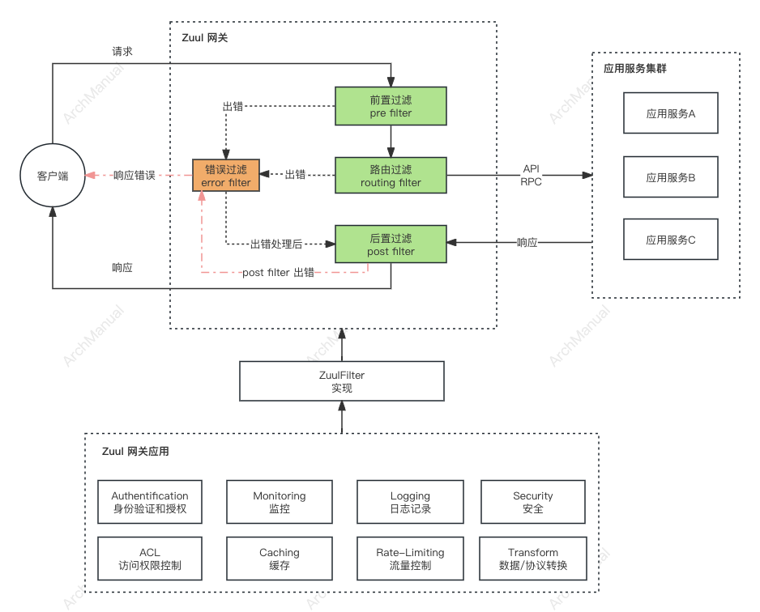

# API网关
使用API网关的决策通常是由多种因素驱动的，特别是在面临复杂的服务架构或特定的业务需求时。以下是一些具体情况，其中使用API网关尤其有益：

## 场景
### 1. 微服务架构
在微服务架构中，系统被分解成多个小型、独立的服务，每个服务执行特定的功能。API网关作为单一的入口点，可以简化这些服务之间的复杂通信，提供统一的接口给客户端，以及处理安全、监控和限流等跨服务的共同关注点。

### 2. 多端支持
当你的应用需要支持多种客户端（如移动应用、Web前端、第三方系统等）时，API网关可以提供一个统一的接口，根据不同客户端的需求优化和调整响应数据格式，实现接口的复用与适配。

### 3. 安全需求
对于需要严格安全控制的应用，API网关能够提供集中的身份验证和授权、数据加密、SQL注入防护、跨站请求伪造（CSRF）防护等安全功能，减少每个微服务需要单独实现这些安全机制的复杂度。

### 4. 性能优化
API网关可以实现请求的缓存、减少客户端到服务端的请求次数通过聚合服务调用等，以此提高系统的响应速度和减轻后端服务的负载。

### 5. 第三方服务整合
在需要与外部服务（如社交网络、支付服务等）集成时，API网关可以作为一个集中化的层来管理这些外部调用，包括处理API密钥、维护会话、转换数据格式等，简化后端服务的开发和维护。

### 6. 系统解耦
API网关有助于实现前后端的彻底分离，允许前端开发人员和后端开发人员独立工作和部署，加速开发流程。同时，它也使得后端服务的重构和扩展更为灵活，因为服务之间的依赖关系被网关所封装。

### 7. 服务版本管理和过渡
当需要引入新的API版本时，API网关能够帮助平滑地过渡，支持多版本API的同时运行，使得客户端可以逐步迁移到新版本而不会中断服务。

### 8. 监控和日志
为了有效地监控和分析系统的健康状况和性能，API网关提供了一个集中点来收集各种指标和日志，便于进行问题诊断和性能优化。

## 功能性要求

实现API网关时，需要考虑一系列功能性要求以确保其能有效地管理微服务之间的通信、提供安全保护、并优化性能。以下是实现API网关时的一些关键功能性要求：

### 1. 请求路由
API网关需要能够根据客户端的请求，将其准确地路由到后端的正确服务。这涉及到解析请求的URL、HTTP方法等信息，并据此决定请求应该被转发到哪个服务。

### 2. 身份验证和授权
API网关应能够对进入的请求进行身份验证（验证请求者的身份）和授权（确定请求者是否有权执行请求的操作）。这通常涉及到集成OAuth、JWT或其他安全机制。

### 3. 限流和配额管理
为了防止资源被过度使用，API网关需要能够限制对某些服务的请求频率。这可能包括对整体流量的限制，或是针对特定用户/客户端的请求配额。

### 4. 负载均衡
API网关应具有将请求分发到多个服务实例的能力，以均衡负载并提高系统的整体可用性和容错能力。

### 5. 故障转移和服务降级
在后端服务发生故障时，API网关应能够自动将请求重定向到其他健康的服务实例，或在必要时执行服务降级策略，以保持系统的稳定性。

### 6. 数据转换和聚合
API网关可能需要对来自不同微服务的数据进行转换（如格式转换）和聚合，然后才能将响应返回给客户端，以简化客户端处理逻辑。

### 7. 协议转换
在某些场景下，API网关需要能够在不同的通信协议之间进行转换，例如将外部的HTTP请求转换为内部系统可能使用的AMQP或WebSocket等协议。

### 8. 缓存
为了提高性能，API网关应能够缓存频繁请求的数据，减少对后端服务的直接访问次数。

### 9. 监控和日志记录
有效的监控和日志记录机制对于跟踪API网关的性能和诊断问题至关重要。API网关应该能够记录关键的操作数据，并提供实时监控能力。

### 10. API版本管理
API网关应支持对API版本的管理，使得可以平滑地引入新版本的API同时还保持对旧版本的支持。

### 11. 安全
除了身份验证和授权之外，API网关还应提供其他安全功能，如防止SQL注入、跨站脚本（XSS）攻击等，以保护后端服务不受恶意攻击。

## 原理

有多个工具实现了API网关的功能，比如：KONG、Zuul、Spring Cloud Gateway 等。下面以Zuul网关为例说明，实现API网关的基本原理。

Zuul是Netflix开源的一个API网关，它主要作为前端的边界服务，对进入微服务系统的请求进行预处理、路由和过滤，然后将请求转发到后端的具体服务。

Zuul的工作流程可以分为几个关键步骤：

### 1. 请求到达Zuul
客户端发起的请求首先到达Zuul服务器。在这个阶段，Zuul可以作为系统的统一入口，隐藏系统内部的复杂性。

### 2. 预过滤（Pre-filtering）
在路由请求之前，Zuul会执行一系列的预过滤器。这些过滤器可以执行多种任务，如请求的日志记录、请求身份验证、请求头的修改等。这是处理请求的第一个阶段，主要用于请求的预处理。

### 3. 路由（Routing）
经过预过滤之后，Zuul根据请求的特征（如URL、HTTP头等）决定将请求路由到哪个具体的微服务。Zuul支持多种路由规则，包括直接路由、服务发现路由等。在这一步，Zuul将请求转发到后端服务。

### 4. 后过滤（Post-filtering）
当后端服务处理完成后，响应会回到Zuul。在将响应返回给客户端之前，Zuul会执行一系列的后过滤器。这些过滤器可以执行响应内容的加工处理、设置HTTP响应头、收集统计信息等操作。

### 5. 错误处理
在请求的任何处理阶段，如果发生错误（如路由失败、服务不可用等），Zuul将进入错误处理流程。Zuul提供了错误过滤器，允许开发人员自定义错误响应的处理逻辑。

### 6. 响应发送
最后，经过一系列的处理之后，Zuul会将最终的响应返回给客户端。这个响应可能是后端服务处理的结果，也可能是Zuul过滤器中生成的响应。

## 工具
- [KONG（基于OpenResty)](https://github.com/Kong/kong)
- [Zuul](https://github.com/Netflix/zuul)
- [SpringCloud Gateway](https://spring.io/projects/spring-cloud-gateway)
- Nginx + Lua
- Traefik