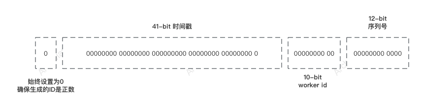
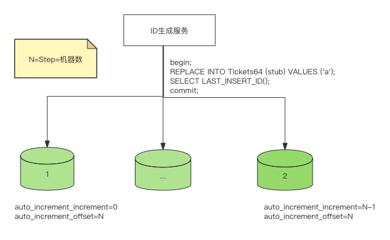
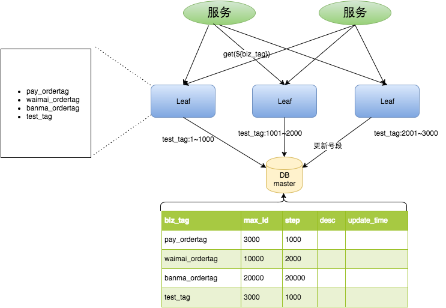

# 分布式ID
分布式ID是在分布式系统中用于唯一标识资源或实体的一种机制。在一个大规模分布式系统中，需要保证即使在不同的服务器、数据中心或地理位置生成的ID也是全局唯一的，这就是分布式ID的核心需求。分布式ID通常是一串数字或字符组合，设计得既能保证全局唯一性，又能在高并发环境下高效生成。

## 场景
分布式ID的使用场景非常广泛，尤其是在需要唯一性保证的系统设计中。以下是一些常见的使用场景：
- **数据库主键**：在分布式数据库系统中，为了保证数据的全局唯一性，通常使用分布式ID作为记录的主键。
- **分布式缓存**：在使用分布式缓存系统（如Redis集群）时，为了确保缓存键的全局唯一性，可以使用分布式ID作为键的一部分。
- **订单编号**：电商平台中，每个订单需要有一个唯一的订单编号，分布式ID可以用来生成这些编号，以保证在整个平台范围内的唯一性。
- **用户会话标识**：在分布式的用户认证系统中，每个用户会话需要一个全局唯一的会话ID，用于跟踪用户状态。
- **分布式事务管理**：在跨多个服务或组件的分布式事务管理中，使用分布式ID来标识每个事务，确保事务的唯一性和一致性。
- **服务跟踪**：在微服务架构中，为了追踪请求跨多个服务的调用链，可以使用分布式ID作为每个请求的唯一标识。

## 功能
设计一个分布式ID生成系统时，需要考虑多个方面的功能要求，以确保系统既能满足全局唯一性的基本需求，又能高效、稳定地在分布式环境中运行。以下是一些关键的功能要求：
- **全局唯一性**：这是分布式ID最基本的要求，不同节点生成的ID之间不能发生冲突，确保每个ID在全系统范围内都是唯一的。
- **高性能**：分布式ID生成系统应能够快速响应ID生成请求，即便在高并发的场景下也能保持较低的延迟，满足大规模分布式系统的性能需求。
- **高可用性**：系统设计应保证高可用性，避免因单点故障导致整个ID生成服务不可用。通常需要通过冗余、故障转移等机制来实现。
- **趋势递增**：虽然不是所有场景都需要ID趋势递增，但在某些应用场景下（如需要将ID作为数据库主键），递增的ID可以优化数据库的插入性能，因为这有利于数据库索引的构建。
- **可配置性**：分布式ID生成系统应提供一定程度的可配置性，以适应不同的应用场景和性能需求。例如，允许调整时间戳的精度、序列号长度或机器ID长度等。
- **时钟回拨处理**：在依赖系统时钟的ID生成策略中，需要考虑系统时钟可能发生回拨的情况，并设计相应的处理机制以避免ID冲突或重复。
- **安全性**：虽然安全性通常不是ID生成系统的主要关注点，但在某些应用场景下（如ID直接暴露给最终用户），需要考虑ID生成机制不被轻易预测，以避免安全风险。
- **伸缩性**：随着系统的扩展，ID生成系统应能够无缝扩展，支持更多的节点参与ID生成，而不影响现有系统的运行。
- **简洁性与易用性**：尽管分布式ID生成系统在设计和实现上可能较为复杂，但其对外提供的接口和使用方式应尽可能简单明了，便于集成和使用。
- **跨数据中心**：对于跨地理位置部署的分布式系统，ID生成系统还需考虑支持跨数据中心的ID生成，保证全球唯一性。

## 实现
实现分布式ID有多种方法

### 1. UUID
UUID（Universally Unique Identifier）是一种广泛使用的标识符，旨在让分布式系统中的所有元素都能有一个全局唯一的标识。按照开放软件基金会（OSF）定义的UUID标准，一个UUID是一个128位的长数字，可以保证在空间和时间上的唯一性。UUID有几种不同的版本，每种版本有其特定的生成方法。

#### UUID的生成原理

- **UUID版本1（基于时间的UUID）** 利用当前时间戳（100纳秒精度），时钟序列，和一个固定的节点信息（通常是机器的MAC地址）来生成UUID。时间戳保证了时间上的唯一性，时钟序列用来处理同一时间多次生成ID的情况，节点信息确保了空间上的唯一性。

- **UUID版本2（DCE安全的UUID）** 对版本1进行少量修改以包含POSIX的UID或GID以增加安全性，但在实际应用中不常用。

- **UUID版本3和5（基于名称的UUID，使用MD5/SHA-1散列）** 通过对指定的名称和命名空间（同样是一个UUID）进行散列计算生成UUID。版本3使用MD5散列，版本5使用SHA-1散列。这些版本保证了对相同名称和命名空间的散列会产生相同的UUID。

- **UUID版本4（随机UUID）** 通过随机或伪随机生成方式创建。这种方法不依赖于机器的硬件信息，因而在所有版本中最为灵活。

#### 优点

- **全局唯一性**：理论上可以保证在全球范围内的唯一性。
- **无需中心化管理**：UUID的生成不依赖于一个中心节点，避免了单点故障和性能瓶颈。
- **易于实现和使用**：生成UUID的算法简单，多种编程语言都提供了相应的库。

#### 缺点

- **大小较大**：128位的大小意味着在存储和传输时会占用更多的资源，特别是在需要存储大量UUID的场景下。
- **无序列**：UUID是无序的，如果用作数据库的主键，可能会导致数据插入性能下降。
- **隐私问题**：版本1的UUID包含节点信息（如MAC地址），可能会泄露用户隐私。
- **碰撞概率**：虽然理论上UUID是唯一的，但实际上还是存在极小的碰撞概率。

### 2. Twitter的Snowflake算法
通过结合时间戳、机器ID和序列号生成64位长的ID，既保证了唯一性，也保证了趋势递增，便于数据库索引。 Twitter的Snowflake算法是一个用于生成64位全局唯一ID的系统。这个算法解决了在分布式系统中如何高效地生成唯一标识符的问题，特别是在需要考虑时间顺序的场合。Snowflake生成的ID是一个64位的整数，这个整数被分成了几个不同的部分，每部分有其特定的含义。

#### Snowflake ID的结构

1. **1位符号位**：最高位是符号位，始终设置为0，确保生成的ID是正数。
2. **41位时间戳**：用来记录时间戳，其值是生成时间与特定起始时间（称为纪元）之间的差值（通常是毫秒级），41位时间戳可以使用69年。
3. **10位工作机器ID**：可以进一步细分为：
    - 5位datacenterId（数据中心ID），用于在多个数据中心间分配ID。
    - 5位workerId（工作机器ID），用于在同一数据中心的不同机器间分配ID。
      这意味着Snowflake算法可以在最多32个数据中心中的1024台机器间分布式地生成ID。
4. **12位序列号**：用于记录同一毫秒内生成的不同ID号，12位序列号支持同一毫秒内生成4096个ID序号。

#### 架构原理
- **时间戳部分** 确保了ID的时间有序性。
- **工作机器ID** 确保了在不同机器和数据中心生成的ID的唯一性。
- **序列号** 确保了在同一毫秒内生成的ID的唯一性。

#### 生成过程
1. 当一个Snowflake节点收到生成ID的请求时，它会获取当前的时间戳，然后与之前的时间戳比较。如果当前时间戳大于之前的时间戳，则序列号重置为0。如果当前时间戳等于之前的时间戳，则序列号递增。
2. 如果序列号溢出（即超过了4095），则Snowflake节点会等待到下一毫秒，然后继续生成ID。
3. 最后，按照上述的位分配规则，将时间戳、工作机器ID和序列号拼接起来，形成一个64位的ID。

#### 优点
- **高性能**：可以在单机上每秒生成数百万个ID。
- **高可用性**：简单的算法和无状态的生成方式使得实现高可用性变得容易。
- **时间有序**：生成的ID大体上是时间有序的。

#### 缺点
- **对系统时钟敏感**：如果系统时钟回拨，那么有可能会生成重复的ID。为了解决这个问题，通常需要在实现时加入时钟回拨的检测逻辑。

### 3. 数据库自增ID
#### 原理
使用Mysql的auto_increment_increment和auto_increment_offset来保证ID自增。在分布式环境下，每台机器设置不同的初始值，且步长和机器数相等。
比如有两台机器，则设置步长step为2，Server-1的初始值为（1，3，5，7，9，11…）、Server-2的初始值为2（2，4，6，8，10…）。参考 [Flickr 的主键生成策略](https://code.flickr.net/2010/02/08/ticket-servers-distributed-unique-primary-keys-on-the-cheap/)


生成ID时，在路由到的数据库上执行类似下面的事务
```sql
begin;
REPLACE INTO Tickets64 (stub) VALUES ('a');
SELECT LAST_INSERT_ID();
commit;
```
#### 缺点
- **水平扩展比较困难**    
- **ID没有单调递增的特性** 只能趋势递增，这个缺点对于一般业务需求不是很重要，可以容忍。
- **数据库压力大** 每次获取ID都得读写一次数据库，只能靠堆机器来提高性能。

### 4. 美团Leaf
美团Leaf是美团点评开源的分布式ID生成系统，旨在解决分布式系统中唯一ID生成的需求。Leaf提供了两种不同的ID生成模式：Leaf-segment和Leaf-snowflake，以满足不同场景下的需求。

#### 4.1 Leaf-segment模式

Leaf-segment模式基于数据库的号段生成策略，其核心原理是预先从数据库中批量获取一段ID区间（号段），然后在内存中递增地分配这些ID，直到号段使用完毕后再从数据库中获取新的号段。这种模式的主要优势是能够生成趋势递增的ID，对数据库友好。

##### 架构原理



1. **号段存储**：使用数据库表来存储每个业务标识（Biz Tag）的当前号段信息，包括当前号段的最大值和步长。
2. **号段加载**：Leaf服务启动时，会预加载每个业务标识的当前号段到内存中。
3. **ID生成**：对于每个ID生成请求，Leaf从内存中对应的号段信息中分配一个ID，并递增内存中的号段计数器。
4. **号段更新**：当当前号段即将用尽时，Leaf会提前从数据库中获取下一个号段，并进行原子切换。  
号段更新的SQL
```sql
Begin
UPDATE table SET max_id=max_id+step WHERE biz_tag=xxx
SELECT tag, max_id, step FROM table WHERE biz_tag=xxx
Commit
```

双Buff方案 和 高可用方案 详见[Leaf官方技术文档](https://tech.meituan.com/2017/04/21/mt-leaf.html)
#### 4.2 Leaf-snowflake模式

Leaf-snowflake模式是基于Twitter的Snowflake算法实现的，其主要用于生成全局唯一的ID，且不依赖于数据库。Leaf对Snowflake算法进行了优化和扩展，使其更适用于美团的业务场景。

##### 架构原理

1. **时间戳**：使用当前时间戳减去一个固定的开始时间戳作为基准，确保ID按时间趋势递增。
2. **工作机器ID**：工作Zookeeper的方式为每个Leaf服务实例分配一个唯一的工作机器ID。详见[Leaf官方技术文档](https://tech.meituan.com/2017/04/21/mt-leaf.html)
3. **序列号**：在同一毫秒内，通过递增序列号来保证ID的唯一性。
4. **时钟回拨处理**：Leaf增加了对系统时钟回拨的处理策略，确保ID的唯一性和连续性不会因为时钟回拨而受影响。详见[Leaf官方技术文档](https://tech.meituan.com/2017/04/21/mt-leaf.html)

### 4.3 总结
美团Leaf通过提供segment和snowflake两种模式，能够满足不同场景下对于分布式ID生成的需求。Leaf-segment模式适合对ID趋势递增有要求的场景，而Leaf-snowflake模式则适合对ID生成性能要求更高的场景。通过这两种模式，美团Leaf为分布式系统中的ID生成提供了一种高效、可靠的解决方案。

详细技术方案，详见[Leaf官方技术文档](https://tech.meituan.com/2017/04/21/mt-leaf.html)

## 工具

推荐  
- [美团Leaf](https://github.com/Meituan-Dianping/Leaf)

其他
- [滴滴TinyId](https://github.com/didi/tinyid)
- [百度 uid-generator](https://github.com/baidu/uid-generator)
- [MongoDB的ObjectID](https://www.mongodb.com/docs/manual/reference/method/ObjectId/#description)