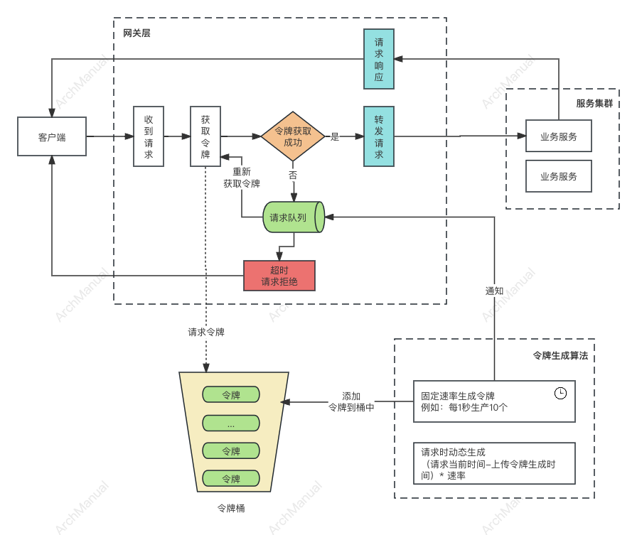
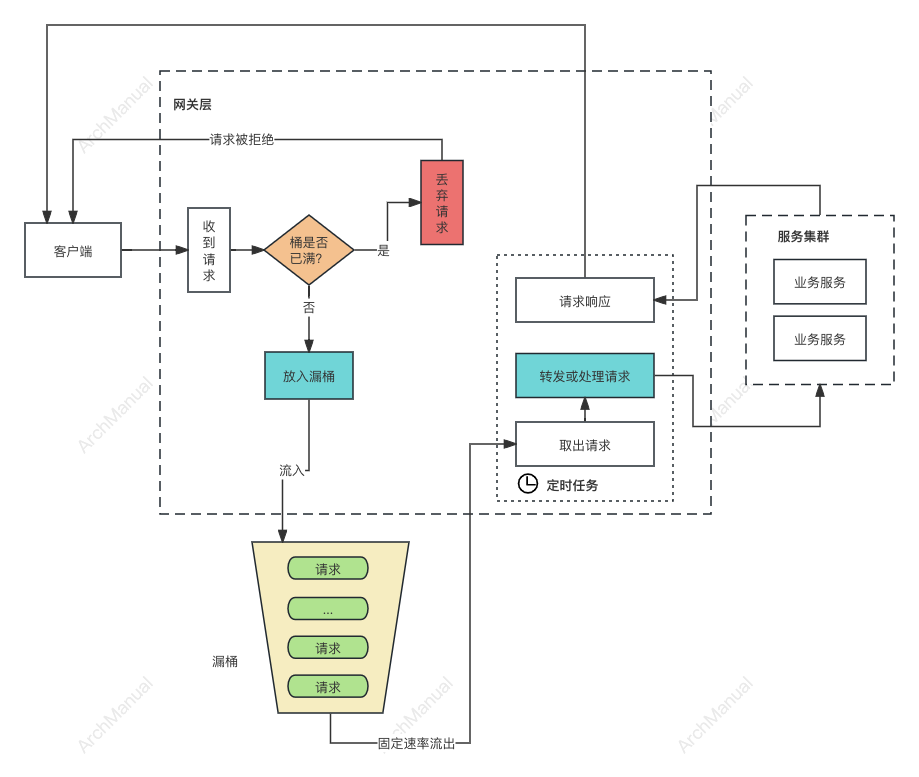
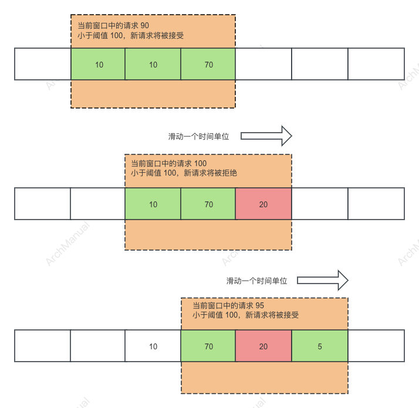

# 限流

限流是一种在软件开发和系统设计中常用的技术，旨在控制访问某一资源或服务的请求数量，以防止系统过载、确保系统稳定性和响应性。

限流对于维护高可用和可靠的服务尤为重要，尤其是在面对高并发访问时。

## 目的

限流是一种重要的系统设计策略，旨在保护系统在面对高流量或潜在的服务滥用时保持稳定和可用。

在多种情况下实施限流是必要的，常见包括：

1. **资源保护**：当系统资源（如数据库、内存、CPU）接近其容量极限时，限流可以防止资源被过度使用，从而避免服务降级或系统崩溃。

2. **流量高峰**：在促销活动、重大新闻事件或其他引发流量激增的情况下，限流可以帮助控制访问量，保证系统的正常运行。

3. **防止服务滥用**：限流能够防止恶意用户或自动化工具（如爬虫）通过大量的请求来滥用服务，可能会导致服务不可用给其他合法用户。

4. **成本控制**：对于基于使用量计费的服务，如云服务和API调用，限流可以帮助控制成本，避免因突然增加的流量而产生高额费用。

5. **服务等级协议（SLA）实施**：通过限流，服务提供商可以根据不同的用户级别或服务协议来分配资源，确保高优先级的用户或任务得到足够的资源。

6. **负载均衡**：在分布式系统中，限流可以帮助实现负载均衡，防止某一服务节点因流量过大而过载，保持整个系统的负载均衡。

7. **应对DDoS攻击**：在分布式拒绝服务（DDoS）攻击中，限流可以作为一种缓解措施，帮助减轻攻击对服务的影响。

8. **提高用户体验**：通过限流平滑处理峰值流量，可以防止系统响应时间变长，从而提高用户的整体体验。

9. **促进公平使用**：在多用户或多租户环境中，限流确保所有用户都能公平地访问资源，防止某些用户因过度使用资源而影响其他用户的服务质量。

## 功能性要求

限流机制在设计和实现时需要满足一系列功能性要求，以确保它能够有效地控制访问流量，同时保持系统的稳定性和响应性。

一些关键的功能性要求：

1. **精确性**：限流策略需要能够精确地控制流量，确保不超过预设的阈值。这要求限流机制能够准确计算和控制进入系统的请求数量。

2. **灵活性**：限流机制应该支持多种限流策略，如固定窗口、滑动窗口、令牌桶、漏桶等，以适应不同的应用场景和需求。

3. **配置简易性**：限流策略的配置应该简单直观，便于管理员根据实际情况快速调整阈值和规则。

4. **高性能**：限流操作应该尽可能低延迟，确保不会因为限流检查本身而造成系统性能的显著下降。

5. **自动化**：在可能的情况下，限流系统应能自动化地根据当前的系统负载和性能指标调整限流规则，以实现动态限流。

6. **公平性**：限流策略需要确保对所有请求的公平处理，避免某些请求长时间得不到服务。对于多租户环境，还需要保证资源按比例分配。

7. **透明性**：对于被限流的请求，系统应提供明确的反馈，例如返回特定的状态码或错误信息，让用户知道请求被限制的原因。

8. **可观察性和监控**：限流系统应该具备良好的监控和日志记录能力，以便于分析流量模式、检测系统性能和及时发现潜在的问题。

9. **可扩展性**：随着系统规模的扩大和流量的增加，限流机制应该能够轻松扩展，以处理更大规模的流量。

10. **故障恢复**：在发生故障时，限流系统应该能够快速恢复，以减少对服务可用性的影响。

## 维度

限流可以从多个维度进行设置和实施，一些常见的限流维度如下：

### 1. **请求速率限制**

限制单位时间内的请求次数，是最常见的限流维度。例如，每秒请求次数（QPS）或每分钟请求次数（RPM）。

### 2. **并发数限制**

限制系统同时处理的请求数量。这有助于控制系统的并发水平，保证系统稳定运行而不被过多的并发请求压垮。

### 3. **带宽限制**

限制数据传输的速率，确保不超过网络带宽的容量。这种限流常用于视频流、大文件下载等需要大量带宽的服务。

### 4. **资源使用限制**

基于资源使用情况来进行限流，例如CPU使用率、内存使用量等。当资源使用接近上限时，可以通过限制进一步的请求来保护系统。

### 5. **用户/客户端限制**

根据用户或客户端的不同进行区别化的限流，如对VIP用户和普通用户应用不同的限流策略。这有助于实现服务质量的分级。

### 6. **IP地址限制**

基于来源IP地址进行限流，防止某一IP地址发起的请求过多影响系统稳定性。这也是防御DDoS攻击的常用策略之一。

### 7. **API端点限制**

针对不同的API端点实施不同的限流策略。因为不同的API对资源的消耗和重要程度可能不同，因此可以分别进行限流设置。

### 8. **地理位置限制**

基于请求者的地理位置进行限流，可能因为法律法规、服务策略或性能优化的需要。

### 9. **会话/用户会话限制**

限制单个用户或会话在一定时间内的请求量，这有助于防止单个用户的过度使用影响到其他用户的体验。


## 实现方案

限流的实现方案多种多样，每种方案都有其适用的场景和特点。以下是一些常见的限流实现方案：

### 1. **令牌桶算法（Token Bucket）**

令牌桶算法的核心思想是以恒定的速率向桶中添加令牌，处理请求时需要消耗令牌，从而实现对数据流的控制。

#### 实现原理



1. **初始化**：一个桶包含固定容量的令牌，桶一开始可能是空的或者满的，这取决于具体实现。
2. **添加令牌**：以固定的速率往桶中添加令牌，直到桶满。这个速率可以根据实际需求设置。
3. **处理请求**：每个传入的请求需要从桶中取出一个或多个令牌。如果桶中的令牌不足以处理当前请求，则请求可以选择等待直到有足够的令牌，或者直接被拒绝。
4. **请求转发**：获取令牌成功后，将请求转发到服务集群进行具体的业务处理。
5. **请求响应**：业务处理完毕后，将处理结果转发给客户端。
6. **请求队列**：如果请求时没有令牌，进入了请求队列。当下次令牌生成后，需要通知队列中的请求重新发起令牌获取操作，如果再次获取成功，则处理请求。

#### 令牌生成算法

令牌生成算法可以是定时生成或者请求令牌是动态生成。

1. **定时生成**：以一定的速率生成令牌放到令牌桶中，比如 1秒10个。
2. **动态生成**：在请求令牌时，动态计算需要生成的令牌数，生成令牌存放到到令牌桶中，计算公式：（当前时间戳 - 上次生成时间戳) * 令牌生成速率。

#### 优点

- **灵活性和平滑性**：令牌桶算法可以平滑地处理突发流量，因为它允许在短时间内处理超过平均速率的请求，只要桶中有足够的令牌。
- **控制精度**：通过调整令牌发放速率和桶的大小，可以精确控制数据流的速率，适用于不同的流量控制需求。
- **适用性广**：令牌桶算法不仅适用于网络带宽限制，也适用于API请求限流、数据库操作限制等多种场景。

#### 缺点

- **资源消耗**：如果实现不当，尤其是在令牌添加和消耗操作中，令牌桶算法可能会消耗较多的CPU资源。
- **响应时间**：对于需要大量令牌才能处理的请求，如果桶中令牌不足，这些请求的响应时间会增加，因为它们需要等待足够的令牌累积。
- **复杂性**：虽然令牌桶算法的基本原理相对简单，但正确地实现和调整参数以适应特定场景可能需要仔细的设计和测试。


### 2. **漏桶算法（Leaky Bucket）**

漏桶算法（Leaky Bucket）是一种流量整形（Traffic Shaping）和流量控制机制，用于控制数据传输的速率和平滑网络流量。

漏桶算法模拟了一个水桶漏水的过程，以此来控制数据的流出速率，保持流量的均匀性。

#### 实现原理



1. **桶的容量**：定义一个固定容量的桶，这个桶用来暂存即将被发送到网络上的数据包。桶的容量限制了在任何时刻桶内能存放的数据量。

2. **数据包的流入**：数据包以任意速度流入桶中。如果桶已满，那么溢出的数据包会被丢弃，即不会被发送（这个过程模拟了桶溢出时水的溢出）。

3. **数据包的流出**：数据包以固定的速率从桶中“漏出”，即被发送到网络上。这个速率由系统预设，与数据包流入速率无关。

4. **流量控制**：通过调整数据包的流出速率（即桶的漏洞大小），可以控制数据传输的速率，从而达到流量控制的目的。

#### 工作过程

- 当数据流入速率较低时，桶不会溢出，所有流入的数据都会以预定的速率流出。
- 当数据流入速率较高且持续时间较短时，桶内暂存的数据量增加，但只要桶未溢出，数据还是可以以固定的速率流出。
- 当数据流入速率持续高于数据的流出速率时，一旦桶满，新到达的数据包将被丢弃，直到桶中有足够的空间为止。

#### 代码示例

虽然漏桶算法的核心是理论模型，但以下是一个简化的伪代码示例，展示了如何实现漏桶算法的基本逻辑：

```pseudo
初始化一个固定容量的桶和固定的流出速率

when 有新的数据包流入 {
    if 桶未满 {
        将数据包加入到桶中
    } else {
        丢弃数据包
    }
}

while (true) {
    if 桶中有数据包 {
        以固定的速率从桶中移除数据包并处理
    }
    等待直到下一个数据包流出的时间点
}
```

#### 优点

1. **流量平滑化**：漏桶算法可以平滑突发流量，使数据以恒定速率离开桶，从而避免网络拥塞。
2. **易于实现**：相较于其他流量控制算法，漏桶算法结构简单，实现起来较为容易。
3. **公平性**：在多用户环境下，漏桶算法确保所有用户或数据流以公平且一致的速率被服务，不会偏向任何特定的数据流。

#### 缺点

1. **不适合突发流量**：对于需要以高速率传输突发数据的应用，漏桶算法可能导致数据延迟，因为即使网络空闲，数据传输速率也受到固定流出速率的限制。
2. **资源利用率低**：在数据流入速率低于桶的流出速率时，实际的网络带宽可能没有被充分利用，导致资源浪费。
3. **对高优先级数据处理不友好**：漏桶算法处理数据的顺序是固定的，无法优先处理紧急或高优先级的数据包。
4. **缺乏灵活性**：漏桶算法的固定输出速率在面对多变的网络条件和需求时，缺乏必要的灵活性和适应性。


### 3. **固定窗口计数器**

固定窗口计数器是一种简单的限流策略，用于控制在给定时间窗口内对某资源的访问请求数量。

这种方法通过设定一个时间段（窗口）和允许的最大请求次数来实现限流。

当请求次数达到设定的阈值时，任何进一步的请求都将被拒绝，直到下一个时间窗口开始。

#### 实现原理


1. **时间窗口**：选择一个固定的时间段作为窗口，例如1秒、1分钟等。这个窗口是计数周期的基础。

2. **请求计数器**：在窗口期间内，系统维护一个计数器来记录对特定资源的请求次数。

3. **阈值设置**：设定在单个时间窗口内允许的最大请求次数。

4. **请求处理逻辑**：
    - 每当收到一个请求，系统首先检查当前时间窗口内的累计请求次数。
    - 如果请求次数小于阈值，系统会处理该请求，并将计数器增加1。
    - 如果请求次数已经达到或超过阈值，则拒绝任何进一步的请求，直到当前时间窗口结束。
    - 当时间窗口结束时，计数器重置，新的时间窗口开始，请求计数重新开始累计。

#### 代码示例（伪代码）

```pseudo
初始化：
    设置时间窗口大小（例如，1分钟）
    设置最大请求次数阈值
    初始化计数器为0
    记录窗口开始时间

对每个请求：
    如果 当前时间 < 窗口开始时间 + 时间窗口大小：
        如果 计数器 < 最大请求次数阈值：
            计数器增加1
            处理请求
        否则：
            拒绝请求
    否则：
        重置计数器
        更新窗口开始时间
        处理请求
```

#### 特点

- **简单易实现**：固定窗口计数器的逻辑简单，容易在多种系统和框架中实施。
- **适用性**：适用于请求量较平稳的场景，能有效防止系统超载。

#### 缺点

- **临界问题**：在窗口切换的瞬间，如果有大量请求同时到达，可能会导致两个连续时间窗口的请求总量暂时超过预期的最大允许值，因为计数器在窗口切换时重置。
- **灵活性有限**：相对于更复杂的限流策略，如滑动窗口算法或令牌桶算法，固定窗口计数器在处理突发流量时的适应性较差。

固定窗口计数器是限流策略中最基础的一种，适用于实现简单的流量控制需求。对于需要更精细控制的场景，可能需要考虑其他更高级的限流机制。

### 4. **滑动窗口**
滑动窗口限流算法是一种相对复杂但更为精确的限流策略，它改进了固定窗口限流算法中的“临界问题”，
通过平滑处理时间窗口的变换，更加精细地控制请求的速率。这种方法特别适用于需要对请求进行精确控制的场景，如API限流。

#### 实现原理

滑动窗口限流算法的核心是将固定的时间窗口分割成多个更小的窗口片段（或称为子窗口、时间格），并对每个小窗口内的请求计数。

通过滑动这些窗口片段，算法能够提供比固定窗口算法更平滑、更精细的限流控制。



1. **窗口划分**：首先，定义一个较大的时间窗口，并将其划分为多个连续的、等长的小窗口片段。

2. **计数存储**：为每个小窗口片段维护一个独立的请求计数器。

3. **滑动逻辑**：随着时间的推进，新的请求被计入当前小窗口片段的计数器中。当时间进入下一个小窗口片段时，最旧的小窗口片段的计数被抛弃，新的小窗口片段开始计数，从而实现窗口的“滑动”。

4. **请求计算与限制**：在任何给定时间点，算法都会计算当前大窗口内所有小窗口片段的请求计数总和。如果这个总和超过了设定的阈值，则新的请求会被限制或拒绝，直到总计数下降至阈值以下。


#### 其他考虑点

- **性能优化**：在实际应用中，可以通过各种方式优化滑动窗口算法的性能，如使用环形数组来高效地管理窗口片段的计数器。
- **时间同步**：在分布式系统中，需要注意时间同步问题，因为滑动窗口算法依赖于时间的准确性。使用外部时间源或时间同步协议可以帮助解决这个问题。

#### 优点

- **减少临界问题**：通过平滑处理时间窗口的变化，滑动窗口算法可以减少固定窗口限流中出现的临界问题，避免在时间窗口交界处的请求量突增。
- **更精细的流量控制**：滑动窗口提供了比固定窗口更为精细的流量控制，能够更好地适应流量的变化。

#### 缺点

- **实现复杂性**：相比固定窗口算法，滑动窗口限流算法的实现更为复杂，需要维护更多的状态信息。
- **资源消耗**：维护多个小窗口片段的计数器可能会增加系统的资源消耗。

### 5. **分布式限流**

分布式限流是在分布式系统中实施的一种技术，旨在跨多个服务实例或节点协同控制流量，以保护下游服务不被过载，并确保系统的稳定性和可靠性。

实现分布式限流通常需要一个共享存储或协调服务来同步不同节点间的限流状态，如Redis、ZooKeeper等分布式数据存储解决方案。

#### 实现原理

分布式限流涉及以下几个关键点：

1. **集中式状态管理**：使用一个中央存储系统（如Redis）来记录和管理当前的请求计数或令牌信息，确保所有节点看到的是一致的限流数据。

2. **请求计数或令牌分发**：
   - **计数器法**：每个节点在处理请求前，都会向中央存储发出增加计数的请求。如果计数超过预定阈值，请求将被限流（即拒绝）。
   - **令牌桶法**：中央存储维护一个令牌桶，各个节点在处理请求前需要从中心令牌桶中获取令牌。如果令牌不足，请求将被限流。

3. **时间窗口同步**：在使用固定或滑动时间窗口算法时，需要确保所有节点对当前时间窗口有一致的视图，以正确计算请求频率。

4. **弹性和容错**：分布式环境下，网络延迟和分区容错成为重要考虑因素。实现时需确保限流策略在部分节点或网络不可达时仍然有效，并且能够快速恢复。

#### 实现方案

1. **基于Redis的限流**

基于Redis的分布式限流通常利用Redis强大的原子操作和快速响应能力，在分布式环境中实现精确的流量控制。

Lua脚本在这里发挥着重要作用，因为它允许在Redis服务器上原子性地执行复杂的逻辑，减少了客户端与Redis服务器之间的通信次数，提高了执行效率。


在Redis中使用Lua脚本实现分布式限流通常涉及以下步骤：

1. **定义限流规则**：确定时间窗口大小和该窗口内允许的最大请求数量。
2. **记录请求**：每个请求到来时，使用Redis记录其访问时间或增加相应的计数。
3. **计数与判断**：通过Lua脚本原子性地判断当前的请求计数（或时间窗口内的请求量）是否超出了预设的限流阈值。
4. **决策执行**：基于当前的请求量（计数）决定是否允许当前请求通过或者被限流（拒绝）。

以下是一个使用Lua脚本在Redis中实现滑动窗口限流算法的示例。

```lua
-- Lua脚本: 实现滑动窗口限流
-- KEYS[1] 限流的Key
-- ARGV[1] 当前时间戳
-- ARGV[2] 窗口大小，单位为毫秒
-- ARGV[3] 窗口内允许的最大请求数
-- ARGV[4] 过期时间，应大于窗口大小，单位为毫秒

local key = KEYS[1]
local now = tonumber(ARGV[1])
local window = tonumber(ARGV[2])
local limit = tonumber(ARGV[3])
local ttl = tonumber(ARGV[4])

-- 清除时间窗口之前的请求记录
redis.call('ZREMRANGEBYSCORE', key, 0, now - window)

-- 获取当前窗口内的请求次数
local count = redis.call('ZCARD', key)

-- 判断是否超出限流阈值
if count < limit then
    -- 如果未超出，记录当前请求
    redis.call('ZADD', key, now, now)
    -- 设置ZSET过期时间，防止无限增长
    redis.call('PEXPIRE', key, ttl)
    return 1
else
    -- 超出限流阈值，拒绝请求
    return 0
end
```

这个Lua脚本首先移除了时间窗口之前的请求记录，然后计算当前窗口内的请求数量。如果请求数量未超过设定的限制，脚本会记录这个新请求并更新过期时间；如果已超过限制，则当前请求会被限流拒绝。


2. **基于ZooKeeper的限流**

基于ZooKeeper的分布式限流利用了ZooKeeper的强一致性特点来同步各个分布式节点间的限流状态。

ZooKeeper是一个为分布式应用提供协调服务的软件，它允许存储少量数据，并且可以用于实现分布式锁、选举、队列等。

在基于ZooKeeper的分布式限流中，通常利用临时顺序节点来控制同时访问某一资源的并发数量。

每个请求在ZooKeeper中创建一个临时顺序节点，节点的创建顺序代表了请求的顺序。通过检查自己创建的节点在所有子节点中的顺序，可以判断是否获得了“访问权限”。

1. **初始化**：确定ZooKeeper的根节点用于存储所有的限流控制信息。
2. **请求到来时**：为每个请求在根节点下创建一个临时顺序节点。
3. **判断权限**：通过比较自己的节点序号与所有子节点的序号，确定当前请求是否在允许的请求范围内。
4. **完成请求**：处理完请求后，删除对应的临时节点。

以下Java代码示例展示了如何使用Apache ZooKeeper客户端库(`org.apache.zookeeper:zookeeper`)实现分布式限流的基本逻辑。

```java
import org.apache.zookeeper.CreateMode;
import org.apache.zookeeper.ZooDefs;
import org.apache.zookeeper.ZooKeeper;
import org.apache.zookeeper.data.ACL;

import java.util.List;

public class ZooKeeperRateLimiter {
    private static final String ROOT_PATH = "/RateLimiter";
    private ZooKeeper zooKeeper;

    public ZooKeeperRateLimiter(ZooKeeper zooKeeper) {
        this.zooKeeper = zooKeeper;
        initialize();
    }

    private void initialize() {
        try {
            // 确保根节点存在
            if (zooKeeper.exists(ROOT_PATH, false) == null) {
                zooKeeper.create(ROOT_PATH, new byte[0], ZooDefs.Ids.OPEN_ACL_UNSAFE, CreateMode.PERSISTENT);
            }
        } catch (Exception e) {
            e.printStackTrace();
        }
    }

    public boolean tryAcquire() {
        try {
            // 为请求创建一个临时顺序节点
            String path = zooKeeper.create(ROOT_PATH + "/request_", new byte[0], ZooDefs.Ids.OPEN_ACL_UNSAFE, CreateMode.EPHEMERAL_SEQUENTIAL);

            // 检查自己的节点是否在允许范围内
            List<String> children = zooKeeper.getChildren(ROOT_PATH, false);
            if (children.size() <= 10) { // 假设限流阈值为10
                // 请求通过限流
                return true;
            } else {
                // 请求未通过限流，清理节点
                zooKeeper.delete(path, -1);
                return false;
            }
        } catch (Exception e) {
            e.printStackTrace();
            return false;
        }
    }

    // 清理操作等
}
```

在这个例子中，每个请求尝试在`/RateLimiter`节点下创建一个临时顺序节点。通过检查这些子节点的数量，可以决定是否允许当前请求。


#### 特点

- **一致性和实时性**：分布式限流需要确保所有节点对限流状态的一致视图，同时响应状态变化要迅速，以应对流量的动态变化。

- **高可用和容错**：限流服务本身需要高可用和容错性，防止成为系统的单点故障。

- **性能考虑**：在分布式限流中，对中心存储系统的调用可能成为性能瓶颈。优化存储访问策略和减少不必要的网络调用是提升性能的关键。

分布式限流的实现复杂度较高，需要综合考虑一致性、性能和容错性等多方面因素，但它对于大规模分布式系统的稳定运行至关重要。


## 常见工具

常见的开源限流框架：
#### **Hystrix (Java)**

虽然现在进入了维护模式，但Hystrix是Netflix开源的一个延迟和容错库，用于隔离访问远程服务、第三方库，防止它们影响系统的整体延迟和容错性。Hystrix也提供了限流功能。

#### **Sentinel (Java)**

由阿里巴巴开源的面向分布式服务架构的高可用性和高扩展性的流量控制组件，支持多种限流模式（如QPS、并发请求数等）和自适应限流策略。

#### **Nginx限流模块**

Nginx通过配置其内置模块来提供限流功能，包括`limit_req_module`和`limit_conn_module`，用于控制请求的速率和并发连接数。适合作为应用前端的流量控制。

#### **Guava RateLimiter (Java)**

Google的Guava库中包含的一个限流工具，基于令牌桶算法实现。它简单易用，适用于单体应用中的限流。

#### **Resilience4j (Java)**

一个轻量级的容错库，设计用于Java 8及以上版本，提供了熔断器、限流器、重试机制和超时控制等多种容错技术。Resilience4j的限流器支持基于令牌桶算法的限流策略。

### **Bucket4j (Java)**

基于JCache的强大限流库，支持分布式和单机环境。Bucket4j基于令牌桶算法实现，适用于需要分布式限流的场景。

#### **Opossum (JavaScript)**

一个用于Node.js应用的断路器库，虽主要用于断路，但也可以实现简单的限流功能来保护应用不被过多的请求淹没。

#### **Ratelimit (Go)**

Go语言的限流器，提供了多种限流策略，包括令牌桶和漏桶算法。它是为微服务设计的，可以轻松集成到Go服务中。

#### **Envoy Proxy**
- **描述**：作为一个高性能的代理，Envoy提供了先进的流量控制功能，包括限流。它可以在微服务架构中用作边缘网关或服务间的代理，提供细粒度的流量管理。

#### **Istio**
- **描述**：一个强大的服务网格框架，提供了包括限流在内的丰富的服务间通信控制功能。Istio的限流基于Envoy，可以在Kubernetes集群中全局管理。

