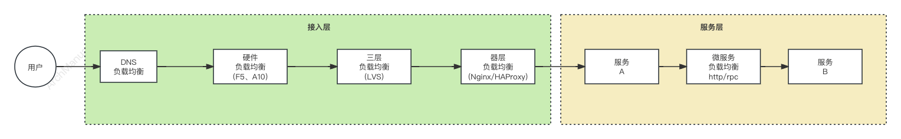
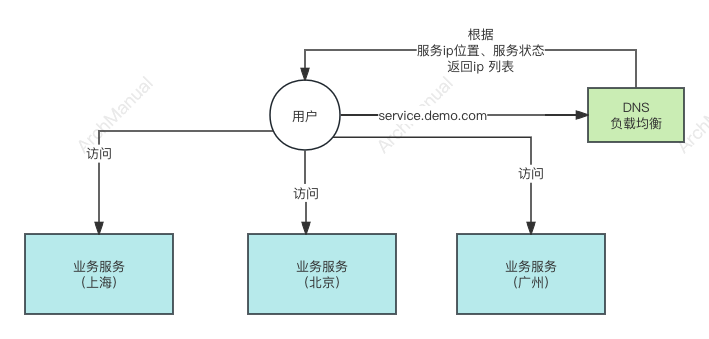
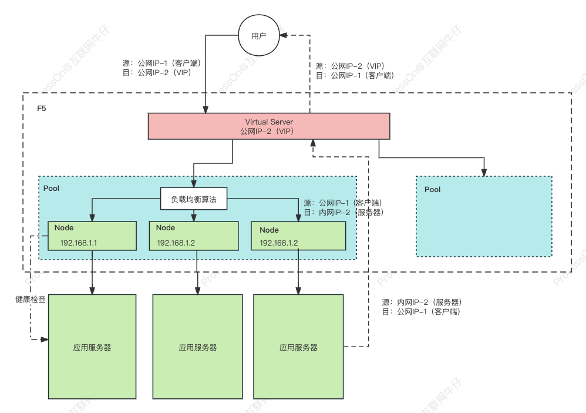
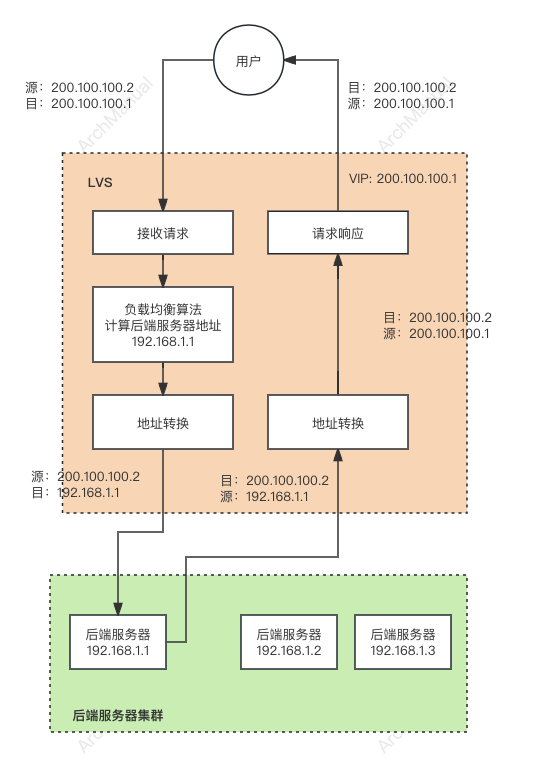
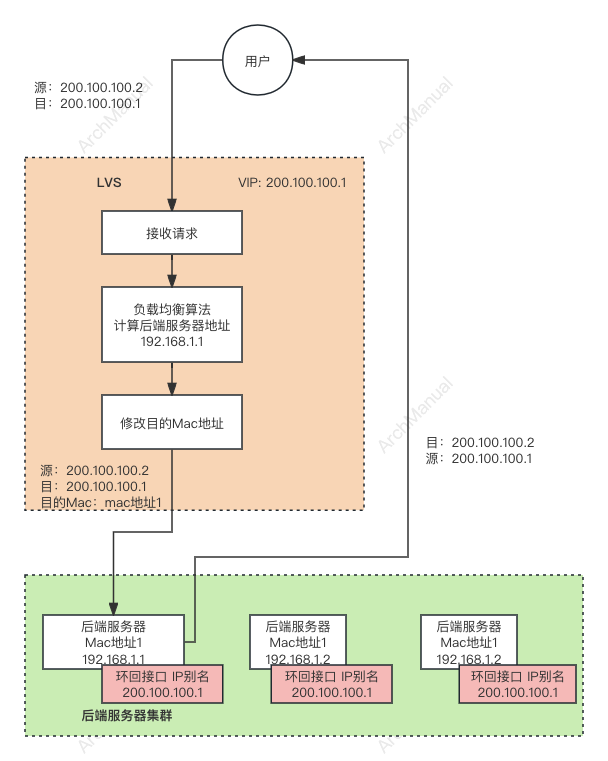
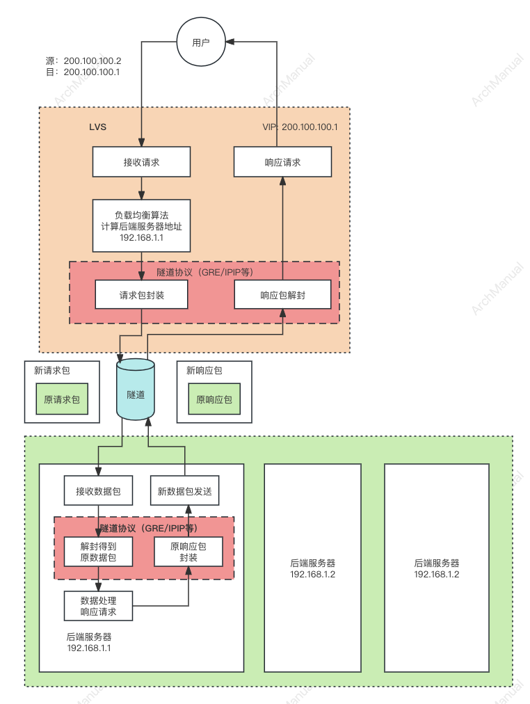

# 负载均衡

负载均衡主要用于分配来自互联网或局域网的请求或任务负载到多个服务器中。
这样做可以避免任何单个服务器的过载，提高响应速度，增加系统的整体处理能力，并确保系统的高可用性和可靠性。

负载均衡器大概可以分为 3 类，包括：DNS 方式实现负载均衡、硬件负载均衡、软件负载均衡。 按照用户到服务的访问顺序，大致如下：



## 场景

使用负载均衡的时机通常取决于多种因素，包括应用的需求、流量模式、系统架构和业务目标。以下是一些最常见的情况，表明可能需要采用负载均衡技术：

1. **流量增加**：当网站或应用的用户基础增长，导致流量显著增加时，单个服务器可能无法处理所有请求，这时使用负载均衡可以帮助分散请求到多台服务器，避免单点过载。

2. **需要高可用性和可靠性**：对于关键业务应用，任何停机时间都可能导致显著的业务损失。负载均衡可以通过在多个服务器间分配流量来减少单点故障的风险，增强系统的整体可靠性。

3. **性能优化**：当应用的响应时间变慢，用户体验下降时，负载均衡可以通过合理分配负载来优化性能和响应时间，提升用户满意度。

4. **扩展性需求**：随着业务的发展，系统需求可能会变化。负载均衡提供了一种灵活的方式来动态添加或移除服务器，以适应不断变化的负载需求，从而实现水平扩展。

5. **全球用户支持**：对于拥有全球用户的服务，负载均衡可以帮助将请求智能路由到地理位置上最接近用户的服务器，减少延迟，提高服务质量。

6. **灾难恢复**：在多地部署的环境中，负载均衡可以作为灾难恢复策略的一部分，确保在一个地区的服务器出现故障时，流量可以自动转移到其他地区的服务器，保证服务的连续性。

7. **成本效益**：通过负载均衡，可以根据实际流量和资源使用情况，动态调整资源分配，避免资源浪费，实现成本效率的最优化。

8. **网络安全策略**：负载均衡还可以辅助实现网络安全策略，例如分散或吸收分布式拒绝服务(DDoS)攻击的流量，保护应用免受攻击。

## 功能性要求

实现负载均衡的功能性要求涵盖了多个方面，旨在确保高效、可靠且灵活地分配网络流量和任务。下面是一些关键的功能性要求：

1. **流量分配策略**：负载均衡器应能够支持多种流量分配策略，如轮询、最少连接、源IP哈希等，以适应不同的应用场景和负载分布需求。

2. **健康检查和故障转移**：定期进行健康检查以监控后端服务器的状态，自动从流量分配中排除故障服务器，并在必要时将流量重新分配到健康的服务器上，以保证服务的连续性和可用性。

3. **会话持久性（粘性会话）**：在某些应用场景中，需要保证用户的会话持续连接到同一个后端服务器。负载均衡器需要提供会话持久性支持，通过使用Cookie或IP哈希等机制来实现。

4. **动态扩展性**：能够根据实时监控的流量和服务器负载情况，动态地添加或移除服务器，以适应负载变化，实现真正的弹性伸缩。

5. **安全性**：包括SSL/TLS终止、DDoS防护、Web应用防火墙（WAF）等功能，以保护数据传输安全并抵御网络攻击。

6. **多协议和应用支持**：支持广泛的协议（如HTTP, HTTPS, TCP, UDP等），以及不同类型的应用，包括Web应用、数据库、邮件服务等。

7. **全球负载均衡**：对于跨地理位置分布的应用，支持全球负载均衡功能，能够根据用户的地理位置将请求智能路由到最近的数据中心。

8. **容错和冗余设计**：负载均衡自身的高可用性设计，确保在负载均衡器面临故障时，可以快速恢复，不影响服务的整体可用性。

9. **详细的监控和日志记录**：提供实时的性能监控、日志记录和分析工具，帮助管理员了解流量模式、识别问题并进行性能调优。

10. **易于管理和配置**：提供简单直观的界面和API，便于配置管理、规则定义和系统维护。

## 方案

### 1. DNS
DNS实现负载均衡是通过域名系统（DNS）来分配和管理网络流量到不同的服务器的一种方式。这种方法利用DNS解析过程中的策略来决定将用户的请求指向哪个服务器地址。下面是DNS实现负载均衡的架构原理、优点和缺点：

#### 架构原理：



1. **请求解析**：当用户尝试访问一个网站时，他们的设备首先向DNS服务器发送一个解析请求，询问网站的IP地址。
2. **智能解析**：负载均衡的DNS服务器根据预定义的规则（如地理位置、服务器负载、健康状态等）选择一个或多个目标IP地址返回给用户。这些规则可以基于静态配置或动态反馈。
3. **缓存和重复使用**：DNS响应会在用户的设备或中间网络节点上缓存一定时间（TTL，生存时间），在这段时间内，对同一域名的请求将直接使用缓存的IP地址，减少DNS查询次数。
4. **路由请求**：用户的设备使用解析得到的IP地址发起请求，该请求被路由到指定的服务器。
5. **动态调整**：DNS负载均衡可以根据服务器的实时负载和健康状况动态调整DNS响应，优化流量分配。

#### 优点：

1. **简单易部署**：相比于其他负载均衡技术，DNS级别的负载均衡相对简单，不需要在服务器和客户端之间部署额外的硬件或软件。
2. **成本效益**：DNS负载均衡通常不需要昂贵的硬件支持，可以利用现有的DNS基础设施。
3. **全球范围内的流量管理**：通过全球分布的DNS解析，可以根据用户的地理位置智能路由流量，优化访问速度和响应时间。
4. **提高可用性**：可以通过DNS解析规则将流量从故障的服务器自动转移至健康服务器，提高系统的整体可用性。

#### 缺点：

1. **缓存控制有限**：DNS解析结果可能在多个级别的DNS服务器和客户端本地被缓存，这可能导致即使后端服务器状态变化，用户仍被路由到不优或不健康的服务器。
2. **解析延迟**：DNS查询和解析过程可能增加用户请求的总体延迟。
3. **不支持复杂的负载均衡策略**：DNS级别的负载均衡相对简单，不适合需要基于应用层信息（如HTTP头、Cookie等）进行的复杂负载均衡决策。
4. **缺乏精细的控制**：与应用层或传输层的负载均衡相比，DNS负载均衡提供的控制和管理能力较为有限。


### 2. 硬件负载均衡器(F5 / A10)

硬件负载均衡器是专用设备，设计用于高性能环境中，能够处理大量流量。它们通常部署在数据中心，直接管理网络流量分配给后端服务器。
知名的硬件负载均衡器包括F5、A10等。

以F5为例，说明硬件负载均衡器的主要架构原理和优缺点。

F5的负载均衡器主要通过其BIG-IP产品线提供服务，这些产品具备广泛的功能，包括负载均衡、网络防火墙、自动化攻击防护、访问控制和性能优化等。

#### 架构原理



F5硬件负载均衡器的架构原理可以概括为以下几个关键组成部分：

1. **前端虚拟服务器**: 负责从客户端接收网络请求，并进行流量导向。

2. **应用服务器**: 一组服务器，用于处理客户端请求。

3. **VIP**: 当客户端请求F5负载均衡器时，请求会转发到一个虚拟IP(Virtual IP)地址上，由F5负载均衡器进行转发。

4. **节点地址**: 每个后端服务器都有一个节点IP(Node IP)地址，用于服务器之间的通信。

5. **负载均衡算法**: F5支持多种负载均衡算法，包括轮询、加权轮询、最少连接数等等。

6. **健康检查**: F5负载均衡器会定期对后端服务器进行健康检查，从而及时发现响应时间过长或者服务停止等问题。


#### 优点

1. **高性能**：F5硬件负载均衡器提供高吞吐量和低延迟的流量处理能力，适用于高流量环境。
2. **广泛的功能集**：除了基本的负载均衡功能外，F5还提供高级的安全功能、应用优化和自动化工具，支持复杂的网络和应用场景。
3. **可靠性和可用性**：通过冗余硬件设计和健康检查机制，F5确保应用的高可用性和持续性服务。
4. **灵活的流量管理**：支持基于内容的路由决策，能够处理复杂的应用交付需求。

#### 缺点

1. **成本**：作为专业的硬件解决方案，F5的成本相对较高，包括设备本身的成本以及维护和支持费用。
2. **复杂性**：F5提供的广泛功能集可能会增加配置和管理的复杂度，需要专业知识进行有效管理。
3. **物理设备的限制**：作为硬件解决方案，F5设备的部署可能受限于物理位置和数据中心的容量，不如软件解决方案那样灵活。

### 3. LVS

Linux Virtual Server (LVS) 是一种负载均衡技术，它基于 Linux 操作系统内核，用于构建高性能、高可用的服务器群集系统。
LVS 通过分散网络服务请求到多台服务器，实现请求处理能力的水平扩展和服务的冗余备份。
LVS 主要三种工作模式：NAT（网络地址转换）、DR（直接路由）、TUN（隧道）

#### 3.1 NAT

在NAT这种模式下，LVS 作为一个中介，将客户端发起的对虚拟服务器（即一个对外表现的单一入口点）的请求转发到多个真实服务器上。
NAT 模式的工作原理涉及到 IP 地址的转换过程，旨在实现请求和响应数据包的正确路由。

##### 工作原理



1. **虚拟服务器地址**：在 NAT 模式下，LVS 对外提供一个虚拟 IP (VIP) 地址，客户端将所有请求发送到这个地址。

2. **请求转发**：当 LVS 接收到针对 VIP 的请求时，它根据预定义的负载均衡算法（如轮询、加权轮询、最少连接等）选择一个后端的真实服务器来处理请求。

3. **地址转换（NAT）**：在将请求转发给后端服务器之前，LVS 调度器执行网络地址转换。具体来说，它将数据包的目的 IP 地址从 VIP 更改为选定的后端服务器的实际 IP 地址。

4. **请求处理**：经过地址转换后，请求到达后端服务器。由于请求的目的地址已被更改为后端服务器的 IP 地址，后端服务器能够正常接收和处理请求，就像它直接从客户端接收请求一样。

5. **响应转发**：后端服务器处理请求后，将响应发送回 LVS 调度器。在响应达到调度器之前，响应数据包的源 IP 地址是后端服务器的 IP 地址。

6. **响应地址转换**：LVS 调度器接收到来自后端服务器的响应后，将数据包的源 IP 地址从后端服务器的 IP 地址更改回 VIP。这样，客户端收到的所有响应看起来都是直接来自于虚拟服务器的。

7. **响应返回客户端**：经过地址转换的响应数据包被发送回原始请求的客户端，完成整个请求-响应周期。

##### NAT 模式的特点

- **隔离和安全**：NAT 模式提供了一定程度的隔离，因为真实服务器的 IP 地址对客户端不可见，这有助于隐藏后端网络的结构。
- **配置简便**：与直接路由模式相比，NAT 模式不要求在后端服务器上做特殊配置，如设置 IP 别名或处理 ARP 请求，因此配置起来相对简单。
- **性能瓶颈**：所有进出的数据包都需要通过 LVS 调度器进行地址转换，这可能导致调度器成为性能瓶颈，特别是在高流量情况下。
- **局限性**：由于地址转换的需要，后端服务器必须与 LVS 调度器在同一个局域网内，这限制了系统的布局和扩展性。

NAT 模式的这些特点使其适合于需要简化网络配置和增强后端网络隔离的场景，但对于极高性能和灵活布局的需求，可能需要考虑其他模式。

#### 3.2 DR

在 DR 模式下，LVS 调度器将客户端的请求直接路由到后端的真实服务器，而响应则直接从真实服务器返回给客户端，绕过了调度器。
这种模式的关键在于利用了 IP 层的路由功能，而不需要对传输的数据包内容进行修改，从而实现高效的负载均衡。

##### 工作原理



1. **虚拟IP地址（VIP）配置**：在 DR 模式下，LVS 对外提供服务的虚拟 IP 地址（VIP）配置在调度器上。客户端将所有请求发送到这个 VIP。

2. **真实服务器的配置**：每个后端的真实服务器都配置有与 VIP 相同的 IP 地址作为它的一个别名（通常配置在环回接口上），但这个地址不参与 ARP 响应。这样做的目的是让真实服务器能识别到它自己应该处理发往 VIP 的请求，同时避免网络上的其他设备直接将流量发送到这些真实服务器。

3. **请求转发**：当客户端发送请求到 VIP 时，请求首先到达 LVS 调度器。调度器根据预定义的负载均衡算法选择一个后端真实服务器来处理请求。

4. **修改目的MAC地址**：LVS 调度器在转发请求到选定的真实服务器时，不修改数据包的目的 IP 地址（仍然是 VIP），而是修改数据包的目的 MAC 地址为选定真实服务器的 MAC 地址。这样，数据包在网络层级看起来仍然是发往 VIP 的，但在链路层级实际上直接发送给了真实服务器。

5. **请求处理**：真实服务器收到请求后，由于它在环回接口上配置了 VIP，它能够识别并处理这个请求。处理完成后，真实服务器直接将响应数据包发送回客户端。在发送响应时，源 IP 地址是 VIP，这样客户端认为响应直接来自于它最初发送请求的服务器。

6. **绕过调度器**：由于响应直接从真实服务器发送到客户端，而不是通过 LVS 调度器转发，因此大大减轻了调度器的负载并降低了延迟，提高了处理效率。

##### 特点和优势

- **高效性**：DR 模式允许数据包直接从真实服务器到达客户端，减少了处理时间和延迟，适合高流量的应用场景。
- **减轻调度器负载**：响应数据包不经过调度器直接返回给客户端，从而减轻了调度器的网络负载和处理压力。
- **透明性**：对客户端来说，它们感知不到后端的负载均衡机制，因为所有的交互似乎都是直接与提供服务的 VIP 进行。

##### 注意事项

- 需要在真实服务器上进行特定的网络配置，如禁用对 VIP 的 ARP 响应，确保流量正确路由。
- 真实服务器必须配置为接受发往其环回接口别名（即 VIP）的请求。

DR 模式通过这种独特的配置和工作方式，实现了高效和低延迟的负载均衡，特别适合于高性能和大规模部署的环境。


#### 3.3 TUN
隧道模式是 LVS 支持的一种负载均衡工作模式，设计用来支持跨不同网络和子网的真实服务器。
这种模式利用隧道技术（如IP隧道）来封装客户端请求，允许请求被转发到不同网络中的真实服务器。
TUN模式特别适用于那些不能直接修改目的MAC地址进行通信的场景，因此它为负载均衡提供了更大的灵活性和扩展性。以下是TUN模式的工作原理：

##### 工作原理



1. **客户端请求**：
    - 客户端向 LVS 的虚拟 IP 地址（VIP）发送请求。
    - 请求到达 LVS 调度器。

2. **调度器选择后端服务器**：
    - LVS 调度器根据负载均衡策略选择一个后端真实服务器来处理请求。

3. **封装请求**：
    - LVS 调度器将客户端的请求封装在一个新的 IP 包中。
    - 封装的 IP 包的目的地址被设置为选定的后端真实服务器的 IP 地址。

4. **隧道传输**：
    - LVS 调度器将封装后的请求通过隧道（如IP隧道）传输到选定的后端真实服务器。
    - 隧道技术允许封装的请求在网络中跨越不同的子网和网络设备。

5. **解封装请求**：
    - 后端真实服务器接收到封装的请求后，解封装以获取原始的客户端请求。
    - 解封装过程中，后端服务器需要支持特定的隧道协议（如IP隧道），以解析封装的请求数据包。

6. **请求处理**：
    - 后端真实服务器处理解封装后的请求，并生成响应。

7. **封装响应**：
    - 后端真实服务器将生成的响应封装在一个新的 IP 包中。
    - 封装的 IP 包的源地址被设置为后端真实服务器的 IP 地址，目的地址被设置为客户端的 IP 地址。

8. **隧道传输响应**：
    - 封装后的响应通过隧道传输回 LVS 调度器。

9. **解封装响应**：
    - LVS 调度器接收到封装的响应后，解封装以获取原始的响应数据。
    - 解封装过程中，LVS 调度器将响应数据包的源地址修改为虚拟 IP 地址（VIP），以便响应看起来是来自虚拟服务器的。

10. **响应返回客户端**：
    - LVS 调度器将解封装后的响应发送回客户端。
    - 客户端收到响应后完成了请求-响应周期。

##### 特点和优势

- **跨网络工作能力**：TUN模式允许真实服务器位于不同的网络和地理位置，为构建跨地域的高可用性和灵活性的负载均衡解决方案提供了可能。
- **灵活性和扩展性**：通过使用隧道技术，TUN模式支持更复杂的网络架构和扩展，不受物理网络限制。
- **隔离和安全性**：封装的数据包可以提供一定程度的隔离和安全性，特别是在数据包需要跨过不信任的网络时。

##### 注意事项

- **隧道开销**：封装和解封装IP包会引入额外的开销，包括处理时间和带宽消耗，这可能影响整体性能。
- **配置复杂性**：真实服务器需要配置支持隧道协议，这增加了配置的复杂性。

TUN模式通过其独特的隧道技术，为负载均衡提供了一种跨网络、高灵活性的解决方案，适合需要跨子网或地理位置分布的服务场景。

#### LVS 的优点

- **高性能**：LVS 能够处理大量并发连接，适合高访问量的服务场景。
- **高可用性**：通过服务器冗余，即使部分服务器发生故障，服务仍然可以继续提供。
- **灵活性**：LVS 支持多种负载均衡算法，如轮询、加权轮询、最少连接等，可以根据实际需要灵活选择。
- **扩展性**：当需要处理更多请求时，可以通过增加后端服务器来水平扩展系统的处理能力。

#### LVS 的缺点

- **配置复杂**：LVS 的配置相对复杂，需要一定的网络知识和 Linux 系统管理经验。
- **有限的会话保持支持**：虽然 LVS 支持会话保持，但实现方式相对简单，可能不适合所有应用场景。
- **NAT 模式下的性能瓶颈**：在 NAT 模式下，所有进出的数据包都需要通过 LVS 调度器，这可能会成为性能瓶颈。

### 4. 应用层负载均衡
应用层负载均衡（通常指第七层负载均衡）操作于 OSI 模型的最高层，即应用层。
它不仅能够根据服务器的IP地址和端口号进行流量分发，还能够理解并处理客户端请求的实际内容（如HTTP头部、消息体等）。
这种深入的理解使得应用层负载均衡器能够执行更复杂的分发决策，比如基于请求的URL、HTTP头部、甚至是某些特定的消息体内容进行路由。

#### 工作原理

应用层负载均衡器位于客户端与服务器之间，它首先解析进入的请求，然后根据预定义的规则将请求转发到适当的后端服务器。
由于它在应用层工作，因此可以执行复杂的逻辑来决定如何分发请求，例如：

- **基于URL的路由**：将不同的URL请求路由到不同的后端服务。
- **基于HTTP头的路由**：根据HTTP头中的信息（如Cookies或自定义头信息）将请求路由到特定的服务器。
- **会话持久性**：通过识别特定的会话信息（如Cookies）来确保用户的连续请求被发送到同一后端服务器。
- **内容检查与修改**：可以在请求转发前对其内容进行检查和必要的修改。

常用的工具包括Nginx 和 HAProxy 等。以Nginx 为例来说，来说明其常用的路由策略。

Nginx 是一个高性能的 HTTP 和反向代理服务器，也经常用作负载均衡器。Nginx 利用其反向代理的功能，来实现负载均衡。


1. **反向代理**: Nginx 作为反向代理服务器，接收来自客户端的请求，并将这些请求转发给后端服务器。客户端只与 Nginx 交互，不直接与后端服务器交互。

2. **请求分发**: Nginx 根据配置的负载均衡策略将客户端请求分发到后端的多个服务器中。这些策略包括轮询、最少连接数、IP 哈希等。

3. **健康检查**: Nginx 定期检查后端服务器的健康状况。如果某个服务器无法正常响应，Nginx 会暂时从负载均衡池中移除该服务器，直到它恢复正常。

4. **缓存和静态内容处理**: Nginx 可以缓存后端服务器的响应，并直接服务于客户端请求静态内容（如图片、CSS/JS 文件等），减轻后端服务器的负担。

Nginx 常用的负载均衡策略如下：


##### 1. 轮询（Round Robin）

轮询是最基本的负载均衡策略，请求按时间顺序依次分配到不同的服务器上。如果服务器宕机，它能自动剔除故障机器，实现请求的均等分配。

```nginx
http {
    upstream myapp {
        server server1.example.com;
        server server2.example.com;
        server server3.example.com;
    }

    server {
        listen 80;

        location / {
            proxy_pass http://myapp;
        }
    }
}
```

##### 2. 最少连接（Least Connections）

最少连接策略会将新的请求发送到当前连接数最少的服务器。这种策略适用于处理时间各异的请求。

```nginx
http {
    upstream myapp {
        least_conn;
        server server1.example.com;
        server server2.example.com;
        server server3.example.com;
    }

    server {
        listen 80;

        location / {
            proxy_pass http://myapp;
        }
    }
}
```

### 3. IP 哈希（IP Hash）

IP 哈希策略根据客户端的 IP 地址进行哈希运算，然后根据运算结果将请求分配给后端服务器，确保来自同一客户端的请求总是被发送到同一服务器。

```nginx
http {
    upstream myapp {
        ip_hash;
        server server1.example.com;
        server server2.example.com;
        server server3.example.com;
    }

    server {
        listen 80;

        location / {
            proxy_pass http://myapp;
        }
    }
}
```

##### 4. 权重（Weighted）

在轮询的基础上，给每个服务器设置一个权重，根据权重比例分配客户端请求。权重越高的服务器，被分配到的请求就越多。

```nginx
http {
    upstream myapp {
        server server1.example.com weight=3;
        server server2.example.com weight=2;
        server server3.example.com weight=1;
    }

    server {
        listen 80;

        location / {
            proxy_pass http://myapp;
        }
    }
}
```


##### 5. Fair（公平）策略 （第三方）

Fair 策略试图更公平地分配请求，它基于后端服务器的响应时间来决定请求的分配。

服务器的响应时间越短，它被选中的几率就越高。这种策略有助于确保没有单个服务器会因为处理一些长任务而变得过载。

由于这不是 Nginx 开源版本直接支持的策略，要使用 Fair 策略，通常需要安装第三方模块，如 `ngx_http_upstream_fair_module`。

但请注意，这可能需要从源代码编译 Nginx，并确保这个模块与你的 Nginx 版本兼容。

```nginx
http {
    upstream myapp {
        fair;
        server server1.example.com;
        server server2.example.com;
    }

    server {
        listen 80;

        location / {
            proxy_pass http://myapp;
        }
    }
}
```

##### 6. URL Hash 策略（第三方）

URL Hash 策略是基于请求的 URL 进行哈希计算，并根据哈希结果将请求路由到后端的服务器。

这种策略确保了相同 URL 的请求总是被发送到相同的服务器，对于需要缓存内容的应用来说非常有用。

像 Fair 策略一样，URL Hash 策略也通常需要通过安装第三方模块来实现，例如 `ngx_http_upstream_hash_module`。

通过使用 URL Hash 策略，可以有效地提高缓存命中率，从而提升应用性能。


```nginx
http {
    upstream myapp {
        hash $request_uri;
        server server1.example.com;
        server server2.example.com;
    }

    server {
        listen 80;

        location / {
            proxy_pass http://myapp;
        }
    }
}
```

#### 应用层负载均衡器的优点

- **智能路由**：能够根据应用层信息（如HTTP请求的内容）进行智能决策，提供更加精细的负载均衡策略。
- **灵活的流量管理**：可以根据应用需求，对流量进行管理和优化，如A/B测试、蓝绿部署等。
- **加强的安全性**：可以实现更细粒度的安全控制，比如阻止恶意请求、数据加密等。
- **应用级的健康检查**：能够执行更为复杂的健康检查，确保请求仅被转发到健康的后端应用。

#### 应用层负载均衡器的缺点

- **性能开销**：由于需要处理和解析每个请求的内容，可能会引入额外的性能开销。
- **复杂性**：配置和管理较为复杂，需要对应用协议有深入的理解。
- **安全风险**：由于位于应用层，负载均衡器可能会暴露于更多的安全威胁之中。

#### 应用层负载均衡器的实现工具

应用层负载均衡通常通过如下工具和产品实现：

- **Nginx**：作为反向代理服务器，Nginx支持丰富的第七层负载均衡功能。
- **HAProxy**：一个高性能的开源负载均衡器，可以在应用层进行精细的流量控制。


## 工具

- [HAProxy](https://www.haproxy.org/)
- [Nginx](https://nginx.org/en/)
- [OpenResty](https://openresty.org/en/)

