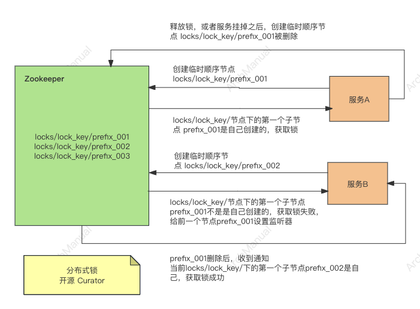
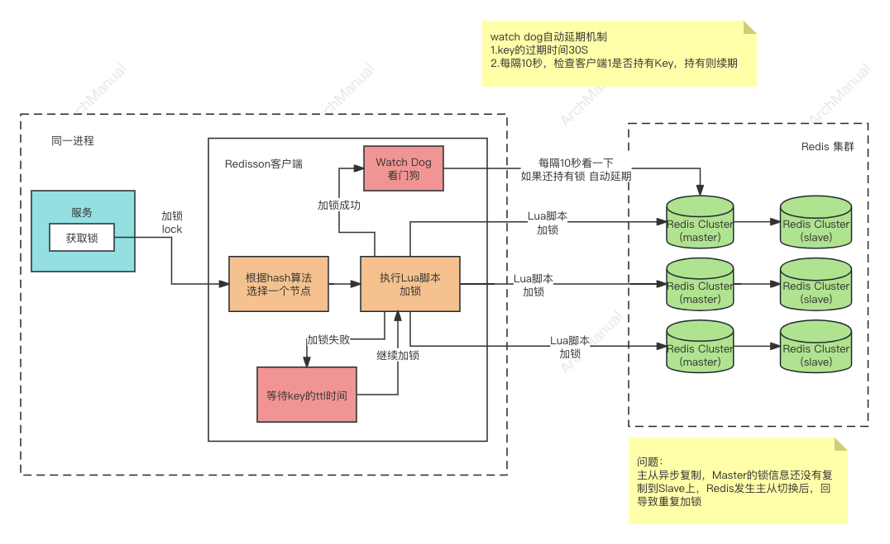
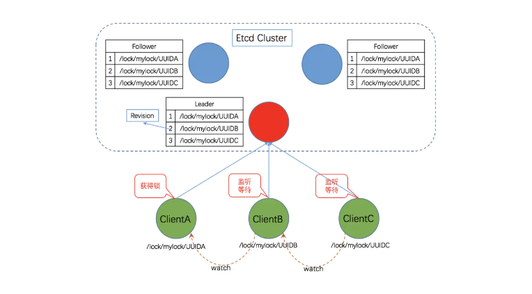

# 分布式锁
分布式锁是分布式系统中用于确保多个进程或服务在访问共享资源时能够保持互斥，以避免发生数据冲突或不一致性问题的一种同步机制。与传统的锁机制相比，分布式锁是为了解决跨多个计算节点的资源同步问题。在分布式环境下，资源可能被分布在不同的服务器上，这就需要一种跨服务器的锁机制来确保在任何时刻只有一个客户端可以访问特定的资源。

## 使用场景

1. **分布式事务管理**：
    - 在处理跨多个数据库或服务的事务时，分布式锁可以用来保证事务的一致性和完整性，避免因并发访问导致的数据不一致问题。

2. **限制资源访问**：
    - 在一些需要限制同时操作特定资源的场景中，如同一时间只允许一个服务实例执行特定的任务或操作，分布式锁可以确保资源的串行访问，避免资源冲突。

3. **系统初始化**：
    - 在多个服务实例启动时，可能需要进行一些只需执行一次的初始化操作，如数据库迁移、缓存预热等。分布式锁可以确保这些操作只被一个服务实例执行。

4. **定时任务调度**：
    - 在分布式定时任务场景中，为了防止同一个任务在多个服务实例中重复执行，可以使用分布式锁来保证同一时间只有一个实例执行该任务。

5. **分布式计数器**：
    - 在需要全局唯一性控制的场景下，比如限流、计数等，分布式锁可以用来同步不同服务或节点间的操作，保证计数器的准确性。

6. **唯一性保证**：
    - 在需要保证操作唯一性的场景中，如全局唯一ID生成、一次性操作验证等，分布式锁可以避免因并发操作导致的重复执行问题。

分布式锁是解决分布式系统中数据一致性和同步问题的关键技术之一。然而，它的使用也需要谨慎，因为不当的使用可能会导致死锁、降低系统性能等问题。正确实现和使用分布式锁，需综合考虑系统架构、性能需求和业务逻辑。

## 功能性要求
分布式锁的设计和实现需要满足一系列功能性要求，以确保它能够在分布式环境中有效地解决资源同步和并发控制的问题。这些要求不仅关乎锁的基本功能，还包括对性能、可靠性、可用性的考量。以下是分布式锁的一些关键功能性要求：

1. **互斥性（Mutual Exclusion）**：
    - 分布式锁最基本的要求是确保互斥性，即在任何时刻，只能有一个客户端持有锁。这是实现并发控制和防止资源冲突的核心。

2. **死锁预防（Deadlock Prevention）或检测**：
    - 系统设计需要预防死锁的发生，或者至少能够检测到死锁并进行恢复。这通常通过锁超时、重试机制等方式实现。

3. **容错性（Fault Tolerance）**：
    - 分布式锁应当能够处理客户端或锁服务自身的失败。即使在部分系统组件失败的情况下，也能保证锁的可用性和一致性。

4. **高可用性（High Availability）**：
    - 锁服务应设计为高可用的，以减少因服务不可用导致的业务中断风险。这可能需要通过冗余、复制等机制来实现。

5. **重入性（Reentrancy）**：
    - 在某些情况下，同一个客户端可能需要多次获取同一个锁（例如，递归算法）。分布式锁应支持重入性，允许同一个锁的多次获取。

6. **公平性（Fairness）**：
    - 在锁的分配上应考虑公平性，避免某些客户端饥饿。例如，可以通过先来先服务的队列管理锁请求。

7. **性能（Performance）**：
    - 锁操作的延迟和吞吐量是衡量分布式锁性能的关键指标。设计应尽量减少获取和释放锁所需的时间，以及网络通信的开销。

8. **可伸缩性（Scalability）**：
    - 随着系统规模的扩大，分布式锁应能够有效地扩展，以支持更多的客户端和更高的请求率。

9. **客户端阻塞与非阻塞支持**：
    - 根据不同的应用场景，分布式锁应提供阻塞和非阻塞的获取方式，以便开发者根据具体需求选择合适的模式。

10. **锁的超时与续租机制**：
    - 为了防止客户端在持有锁后因故障而无法释放锁，造成资源长时间不可用，分布式锁应支持锁的自动超时和客户端的续租操作。

满足这些功能性要求的分布式锁实现，能够为分布式系统提供可靠、高效的并发控制机制，是实现分布式系统稳定运行的关键组件之一。

## 实现方式
分布式锁是一种用于在分布式系统中同步访问共享资源的机制。在分布式系统中，多个计算节点可能需要同一时间访问同一个资源，例如数据库条目或文件，分布式锁可以确保在同一时间内只有一个节点能够访问该资源，从而避免数据不一致或资源冲突的问题。以下是几种常见的分布式锁实现方式：

### 1.基于ZooKeeper的分布式锁
基于ZooKeeper的分布式锁实现依赖于ZooKeeper的强一致性模型和其对临时节点（临时Znode）的支持。ZooKeeper是一个为分布式应用提供一致性存储的系统，常用于名称服务、配置管理、同步服务和提供分布式锁等。

#### 实现原理

1. **锁的创建**：
   - 当一个客户端希望获得锁时，它在ZooKeeper的指定锁目录下创建一个临时顺序节点。节点的路径可以是`/locks/lock_key/prefix_000000001`，其中`/lock`是锁的根目录，`lock_key`是锁的名称，`prefix_`是前缀，后面的数字是一个自动递增的序列号。

2. **锁的获取**：
   - 创建节点后，客户端获取锁目录下的所有子节点，并比较自己创建的节点序号。如果该客户端创建的节点序号是最小的，那么它成功获得锁。如果不是，客户端找到比自己序号小的最大节点，然后对其设置监听（Watch），进入等待状态。

3. **锁的释放**：
   - 持有锁的客户端完成其临界区的操作后，删除自己创建的临时节点，释放锁。删除操作触发监听该节点的下一个客户端（即序号次小的节点），使其获得锁。

#### 优点

1. **强一致性保证**：
   - ZooKeeper保证了跨所有节点的数据一致性，这使得基于ZooKeeper的分布式锁实现非常可靠。

2. **自动失效处理**：
   - 利用ZooKeeper的临时节点，当客户端崩溃或失去与ZooKeeper的连接时，其创建的临时节点会被自动删除，从而释放锁，避免死锁。

3. **公平性**：
   - 由于锁的获取基于节点序列号的顺序，这保证了请求锁的公平性，先到的先得到锁。

#### 缺点

1. **性能问题**：
   - 每次锁的获取和释放都涉及到与ZooKeeper服务器的网络通信，相比本地锁会有更高的延迟。此外，频繁的锁请求可能导致ZooKeeper集群负载较高。

2. **复杂性**：
   - 实现和维护一个基于ZooKeeper的分布式锁比较复杂，需要处理网络问题、节点监听等多种场景。

3. **资源消耗**：
   - 如果大量的分布式锁操作，ZooKeeper的临时节点会频繁地创建和删除，这可能会消耗大量的ZooKeeper资源，并影响其性能。

基于ZooKeeper的分布式锁适用于对一致性要求较高、锁竞争不是非常频繁的场景。在设计系统时，需要综合考虑性能、可靠性以及系统复杂性等因素，选择最合适的分布式锁实现方案。

#### 开源实现
- [Curator](https://github.com/apache/curator)

### 2.基于Redis的分布式锁
基于Redis的分布式锁有多种实现方式，包括：直接使用Redis命令、[Redisson客户端(推荐)](https://github.com/redisson/redisson)、以及官方RedLock。
#### 2.1 Redis命令
基于Redism命令的分布式锁是一种在分布式系统中实现互斥访问共享资源的机制，主要利用Redis的特性，如原子性操作、键过期等，来实现锁的功能。

##### 实现原理

1. **锁的获取**：
   - 客户端通过使用`SET`命令与一些特定的参数（如`NX`和`PX`）来尝试创建一个键，其中`NX`参数使得命令只在键不存在时成功（即锁未被占用），`PX`参数指定了键的过期时间（锁的持有时间）。如果命令返回成功，那么该客户端获得了锁。

   ```redis
   SET lock_key unique_value NX PX 30000
   ```
   这个命令尝试设置一个名为`lock_key`的锁，`unique_value`是一个客户端生成的唯一值，用来标识锁的所有者，以确保只有锁的持有者可以释放锁。`PX 30000`指定锁的自动释放时间是30000毫秒。

2. **锁的释放**：
   - 锁的持有者通过删除键来释放锁。为了安全地执行这一操作，需要使用Lua脚本来确保检查键的值和删除操作的原子性。这是因为只有锁的持有者（即知道`unique_value`的客户端）才能释放锁。

   ```redis
   if redis.call("get",KEYS[1]) == ARGV[1] then
       return redis.call("del",KEYS[1])
   else
       return 0
   end
   ```
   这段Lua脚本检查`lock_key`的值是否与客户端提供的`unique_value`相等，如果相等则删除键，释放锁。

##### 优点

1. **性能高**：Redis是一个高性能的内存数据库，处理锁操作非常快，适合需要快速响应的场景。
2. **简单易用**：相对于ZooKeeper等系统，Redis的使用和维护更简单。
3. **灵活性**：Redis提供的各种数据结构和操作命令使得基于Redis的分布式锁可以很容易地根据需要进行扩展和自定义。

##### 缺点

1. **可靠性问题**：在Redis集群模式下，由于网络分区和Redis实例故障等问题，可能存在锁丢失的风险。
2. **不是完全公平的**：基于Redis的分布式锁无法保证完全的公平性，即请求锁的顺序并不总是严格按照客户端请求的顺序授予锁。
3. **需要处理锁的续租**：由于锁有过期时间，客户端需要自行实现锁续租逻辑，以避免长时间运行的操作因锁自动过期而导致的问题。

基于Redis的分布式锁因其高性能和易用性被广泛应用，尤其适合对锁操作响应时间要求严格的场景。然而，它的可靠性和公平性可能不如基于ZooKeeper的实现，因此在选择分布式锁实现方案时需要根据具体需求权衡。

#### 2.2 Redisson
Redisson 是一个基于 Java 的 Redis 客户端库，提供了丰富的分布式数据结构和服务，包括分布式锁。Redisson 的分布式锁实现利用了 Redis 的特性，提供了一个高级的、易于使用的分布式锁实现。

##### 实现原理

Redisson 的分布式锁主要依赖于 Redis 的 `SET` 命令和 Lua 脚本来确保操作的原子性。具体实现涉及以下几个关键步骤：

1. **锁的获取**：
   - Redisson 通过发送一个包含 `NX`（只有键不存在时才设置）、`PX`（设置键的过期时间）选项的 `SET` 命令来尝试获取锁。如果该命令执行成功（即之前锁不存在），则表示锁被成功获取。
   - `KEYS[1]` 锁的KEY, `ARGV[2]` 客户端ID

```redis
if (redis.call('exists', KEYS[1]) == 0) then
        redis.call('hset', KEYS[1], ARGV[2], 1);
         redis.call('pexpire', KEYS[1], ARGV[1]);
         return nil;
          end;
if (redis.call('hexists', KEYS[1], ARGV[2]) == 1) then
        redis.call('hincrby', KEYS[1], ARGV[2], 1);
        redis.call('pexpire', KEYS[1], ARGV[1]);
        return nil;
        end;
return redis.call('pttl', KEYS[1]);
```
2. **锁的自动续期**：
   - 为了防止长时间操作导致锁过期（客户端崩溃或长时间运行的任务），Redisson 会在一个后台线程中自动给持有的锁续期，确保在操作进行期间，锁不会失效。

3. **公平锁和非公平锁**：
   - Redisson 提供了公平锁（`RFairLock`）和非公平锁（`RLock`）的实现。公平锁通过维护一个请求队列来保证获取锁的顺序性，而非公平锁则不保证这一点。公平锁的实现更加复杂，需要更多的 Redis 操作。

4. **锁的释放**：
   - 释放锁时，Redisson 通过执行一个 Lua 脚本来确保操作的原子性。该脚本会检查当前锁是否仍然由当前线程持有（通过比对一个唯一标识符），如果是，则释放锁。
   - `KEYS[1]` 锁的KEY, `ARGV[2]` 客户端ID 

```redis

if (redis.call('exists', KEYS[1]) == 0) then
       redis.call('publish', KEYS[2], ARGV[1]);
        return 1;
        end;

if (redis.call('hexists', KEYS[1], ARGV[3]) == 0) then
     return nil;
     end;

local counter = redis.call('hincrby', KEYS[1], ARGV[3], -1);
if (counter > 0) then
     redis.call('pexpire', KEYS[1], ARGV[2]);
     return 0;
else redis.call('del', KEYS[1]);
     redis.call('publish', KEYS[2], ARGV[1]);
     return 1;
     end;
return nil;
```
##### 两点说明
1. **为什么要用lua 脚本 + hset 客户端id number 命令来实现？**  
   （1）setnx key value(客户端id)  + pexpire。 pexpire执行失败，回造成锁无法释放。     
   （2）set key value(客户端Id) nx expx time。 没有（1）的问题，但不可重入。    
   （3）lua脚本 + hset key 客户端id number。没有（1）（2）的问题，可实现可重入锁。    

2. **为什么要设置客户端id？**  
   （1）删除时，可判断是否是自己加的锁，防止误删除。  
   （2）实现锁的可重入。  

##### 优点

1. **易用性**：Redisson 提供了丰富的高层抽象，使得在 Java 应用中实现分布式锁变得非常简单。
2. **高性能**：基于 Redis 的实现保证了高性能，特别是在锁操作需要快速响应的场景中。
3. **自动续期**：自动续期机制防止了因任务运行时间过长而导致的锁过期问题。
4. **支持公平锁和非公平锁**：提供了更灵活的锁策略选择。
5. **可重入**：一个客户端加锁成功后，可多次加锁。

##### 缺点

1. **依赖于 Redis 的可用性**：如果 Redis 服务不可用，基于 Redisson 的分布式锁也会受到影响。
2. **资源消耗**：自动续期机制虽然可以防止锁过期，但也意味着额外的资源消耗和网络通信。
3. **Redis 的持久性问题**：在 Redis 配置为非持久化模式时，可能会在 Redis 重启后丢失锁信息，尽管这在分布式锁的使用场景中通常不是主要问题。

Redisson 的分布式锁提供了一个在 Java 中易于使用、性能良好的解决方案，适合需要快速开发分布式应用的团队。然而，选择使用 Redisson 时，还需要考虑到应用对 Redis 服务的依赖以及相关的资源消耗。

##### 开源地址
- [Redisson](https://github.com/redisson/redisson)

#### 2.3 RedLock(不推荐)

RedLock 算法是由 Redis 的创始人 Antirez 提出的一种分布式锁的实现算法，旨在提高分布式系统中锁的可靠性。该算法主要用于解决在分布式环境下单个 Redis 实例可能出现的单点故障问题，通过组合多个 Redis 实例来达到更高的可靠性。

##### 实现原理

RedLock 算法的核心思想是同时使用多个独立的 Redis 实例来获取锁，只有当大多数的 Redis 实例都成功获得锁时，锁才被认为是成功获取的。算法的基本步骤如下：

1. **获取锁**：
   - 客户端尝试在 N 个 Redis 实例上创建锁，每个实例都设置一个相同的锁ID（由客户端生成，保证唯一性）和锁的有效时间。
   - 客户端需要在给定的时间内（比如10毫秒内）从大多数（大于 N/2）的 Redis 实例上成功获得锁。
   - 如果客户端从大多数实例上成功获取了锁，那么认为锁获取成功。客户端计算获取锁的有效时间，这个有效时间是原始有效时间减去获取锁所花费的时间。

2. **释放锁**：
   - 客户端在完成操作后，需要释放在所有 Redis 实例上的锁。这通常通过发送一个解锁脚本来实现，该脚本会检查锁ID是否匹配，以确保只有锁的持有者能释放锁。

##### 优点

1. **避免单点故障**：通过使用多个 Redis 实例，RedLock 算法减少了因单个 Redis 实例故障导致的锁失效风险。
2. **容错能力**：即使部分 Redis 实例不可用，只要大多数实例可用，锁操作仍然可以成功进行。
3. **较高的可靠性**：相较于单个 Redis 实例的锁实现，RedLock 提供了更高的可靠性，适用于对锁准确性要求较高的场景。

##### 缺点

1. **复杂性**：实现 RedLock 算法需要维护多个 Redis 实例，增加了部署和管理的复杂性。
2. **性能开销**：与单个 Redis 实例相比，RedLock 需要在多个实例上进行锁操作，可能会增加延迟和网络开销。
3. **争议和风险**：关于 RedLock 算法的安全性和可靠性有一定的争议。一些专家认为即使使用多个实例，也难以完全保证分布式锁的安全性，因为网络分区和时钟漂移等问题仍然可能导致锁的不正确行为。

尽管存在争议，RedLock 算法在一定条件下可以提供比单个 Redis 实例更高的可靠性，特别是在需要避免单点故障且可以接受一定的性能开销的应用场景中。然而，设计和实施 RedLock 方案时，需要仔细考虑其复杂性和潜在的风险。


### 3.基于Etcd的分布式锁
Etcd 是一个高可用的分布式键值存储，常用于配置管理和服务发现。它提供了一致性保证，使其成为实现分布式锁的理想选择。基于 Etcd 的分布式锁利用 Etcd 的事务和租约（Lease）机制来实现。

#### 实现原理

整个实现方式类似于Zookeeper  

1. **租约创建**：
   - 客户端首先创建一个租约（Lease），租约在一定时间后会过期。租约的存在时间就是锁的最大持有时间，以防止客户端在持有锁时发生故障导致锁无法释放。

2. **锁的获取**：
   - 客户端尝试在 Etcd 中创建一个带有租约的键。这个键的存在代表着锁的占用。如果键已经存在，表示锁被其他客户端持有。客户端可以选择等待或重试。

3. **锁的等待**：
   - 如果锁已被其他客户端持有，当前客户端可以通过观察（watch）该键的变化来等待锁被释放。Etcd 的观察机制允许客户端被动地接收键值变化的通知。

4. **锁的释放**：
   - 锁的持有者通过删除对应的键或让租约过期来释放锁。其他客户端可以通过观察到这一变化来重新尝试获取锁。

#### 优点

1. **强一致性**：Etcd 使用 Raft 协议来保证数据的一致性，这意味着基于 Etcd 的分布式锁在分布式系统中非常可靠。
2. **容错性**：由于 Etcd 是一个集群，它能够处理节点故障，保持高可用性和持久性。
3. **自动锁释放**：通过租约机制，即使锁的持有者发生故障，锁也会在租约过期后自动释放，防止死锁。

#### 缺点

1. **性能开销**：与基于内存的锁（如 Redis 锁）相比，基于 Etcd 的锁可能会有更高的延迟，因为它依赖于网络和磁盘 I/O。
2. **复杂性**：实现和管理基于 Etcd 的锁相对复杂，需要对 Etcd 的工作机制有一定了解。
3. **资源消耗**：Etcd 集群的运行需要消耗系统资源，特别是在高负载环境下，可能需要优化 Etcd 集群的配置和部署。

基于 Etcd 的分布式锁因其强一致性和高可用性而受到青睐，特别适用于对锁准确性和系统稳定性要求较高的场景。然而，设计时需要权衡其性能开销和管理复杂性。

#### 开源客户端
- [Jetcd](https://github.com/etcd-io/jetcd)

## 工具
推荐
- [Redisson](https://github.com/redisson/redisson)
- [Curator](https://github.com/apache/curator)
- [Jetcd](https://github.com/etcd-io/jetcd)