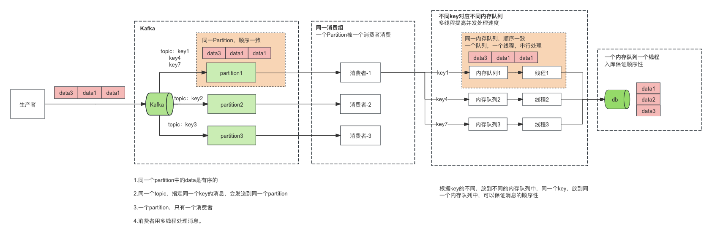
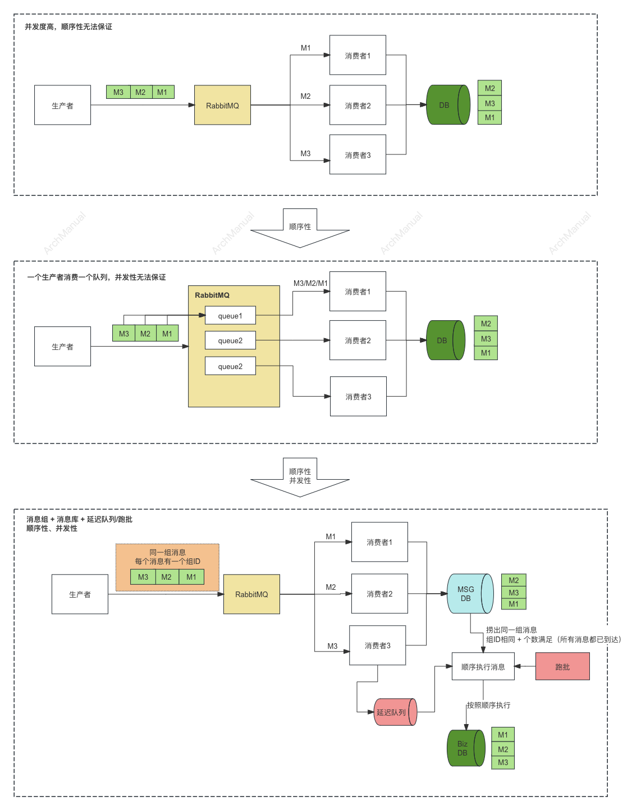
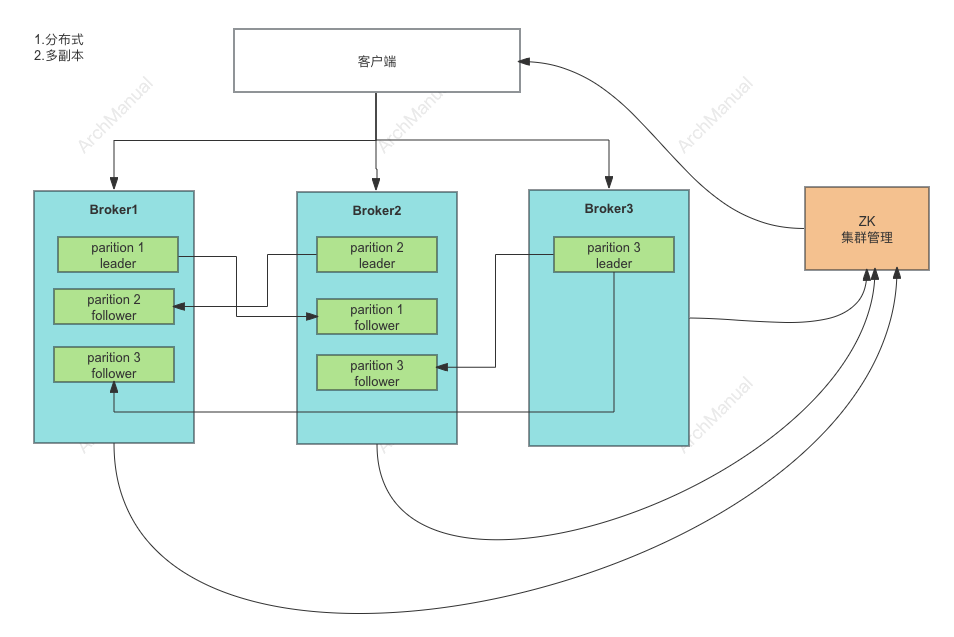
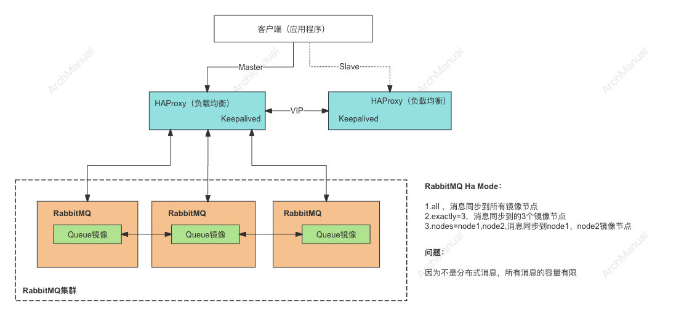
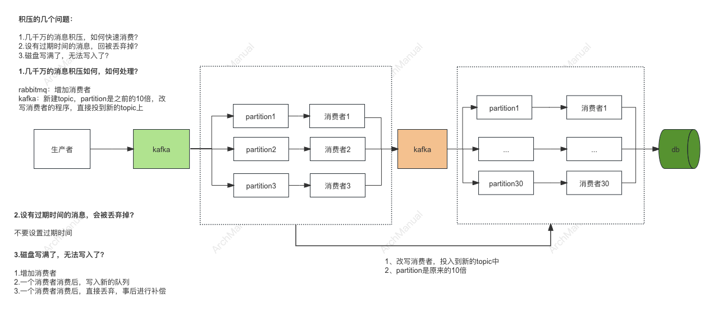
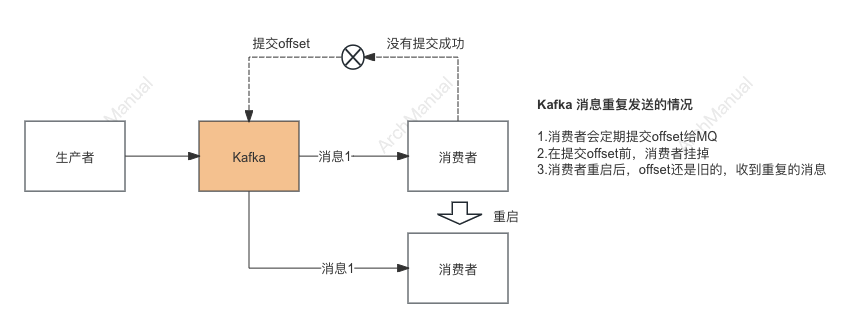
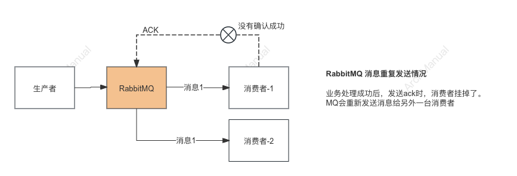
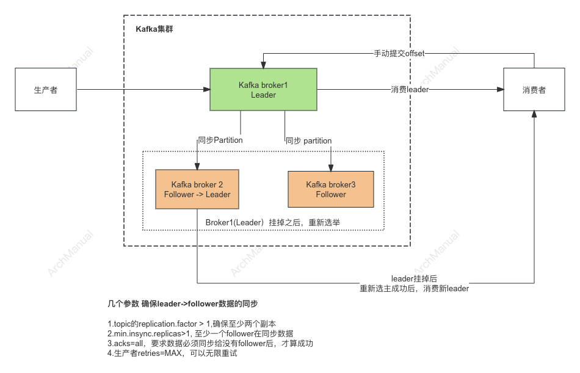
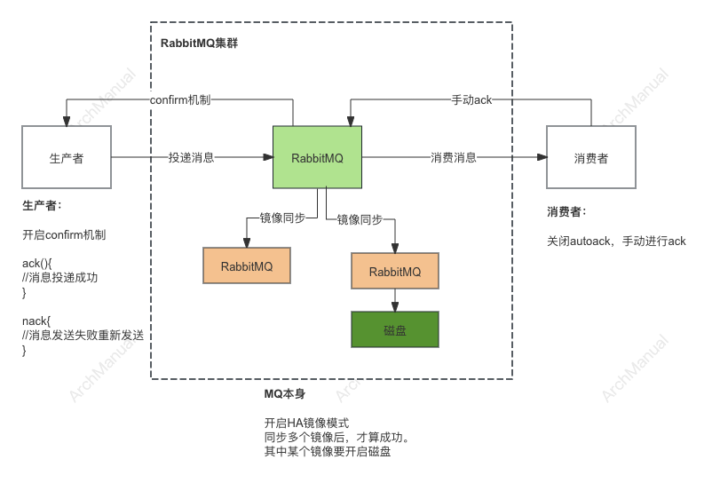

# 消息队列

消息队列（Message Queue）是一种用于系统或服务之间发送和接收消息的技术。
它主要用于在不同的应用程序、系统或服务之间异步地交换数据。
消息队列作为一种中间件，提供了缓冲和存储机制，使得发送者和接收者无需同时在线或直接连接，也能进行通信。

## 场景
1. **解耦**：消息队列可以帮助将应用程序的不同组件解耦，使它们可以独立地进行开发、部署和扩展。
2. **异步**：消息队列可以用于实现异步处理，提高系统的响应速度和吞吐量。
3. **削峰填谷**：消息队列可以用于平滑系统的流量波动。当系统面临突然的高流量时，消息队列可以暂时存储消息，然后由后续的处理者逐渐消费这些消息，防止系统因突发流量而崩溃。
4. **日志处理**：消息队列可以用于收集和处理大量的日志数据。应用程序可以将日志信息发送到消息队列，然后由专门的日志处理服务从队列中获取日志并进行分析、存储或展示。
5. **任务调度**：消息队列可以用于实现任务调度系统。应用程序可以将需要定时执行的任务信息发送到消息队列，然后由专门的调度器从队列中获取任务并按照预定的时间执行。
6. **分布式系统通信**：在分布式系统中，各个节点之间需要进行通信和协调。消息队列可以作为一种分布式通信的基础设施，帮助不同节点之间进行消息交换和数据同步。
7. **重试机制**：消息队列可以提供消息重试的机制，当消息处理失败时，可以将消息重新放入队列，等待后续重试，以确保消息被正确处理。
8. **事件驱动架构**：消息队列可以用于构建事件驱动架构，通过发布-订阅模式实现系统中的事件通知和处理。

## 功能性要求
1. **可靠性**：消息队列应该能够保证消息的可靠传输，即使在系统故障或网络异常的情况下，也能够确保消息不会丢失。为了实现可靠性，通常会采用消息持久化、消息确认机制和消息重试机制等手段。
2. **高吞吐量**：消息队列应该能够支持高吞吐量的消息处理，能够处理大量的消息并且保持低延迟。为了实现高吞吐量，需要考虑队列的设计、消息的存储和传输等方面的性能优化。
3. **可扩展性**：消息队列应该具备良好的可扩展性，能够根据需求灵活地扩展系统的规模和容量。这包括水平扩展、集群化部署、分区和分片等技术手段。
4. **消息排序**：某些场景下，消息的顺序很重要，因此消息队列应该能够保证消息的顺序性。即使是分布式环境下，也需要确保相同分区或主题中的消息能够按照发送顺序进行处理。
5. **灵活的消息路由**：消息队列应该支持灵活的消息路由机制，能够根据消息的内容、标签或其他属性将消息路由到不同的队列或主题中，以便于实现定制化的消息处理逻辑。
6. **低延迟**：对于一些实时性要求较高的场景，消息队列应该能够保证低延迟的消息传输和处理，尽可能减少消息在队列中的停留时间。
7. **可观测性**：消息队列应该提供丰富的监控和管理功能，能够实时监控队列的状态、消息的流动情况、处理速度等指标，并提供相应的报警和日志记录功能，帮助系统管理员进行运维和故障排查。
8. **安全性**：消息队列应该具备良好的安全性，能够保护消息的机密性和完整性，防止消息被篡改或者被未授权的访问。这包括数据加密、身份认证、访问控制等安全措施。
9. **灵活的部署和集成**：消息队列应该能够与现有的系统和组件进行灵活的集成，支持多种部署方式，包括本地部署、云端部署和容器化部署等。 
 
## 消息队列选型

在选择分布式消息队列时，需要考虑多个因素，包括性能、可靠性、易用性、社区支持、成本和特定的功能需求。

下面列举一些流行的分布式消息队列系统，以及它们的主要特点和适用场景：

### 1. Kafka

Apache Kafka 是一个分布式流处理平台，最初由LinkedIn开发，后来成为Apache软件基金会的一部分。 它主要用于构建实时数据管道和流应用程序。

以下是Kafka的主要特点、适用场景以及其优缺点：

#### 特点
1. **高吞吐量**：Kafka能够处理数百万条消息每秒，非常适合需要大规模消息处理的应用。
2. **可扩展性**：Kafka可以水平扩展，通过增加更多的服务器来增强处理能力。
3. **持久性**：Kafka将消息存储在磁盘上，并支持消息的持久化，确保数据不会因为系统故障而丢失。
4. **容错性**：Kafka通过复制数据到多个节点来保证高可用性和数据安全。
5. **实时性**：Kafka支持实时的消息处理，使得数据可以快速被消费和分析。

#### 适用场景
1. **实时数据处理**：Kafka常用于需要实时数据处理的场景，如实时分析、实时监控和实时报警。
2. **日志聚合**：Kafka可以从多个服务收集日志数据，然后集中处理和分析。
3. **事件驱动架构**：Kafka是构建事件驱动系统的理想选择，支持事件的发布、订阅和存储。
4. **流式处理**：与Apache Flink或Apache Spark等流处理框架结合，可以进行复杂的数据处理和分析。
5. **消息队列**：Kafka可以用作传统消息队列的替代品，支持消息的缓冲和异步通信。

#### 优点
1. **性能优越**：Kafka设计时考虑到高吞吐和低延迟，性能非常出色。
2. **高可靠性**：通过数据副本和故障转移机制，Kafka确保在节点故障时仍能提供服务。
3. **弹性与可伸缩性**：Kafka集群可以动态伸缩，容易应对不断变化的负载需求。

#### 缺点
1. **复杂的配置**：Kafka的配置较为复杂，尤其是在大规模部署时，管理和优化可能需要较深的技术知识。
2. **资源消耗**：由于依赖于ZooKeeper来进行管理和协调，Kafka可能会占用较多的系统资源。
3. **学习曲线**：对于新用户来说，Kafka的概念和架构比较复杂，需要时间来学习和掌握。

Apache Kafka非常适合需要处理大量数据流的企业和应用，它的设计目标是优化数据的快速传输和处理。对于需要高性能和可靠性的系统，Kafka是一个非常好的选择。

### 2.RabbitMQ

RabbitMQ 是一个流行的开源消息代理软件，它实现了高级消息队列协议（AMQP）。

它被广泛用于在分布式系统中处理消息和任务队列。以下是RabbitMQ的主要特点、适用场景以及优缺点：

#### 特点
1. **多协议支持**：RabbitMQ 支持多种消息传递协议，包括 AMQP、STOMP、MQTT 等。
2. **灵活的路由功能**：通过交换器（exchanges）、队列（queues）和绑定（bindings）的组合，可以灵活地控制消息如何路由和分发。
3. **可靠性**：RabbitMQ 提供消息持久化、交付确认、消息回溯等功能，确保消息的可靠传递。
4. **插件系统**：RabbitMQ 可以通过插件扩展功能，如集群管理、跟踪、高可用性等。
5. **客户端语言支持**：支持多种编程语言的客户端，如 Python、Java、Ruby、.NET 等。

#### 适用场景
1. **异步处理**：在Web应用中用于处理耗时任务，如发送电子邮件、图片处理等。
2. **应用解耦**：各个微服务或系统组件之间通过消息队列进行通信，减少它们之间的直接依赖。
3. **负载均衡**：通过消息队列平衡不同消费者的工作负载，提高系统整体效率。
4. **任务调度与分布**：用于分布式系统中任务的调度和执行，使任务分配更加灵活和可控。

#### 优点
1. **易于使用和设置**：RabbitMQ 安装简单，配置直观，易于理解和使用。
2. **高可用性**：支持集群模式，可以非常容易地搭建高可用的消息队列系统。
3. **社区支持强**：有一个活跃的社区和广泛的文档支持，问题解决相对容易。

#### 缺点
1. **性能瓶颈**：在极高的吞吐量需求下，性能可能不如某些专为高吞吐量设计的消息系统（如Kafka）。
2. **管理复杂性**：在大规模部署和精细的性能调优时，管理和维护可能较为复杂。
3. **资源使用**：相比于一些更轻量级的消息队列，RabbitMQ的资源消耗相对较高。

RabbitMQ 适合需要高可靠性和灵活消息路由的应用场景。它在小到中型企业或需要复杂消息路由逻辑的场景中表现尤为出色。

### 3.RocketMQ

Apache RocketMQ 是一个开源的分布式消息中间件和流处理平台，由阿里巴巴开发并捐赠给Apache软件基金会。 它主要用于处理大规模、高吞吐量的消息服务。

以下是RocketMQ的主要特点、适用场景以及优缺点：

#### 特点
1. **高性能、高吞吐量**：RocketMQ 能够支持每秒万级的消息处理，适合大规模数据处理需求。
2. **可靠性和可扩展性**：支持分布式架构，可以无缝扩展，同时确保消息的可靠传输。
3. **多种消息模式**：支持发布-订阅模式、点对点消息模式，以及顺序消息、延时消息等高级特性。
4. **事务消息支持**：提供事务消息功能，可以确保消息在分布式事务中的一致性。
5. **容错与高可用**：通过消息存储复制和自动故障恢复，保证系统的高可用性。

#### 适用场景
1. **金融行业**：适用于高可靠性和一致性要求的金融交易和支付系统。
2. **大数据处理**：用于大规模数据收集、存储和处理，如日志数据、用户行为数据等。
3. **分布式系统的服务解耦**：各服务之间通过RocketMQ进行通信，降低系统耦合度。
4. **订单处理系统**：处理高并发的订单消息，确保订单数据的一致性和可靠性。
5. **实时计算**：与流处理框架结合，进行实时数据分析和计算。

#### 优点
1. **高可靠性**：具备高可靠消息传递机制，非常适合需要保证消息不丢失的场景。
2. **高性能**：设计时就考虑了高性能，适合需要处理大量数据的业务场景。
3. **功能丰富**：支持多种消息类型和传输模式，满足复杂应用场景的需求。

#### 缺点
1. **配置和管理复杂**：功能丰富也带来了配置和管理的复杂性，对于初学者来说，学习和部署成本相对较高。
2. **资源消耗**：为了保证消息的可靠性和服务的高可用性，可能会消耗较多的系统资源。
3. **社区和文档**：虽然社区在成长，但相比于一些更成熟的消息队列如Kafka和RabbitMQ，其社区和文档支持可能还不够完善。

RocketMQ 特别适合于需要处理高吞吐量、高可靠性的大型分布式系统。对于金融、电商等行业，RocketMQ 提供了强大的支持，可以帮助企业建立稳定可靠的消息服务平台。

## 架构点

在使用消息队列时，确保系统的可靠性、一致性和性能是关键。以下是以Kafka、RabbitMQ为例来说明在使用消息队列的过程中的一些需要考虑和熟悉的的架构点：

### 1. 顺序性
在消息队列系统中，消息的顺序性是指在消息生产、传输和消费的过程中保持消息的原始顺序不变的特性。

这意味着如果生产者按照某种特定的顺序发送消息，消费者在接收和处理这些消息时，应该能够按照相同的顺序进行。

消息的顺序性在许多应用场景中非常重要，特别是在需要严格的数据一致性和事务顺序的场合。

比如以下场景中，消息顺序性就比较重要：

1. **事务处理**：在处理金融交易或任何涉及事务的系统时，保证操作的顺序与其发生的实际顺序相同是至关重要的。

2. **状态更新**：在状态更新或日志记录的应用中，确保按照正确的顺序记录或更新状态，以避免数据不一致。

3. **事件驱动架构**：在基于事件的系统中，事件处理的顺序可能会影响最终状态或结果，因此保持事件的顺序是必需的。

4. **数据重放**：在需要重放数据以恢复系统状态的情况下，保证数据的顺序性可以确保重放过程的准确性。

消息顺序性是保证数据一致性和系统可靠性的重要方面。在实现消息顺序性时，可能需要在性能和顺序精确性之间做出权衡，尤其是在高吞吐量的系统中。

#### 1.1 Kafka 消息顺序性
Kafka 保证消息顺序性的主要方式是依靠其分区（partition）和偏移量（offset）的机制。

以下是 Kafka 保障消息顺序性的几个关键点：

1. **单一分区内的顺序**：Kafka 可以保证单个分区内消息的顺序。当生产者向 Kafka 发送消息时，如果指定了分区(key相同，则会发到同一个分区），消息将被追加到该分区的日志末尾。消费者从分区中读取消息时，可以按照消息被存储的顺序（也就是偏移量的顺序）来消费，从而实现顺序处理。

2. **键（Key）的使用**：在生产消息时，可以为消息指定一个键（key）。Kafka 根据这个键来确定消息应该发送到哪个分区。如果所有相同键的消息都发送到同一个分区，那么这些消息就会按照发送的顺序来保存和处理。

3. **偏移量（Offset）管理**：每条消息在其所在分区中都有一个唯一的偏移量。消费者通过追踪已经读取的最后一个消息的偏移量，可以保证按照顺序处理消息。

4. **消费者组内的单一消费者订阅**：在一个消费者组中，每个分区只能由一个消费者来消费，这样可以防止在同一个分区内部发生消息顺序错乱的问题。

5. **消费者内部使用内存队列**：因为同一个消费者组中，一个分区的数据只能有一个消费者来消费，消除的处理变成了串行。为了提供并行度，可以引入内存队列。
在消费消息的时候，将不同key的消息放到不同的内存队列中，每个内存队列对应一个线程来处理内存队列中的消息。这样既可以保证消息的顺序性，同时也增强消息处理的并发度。

#### 1.2 RabbitMQ 消息顺序性
RabbitMQ 保存消息的顺序性，可以将消息发送到同一个队列中，一个队列使用一个消费者来消费，但这样会大大降低消息处理的并发度。
如果要同时满足顺序性和并发度的要求，则需要在系统上做额外的设计。

1. **日常使用场景**：RabbitMQ的日常场景下，并发度很高，但顺序性无法做的保证。
2. **一个队列一个消费者**：如果业务要求需要保证消息出来的顺序但对并发度要求很低，则可以用使用RabbitMQ自身的队列来是实现。
在RabbitMQ中，一个队列中的消息是可以保证顺序的，生产者可以将消息按照顺序放到同一个队列中。
一个队列对应一个消费者，消费者从队列中按照顺序进行消费则可以保证消息的顺序性。
但这种情况下，一个队列只有一个消费者进行串行消费，并发度大大降低。
3. **系统额外设计**：如果要同时满足顺序性和并发度的要求，则需要在系统上做额外的设计。需要引入以下设计：
   - **消息组**：有顺序要求的一组消息可以放到同一个消息组中，每个消息体中有一个消息组的Id的字段，同一组消息，消息组ID一样。生成者再发送消息时，按照正常的发送逻辑进行发送即可，不需要放到同一个队列中。
   - **消息库**：需要一个消息库，将有顺序要求的消息先放到消息库中，不做业务逻辑的处理。消费者再消费到消息后，只放到消息库，然后通过延迟队列或者跑批来处理同一组消息。
   - **消息顺序处理**：通过延迟队列或者跑批的方式，从消息库中取出同一组消息，要求同一组的消息都已经入库，如果同一组的消息仍然有消息未到达，则不处理。取出同一组消息之后，按照消息的顺序执行业务逻辑，将结果存放到业务库中。

### 2. 高可用  
消息队列的高可用性是确保系统可靠性和持续运行的关键要素，特别是在处理大量数据和高并发请求的分布式系统中。实现消息队列的高可用性通常包括以下几个方面：

1. **冗余部署**：通过在多个服务器或数据中心部署消息队列的多个实例来实现冗余。这样，即使某个实例失败，其他实例仍可继续处理消息。

2. **数据复制**：通过在不同的服务器之间复制数据，确保数据的一致性和完整性。这可以通过同步或异步复制完成，确保消息不会因单点故障而丢失。

3. **故障转移（Failover）机制**：在检测到某个节点故障时，系统自动将该节点的工作转移到其他正常节点，以保证服务的连续性。这通常需要配合负载均衡器和健康检查机制使用。

4. **持久化**：将消息存储在磁盘上，而不仅仅是内存中，可以防止系统崩溃导致的数据丢失。持久化可以在消息到达队列时立即进行，也可以定期进行。

5. **监控与告警**：实时监控消息队列的状态和性能指标，如队列长度、处理延迟和节点健康状况。一旦发现异常，立即通过邮件、短信或其他方式发送告警，快速响应可能的故障。

6. **负载均衡**：通过在多个节点间均匀分配工作负载，避免任何单一节点过载，增强系统的整体性能和稳定性。

#### 2.1 Kafka 高可用
Kafka 通过一系列设计和配置选择来保证高可用性： 

1. **副本机制**：
   - Kafka 通过在不同的服务器（称为broker）上复制每个分区的数据来实现高可用性。每个主题分区可以配置多个副本，这些副本分布在不同的brokers上。
   - 每个分区有一个称为“领导者”的副本，它处理所有读写请求。其他副本称为“追随者”，它们从领导者那里同步数据。
   - 当领导者发生故障时，一个追随者将被自动选举为新的领导者，从而确保服务的连续性。

2. **同步与异步复制**：
   - Kafka 允许配置副本的同步方式。如果配置为同步复制，领导者必须等待一个或多个追随者确认已收到数据后才认为消息提交完成。
   - 异步复制则不需要等待追随者确认，这可以提高性能，但在极端情况下可能导致数据丢失。

3. **故障转移**：
   - Kafka 的故障转移能力依赖于ZooKeeper，它用于管理集群的元数据和进行领导者选举。
   - 当领导者副本发生故障时，ZooKeeper 协助选举一个新的领导者，通常是数据最完整的那个追随者。

4. **持久化**：
   - Kafka 默认将所有消息存储在磁盘上，而不是内存，这意味着即使系统发生重启，数据也不会丢失。
   - Kafka的存储机制设计为对磁盘I/O进行优化，能够支持高速数据写入和读取。

5. **分区与负载均衡**：
   - 通过增加分区数，Kafka 可以在更多的broker上分散读写负载，这不仅可以提高并发处理能力，还可以在发生单个broker故障时减少影响。
   - 生产者和消费者都可以根据分区键将消息均匀分布到不同的分区，实现负载均衡。

6. **监控与管理**：
   - Kafka集群的运行状态可以通过各种监控工具（如JMX、Prometheus等）进行监视，及时发现并解决潜在的问题。

通过上述机制，Kafka 能够在面对硬件故障、软件故障和网络问题时，保持高度的可用性和数据完整性。

#### 2.2 RabbitMQ 高可用
RabbitMQ 的高可用性设计主要通过以下几种机制来实现：

1. **集群部署**：
   - RabbitMQ 支持集群模式，允许多个节点共同组成一个逻辑上的消息代理。在这种配置中，队列可以在多个节点上镜像，从而实现高可用性。
   - 节点可以是完全相同的，这意味着每个节点都可以处理消息和连接。

2. **镜像队列**：
   - 镜像队列是 RabbitMQ 中实现高可用性的关键特性。这一机制允许队列中的消息在多个节点之间复制，确保即使某个节点失败，消息也不会丢失。
   - 当创建队列时，可以指定镜像队列的参数，包括哪些节点将镜像这个队列，以及如何同步消息。

3. **故障转移**：
   - 在发生节点故障时，镜像队列中的一个从节点（slave）可以自动升级为主节点（master），继续处理消息。这种自动故障转移机制确保了服务的持续性。

4. **持久化**：
   - RabbitMQ 允许用户将消息标记为“持久化”，这意味着这些消息会被存储在磁盘上，而不仅仅是内存。这样在节点重启之后，消息不会丢失。
   - 队列和交换机也可以配置为持久的，确保它们在服务器重启后仍然存在。

5. **负载均衡**：
   - 在 RabbitMQ 的集群环境中，客户端连接可以分散到多个节点上，以均衡负载。这可以通过智能客户端或负载均衡器（比如HaProxy）实现，后者可以均匀地将连接请求分配给各个节点。
   在使用负载均衡器，也要确保负载均衡器本身的高可用，不能出现单点故障，比如：使用HaProxy作为负载均衡器，则可以使用Keepalived 来确保HaProxy的高可用。

6. **监控**：
   - 监控是维护高可用性系统的重要部分。RabbitMQ 提供了多种监控工具，例如 RabbitMQ Management Plugin，它提供了一个基于 Web 的界面来监视和管理节点状态、队列长度、消息吞吐量等。

### 3. 消息积压 
消息积压通常是指在消息传输和处理系统中，由于某些原因导致消息不能及时处理，而积压在队列中。

这种情况可以由多种因素引起，包括：
   
1. **生产速率高于消费速率**：如果消息的生产速度持续超过消费速度，消息就会在队列中积累。

2. **消费者处理能力不足**：消费者的处理能力可能因为硬件限制、软件效率问题或者错误的设计而不足，导致不能及时处理队列中的消息。

3. **资源限制**：如CPU、内存或网络带宽不足，也会影响消息的处理速度。

4. **消费者故障或重启**：消费者因为故障停止工作或进行重启时，其处理过程会被暂停，这也会造成消息积压。

5. **依赖服务延迟**：如果消息处理依赖于外部服务或数据库，这些服务的响应延迟或不可用也会导致处理速度下降。

Kafka的RabbitMQ处理消息积压的方式大致雷同，以下是关于消息积压的一些情况以及处理方式

#### 3.1 几千万的消息积压如何，如何处理？
几千万的消息积压的主要是靠增加动态增加消费者，RabbitMQ直接增加消费者即可。

对Kafka来说，因为Partition和消费者有对应关系，所以需要增加Partition，同时增加消费者。
给原有Topic增加Partition会改变正常逻辑的业务部署架构，增加之后，后续等流量平稳之后，Partition无法减少。

所以应对临时的消息积压，一般不直接增加原有Topic的Partition，而是新增一个新的Topic，并让该Topic的Partition的数量是原有Topic的Partition的多倍。
同时原有Topic的消费者，接收到消息之后，不做业务逻辑的处理，而是直接将消息转发到新的Topic上。

#### 3.2 设有过期时间的消息，会被丢弃掉?

在处理消息队列中的消息积压问题时，设有过期时间（TTL, Time-To-Live）的消息的处理策略是一个重要的考虑点。
这些消息如果未在规定时间内被处理，将会过期并可能被系统自动丢弃。以下是如何处理这种情况的几个策略：

##### 自动丢弃过期消息

在许多消息队列系统中（如 RabbitMQ, Apache Kafka 等），可以为消息设置 TTL。
一旦消息超过这个时间限制还没有被消费，它将会被自动从队列中删除。这种机制有助于防止处理过时的数据，也有助于减轻因长时间积压导致的资源压力。

##### 监控和告警

实施有效的监控和告警机制，以便及时发现消息积压和过期问题。
一旦检测到消息积压，可以立即采取行动，如增加消费者数量或优化消费逻辑，以减少对业务的影响。

##### 不设置过期和死信队列

1. **不设置过期**：对一些消息特别重要的场景，可以不设置消息的过期时间。

2. **使用死信队列**：在很多消息队列系统中，过期消息或者因错误无法被消费的消息可以被发送到一个特定的队列，即死信队列（Dead Letter Queue, DLQ）。这样做的好处是可以隔离这些问题消息，不干扰主队列的处理流程，同时可以对这些消息进行后续的分析或手动干预。

#### 3.3 磁盘写满了，无法写入了？

当磁盘写满了，无法写入时，可以清理磁盘、扩容磁盘和调整消息队列的日志参数。
当 Kafka 遇到磁盘满的情况，无法继续写入新消息时，这可能导致严重的问题，包括数据丢失、生产者和消费者暂停服务等。以下是应对 Kafka 磁盘满时可以采取的一系列措施：

##### 1. 清理磁盘
首先，使用适当的工具（如 `df`, `du`）检查 日志存储的磁盘空间，确定是否真的已经满了，并识别哪些文件或目录占用了大量空间。

如果确实是消息队列日志文件占用了大量空间，可以考虑手动删除一些不再需要的日志文件，特别是那些由于配置错误或异常情况保留的老旧日志。此操作应谨慎进行，以避免删除正在使用或重要的数据。

##### 2.扩展或增加磁盘空间
如果经常遇到磁盘空间不足的问题，可能需要增加磁盘空间。这可以通过添加更多的硬盘或使用更大的存储解决

##### 3.调整日志保留策略
Kafka 提供了几种不同的配置选项来控制消息在磁盘上的保留时间：

- **时间基的保留 (log.retention.hours, log.retention.minutes, log.retention.ms)**: 这些配置项定义了消息在日志中保留的时间。默认情况下，Kafka 设置消息保留时间为 7 天。
- **大小基的保留 (log.retention.bytes)**: 此配置项限制了日志文件的最大大小。一旦日志文件达到这个大小，旧的日志段将会被删除，即使这些消息的保留时间还没有过期。
- **日志段文件 (log.segment.bytes, log.segment.ms)**: 这些配置控制每个日志段文件的最大大小和最长保留时间。当日志段文件满足删除条件时，整个文件被删除。

RabbitMQ 提供一下设置可以进行优化
- **调整消息存储策略**：调整 queue_length 和 message_ttl 设置，限制消息的生命周期或队列长度，减少存储需求。
- **启用流控制** ：确保 RabbitMQ 的流控制（Flow Control）功能启用，当资源达到限制时，自动限制发布者的速率。

### 4. 消息重新发送以及幂等性 
消息队列中消息重复发送的情况通常是由以下几个原因导致的：

1. **消息重试机制**：在分布式系统中，为了保证消息的可靠传输，通常会有消息重试机制。如果消息发送方在发送消息后没有及时收到确认消息，它可能会重新发送该消息。这可能导致接收方收到重复的消息。

2. **网络问题**：网络延迟或网络故障可能导致消息发送方或中间件误判为消息未成功发送，从而触发重发机制。

3. **消费者处理速度**：如果消费者处理消息的速度不够快，或者在处理过程中发生故障，消费者可能无法及时确认已收到的消息，导致消息系统重新发送消息。

4. **中间件故障**：消息中间件本身的故障也可能导致消息重复，比如在消息状态管理中出现错误，或者中间件在恢复故障时重复处理了某些消息。

为了处理这些情况，通常有几种策略：

- **幂等性**：确保消费者处理消息的操作是幂等的，即多次执行同一操作的结果是相同的，这样即使收到重复的消息也不会影响系统状态。

- **唯一标识符**：为每条消息分配一个唯一标识符，并在消费者处进行检查，从而防止重复处理。

- **确认机制**：改进消息确认机制，确保消息一旦被正确处理就立即确认，减少由于延迟确认导致的重复消息。

- **事务管理**：在处理消息时使用事务，确保消息处理的原子性，从而防止在处理过程中发生故障导致的重复处理问题。

#### 4.1 Kafka 消息重复发送以及幂等性

Kafka 在以下几种情况下可能会发送重复消息：

1. **至少一次 (At-least-once) 交付语义**：Kafka 默认使用的是至少一次交付语义，这意味着消息至少被传递一次，但在某些情况下可能会传递多次。如果生产者在发送消息后没有收到来自 Kafka 的确认，它可能会再次发送消息。这种重复可能发生在网络延迟或 Kafka 服务器暂时不可达的情况下。

2. **消费者失败和重新平衡**：如果消费者在处理消息但未提交偏移量（即未确认消息已成功处理）时失败，那么当新的消费者接管分区时，这些未提交的消息将被重新传递。这是因为 Kafka 的消费者在读取消息后需要显式地提交偏移量。如果在提交之前消费者失败，那么新的消费者会从上一个已提交的偏移量开始读取，导致消息重复。

3. **生产者重试机制**：为了确保消息至少被发送一次，Kafka 生产者在发送消息时可能会因为网络问题或 Kafka 服务的不可用而自动重试。如果重试的消息实际上在网络中已经被成功发送并被 Kafka 服务器处理，这将导致消息重复。

4. **事务性生产者**：即使使用 Kafka 的事务性生产者也可能发生消息重复。在网络分区或其他异常导致事务未能及时完成的情况下，事务可能被中断并重新启动，导致已发送的消息在事务重试时再次发送。

为了处理重复消息，可以采用以下策略：

- **幂等性生产者**：Kafka 提供了幂等性生产者的配置，可以通过设置 `enable.idempotence=true` 来启用。开启幂等性后，生产者保证即使进行多次重试，消息也不会在一个会话中被重复发送。

- **事务性消息**：通过使用 Kafka 的事务特性，可以在多个消息之间保持原子性。这有助于确保消息的一致性和避免重复，特别是在生产者需要向多个主题或分区发送多个消息时。

- **消费者端去重**：在消费者端实现逻辑以检查和存储已处理消息的标识符，从而防止重复处理。

#### 4.2 RabbitMQ 消息重复发送以及幂等性
RabbitMQ 作为一种广泛使用的消息队列服务，同样可能在某些情况下发送重复消息。这些情况主要包括：

1. **消息确认超时或失败**：如果一个消息已经被消费者接收并处理，但由于某种原因未能正确地发送回确认信息（acknowledgement），RabbitMQ 可能会认为该消息未被正确处理，并将其再次发送给同一消费者或另一消费者。

2. **网络问题**：网络故障或延迟可能导致消费者发送的确认信息丢失，使得 RabbitMQ 误认为消息未成功送达，从而触发消息的重复发送。

3. **消费者故障**：如果消费者在处理完消息后失败，而且在崩溃前没有来得及发送确认信息，那么 RabbitMQ 会将这些未确认的消息重新放入队列中，等待其他消费者或重启后的相同消费者重新处理。

4. **镜像队列同步**：在使用 RabbitMQ 集群和镜像队列的配置时，由于同步过程中的问题或配置错误，也可能导致消息重复。

为了处理这些可能导致的重复消息问题，可以采用以下策略：

- **手动消息确认**：使用手动确认模式（manual acks），确保消息仅在完全处理完毕后才确认。这样可以减少因消费者失败而导致的消息重复。

- **事务处理**：RabbitMQ 支持基本的事务机制，即将 `channel.txSelect()` 和 `channel.txCommit()` 用于开始和提交事务。通过事务确保一系列操作（包括发送和接收消息）的完整性，可以在一定程度上减少消息重复。

- **幂等性操作**：确保消费者处理消息的操作是幂等的，即使同一消息被多次接收和处理，也不会对系统的状态产生负面影响。

- **消息去重逻辑**：在应用层面实现消息去重逻辑，例如使用消息的唯一标识符来检查是否已处理过相同的消息。
#### 4.3 消费者如何消息处理的幂等性

消费者实现幂等性的方法通常依赖于业务逻辑和数据持久性的设计，以下是一些常见的策略：

1. **唯一标识符 + Redis**：为每个消息分配一个唯一标识符（如 UUID 或消息特有的 ID），并在消费者处理消息前检查这个标识符。通常可以在Redis缓存中维护一个已处理消息的标识符列表，每次处理消息前先检查该消息是否已被处理。

2. **数据库约束**：利用数据库的唯一性约束（如唯一索引）来防止插入重复数据。例如，如果消息内容涉及向数据库表中插入数据，可以设置数据库表的某些字段为唯一索引，确保即使重复执行插入操作，也不会成功插入重复数据。

3. **分布式锁 + 数据库查询判断**：在处理消息时加入逻辑检查（查询数据库），如检查订单是否已经处理过支付动作，如果已处理，则直接忽略该支付消息，该部分的逻辑的检查需要加分布式锁。

4. **状态机逻辑**：设计状态机确保每个消息只能在特定状态下被处理。例如，一个订单只能从"未支付"状态转移到"已支付"状态一次，即使接收到多个支付完成的消息。

5. **幂等操作**：确保操作本身是幂等的，即多次执行相同的操作结果相同。例如，设置用户的“最后登录时间”是一个幂等操作，无论执行多少次，结果都是将该时间设置为指定的时间点。

### 5. 防止消息丢失（可靠消息传输）
为了防止消息队列中的消息丢失，可以采取以下几种措施：

1. **持久化**：
   - 确保消息队列的持久化设置已启用。这意味着所有传入的消息都将存储在持久存储（如硬盘）上，而不仅仅是在内存中。即使在消息队列服务器重启或崩溃后，这些消息也能被恢复。

2. **高可用性配置**：
   - 实施高可用性部署，如集群或多副本配置，可以确保当某个节点发生故障时，其他节点可以接管，从而无缝继续服务。
   - 使用同步复制或镜像来保证数据在多个节点间实时同步。

3. **事务支持**：
   - 在消息的发送和接收过程中使用事务，以确保这些操作的全部或无（all-or-nothing）性。这可以防止在操作过程中发生故障时消息的部分写入或丢失。

4. **确认机制**：
   - 使用消息确认机制确保消息被正确处理。消费者在成功处理消息后应发送确认回执，未发送确认回执的消息将被视为未处理，并可能被重新发送。
   - 在某些系统中，也可以配置消息的自动重试，这有助于处理因临时问题（如网络故障）导致的消息处理失败。

5. **死信队列（DLQ）**：
   - 配置死信队列来处理无法正常消费的消息。例如，如果消息因为超过最大重试次数而无法被消费，它可以被发送到一个专门的队列中，这样开发人员可以检查并决定如何处理这些消息。

6. **备份和恢复策略**：
   - 定期备份消息数据和配置，以便在发生灾难性事件时可以迅速恢复服务。

#### 5.1 Kafka 防止消息丢失
为了防止消息丢失，Kafka 提供了多种配置和设计选择：

1. **副本机制（Replication）**：
   - Kafka通过副本机制来确保数据的高可用性和持久性。你可以在Kafka的主题配置中设置`replication.factor`来指定每条消息应该复制到多少个broker。通常建议至少设置为3，以确保在任何一个broker失败时，仍有其他broker可以提供数据。
   但broker1（leader）挂掉之后，将触发剩余的broker的选举，新的leader选举成功后，消费者则会在新的leader上消费消息。

2. **持久化**：
   - Kafka 默认将所有消息持久化到磁盘，这不仅确保了性能，也保证了即使服务崩溃也不会丢失数据。磁盘上的数据被结构化为多个分区和段，每个段都是一个文件。

3. **确认和提交机制**：
   - 生产者发送消息时可以指定不同级别的确认（acks）：
      - `acks=0`：生产者在写入消息后不会等待任何确认，风险最高。
      - `acks=1`：只要主副本接收到消息，生产者就会收到一个成功响应。
      - `acks=all`（或`acks=-1`）：只有当所有同步副本都成功写入消息后，生产者才会收到一个成功响应。这是最安全的模式，确保消息至少被写入到所有配置的副本中。
   - 消费者使用offset来追踪每个分区中已经读取和处理的消息。通过定期提交这些offset，即使在消费者失败后，也能从最后提交的offset重新开始处理，从而防止消息重复或丢失。

4. **最小同步副本数（Min ISR）**：
   - `min.insync.replicas` 配置项可以设置在认为提交成功前，必须有多少个副本同步了数据。如果同步的副本数少于这个值，生产者在`acks=all`模式下将会收到一个错误。

5. **合理配置分区**：
   - Kafka通过分区来提高并行度和吞吐量。合理配置分区数量，可以在不同的broker上平衡负载，提高数据处理的效率和可靠性。

6. **适当监控和维护**：
   - 使用Kafka监控工具如Apache Kafka's JMX工具来监视集群状态、性能指标和可能的异常。定期检查和维护可以帮助预防数据丢失。

#### 5.2 RabbitMQ 防止消息丢失

为了防止消息丢失，RabbitMQ 提供了一系列的功能和配置选项，可以帮助确保消息的可靠性和持久性。以下是一些关键的措施：

1. **消息持久化**：
   - 在RabbitMQ中，可以将队列和消息都设置为持久化。这意味着即使RabbitMQ服务器重启，消息也不会丢失。创建队列时，可以将其声明为持久的（`durable: true`），同时发送消息时设置消息属性`delivery_mode: 2`（标记消息为持久化）。

2. **确认机制**：
   - **发布确认**（Publisher Confirms）：开启发布确认机制可以确保消息被RabbitMQ服务器接收。一旦消息被接收，RabbitMQ会向生产者发送一个确认（ack），这是确保消息不在传输过程中丢失的有效方式。如果没被服务器接受（发送失败），则在nack中重新发送消息。
   - **消费者确认**（Consumer Acknowledgments）：消费者关闭自动确认，消费者处理完消息后应手动发送ack回RabbitMQ。如果消费者在没有发送ack的情况下断开连接或崩溃，RabbitMQ会将消息重新入队，确保消息可以被其他消费者或重新连接的消费者消费。

3. **事务支持**：
   - 虽然使用事务会影响RabbitMQ的性能，但它可以确保操作（发送、确认）的原子性。通过将channel设置为事务模式，可以使得消息发送与确认在一个事务中完成，要么全部成功，要么全部失败。

4. **高可用性队列**：
   - RabbitMQ支持队列镜像，即在多个节点上创建队列的镜像，这样即使某个节点失败，其他节点上的镜像队列还可以继续提供服务，从而提高系统的可用性和可靠性。

5. **死信队列**：
   - 设置死信交换器和死信队列，可以处理无法正常消费的消息。例如，消息因为消费失败超过设定的重试次数后，可以被路由到死信队列，供后续的检查和处理。

6. **备份和监控**：
   - 定期备份RabbitMQ的配置和数据是避免数据丢失的重要措施。同时，监控RabbitMQ的性能和状态可以及时发现并解决可能导致数据丢失的问题。

## 工具总结
- [Kafka](https://kafka.apache.org/)
- [RabbitMQ](https://www.rabbitmq.com/)
- [RocketMQ](https://rocketmq.apache.org/)

