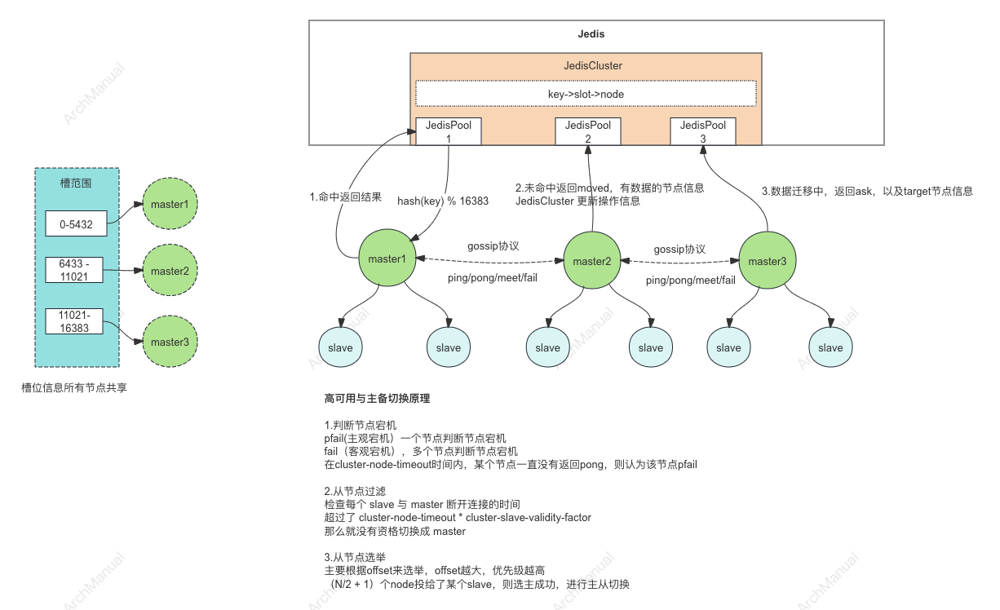

# Redis Cluster 分布式集群
Redis Cluster 是 Redis 的一种分布式实现，它通过将数据分片存储在多个节点上，实现了数据的分布式存储和处理。



#### 1. 数据分片  
   Redis Cluster 使用哈希槽（Hash Slot）来分片数据。整个键空间被分为 16384 个哈希槽，每个键根据其哈希值被映射到一个特定的哈希槽。每个节点负责一部分哈希槽，从而实现数据的分布式存储。

#### 2. 节点角色
   Redis Cluster 中的节点分为主节点（Master）和从节点（Slave）。每个主节点负责一部分哈希槽，从节点作为主节点的备份节点，用于故障转移。一般来说，一个集群至少需要 3 个主节点来存储所有的哈希槽。

#### 3. 数据复制
   每个主节点都有一个或多个从节点，从节点会复制主节点的数据，确保在主节点故障时，从节点能够接管并继续提供服务。这种复制机制提高了系统的可用性和容错能力。

#### 4. 请求路由
   当客户端向 Redis Cluster 发送请求时，客户端首先会根据键的哈希值找到对应的哈希槽，然后通过 Cluster 节点的元数据找到存储该哈希槽的主节点，并将请求发送到该节点。Redis Cluster 提供了重定向机制，当客户端请求的哈希槽不在当前节点时，节点会返回一个重定向指令，指导客户端请求正确的节点。

#### 5. 故障检测和故障转移
   Redis Cluster 中的每个节点都定期与其他节点通信，进行故障检测。一旦发现某个主节点故障，集群会自动进行故障转移（Failover），将对应的从节点提升为主节点，并更新集群的元数据。

#### 6. 一致性和可用性
   Redis Cluster 采用的是最终一致性模型，节点之间的数据同步不是实时的，但会在一定时间内达成一致。在网络分区情况下，Redis Cluster 保证集群中至少有半数以上的主节点可用。

#### 7. 集群扩展
   Redis Cluster 支持在线扩展和缩减节点。可以通过添加或删除节点来调整集群的规模，重新分配哈希槽以实现数据的均衡分布。

#### 8. 多节点优化MGET操作
   Redis Cluster 中的多节点 MGET 操作，需要进行优化。有多种方法，包括串行 MGET、串行 IO+Pipeline、并行 IO+Pipeline、Hash Tag等。

## 一、 数据分片

Redis Cluster 的数据分片（Sharding）是通过哈希槽（Hash Slot）机制实现的。

以下是详细说明：

### 1. 哈希槽的概念
- **哈希槽数量**：Redis Cluster 将键空间划分为 16384 个哈希槽（Hash Slots）。
- **哈希算法**：每个键通过 CRC16 算法计算哈希值，然后对 16384 取模，得到对应的哈希槽编号。例如，`hash_slot = CRC16(key) % 16384`。

### 2. 哈希槽分配
- **节点分配**：集群中的每个主节点（Master）负责管理一部分哈希槽。假设有 N 个主节点，那么每个节点平均会管理 16384/N 个哈希槽。
- **数据存储**：键值对存储在负责相应哈希槽的节点上。每个节点维护自己负责的哈希槽和存储在这些哈希槽中的键值数据。

### 3. 哈希槽的映射
- **映射关系**：集群中的每个节点都会保存整个集群的哈希槽到节点的映射关系，这些信息通过节点间的通信来保持一致。
- **重定向**：当一个节点接收到请求时，会检查请求的键对应的哈希槽是否属于自己。如果不是，它会向客户端返回 MOVED 错误，指示客户端请求对应哈希槽的节点。

### 4. 数据写入流程
- **键的哈希计算**：客户端根据键计算出哈希槽编号。
- **查找节点**：客户端查询集群的哈希槽到节点的映射表，找到负责该哈希槽的节点。
- **发送请求**：客户端将请求发送到对应的节点，该节点处理请求并返回结果。

### 5. 数据读取流程
- **键的哈希计算**：客户端根据键计算出哈希槽编号。
- **查找节点**：客户端查询集群的哈希槽到节点的映射表，找到负责该哈希槽的节点。
- **发送请求**：客户端将请求发送到对应的节点，该节点处理请求并返回结果。

### 6. 哈希槽的迁移
- **节点扩展/缩减**：当集群需要扩展或缩减节点时，哈希槽的分配会发生变化。Redis Cluster 支持动态调整哈希槽的分配，将哈希槽从一个节点迁移到另一个节点。
- **数据迁移过程**：迁移过程中，源节点将负责的哈希槽及其数据逐步迁移到目标节点，期间两节点会保持同步，直到数据完全迁移完毕。

### 7. 实例
假设有三个节点 Node A、Node B 和 Node C：
- Node A 负责哈希槽 0-5460
- Node B 负责哈希槽 5461-10922
- Node C 负责哈希槽 10923-16383

当一个键 "example" 被插入时：
1. 计算 CRC16("example") 的值，例如得到 12816。
2. 计算哈希槽编号：12816 % 16384 = 12816。
3. 查询哈希槽 12816 由 Node C 负责。
4. 客户端将 "example" 插入 Node C。

## 二、 节点角色
在 Redis Cluster 中，节点分为主节点（Master）和从节点（Slave），两者在集群中的角色和作用不同。以下是对节点角色的详细说明：

### 1. 主节点（Master）

#### 1.1 主要职责
- **数据存储和处理**：主节点负责存储
- 
- 分配给它的哈希槽范围内的数据，并处理对这些数据的读写请求。
- **哈希槽分配**：每个主节点管理一部分哈希槽，集群通过将哈希槽分配给不同的主节点来实现数据的分片。

#### 1.2 故障检测
- **心跳机制**：主节点定期向其他主节点发送 PING 消息，以检测彼此的健康状况。
- **故障标记**：如果一个主节点没有响应其他主节点的 PING 消息，可能会被标记为疑似故障。进一步的投票机制会确认该节点是否真正故障。

#### 1.3 数据迁移
- **扩展和缩减**：在扩展或缩减集群时，主节点负责哈希槽和数据的迁移，确保数据在新节点间的均匀分布。

### 2. 从节点（Slave）

#### 2.1 主要职责
- **数据复制**：从节点复制其对应主节点的数据，保持与主节点的数据同步。这种复制是异步的，但可以配置为半同步，以减少数据丢失的风险。
- **故障转移**：在主节点故障时，从节点可以被提升为新的主节点，继续提供服务。这一过程称为故障转移（Failover）。

#### 2.2 故障转移过程
- **检测主节点故障**：从节点与主节点之间也会进行心跳检测，当从节点检测到主节点故障时，会向集群中的其他节点报告。
- **投票选举**：集群中的其他主节点通过投票机制选举一个从节点作为新的主节点，确保集群的持续可用性。
- **提升为主节点**：被选中的从节点会被提升为主节点，接管故障主节点的哈希槽和数据。

### 3. 节点通信

#### 3.1 节点之间的通信协议
- **Gossip 协议**：Redis Cluster 使用 Gossip 协议在节点之间传播元数据和状态信息。这种协议使得集群可以在无需中央控制器的情况下，动态地进行节点间的信息交换和状态更新。

#### 3.2 消息类型
- **PING/PONG 消息**：用于节点间的心跳检测和健康检查。
- **MEET 消息**：用于新节点加入集群时的引导。
- **FAIL 消息**：用于通知集群中的节点某个主节点已被标记为故障。

### 4. 节点配置和管理

#### 4.1 配置文件
- **节点配置文件**：每个节点都有一个独立的配置文件，存储节点的配置信息和集群状态。集群会自动管理和更新这些配置文件。

#### 4.2 节点管理命令
- **CLUSTER MEET**：用于将新节点加入集群。
- **CLUSTER FORGET**：用于从集群中移除节点。
- **CLUSTER FAILOVER**：用于手动触发故障转移，将某个从节点提升为主节点。

### 总结
Redis Cluster 中的主节点和从节点各自承担不同的职责，通过心跳检测、数据复制、故障转移和节点间通信等机制，共同构成了一个高可用、可扩展的分布式系统。
主节点负责数据的存储和处理，而从节点则通过复制和故障转移机制，提供数据冗余和高可用性保障。

## 三、 数据复制
在 Redis Cluster 中，数据复制是确保数据高可用性和容错能力的关键机制。下面是对数据复制的详细说明：

### 1. 数据复制概述

Redis Cluster 中的每个主节点（Master）都可以有一个或多个从节点（Slave）。从节点复制主节点的数据，以便在主节点发生故障时，从节点能够接管并继续提供服务。

### 2. 复制机制

#### 2.1 初次同步（Full Synchronization）
当从节点首次连接到主节点时，或当主节点和从节点之间的连接中断并重新建立时，会进行初次同步：
- **RDB 文件传输**：主节点生成一个快照（RDB 文件），并将其发送给从节点。从节点加载快照文件以初始化数据集。
- **增量复制**：在生成快照和传输过程中，主节点记录所有写操作日志（增量日志），并在快照传输完成后将这些日志发送给从节点。从节点在应用快照后再应用这些增量日志，确保数据完全同步。

#### 2.2 增量同步（Partial Synchronization）
在初次同步后，主节点和从节点会进行增量同步，以保持数据的一致性：
- **命令传播**：主节点会将每个写命令（例如 SET、DEL 等）发送给所有从节点，从节点执行这些命令来更新自己的数据集。
- **心跳检测**：从节点会定期向主节点发送 PING 消息，主节点回复 PONG 消息，双方通过这种心跳机制来保持连接并检测故障。

### 3. 复制延迟

由于复制是异步的，从节点可能会有短暂的延迟。这种延迟通常很小，但在主节点负载较高或网络延迟较大的情况下，延迟可能会增加。

### 4. 复制故障处理

#### 4.1 主节点故障
- **故障检测**：从节点和其他主节点会检测到主节点的故障，并通过 Gossip 协议传播故障信息。
- **故障转移（Failover）**：集群会通过投票机制选举一个从节点作为新的主节点。被选中的从节点会提升为主节点，并接管原主节点的哈希槽。

#### 4.2 从节点故障
- **自动重试**：如果从节点与主节点的连接中断，从节点会自动尝试重新连接并同步数据。
- **手动干预**：在从节点长期故障或无法恢复的情况下，管理员可以手动替换从节点，或添加新的从节点来替代故障节点。

### 5. 高可用性和一致性保证

#### 5.1 多从节点配置
为了提高容错能力，每个主节点通常配置多个从节点。如果一个从节点故障，其他从节点仍然可以提供备份，提高系统的高可用性。

#### 5.2 写操作确认
可以配置 Redis Cluster 以实现写操作的部分同步，通过等待多个从节点确认写操作，来提高数据的一致性。这种机制可以通过 `wait` 命令实现，但会增加写操作的延迟。

### 6. 配置和管理

#### 6.1 复制配置
在 Redis 配置文件中，可以通过 `replicaof` 指令配置从节点的主从关系。例如：
```
replicaof 127.0.0.1 6379
```

#### 6.2 复制状态监控
通过 Redis 提供的命令，可以查看复制状态和统计信息：
- **INFO replication**：显示复制状态，包括角色、主节点地址、从节点列表等信息。
- **CLUSTER NODES**：显示集群中所有节点的信息，包括角色、连接状态、哈希槽分配等。

### 总结

数据复制是 Redis Cluster 确保数据高可用性和一致性的关键机制。通过初次同步和增量同步，从节点能够保持与主节点的数据一致性。在主节点故障时，从节点可以迅速接管，确保集群的持续可用性。通过多从节点配置和写操作确认机制，可以进一步提高系统的容错能力和数据一致性。

## 四、 请求路由
在 Redis Cluster 中，请求路由是确保客户端能够将请求发送到正确节点的重要机制。下面是对请求路由的详细说明：

### 1. 请求路由概述

Redis Cluster 通过哈希槽（Hash Slot）机制将键映射到不同的节点。每个键根据其哈希值被映射到一个特定的哈希槽，然后再由哈希槽确定该键存储在哪个节点。客户端负责计算键的哈希槽并将请求路由到相应的节点。

### 2. 哈希槽计算

- **哈希算法**：Redis Cluster 使用 CRC16 算法计算键的哈希值，然后对 16384 取模，得到哈希槽编号。
  ```plaintext
  hash_slot = CRC16(key) % 16384
  ```

### 3. 客户端请求路由过程

#### 3.1 初始请求

1. **键的哈希计算**：客户端根据键计算出哈希槽编号。
2. **查找节点**：客户端查询缓存的集群哈希槽到节点的映射表，找到负责该哈希槽的节点。
3. **发送请求**：客户端将请求发送到对应的节点，该节点处理请求并返回结果。

#### 3.2 MOVED 重定向

- **重定向机制**：如果客户端请求的哈希槽不在当前节点，节点会返回一个 `MOVED` 响应，指示客户端请求正确的节点。
  ```plaintext
  MOVED <hash_slot> <correct_node_address>
  ```

- **更新映射表**：客户端接收到 `MOVED` 响应后，会更新其缓存的哈希槽到节点的映射表，并将请求重新路由到正确的节点。

### 4. ASK 重定向

- **ASK 重定向**：在哈希槽迁移过程中，节点可能返回 `ASK` 响应，指示客户端临时访问另一个节点。
  ```plaintext
  ASK <hash_slot> <correct_node_address>
  ```

- **临时请求**：客户端接收到 `ASK` 响应后，会向目标节点发送 `ASKING` 命令，然后再发送原始请求。目标节点处理请求并返回结果，但客户端的哈希槽到节点映射表不更新。

### 5. 哈希槽迁移

在集群扩展或缩减时，哈希槽可能从一个节点迁移到另一个节点：
- **哈希槽转移过程**：源节点会将负责的哈希槽及其数据逐步迁移到目标节点。
- **客户端请求处理**：在迁移过程中，客户端可能收到 `ASK` 响应，指导临时访问目标节点。

### 6. 客户端实现

Redis 提供的官方客户端库（如 `redis-py`、`Jedis` 等）已经内置了请求路由和重定向处理逻辑，用户在使用这些库时，无需手动处理请求路由。

### 7. 请求路由示例

假设有三个节点 Node A、Node B 和 Node C：

- Node A 负责哈希槽 0-5460
- Node B 负责哈希槽 5461-10922
- Node C 负责哈希槽 10923-16383

一个键 "example" 的路由过程如下：

1. **计算哈希槽**：`hash_slot = CRC16("example") % 16384 = 12816`
2. **查找节点**：根据哈希槽到节点的映射表，找到 12816 属于 Node C。
3. **发送请求**：客户端将请求发送到 Node C。
4. **处理重定向**：如果 Node C 返回 `MOVED` 响应（例如，Node C 不再负责 12816），客户端更新映射表并将请求重新发送到正确的节点。

### 8. 总结

Redis Cluster 中的请求路由通过哈希槽机制和重定向机制，确保客户端能够高效地将请求发送到正确的节点。
客户端负责计算键的哈希槽并维护哈希槽到节点的映射表，通过处理 `MOVED` 和 `ASK` 响应，动态调整请求路由，从而实现集群的高可用性和负载均衡。

## 五、 故障检测和故障转移
在 Redis Cluster 中，故障检测和故障转移是确保系统高可用性和容错能力的关键机制。以下是对这两个机制的详细说明：

### 1. 故障检测

#### 1.1 心跳机制
- **PING/PONG 消息**：每个节点会定期向集群中的其他节点发送 PING 消息。接收到 PING 消息的节点会返回 PONG 消息。通过这种心跳机制，节点能够相互检测对方的健康状况。
- **间隔时间**：默认情况下，PING 消息的发送间隔是 1 秒，这个时间可以通过配置进行调整。

#### 1.2 主节点故障检测
- **主节点检测**：每个主节点会监控集群中的其他主节点。如果在一定时间内（默认 5 秒）没有收到某个主节点的 PONG 响应，则会将其标记为疑似故障（PFAIL）。
- **疑似故障确认**：如果一个主节点被大多数主节点（超过半数）标记为疑似故障（PFAIL），则该节点会被正式标记为故障（FAIL）。

#### 1.3 从节点故障检测
- **从节点检测**：主节点会监控其从节点的健康状况。如果从节点长时间不响应主节点的 PING 消息，主节点会将其标记为故障。

### 2. 故障转移（Failover）

#### 2.1 故障转移触发条件
- **主节点故障**：当一个主节点被确认故障（FAIL）后，其从节点会尝试发起故障转移。
- **从节点选举**：多个从节点中，首先进行选举，选择一个从节点作为新的主节点。

#### 2.2 从节点选举
- **优先级**：每个从节点都有一个优先级（priority），在配置文件中可以设置（默认为 100）。优先级越高，被选为主节点的可能性越大。如果两个从节点优先级相同，则选择 replication offset 最大的从节点（即数据最完整的从节点）。
- **投票机制**：从节点会向集群中的其他主节点请求选票。集群中大多数主节点同意后，选举成功，开始故障转移过程。

#### 2.3 故障转移过程
- **提升为主节点**：选中的从节点会提升为主节点，接管故障主节点的哈希槽。
- **广播新配置**：新的主节点会向集群广播其新角色，更新集群的元数据。
- **客户端重定向**：集群的其他节点和客户端会收到更新的集群状态，客户端请求将被重定向到新的主节点。

### 3. 故障检测和故障转移示例

假设集群有三个主节点 Node A、Node B 和 Node C，每个主节点都有一个从节点。

#### 3.1 主节点故障检测
1. **心跳检测**：Node A 向 Node B 和 Node C 发送 PING 消息，如果 Node B 长时间不响应，Node A 将其标记为疑似故障（PFAIL）。
2. **疑似故障确认**：如果 Node C 也将 Node B 标记为 PFAIL，则 Node B 会被正式标记为故障（FAIL）。

#### 3.2 故障转移
1. **从节点选举**：Node B 的从节点（假设为 Node B1）开始请求投票，竞选新的主节点。
2. **投票机制**：Node A 和 Node C 根据优先级和数据完整性，投票选举 Node B1 为新的主节点。
3. **提升为主节点**：Node B1 被提升为主节点，并接管 Node B 的哈希槽。
4. **广播新配置**：Node B1 广播其新角色，集群中的其他节点更新其元数据。

### 4. 故障转移策略配置

#### 4.1 配置参数
- **`cluster-node-timeout`**：设置节点的超时时间，用于确定节点是否故障。
- **`cluster-require-full-coverage`**：是否需要所有哈希槽都有节点覆盖，设置为 `no` 可以在部分哈希槽不可用时继续服务。
- **`min-slaves-to-write`**：设置主节点在多少个从节点在线时才接受写操作。

### 总结

Redis Cluster 通过心跳检测、故障标记和投票机制，实现了高效的故障检测和故障转移。主节点故障时，通过选举机制从从节点中选出新的主节点，确保集群的高可用性和数据一致性。
故障检测和故障转移机制是 Redis Cluster 保证服务稳定性的核心机制。

## 六、 一致性和可用性
在 Redis Cluster 中，一致性和可用性是设计中的两个关键方面。它们决定了集群在数据访问、故障处理和扩展时的表现。下面是对一致性和可用性的详细说明：

### 一致性

#### 1. 最终一致性
Redis Cluster 采用最终一致性模型，这意味着在没有进一步的写操作时，所有的副本最终会达到一致的状态。在实际操作中，主节点会将写操作传播到从节点，但传播是异步的，因此在短时间内，主节点和从节点的数据可能不一致。

#### 2. 写操作的传播
- **异步复制**：主节点将写操作发送给从节点，从节点异步地应用这些操作。这种异步机制保证了写操作的高性能，但在主节点故障时可能会有少量数据丢失。
- **部分同步**：通过配置，可以让主节点等待一定数量的从节点确认收到写操作，从而提高数据一致性。这会增加写操作的延迟，但减少数据丢失的风险。

#### 3. 数据一致性保障机制
- **`wait` 命令**：可以使用 `wait` 命令来确保主节点等待从节点的确认，增强写操作的一致性：
  ```plaintext
  WAIT numreplicas timeout
  ```
  这条命令会阻塞直到指定数量的从节点确认收到写操作，或超时。

### 可用性

#### 1. 高可用性机制
Redis Cluster 通过多个机制来实现高可用性，包括数据复制、故障检测和自动故障转移。

#### 2. 数据复制
- **主从复制**：每个主节点都有一个或多个从节点，从节点复制主节点的数据。在主节点故障时，从节点可以接管并提供服务。
- **复制拓扑**：可以通过配置文件指定主从节点的关系，确保数据在多个节点之间的分布和冗余。

#### 3. 故障检测和故障转移
- **自动故障检测**：节点之间通过 PING/PONG 消息进行健康检查，发现故障节点。
- **自动故障转移**：当主节点故障时，从节点会被提升为主节点，接管故障主节点的职责。这保证了集群在单个节点故障时仍能继续提供服务。

#### 4. 数据可用性策略
- **集群覆盖**：Redis Cluster 要求所有哈希槽都要有主节点负责。如果某些哈希槽没有主节点覆盖，集群将无法处理请求，除非配置 `cluster-require-full-coverage` 为 `no`。
- **写操作的冗余检查**：可以通过配置 `min-slaves-to-write` 和 `min-slaves-max-lag` 等参数，确保在一定数量的从节点同步后才允许主节点处理写操作。

### 配置参数详解

#### 1. `cluster-require-full-coverage`
- **默认值**：`yes`
- **作用**：决定在部分哈希槽没有主节点时，集群是否继续接受请求。如果设置为 `no`，集群在部分哈希槽不可用时仍然可以继续服务。
  ```plaintext
  cluster-require-full-coverage yes
  ```

#### 2. `cluster-node-timeout`
- **默认值**：15000 毫秒（15 秒）
- **作用**：节点被认为不可用的超时时间。如果在这个时间内没有收到 PONG 响应，节点会被标记为疑似故障。
  ```plaintext
  cluster-node-timeout 15000
  ```

#### 3. `min-slaves-to-write`
- **默认值**：0
- **作用**：指定写操作需要多少个从节点在线。如果在线从节点少于该值，主节点会拒绝写操作。
  ```plaintext
  min-slaves-to-write 1
  ```

#### 4. `min-slaves-max-lag`
- **默认值**：10 秒
- **作用**：指定写操作要求从节点的最大延迟时间。如果从节点的延迟超过这个值，主节点会拒绝写操作。
  ```plaintext
  min-slaves-max-lag 10
  ```

### 示例场景

#### 场景 1：主节点故障恢复
- **故障检测**：节点 A、B、C 中，A 作为主节点。如果 A 发生故障，B 和 C 通过 PING/PONG 机制检测到 A 不可用。
- **故障转移**：B 和 C 选举一个从节点（假设 B1）作为新的主节点。B1 接管 A 的哈希槽和数据。
- **服务恢复**：集群更新元数据，客户端请求被重定向到 B1，新主节点继续处理请求。

#### 场景 2：写操作一致性
- **命令执行**：客户端发送写操作到主节点 A，A 处理写操作并异步发送给从节点 A1 和 A2。
- **部分同步**：使用 `WAIT` 命令，确保 A 等待至少一个从节点确认写操作，减少数据丢失风险。

### 总结

Redis Cluster 通过异步复制、自动故障检测和故障转移机制，实现了高可用性和一定程度的一致性。
通过合理配置，可以在性能和一致性之间找到平衡，确保集群在高负载和故障情况下仍能提供可靠服务。

## 七、 集群扩展
Redis Cluster 支持在线扩展和缩减节点，这使得系统能够灵活应对负载变化和资源需求。以下是对 Redis Cluster 集群扩展的详细说明，包括节点添加、删除和哈希槽重新分配的过程。

### 1. 集群扩展的需求

集群扩展通常出于以下几个原因：
- **增加容量**：当数据量增长时，单个节点的存储和处理能力可能不足，需要增加更多节点来分担负载。
- **提高性能**：通过增加节点，可以分散读写请求，提高集群的整体性能。
- **增强容错性**：增加节点可以提高数据冗余度和系统的容错能力。

### 2. 节点添加

#### 2.1 添加新节点
1. **启动新节点**：配置新的 Redis 实例，使其加入现有集群。启动命令示例：
   ```plaintext
   redis-server --cluster-enabled yes --cluster-config-file nodes.conf --port 7004
   ```

2. **加入集群**：使用 `CLUSTER MEET` 命令将新节点引入集群：
   ```plaintext
   redis-cli -h <existing-node-ip> -p <existing-node-port> CLUSTER MEET <new-node-ip> <new-node-port>
   ```
   例如：
   ```plaintext
   redis-cli -h 127.0.0.1 -p 7000 CLUSTER MEET 127.0.0.1 7004
   ```

3. **分配哈希槽**：通过 `CLUSTER ADDSLOTS` 命令手动或使用 Redis 提供的工具重新分配哈希槽给新节点。使用 Redis 官方的 `redis-trib` 工具或 `redis-cli` 的 `--cluster` 选项进行哈希槽迁移。

#### 2.2 哈希槽迁移
1. **确认迁移计划**：确定哪些哈希槽需要迁移到新节点。
2. **执行迁移**：可以使用 `redis-cli` 工具执行迁移：
   ```plaintext
   redis-cli --cluster reshard <existing-node-ip>:<existing-node-port>
   ```
   根据提示输入需要迁移的哈希槽数量、源节点和目标节点。

### 3. 节点删除

#### 3.1 移除节点
1. **重新分配哈希槽**：在移除节点之前，需要将该节点负责的哈希槽重新分配到其他节点。使用 `redis-cli` 的 `reshard` 功能：
   ```plaintext
   redis-cli --cluster reshard <existing-node-ip>:<existing-node-port>
   ```
   根据提示选择迁移的哈希槽和目标节点。

2. **从集群移除节点**：使用 `CLUSTER FORGET` 命令将节点从集群中移除：
   ```plaintext
   redis-cli -h <existing-node-ip> -p <existing-node-port> CLUSTER FORGET <node-id>
   ```
   可以通过 `CLUSTER NODES` 命令获取节点 ID。

3. **关闭节点**：移除节点后，可以安全地关闭该节点：
   ```plaintext
   redis-cli -h <removed-node-ip> -p <removed-node-port> shutdown
   ```

### 4. 哈希槽重新分配

#### 4.1 手动迁移哈希槽
1. **获取当前哈希槽分布**：使用 `CLUSTER NODES` 命令查看当前哈希槽分布。
   ```plaintext
   redis-cli -h <existing-node-ip> -p <existing-node-port> CLUSTER NODES
   ```

2. **迁移哈希槽**：使用 `CLUSTER SETSLOT` 和 `CLUSTER ADDSLOTS` 命令手动迁移哈希槽。例如，将哈希槽 0 分配给新节点：
   ```plaintext
   redis-cli -h <existing-node-ip> -p <existing-node-port> CLUSTER SETSLOT 0 NODE <new-node-id>
   ```

#### 4.2 使用自动工具
Redis 提供了 `redis-cli` 的 `--cluster` 选项，简化了哈希槽迁移操作。例如：
```plaintext
redis-cli --cluster add-node <new-node-ip>:<new-node-port> <existing-node-ip>:<existing-node-port>
redis-cli --cluster reshard <existing-node-ip>:<existing-node-port>
```
按提示输入迁移的哈希槽数量和节点信息。

### 5. 扩展示例

#### 示例 1：添加新节点
1. 启动新节点 7004。
2. 加入集群：
   ```plaintext
   redis-cli -h 127.0.0.1 -p 7000 CLUSTER MEET 127.0.0.1 7004
   ```
3. 重新分配哈希槽：
   ```plaintext
   redis-cli --cluster reshard 127.0.0.1:7000
   ```
   输入需要迁移的哈希槽数量和目标节点 7004。

#### 示例 2：移除节点
1. 确定需要移除的节点（假设是 7003）。
2. 重新分配 7003 的哈希槽：
   ```plaintext
   redis-cli --cluster reshard 127.0.0.1:7000
   ```
3. 从集群中移除节点 7003：
   ```plaintext
   redis-cli -h 127.0.0.1 -p 7000 CLUSTER FORGET <node-id-7003>
   ```
4. 关闭节点 7003：
   ```plaintext
   redis-cli -h 127.0.0.1 -p 7003 shutdown
   ```

### 总结

Redis Cluster 通过灵活的扩展和缩减机制，实现了高可用性和高性能。节点的添加和删除以及哈希槽的重新分配，可以在线完成，不会中断服务。
这些机制确保了 Redis Cluster 在负载变化和资源需求变化时，能够平稳地进行扩展和调整。

## 八、多节点命令优化：mget

对于优化 Redis Cluster 中的多节点 MGET 操作，可以使用以下方法，每种方法各有优缺点和适用场景。

下面详细介绍这些方法，包括串行 MGET、串行 IO+Pipeline、并行 IO+Pipeline、Hash Tag，以及其他可能的优化方式，并分析它们的网络 IO 次数复杂度。

### 1. 串行 MGET

#### 优点：
- 实现简单，直接对每个键执行 GET 操作。

#### 缺点：
- 性能较差，每个键都单独发送请求，网络 IO 次数多。

#### 网络 IO 次数复杂度：
- **O(n)**，每个键单独发送一个 GET 请求。

**示例代码：**

```python
import redis

# 创建 Redis Cluster 连接
cluster = redis.StrictRedisCluster(startup_nodes=[{"host": "127.0.0.1", "port": "7000"}])

keys = ['key1', 'key2', 'key3', 'key4']
results = {}

for key in keys:
    results[key] = cluster.get(key)

print(results)
```

### 2. 串行 IO + Pipeline

通过使用 Pipeline，将多个请求打包在一起发送，减少网络往返次数。

#### 优点：
- 减少网络往返次数，提高性能。

#### 缺点：
- 仍然是串行执行，每个节点独立发送请求。

#### 网络 IO 次数复杂度：
- **O(k)**，每个节点一次 Pipeline 请求，其中 k 是涉及的节点数。

**示例代码：**

```python
import redis
from collections import defaultdict

# 创建 Redis Cluster 连接
cluster = redis.StrictRedisCluster(startup_nodes=[{"host": "127.0.0.1", "port": "7000"}])

keys = ['key1', 'key2', 'key3', 'key4']

# 分组键到各个节点
slot_dict = defaultdict(list)
for key in keys:
    slot = cluster.cluster_keyslot(key)
    node = cluster.get_node_from_slot(slot)
    slot_dict[node["name"]].append(key)

# 使用 Pipeline 执行分组后的请求
results = {}
for node_name, node_keys in slot_dict.items():
    node_client = redis.StrictRedis(host=node_name.split(':')[0], port=node_name.split(':')[1])
    pipeline = node_client.pipeline()
    for key in node_keys:
        pipeline.get(key)
    node_results = pipeline.execute()
    results.update(dict(zip(node_keys, node_results)))

print(results)
```

### 3. 并行 IO + Pipeline

通过多线程或异步 IO 并行发送请求，同时使用 Pipeline，进一步提高性能。

#### 优点：
- 并行发送请求，提高性能。
- 使用 Pipeline 减少网络往返次数。

#### 缺点：
- 实现复杂，需要管理并发和线程安全。

#### 网络 IO 次数复杂度：
- **O(k)**，每个节点一次 Pipeline 请求。

**示例代码（使用线程池）：**

```python
import redis
from concurrent.futures import ThreadPoolExecutor
from collections import defaultdict

# 创建 Redis Cluster 连接
cluster = redis.StrictRedisCluster(startup_nodes=[{"host": "127.0.0.1", "port": "7000"}])

keys = ['key1', 'key2', 'key3', 'key4']

# 分组键到各个节点
slot_dict = defaultdict(list)
for key in keys:
    slot = cluster.cluster_keyslot(key)
    node = cluster.get_node_from_slot(slot)
    slot_dict[node["name"]].append(key)

# 函数：从某个节点获取键值
def fetch_from_node(node_name, node_keys):
    node_client = redis.StrictRedis(host=node_name.split(':')[0], port=int(node_name.split(':')[1]))
    pipeline = node_client.pipeline()
    for key in node_keys:
        pipeline.get(key)
    node_results = pipeline.execute()
    return dict(zip(node_keys, node_results))

# 使用线程池并行执行请求
results = {}
with ThreadPoolExecutor(max_workers=len(slot_dict)) as executor:
    future_to_node = {executor.submit(fetch_from_node, node_name, node_keys): node_name for node_name, node_keys in slot_dict.items()}
    for future in future_to_node:
        node_results = future.result()
        results.update(node_results)

print(results)
```

### 4. Hash Tag

通过使用哈希标签，将相关联的键放在同一个哈希槽中，确保它们在同一个节点，避免跨节点操作。

#### 优点：
- 极大减少跨节点操作，网络 IO 次数少。

#### 缺点：
- 需要设计键的命名方式，确保使用相同的哈希标签。
- 无法完全避免所有情况的跨节点操作，特别是无法预知的多样性键请求场景。

#### 网络 IO 次数复杂度：
- **O(1)**，所有键都在同一个节点，只需一次 MGET 请求。

**示例代码：**

```python
import redis

# 创建 Redis Cluster 连接
cluster = redis.StrictRedisCluster(startup_nodes=[{"host": "127.0.0.1", "port": "7000"}])

# 使用相同的哈希标签 {tag}
keys = ['{tag}key1', '{tag}key2', '{tag}key3', '{tag}key4']
results = cluster.mget(*keys)

print(results)
```

### 5. 其他方式

#### 使用异步库（例如 aioredis）

通过异步 IO 模式，可以高效并行发送请求，适合处理大量请求场景。

#### 优点：
- 高效并行发送请求，适合大量请求场景。
- 减少阻塞等待时间。

#### 缺点：
- 实现复杂度较高，需要熟悉异步编程模型。
- 需要异步 Redis 客户端库的支持。

#### 网络 IO 次数复杂度：
- **O(k)**，与并行 IO 类似，但由于异步处理，实际耗时会进一步减少。

**示例代码（使用 aioredis）：**

```python
import asyncio
import aioredis
from collections import defaultdict

async def fetch_from_node(node_name, node_keys):
    node_client = await aioredis.create_redis_pool((node_name.split(':')[0], int(node_name.split(':')[1])))
    pipeline = node_client.pipeline()
    for key in node_keys:
        pipeline.get(key)
    node_results = await pipeline.execute()
    await node_client.close()
    return dict(zip(node_keys, node_results))

async def main():
    cluster = await aioredis.create_redis_cluster(startup_nodes=[("127.0.0.1", 7000)])

    keys = ['key1', 'key2', 'key3', 'key4']

    # 分组键到各个节点
    slot_dict = defaultdict(list)
    for key in keys:
        slot = await cluster.cluster_keyslot(key)
        node = await cluster.get_node_from_slot(slot)
        slot_dict[node["name"]].append(key)

    # 使用异步并行执行请求
    tasks = [fetch_from_node(node_name, node_keys) for node_name, node_keys in slot_dict.items()]
    results = await asyncio.gather(*tasks)

    combined_results = {}
    for result in results:
        combined_results.update(result)

    print(combined_results)

    await cluster.close()

asyncio.run(main())
```

### 总结

通过以上几种方法，可以优化 Redis Cluster 中的多节点 MGET 操作，每种方法的优缺点和适用场景如下：

| 方法                  | 优点                                                         | 缺点                                                  | 网络 IO 次数复杂度 |
|-----------------------|--------------------------------------------------------------|-------------------------------------------------------|---------------------|
| 串行 MGET             | 实现简单                                                     | 性能较差，网络 IO 次数多                              | O(n)                |
| 串行 IO + Pipeline    | 减少网络往返次数，提高性能                                   | 仍然是串行执行                                        | O(k)                |
| 并行 IO + Pipeline    | 并行发送请求，提高性能                                       | 实现复杂，需要管理并发和线程安全                      | O(k)                |
| Hash Tag              | 极大减少跨节点操作，网络 IO 次数少                           | 需要设计键的命名方式，无法完全避免跨节点操作          | O(1)                |
| 使用异步库            | 高效并行发送请求，适合大量请求场景                           | 实现复杂度高，需要异步编程模型和客户端库的支持        | O(k)                |

根据实际需求和环境选择合适的方法，可以显著提升 Redis Cluster 的多节点 MGET 操作性能。