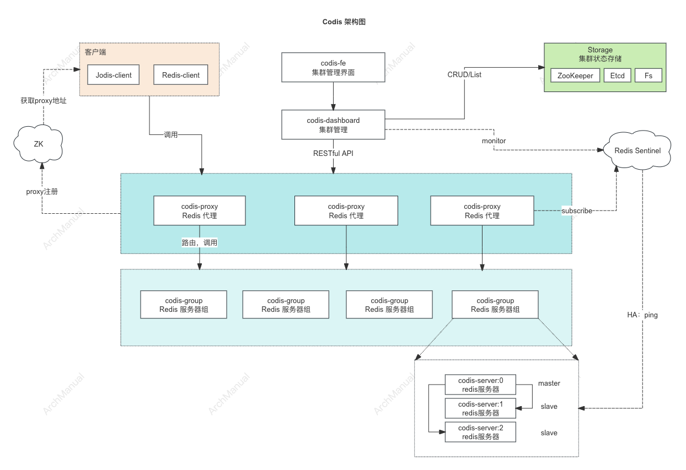

# Codis 分布式集群
Codis 是一个用于实现 Redis 分布式架构的代理系统，通过引入代理层来分发客户端的请求，从而实现数据分片和高可用性。


## Codis 架构概览
Codis 的架构设计包括多个核心组件，每个组件在整个系统中扮演不同的角色，共同确保集群的高效运行。



### 1. Codis FE (Frontend)

- Codis FE 提供了一个基于 Web 的用户界面，用于管理和监控 Codis 集群。用户可以通过 Codis FE 界面查看集群状态、配置分片、添加或删除节点等操作。
- Codis FE 主要与 Codis Dashboard 交互，获取集群的配置信息和运行状态。

### 2. Codis Proxy

- Codis Proxy 是客户端与 Redis 集群之间的代理层。它接收客户端的请求，根据请求的键值将请求路由到正确的 Codis Server 实例。
- Codis Proxy 从 Codis Dashboard 获取集群的配置信息，并将请求转发到对应的 Codis Server 实例。Codis Proxy 通过 ZooKeeper 或 Etcd 与其他 Proxy 同步配置信息。

### 3. Codis Group

- Codis Group 是一个逻辑概念，表示一组 Redis 实例（主从结构）。每个 Group 包含一个主节点（master）和若干从节点（slave），用于实现数据复制和高可用性。
- Codis Group 内的 Redis 实例通过 Redis Sentinel 进行监控和故障转移。Codis Dashboard 管理 Group 中的节点信息。

### 4. Codis Server (Redis)

- Codis Server 是实际的 Redis 实例，负责存储和管理数据。Codis Server 是 Codis Group 的组成部分，通常一个 Group 包含一个主节点和多个从节点。
- Codis Server 被 Codis Proxy 访问，用于处理客户端请求的数据操作。Codis Server 的状态由 Redis Sentinel 监控。

### 5. Codis Dashboard

- Codis Dashboard 是 Codis 集群的管理中心，提供集群的配置管理、监控和操作界面。它与 Codis FE 配合，为用户提供友好的管理界面。
- Codis Dashboard 通过 ZooKeeper 或 Etcd 维护集群的配置信息，并与 Codis Proxy 和 Codis Server 交互，确保集群配置的一致性。

### 6. Jodis (Codis Java Client)

- Jodis 是 Codis 的 Java 客户端，封装了与 Codis Proxy 的通信接口，提供了负载均衡和故障转移功能，简化了 Java 应用与 Codis 集群的交互。
- Jodis 直接与 Codis Proxy 交互，从 Codis Dashboard 获取 Proxy 列表，实现高效的请求路由和负载均衡。

### 7. Redis Sentinel

- Redis Sentinel 监控 Codis Group 中的 Redis 实例，提供自动故障转移、配置更新和通知功能，确保 Redis 集群的高可用性。
- Redis Sentinel 与 Codis Server 直接交互，监控主从节点的健康状态，并在主节点故障时执行自动故障转移。Codis Dashboard 获取 Sentinel 的状态更新。


### 8. Storage (ZooKeeper / Etcd / Fs)

- Storage 系统（ZooKeeper、Etcd 或 Fs）用于存储 Codis 集群的配置信息和元数据，确保配置的一致性和高可用性。ZooKeeper 和 Etcd 提供分布式协调和一致性保证，而 Fs 则适用于简单的文件系统存储。
- Codis Dashboard 使用 Storage 存储和管理集群的配置信息，Codis Proxy 和 Codis Server 通过 Storage 进行节点注册和配置同步。

## 一、Codis FE (Frontend)
Codis FE（Frontend）是 Codis 提供的一个前端管理工具，它通过一个 Web 界面向用户展示 Codis 集群的各种信息，并提供管理功能。

Codis FE 使用户能够方便地管理和监控 Codis 集群，了解集群的运行状态和性能指标。

1. **集群监控**：
    - 实时展示 Codis 集群的运行状态，包括 QPS（每秒查询数）、延迟、连接数等关键性能指标。

2. **节点管理**：
    - 管理 Codis Proxy、Codis Server 的状态，添加或删除 Redis 实例，配置主从复制等。

3. **分片管理**：
    - 查看和管理 Redis 数据分片（shard），进行分片的添加、删除和迁移。

4. **报警和通知**：
    - 配置报警规则，当集群中某些指标异常时，及时通知管理员进行处理。

5. **操作日志**：
    - 记录集群的操作日志，方便管理员追踪和审计操作记录。

## 二、Codis Proxy
Codis Proxy 是 Codis 架构中的关键组件，充当客户端与 Redis 集群之间的中间层。

它的主要功能是接收客户端请求，并将这些请求路由到正确的 Redis 节点，从而实现数据的分片和负载均衡。

### Codis Proxy 的主要功能

1. **请求路由**：
    - Codis Proxy 接收客户端请求，根据请求中的键值计算出相应的分片（shard），并将请求转发到对应的 Redis 节点。

2. **负载均衡**：
    - Codis Proxy 能够均衡地分配请求到多个 Redis 节点，从而提高集群的整体性能。

3. **高可用性**：
    - Codis Proxy 是无状态的，可以部署多个实例来提高系统的高可用性和处理能力。当某个 Proxy 实例出现故障时，客户端可以连接到其他 Proxy 实例继续工作。

4. **数据一致性**：
    - Codis Proxy 确保在主从复制架构下的数据一致性，通过向主节点写入数据并从从节点读取数据来实现。

### Codis Proxy 的工作原理

1. **启动 Proxy**：
    - 启动 Codis Proxy 进程并连接到 Codis Dashboard 以获取集群的配置信息。

2. **请求接收**：
    - Codis Proxy 监听客户端的连接请求。客户端通过连接到 Codis Proxy 而不是直接连接到 Redis 节点来进行操作。

3. **键值路由**：
    - Codis Proxy 根据请求中的键值，利用一致性哈希算法或其他分片算法确定请求应该路由到哪个 Redis 节点。

4. **转发请求**：
    - Codis Proxy 将客户端请求转发到正确的 Redis 节点，获取结果后再返回给客户端。

### Codis Proxy 的配置

Codis Proxy 的配置文件通常为 `proxy.toml`，以下是一个示例配置文件：

```toml
# Codis Proxy 配置
coordinator_name = "zookeeper"
coordinator_addr = "localhost:2181"
product_name = "codis-demo"
proxy_id = "proxy-1"
proxy_addr = "0.0.0.0:19000"
admin_addr = "0.0.0.0:11000"
```

- `coordinator_name`：指定使用的协调器，可以是 `zookeeper` 或 `etcd`。
- `coordinator_addr`：协调器的地址。
- `product_name`：Codis 集群的名称。
- `proxy_id`：Codis Proxy 的唯一标识符。
- `proxy_addr`：Codis Proxy 监听客户端连接的地址和端口。
- `admin_addr`：Codis Proxy 管理接口的地址和端口。

### 启动 Codis Proxy

启动 Codis Proxy 的命令如下：

```sh
nohup ./bin/codis-proxy --config=proxy.toml > proxy.log 2>&1 &
```

### 管理 Codis Proxy

通过 Codis Dashboard 可以管理和监控 Codis Proxy。以下是一些常用的管理操作：

1. **查看 Proxy 状态**：
    - 在 Codis Dashboard 的 Web 界面上，可以查看所有 Proxy 实例的状态，包括它们的负载情况和连接数等。

2. **添加或移除 Proxy 实例**：
    - 可以在 Codis Dashboard 中添加新的 Proxy 实例，以扩展系统的处理能力。
    - 同样，可以移除不再需要的 Proxy 实例。

3. **日志监控**：
    - 通过查看 Proxy 的日志文件，可以了解其运行情况和处理的请求信息，以便于故障排查和性能优化。

### 优化和注意事项

1. **多实例部署**：
    - 为了提高高可用性，建议部署多个 Codis Proxy 实例。这样即使某个实例发生故障，客户端也可以切换到其他 Proxy 实例继续工作。

2. **负载均衡**：
    - 使用负载均衡器（如 Nginx 或 LVS）将客户端请求分发到不同的 Codis Proxy 实例，进一步提高系统的可靠性和性能。

3. **性能监控**：
    - 定期监控 Codis Proxy 的性能指标，如 QPS（每秒查询率）、延迟和连接数等，及时进行性能优化。

## 三、Codis Group

在 Codis 中，`group` 是一个重要的概念，它代表一组 Redis 实例，用于实现高可用性和数据复制。

每个 `group` 包含一个主节点（master）和若干个从节点（slave）。

### Codis Group 结构

1. **Master 节点**：
    - 每个 `group` 有一个主节点，负责处理读写请求。
    - 主节点中的数据会被复制到从节点，确保数据一致性。

2. **Slave 节点**：
    - 从节点用于备份主节点的数据，提供故障转移能力。
    - 当主节点发生故障时，从节点可以提升为新的主节点，保证服务的连续性。

### 管理 Codis Group

通过 Codis Dashboard 或 Codis Admin 工具可以管理 `group`，包括添加、删除 Redis 实例，配置主从复制等。

#### 添加 Group

1. 启动新的 Redis 实例，确保实例可以正常运行。
2. 在 Codis Dashboard 中，添加新的 Redis 实例到一个 `group`。

示例命令：

```sh
# 启动 Redis 实例
nohup ./bin/codis-server --port 6379 > server.log 2>&1 &
```

在 Codis Dashboard 的 Web 界面上：

- 进入 `Groups` 页面。
- 点击 `Add Group` 按钮，创建一个新的 `group`。
- 在新建的 `group` 中，点击 `Add Server`，输入新的 Redis 实例的 IP 和端口，指定角色（master 或 slave）。

#### 配置主从复制

主从复制配置可以通过 Codis Dashboard 自动完成。添加从节点到某个 `group` 时，Codis 会自动配置从节点与主节点之间的复制关系。

#### 删除 Group

删除 `group` 之前，确保该 `group` 中的数据已经迁移到其他 `group` 或备份。

在 Codis Dashboard 的 Web 界面上：

- 进入 `Groups` 页面。
- 选择要删除的 `group`，点击 `Remove` 按钮。

### 使用 Codis Admin 工具管理 Group

Codis 也提供了命令行工具 `codis-admin` 用于管理 `group`。以下是一些常用命令示例：

#### 查看所有 Group

```sh
./bin/codis-admin --dashboard=127.0.0.1:18080 --list-groups
```

#### 创建 Group

```sh
./bin/codis-admin --dashboard=127.0.0.1:18080 --create-group --gid=1
```

#### 添加 Server 到 Group

```sh
./bin/codis-admin --dashboard=127.0.0.1:18080 --group-add --gid=1 --addr=127.0.0.1:6379
```

#### 删除 Server 从 Group

```sh
./bin/codis-admin --dashboard=127.0.0.1:18080 --group-del --gid=1 --addr=127.0.0.1:6379
```

## 四、Codis Server (Redis)
Codis Server 是 Codis 集群中的实际 Redis 实例，负责存储和管理数据。

每个 Codis Server 可以配置为主节点（master）或从节点（slave），组成一个或多个分片（shard），实现数据的分布式存储和高可用性。

### Codis Server 的主要功能

1. **数据存储**：
    - Codis Server 作为 Redis 实例，负责存储键值数据，并处理客户端的读写请求。

2. **主从复制**：
    - 每个 Codis Server 可以配置为主节点或从节点，主节点负责处理写请求，并将数据复制到从节点，从节点提供读请求服务，并在主节点故障时接管主节点的角色。

3. **分片机制**：
    - 数据通过一致性哈希算法或其他分片算法分布到不同的 Codis Server 上，实现水平扩展和负载均衡。

### Codis Server 的配置

启动 Redis 实例时，可以通过配置文件指定相应的参数。以下是一个简单的 Redis 配置文件示例：

```conf
# Redis Server 配置
port 6379
bind 0.0.0.0
appendonly yes
dir /path/to/redis/data
```

### 启动 Codis Server

使用以下命令启动 Redis 实例：

```sh
nohup ./bin/codis-server /path/to/redis.conf > server.log 2>&1 &
```

### 管理 Codis Server

通过 Codis Dashboard 或命令行工具 codis-admin 可以管理 Codis Server。以下是一些常用的管理操作：

#### 添加 Codis Server 到 Group

1. 在 Codis Dashboard 中，进入 `Groups` 页面。
2. 选择要添加 Codis Server 的 `group`。
3. 点击 `Add Server` 按钮，输入新的 Redis 实例的 IP 和端口，选择角色（master 或 slave）。

也可以使用 codis-admin 命令行工具添加 Codis Server：

```sh
./bin/codis-admin --dashboard=127.0.0.1:18080 --group-add --gid=1 --addr=127.0.0.1:6379
```

#### 配置主从复制

当将新的从节点添加到 `group` 中时，Codis 会自动配置主从复制。以下是手动配置主从复制的命令：

在 Redis 主节点上：

```sh
redis-cli -h master_ip -p master_port
```

在 Redis 从节点上：

```sh
redis-cli -h slave_ip -p slave_port
slaveof master_ip master_port
```

#### 删除 Codis Server

在 Codis Dashboard 中：

1. 进入 `Groups` 页面。
2. 选择要删除的 Codis Server 所在的 `group`。
3. 点击要删除的 Codis Server，选择 `Remove`。

也可以使用 codis-admin 命令行工具删除 Codis Server：

```sh
./bin/codis-admin --dashboard=127.0.0.1:18080 --group-del --gid=1 --addr=127.0.0.1:6379
```

### 高可用性和故障恢复

1. **主从复制**：
    - 配置主从复制，确保数据在多个节点之间保持一致。当主节点发生故障时，从节点可以快速接管，保证服务的连续性。

2. **故障转移**：
    - 在主节点故障时，Codis 可以自动将从节点提升为新的主节点，继续提供服务。

3. **监控和报警**：
    - 通过 Codis Dashboard 监控 Codis Server 的运行状态，设置报警机制，及时发现和处理故障。


## 五、Codis Dashboard
Codis Dashboard 是 Codis 集群的管理和监控组件。

它提供了一个 Web 界面，供管理员管理 Codis 集群的配置、分片、节点等，并实时监控集群的运行状态。

### Codis Dashboard 的主要功能

1. **集群管理**：
    - 管理 Codis 集群中的分片（shard）和组（group）。
    - 添加或删除 Redis 实例，管理主从节点。
    - 配置主从复制和故障转移。

2. **监控**：
    - 实时监控 Codis 集群的状态，包括 QPS（每秒查询数）、延迟、连接数等性能指标。
    - 查看各个 Redis 实例的运行状态和负载情况。

3. **数据迁移**：
    - 支持数据在不同分片之间的迁移，确保在添加或删除节点时数据的一致性和完整性。

4. **故障处理**：
    - 提供自动故障转移机制，在主节点故障时自动提升从节点为主节点。

### Codis Dashboard 的安装与配置

#### 安装 Codis Dashboard

Codis Dashboard 是 Codis 的一个组件，可以通过以下步骤进行安装：

1. 从 Codis 的 GitHub 仓库下载源码并进行编译安装：

    ```sh
    git clone https://github.com/CodisLabs/codis.git
    cd codis
    make
    ```

2. 编译完成后，`bin` 目录下会生成 `codis-dashboard` 可执行文件。

#### 配置 Codis Dashboard

Codis Dashboard 的配置文件通常为 `dashboard.toml`，以下是一个示例配置文件：

```toml
# Codis Dashboard 配置
coordinator_name = "zookeeper"
coordinator_addr = "localhost:2181"
product_name = "codis-demo"
dashboard_addr = "0.0.0.0:18080"
admin_addr = "0.0.0.0:18087"
```

- `coordinator_name`：指定使用的协调器，可以是 `zookeeper` 或 `etcd`。
- `coordinator_addr`：协调器的地址。
- `product_name`：Codis 集群的名称。
- `dashboard_addr`：Codis Dashboard 监听的地址和端口。
- `admin_addr`：Codis Dashboard 管理接口的地址和端口。

#### 启动 Codis Dashboard

使用以下命令启动 Codis Dashboard：

```sh
nohup ./bin/codis-dashboard --config=config/dashboard.toml > dashboard.log 2>&1 &
```

### 使用 Codis Dashboard

1. **访问 Dashboard 界面**：
    - 在浏览器中访问 Codis Dashboard 的 Web 界面，通常地址为 `http://<dashboard-ip>:18080`。

2. **管理集群**：
    - 进入 `Groups` 页面，管理 Codis 集群中的分片和组。
    - 添加或删除 Redis 实例，配置主从复制。

3. **监控集群**：
    - 查看各个 Proxy 和 Server 的状态，包括 QPS、延迟和连接数等性能指标。
    - 监控 Redis 实例的运行情况，及时发现和处理故障。

4. **数据迁移**：
    - 在 `Slots` 页面管理分片，进行数据迁移，确保数据的一致性和完整性。

## 六、Storage

在 Codis 集群中，Codis Storage 指的是 Codis 用来存储集群配置信息和元数据的后端存储系统。

Codis 支持使用 ZooKeeper、Etcd、Fs 作为其存储后端。

这些存储系统在 Codis 集群中的作用是至关重要的，因为它们提供了分布式协调和一致性保证，确保 Codis 集群的稳定运行。

### Codis Storage 的作用

1. **存储集群配置**：
    - Codis Storage 保存 Codis 集群的所有配置信息，包括 Proxy 列表、Server 列表、分片信息、主从关系等。

2. **节点注册与发现**：
    - Codis Proxy 和 Codis Server 启动时会向存储系统注册自己，Codis Dashboard 可以通过存储系统获取当前活跃的节点信息。

3. **配置同步与一致性**：
    - 当集群配置发生变化时（如添加或删除节点），存储系统会更新配置信息，并确保所有 Codis 组件（如 Proxy、Server、Dashboard）都能实时获取最新的配置信息。

4. **高可用性与故障转移**：
    - Codis Storage 系统如 ZooKeeper 和 Etcd 提供高可用性和一致性保障。当节点发生故障时，它们能够快速感知并通知 Codis 组件进行相应的处理。

### 存储方式的比较

#### ZooKeeper

ZooKeeper 是一个开源的分布式协调服务，广泛应用于分布式系统中，用于实现配置管理、命名服务、分布式同步和组服务。

**优点**：
- **成熟稳定**：ZooKeeper 是一个成熟且经过广泛验证的系统。
- **强一致性**：ZooKeeper 提供严格的强一致性保证，适合用于需要高一致性的分布式系统。
- **丰富的功能**：支持配置管理、分布式锁、选举等功能。

**缺点**：
- **运维复杂**：ZooKeeper 的部署和运维相对复杂，特别是在大规模集群中。
- **性能问题**：在高负载场景下，ZooKeeper 的性能可能成为瓶颈。

**配置示例**:

```toml
coordinator_name = "zookeeper"
coordinator_addr = "127.0.0.1:2181"
product_name = "codis-demo"
dashboard_addr = "0.0.0.0:18080"
admin_addr = "0.0.0.0:18087"
data_dir = "./data"
```
#### Etcd

Etcd 是一个分布式键值存储系统，提供了分布式配置存储和服务发现功能，专为高可用性设计。

**优点**：
- **高性能**：Etcd 采用 Raft 一致性算法，性能优越，适合高并发场景。
- **易于部署**：Etcd 的部署和运维相对简单。
- **API 友好**：提供简单的 HTTP+JSON API，易于集成和使用。

**缺点**：
- **一致性保证**：虽然 Etcd 也提供强一致性，但在某些极端情况下可能不如 ZooKeeper 稳定。
- **功能较少**：相比 ZooKeeper，Etcd 的功能相对较少，但足够满足配置存储和服务发现的需求。

**配置示例**:
```toml
coordinator_name = "etcd"
coordinator_addr = "http://127.0.0.1:2379"
product_name = "codis-demo"
dashboard_addr = "0.0.0.0:18080"
admin_addr = "0.0.0.0:18087"
data_dir = "./data"
```
#### Fs

**优点**:
- **简单易用**：无需额外的分布式协调服务，配置简单。
- **快速部署**：非常适合开发测试环境，快速部署和测试。

**缺点**:
- **缺乏高可用性**：单点故障风险高，不适合生产环境。
- **一致性差**：没有分布式一致性保证，只适用于单节点环境。

**配置示例**:
```toml
coordinator_name = "filesystem"
data_dir = "./data"
product_name = "codis-demo"
dashboard_addr = "0.0.0.0:18080"
admin_addr = "0.0.0.0:18087"
```
### 选型建议

#### 选择 ZooKeeper 的场景

- **需要强一致性**：适用于需要严格一致性保证的生产环境。
- **复杂协调**：需要分布式锁、选举等高级功能。

#### 选择 Etcd 的场景

- **高性能需求**：适用于高并发、高性能需求的生产环境。
- **简化运维**：希望简化部署和运维。

#### 选择 Fs 的场景

- **开发测试**：适用于开发测试环境，快速部署和测试。
- **小型集群**：适用于小型集群或简单应用场景，不适合生产环境。

## 七、Jodis (Codis Java Client)

Jodis（Codis Java Client）是一个用于与 Codis 集群通信的 Java 客户端，它封装了对 Codis Proxy 的访问，使 Java 开发者能够方便地使用 Codis 集群。

Jodis 提供了一套简单的 API 来管理连接和执行 Redis 命令，同时支持从 Codis Dashboard 获取最新的 Proxy 列表，实现负载均衡和故障转移。

### Jodis 的主要功能

1. **自动发现**：
    - Jodis 从 Codis Dashboard 获取 Codis Proxy 列表，自动发现并连接可用的 Proxy 实例。

2. **负载均衡**：
    - Jodis 自动选择负载较轻的 Proxy 实例进行连接和操作，提升性能和可靠性。

3. **故障转移**：
    - 当某个 Proxy 实例发生故障时，Jodis 能够自动切换到其他可用的 Proxy 实例，确保服务的连续性。

4. **Redis 命令支持**：
    - Jodis 提供了丰富的 Redis 命令接口，支持大多数 Redis 操作，如字符串、哈希、列表、集合、有序集合等。

### Jodis 的使用

#### 添加依赖

在 Maven 项目中添加 Jodis 依赖：

```xml
<dependency>
    <groupId>com.wandoulabs</groupId>
    <artifactId>jodis</artifactId>
    <version>0.4.8</version>
</dependency>
```

#### 初始化 Jodis 客户端

以下是一个简单的 Jodis 客户端初始化示例：

```java
import com.wandoulabs.jodis.JedisResourcePool;
import com.wandoulabs.jodis.RoundRobinJedisPool;
import redis.clients.jedis.Jedis;

public class JodisExample {
    public static void main(String[] args) {
        String zkAddr = "127.0.0.1:2181";  // ZooKeeper 地址
        String zkProxyDir = "/zk/codis/db_codis-demo/proxy";  // Codis Proxy 在 ZooKeeper 中的路径

        JedisResourcePool jedisPool = RoundRobinJedisPool.create()
                .curatorClient(zkAddr, 30000).zkProxyDir(zkProxyDir).build();

        try (Jedis jedis = jedisPool.getResource()) {
            // 执行 Redis 命令
            jedis.set("foo", "bar");
            String value = jedis.get("foo");
            System.out.println("foo: " + value);
        }
    }
}
```

在这个示例中：

- `zkAddr` 是 ZooKeeper 的地址。
- `zkProxyDir` 是 Codis Proxy 在 ZooKeeper 中的路径。
- `RoundRobinJedisPool.create()` 用于创建一个支持轮询的 Jedis 连接池。

#### 连接池配置

可以通过连接池配置调整 Jodis 客户端的行为，例如设置连接超时、最大连接数等：

```java
JedisResourcePool jedisPool = RoundRobinJedisPool.create()
        .curatorClient(zkAddr, 30000)  // 连接到 ZooKeeper
        .zkProxyDir(zkProxyDir)        // Codis Proxy 路径
        .poolConfig(poolConfig)        // 连接池配置
        .build();
```

## 八、Codis Admin

Codis Admin 是一个命令行工具，用于管理和维护 Codis 集群。

它提供了一系列命令，帮助管理员执行各种管理任务，如创建分片、添加节点、查看集群状态等。

使用 Codis Admin 可以方便地管理 Codis 集群的各个方面，确保集群的正常运行和高可用性。

### Codis Admin 的主要功能

1. **集群管理**：
    - 创建、删除和查看 Codis 集群。
    - 管理 Codis Proxy 和 Codis Server 的状态。

2. **分片管理**：
    - 创建和删除分片。
    - 添加或移除 Redis 实例到分片。
    - 查看分片的详细信息。

3. **节点管理**：
    - 添加和删除 Redis 实例。
    - 查看节点的详细状态和配置信息。

4. **监控和故障排查**：
    - 查看集群的运行状态。
    - 检查节点的健康状况和连接状态。

### 使用 Codis Admin

#### 安装 Codis Admin

Codis Admin 是 Codis 项目的一部分，通常与 Codis 一起安装。以下是安装步骤：

1. 从 Codis 的 GitHub 仓库下载源码并进行编译安装：

    ```sh
    git clone https://github.com/CodisLabs/codis.git
    cd codis
    make
    ```

2. 编译完成后，`bin` 目录下会生成 `codis-admin` 可执行文件。

#### Codis Admin 命令示例

以下是一些常用的 Codis Admin 命令示例：

##### 1. 启动 Codis Admin

```sh
./bin/codis-admin --dashboard=127.0.0.1:18080
```

- `--dashboard`：指定 Codis Dashboard 的地址。

##### 2. 创建分片

```sh
./bin/codis-admin --dashboard=127.0.0.1:18080 --create-group --gid=1
```

- `--create-group`：创建一个新的分片。
- `--gid`：指定分片 ID。

##### 3. 添加 Redis 实例到分片

```sh
./bin/codis-admin --dashboard=127.0.0.1:18080 --group-add --gid=1 --addr=127.0.0.1:6379
```

- `--group-add`：将 Redis 实例添加到指定分片。
- `--gid`：指定分片 ID。
- `--addr`：指定 Redis 实例的地址。

##### 4. 删除 Redis 实例从分片

```sh
./bin/codis-admin --dashboard=127.0.0.1:18080 --group-del --gid=1 --addr=127.0.0.1:6379
```

- `--group-del`：从指定分片中删除 Redis 实例。
- `--gid`：指定分片 ID。
- `--addr`：指定 Redis 实例的地址。

##### 5. 查看分片信息

```sh
./bin/codis-admin --dashboard=127.0.0.1:18080 --list-group
```

- `--list-group`：列出所有分片及其详细信息。

##### 6. 查看集群状态

```sh
./bin/codis-admin --dashboard=127.0.0.1:18080 --list-proxy
```

- `--list-proxy`：列出所有 Codis Proxy 的状态信息。

## 九、Redis Sentinel

在 Codis 集群中，Redis Sentinel 主要用于监控 Redis 实例的状态，提供故障转移和高可用性保障。

以下是 Redis Sentinel 在 Codis 中的作用。

### Redis Sentinel 在 Codis 中的作用

1. **监控**：
    - Redis Sentinel 负责持续监控 Codis Server（即 Redis 实例）的运行状态，检测主节点和从节点是否在线。

2. **通知**：
    - 当 Redis Sentinel 发现某个 Codis Server 出现故障时，它会通知 Codis Dashboard 和其他相关组件，以便及时进行处理。

3. **自动故障转移**：
    - 在主节点发生故障时，Redis Sentinel 会自动选举一个新的主节点，并重新配置从节点，使它们跟随新的主节点。
    - 这种自动故障转移机制确保了 Codis 集群的高可用性，即使某个节点出现问题，系统仍然可以继续提供服务。

4. **配置提供者**：
    - 客户端应用程序可以通过 Redis Sentinel 获取当前主节点的信息，确保它们连接的是当前有效的主节点。

### Redis Sentinel 与 Codis 组件的关系

#### 1. Codis Server

- **角色**：Codis Server 是实际的 Redis 实例，存储和管理数据。
- **关系**：Redis Sentinel 直接监控 Codis Server 的运行状态。它会检测主节点的健康状况，并在需要时执行故障转移。

#### 2. Codis Proxy

- **角色**：Codis Proxy 充当客户端与 Redis 集群之间的中间层，负责请求的路由和负载均衡。
- **关系**：在 Redis Sentinel 执行故障转移后，Codis Proxy 会通过 Codis Dashboard 获取最新的主从节点信息，确保请求能够正确路由到新的主节点。

#### 3. Codis Dashboard

- **角色**：Codis Dashboard 提供一个 Web 界面，用于管理和监控整个 Codis 集群。
- **关系**：Codis Dashboard 从 Redis Sentinel 获取节点的运行状态和故障转移信息，并展示在管理界面上。同时，Codis Dashboard 也会通知 Codis Proxy 更新主从节点配置。

### 工作流程示意

1. **正常运行时**：
    - Redis Sentinel 持续监控 Codis Server（Redis 实例）的状态。
    - Codis Proxy 通过 Codis Dashboard 获取最新的节点信息，进行请求路由。

2. **主节点故障时**：
    - Redis Sentinel 检测到主节点故障，开始选举新的主节点。
    - 选举完成后，Redis Sentinel 重新配置从节点，使它们跟随新的主节点。
    - Codis Dashboard 获取故障转移的信息，并更新 Codis Proxy 的配置。
    - Codis Proxy 更新后，继续将客户端请求路由到新的主节点。

## 工具
- [Codis](https://github.com/CodisLabs/codis)