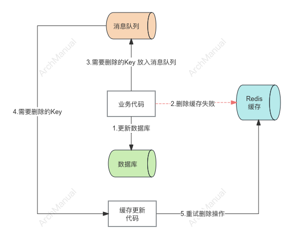
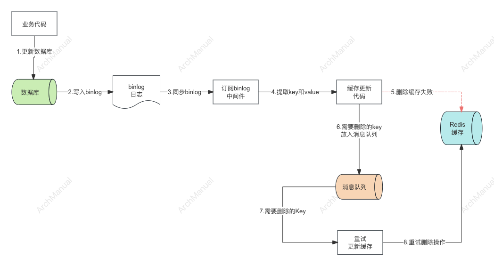

# Redis 双写一致性

Redis 双写一致性是指在使用Redis作为缓存或数据存储时，保证在写入数据到Redis和后端数据库时，两者的数据保持一致的机制。

这是一个常见的问题，尤其是在高性能、高并发的系统中，如何保证数据的一致性是一个重要的挑战。比较常用的一种方式是：Cache-Aside Pattern。

## Cache-Aside Pattern

Cache-Aside Pattern，又称为 Lazy Loading（懒加载）或 Lazy Cache（懒缓存），是一种常见的缓存使用模式。该模式主要用于在需要时将数据加载到缓存中，从而减少数据库的负载并提高数据访问速度。以下是 Cache-Aside Pattern 的工作流程和具体实现步骤：

### 工作流程

1. **读取数据**：
    - 应用程序首先尝试从缓存中读取数据。
    - 如果缓存中存在所需数据（缓存命中），则直接返回数据。
    - 如果缓存中不存在所需数据（缓存未命中），则从数据库中读取数据。
    - 从数据库中读取数据后，将数据写入缓存，并返回给应用程序。

2. **写入数据**：
    - 应用程序更新数据时，首先将数据写入数据库。
    - 然后使缓存中的相关数据失效（即删除缓存中的数据）。
    - 或者，可以选择同时更新缓存和数据库中的数据，但这不是 Cache-Aside Pattern 的标准做法。

### 实现步骤

1. **读取操作**：
   ```python
   def get_data(key):
       data = cache.get(key)
       if not data:
           data = db.get(key)
           cache.set(key, data)
       return data
   ```

2. **写入操作**：
   ```python
   def update_data(key, value):
       db.update(key, value)
       cache.invalidate(key)  # 或 cache.delete(key)
   ```

### 优缺点

**优点**：
- **简单易用**：Cache-Aside Pattern 的实现比较简单，易于理解和使用。
- **延迟加载**：数据只有在需要时才加载到缓存中，避免了不必要的缓存填充。
- **缓存失效控制**：写操作时使缓存失效，保证数据的一致性。

**缺点**：
- **首次读取慢**：缓存未命中时需要访问数据库，首次读取的延迟较高。
- **复杂的缓存失效逻辑**：在写操作后需要处理缓存失效，可能导致逻辑复杂。
- **可能的数据不一致**：在极端情况下（如并发写入），可能会出现数据不一致的问题。

### 适用场景

Cache-Aside Pattern 适用于以下场景：
- 读多写少的应用：大部分操作是读取数据，写操作较少。
- 数据变化频率较低：数据变化不频繁，缓存命中率较高。
- 对一致性要求不高：允许一定程度的延迟一致性。

通过合理使用 Cache-Aside Pattern，可以显著提高应用程序的性能，减少对数据库的直接访问压力。

## Cache-Aside pattern 下，数据不一致的情况

Cache-Aside pattern 下，数据不一致的情况也会发生，但概率较低，一般发生在缓存和数据库同时更新的场景中。比如下面的场景：

### 情景描述

假设我们有一个系统，在写操作时，既更新数据库，又更新缓存。

1. **缓存刚好失效**：
    - 缓存中的数据过期，某个请求发现缓存未命中，准备从数据库读取数据并更新缓存。

2. **请求A查询数据库，得一个旧值**：
    - 请求A发现缓存未命中，从数据库读取数据，但此时数据库中的数据是旧的。

3. **请求B将新值写入数据库**：
    - 请求B在请求A查询数据库后，将新的数据写入数据库。

4. **请求B删除缓存**：
    - 请求B更新数据库后，为确保一致性，删除缓存中的旧数据。

5. **请求A将查到的旧值写入缓存**：
    - 请求A将从数据库读取的旧值写入缓存，导致缓存中存储了过期的数据。

### 解决方案 - 延迟双删策略


延迟双删策略，在数据库更新和缓存失效后，等待一段时间再次删除缓存，确保所有并发操作完成。

```python
import time

def update_data(key, value):
    db.update(key, value)  # 更新数据库
    redis_client.delete(key)  # 删除缓存
    time.sleep(1)  # 等待一段时间，确保并发读写完成
    redis_client.delete(key)  # 再次删除缓存
```
## Cache-Aside pattern 模式下，处理删除缓存失败的情况

Cache-Aside pattern 模式 是先更新数据库，再删除缓存。在删除缓存时，有可能删除失败，导致缓存中的数据是旧的。
在此模式下，要确保删除操作最终要被执行，这样才可以保证数据的最终一致性。一些是一些处理方式。

### 1. 重试机制

在删除缓存失败时，尝试重新删除缓存。可以设置一个重试次数限制，防止无限重试。

```python
import time

def update_data(key, value):
    db.update(key, value)  # 更新数据库
    retry_delete_cache(key)  # 尝试删除缓存

def retry_delete_cache(key, retries=3, delay=0.5):
    for attempt in range(retries):
        if redis_client.delete(key):
            return True
        time.sleep(delay)
    raise Exception(f"Failed to delete cache for key: {key} after {retries} retries")
```

### 2. 延迟双删策略

在删除缓存失败时，通过异步任务或延迟删除缓存来确保缓存最终被删除。

```python
import time

def update_data(key, value):
    db.update(key, value)  # 更新数据库
    if not redis_client.delete(key):
        # 如果删除失败，异步任务或延迟再尝试删除
        schedule_delayed_delete(key)

def schedule_delayed_delete(key, delay=1):
    time.sleep(delay)
    redis_client.delete(key)
```

### 3. 异步任务

使用消息队列或任务队列来异步处理缓存删除操作。如果删除缓存失败，可以将任务重新放回队列中，确保最终删除成功。


1. 业务代码更新数据到数据库中
2. 删除Redis中的相关数据时，删除失败
3. 删除失败后，将需要删除的key放到消息队列中
4. 更新缓存的代码从消息队列中获取需要删除的key
5. 然后重试删除key的操作

### 4. 订阅binlog + 异步任务
在异步任务的方案中，需要业务代码处理redis key的删除以及删除失败的情况。这样对业务代码有一定的侵入性。可以采用订阅binlog日志的方式，有专门的来处理相关的删除逻辑。


1. 业务代码更新数据到数据库中
2. 数据库（mysql）会将数据库的操作写入binlog
3. 订阅binlog中间件可以订阅数据库的binlog日志
4. 更新缓存的代码从binlog中间件获取key和value
5. 删除Redis中的key
6. 如果删除key失败，将key放入消息队列中
7. 重试删除程序从消息队列中获取需要删掉的key
8. 重试删除操作