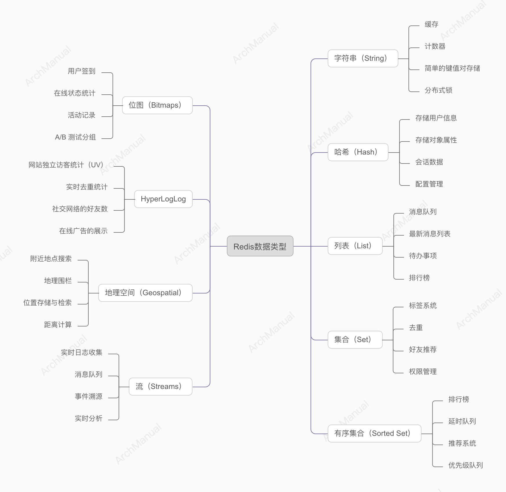

# Redis - 数据类型
Redis是一种开源的内存数据结构存储，用作数据库、缓存和消息代理。
它支持多种数据结构，如字符串、哈希、列表、集合、有序集合等。



## 1. 字符串（String）

Redis 的字符串（String）数据类型是最基本和最常用的数据类型之一。它可以存储各种类型的数据，如文本、数字、二进制数据等。以下是字符串类型的一些常见应用场景及其示例代码。

### 应用场景

1. **缓存**
   - **场景**: 缓存频繁访问的数据，如网页内容、查询结果等。
   - **示例**: 缓存用户个人信息。
2. **计数器**
   - **场景**: 计数操作，如网站访问量、视频播放次数等。
   - **示例**: 记录文章阅读次数。
3. **简单的键值对存储**
   - **场景**: 存储一些简单的配置信息或状态标识。
   - **示例**: 存储网站的配置信息。
4. **分布式锁**
   - **场景**: 控制对共享资源的访问，避免并发问题。
   - **示例**: 使用字符串实现分布式锁。

### 示例代码

#### 1. 缓存用户信息

```python
import redis

# 连接到 Redis 服务器
r = redis.Redis(host='localhost', port=6379, db=0)

user_id = "user:1000"
user_info = {
    "name": "Alice",
    "email": "alice@example.com",
    "age": "30"
}

# 设置用户信息缓存，设置过期时间为 3600 秒（1 小时）
r.setex(user_id, 3600, str(user_info))

# 获取用户信息
cached_user_info = r.get(user_id)
if cached_user_info:
    print(f"缓存的用户信息: {cached_user_info.decode()}")
else:
    print("缓存已过期或不存在")
```

#### 2. 记录文章阅读次数

```python
article_id = "article:123"

# 初始化阅读次数
r.set(article_id, 0)

# 每次读取文章时，增加阅读次数
r.incr(article_id)

# 获取当前阅读次数
read_count = r.get(article_id)
print(f"文章 {article_id} 的阅读次数为: {read_count.decode()}")
```

#### 3. 存储网站配置信息

```python
config_key = "site:config"

config = {
    "site_name": "My Awesome Site",
    "maintenance_mode": "off"
}

# 存储配置信息
r.set(config_key, str(config))

# 获取配置信息
site_config = r.get(config_key)
if site_config:
    print(f"网站配置信息: {site_config.decode()}")
else:
    print("配置信息不存在")
```

#### 4. 使用字符串实现分布式锁

```python
import time

lock_key = "resource:lock"
lock_value = "unique_lock_id"

# 获取锁，设置锁的过期时间为 10 秒
if r.set(lock_key, lock_value, nx=True, ex=10):
    print("成功获取锁")
    try:
        # 执行需要加锁的操作
        print("正在执行操作...")
        time.sleep(5)  # 模拟操作
    finally:
        # 释放锁
        if r.get(lock_key) == lock_value:
            r.delete(lock_key)
            print("成功释放锁")
else:
    print("获取锁失败，资源正在被使用")
```
## 2. 哈希（Hash）

Redis 的哈希（Hash）数据类型是一个键值对集合，适合存储对象及其属性。以下是哈希类型的一些常见应用场景及其示例代码。

### 应用场景

1. **存储用户信息**
   - **场景**: 存储用户的基本信息，如用户名、密码、邮箱等。
   - **示例**: 用户注册信息存储。
2. **存储对象属性**
   - **场景**: 存储商品的属性信息，如名称、价格、库存等。
   - **示例**: 商品详情存储。
3. **会话数据**
   - **场景**: 存储用户会话数据，如登录状态、会话时间等。
   - **示例**: 用户登录会话管理。
4. **配置管理**
   - **场景**: 存储应用的配置信息，方便集中管理和读取。
   - **示例**: 网站配置项存储。

### 示例代码

#### 1. 存储用户信息

```python
import redis

# 连接到 Redis 服务器
r = redis.Redis(host='localhost', port=6379, db=0)

user_id = "user:1000"
user_info = {
    "name": "Alice",
    "email": "alice@example.com",
    "age": "30"
}

# 存储用户信息
r.hmset(user_id, user_info)

# 获取用户信息
retrieved_user_info = r.hgetall(user_id)
print("用户信息:")
for key, value in retrieved_user_info.items():
    print(f"{key.decode()}: {value.decode()}")
```

#### 2. 存储商品属性

```python
product_id = "product:123"
product_info = {
    "name": "Laptop",
    "price": "999.99",
    "stock": "50"
}

# 存储商品属性
r.hmset(product_id, product_info)

# 获取商品属性
retrieved_product_info = r.hgetall(product_id)
print("商品属性:")
for key, value in retrieved_product_info.items():
    print(f"{key.decode()}: {value.decode()}")
```

#### 3. 用户会话数据

```python
session_id = "session:456"
session_data = {
    "user_id": "1000",
    "login_time": "2023-05-29 10:00:00",
    "status": "active"
}

# 存储会话数据
r.hmset(session_id, session_data)

# 获取会话数据
retrieved_session_data = r.hgetall(session_id)
print("会话数据:")
for key, value in retrieved_session_data.items():
    print(f"{key.decode()}: {value.decode()}")
```

#### 4. 存储网站配置信息

```python
config_key = "site:config"
site_config = {
    "site_name": "My Awesome Site",
    "maintenance_mode": "off",
    "max_users": "10000"
}

# 存储网站配置信息
r.hmset(config_key, site_config)

# 获取网站配置信息
retrieved_site_config = r.hgetall(config_key)
print("网站配置信息:")
for key, value in retrieved_site_config.items():
    print(f"{key.decode()}: {value.decode()}")
```

### 注意事项
- **`hmset` 已弃用**: 请注意，`hmset` 方法在 Redis 3.2.0 及以后的版本中已被弃用，推荐使用 `hset` 方法来代替。

以下是使用 `hset` 方法的示例：

```python
# 存储用户信息
for key, value in user_info.items():
    r.hset(user_id, key, value)

# 存储商品属性
for key, value in product_info.items():
    r.hset(product_id, key, value)

# 存储会话数据
for key, value in session_data.items():
    r.hset(session_id, key, value)

# 存储网站配置信息
for key, value in site_config.items():
    r.hset(config_key, key, value)
```

## 列表（List）

Redis 列表（List）是一个按插入顺序排序的字符串列表，支持从列表的两端推入和弹出元素，并且支持阻塞操作。以下是 Redis 列表的一些常见应用场景及其示例代码。

### 应用场景

1. **消息队列**
   - **场景**: 使用列表实现简单的消息队列系统，存储任务或消息。
   - **示例**: 任务队列。
2. **最新消息列表**
   - **场景**: 存储和获取最新的消息或日志，如社交媒体的时间线、聊天记录。
   - **示例**: 获取最新的聊天记录。
3. **待办事项**
   - **场景**: 存储用户的待办事项清单。
   - **示例**: 任务管理系统中的任务列表。
4. **排行榜**
   - **场景**: 存储和管理排名信息。
   - **示例**: 游戏排行榜。

### 示例代码

#### 1. 实现简单的消息队列

```python
import redis

# 连接到本地的 Redis 服务
r = redis.Redis(host='localhost', port=6379, db=0)

queue_key = 'task_queue'

# 推送任务到队列
r.rpush(queue_key, 'task1')
r.rpush(queue_key, 'task2')
r.rpush(queue_key, 'task3')

# 从队列中取出任务并处理
while True:
    task = r.lpop(queue_key)
    if task is None:
        break
    print(f'Processing {task.decode()}')

```

#### 2. 存储和获取最新的消息

```python
import redis

# 连接到本地的 Redis 服务
r = redis.Redis(host='localhost', port=6379, db=0)

chat_key = 'chat:messages'

# 存储消息
r.rpush(chat_key, 'Hello!')
r.rpush(chat_key, 'How are you?')
r.rpush(chat_key, 'Goodbye!')

# 获取最新的消息（从列表的右侧）
latest_messages = r.lrange(chat_key, -3, -1)
print('Latest messages:')
for message in latest_messages:
    print(message.decode())
```

#### 3. 存储和管理待办事项

```python
import redis

# 连接到本地的 Redis 服务
r = redis.Redis(host='localhost', port=6379, db=0)

todo_list_key = 'todo:list'

# 添加待办事项
r.rpush(todo_list_key, 'Buy milk')
r.rpush(todo_list_key, 'Walk the dog')
r.rpush(todo_list_key, 'Read a book')

# 获取所有待办事项
todo_items = r.lrange(todo_list_key, 0, -1)
print('To-Do List:')
for item in todo_items:
    print(f'- {item.decode()}')

# 完成第一个待办事项
completed_item = r.lpop(todo_list_key)
print(f'Completed: {completed_item.decode()}')
```

#### 4. 存储和管理排行榜

```python
import redis

# 连接到本地的 Redis 服务
r = redis.Redis(host='localhost', port=6379, db=0)

leaderboard_key = 'game:leaderboard'

# 添加玩家分数
r.rpush(leaderboard_key, 'Alice:1000')
r.rpush(leaderboard_key, 'Bob:1500')
r.rpush(leaderboard_key, 'Charlie:1200')

# 获取排行榜
leaderboard = r.lrange(leaderboard_key, 0, -1)
print('Leaderboard:')
for rank, player in enumerate(leaderboard, start=1):
    print(f'{rank}. {player.decode()}')
```

## 4. 集合（Set）

Redis 集合（Set）是一种无序的字符串集合，集合中的元素是唯一的，不允许重复。集合类型支持多种集合操作，如交集、并集、差集等。以下是 Redis 集合的一些常见应用场景及其示例代码。

### 应用场景

1. **标签系统**
   - **场景**: 存储和管理标签，如用户标签、商品标签等。
   - **示例**: 用户兴趣标签。
2. **去重**
   - **场景**: 存储和管理唯一性数据，防止重复。
   - **示例**: 记录唯一访问 IP。
3. **好友推荐**
   - **场景**: 计算共同好友或共同关注的用户。
   - **示例**: 推荐共同好友。
4. **权限管理**
   - **场景**: 存储和管理用户权限。
   - **示例**: 用户角色权限。

### 示例代码

#### 1. 标签系统

```python
import redis

# 连接到本地的 Redis 服务
r = redis.Redis(host='localhost', port=6379, db=0)

user_id = 'user:1000'
tags_key = f'{user_id}:tags'

# 添加标签
r.sadd(tags_key, 'music', 'movies', 'sports')

# 获取所有标签
tags = r.smembers(tags_key)
print('User tags:')
for tag in tags:
    print(tag.decode())

# 检查是否有某个标签
has_music_tag = r.sismember(tags_key, 'music')
print(f'User has music tag: {has_music_tag}')
```

#### 2. 去重

```python
import redis

# 连接到本地的 Redis 服务
r = redis.Redis(host='localhost', port=6379, db=0)

unique_ips_key = 'unique:ips'

# 添加访问 IP
r.sadd(unique_ips_key, '192.168.1.1', '192.168.1.2', '192.168.1.1')  # 192.168.1.1 重复

# 获取所有唯一 IP
unique_ips = r.smembers(unique_ips_key)
print('Unique IPs:')
for ip in unique_ips:
    print(ip.decode())
```

#### 3. 共同好友推荐

```python
import redis

# 连接到本地的 Redis 服务
r = redis.Redis(host='localhost', port=6379, db=0)

user1_friends_key = 'user:1000:friends'
user2_friends_key = 'user:2000:friends'

# 添加用户好友
r.sadd(user1_friends_key, 'friend1', 'friend2', 'friend3')
r.sadd(user2_friends_key, 'friend2', 'friend3', 'friend4')

# 获取共同好友
common_friends = r.sinter(user1_friends_key, user2_friends_key)
print('Common friends:')
for friend in common_friends:
    print(friend.decode())
```

#### 4. 权限管理

```python
import redis

# 连接到本地的 Redis 服务
r = redis.Redis(host='localhost', port=6379, db=0)

role_key = 'role:admin:permissions'

# 添加权限
r.sadd(role_key, 'read', 'write', 'delete')

# 获取所有权限
permissions = r.smembers(role_key)
print('Admin permissions:')
for permission in permissions:
    print(permission.decode())

# 检查是否有某个权限
has_delete_permission = r.sismember(role_key, 'delete')
print(f'Admin has delete permission: {has_delete_permission}')
```

## 5. 有序集合（Sorted Set）
Redis 有序集合（Sorted Set）是一种带有分数的集合，集合中的每个成员都有一个分数，Redis 会按照分数的大小进行排序。以下是 Redis 有序集合的一些常见应用场景及其示例代码。

### 应用场景

1. **排行榜**
   - **场景**: 存储和管理排行榜数据，如游戏得分排行榜。
   - **示例**: 游戏玩家得分排行榜。
2. **延时队列**
   - **场景**: 实现基于时间的任务调度。
   - **示例**: 定时任务执行。
3. **推荐系统**
   - **场景**: 根据权重推荐内容，如推荐文章或商品。
   - **示例**: 根据点击率推荐文章。
4. **优先级队列**
   - **场景**: 存储和管理不同优先级的任务。
   - **示例**: 任务调度系统中的任务队列。

### 示例代码

#### 1. 游戏玩家得分排行榜

```python
import redis

# 连接到本地的 Redis 服务
r = redis.Redis(host='localhost', port=6379, db=0)

leaderboard_key = 'game:leaderboard'

# 添加玩家分数
r.zadd(leaderboard_key, {'Alice': 1000, 'Bob': 1500, 'Charlie': 1200})

# 获取排行榜前 N 名
top_players = r.zrevrange(leaderboard_key, 0, 2, withscores=True)
print('Top players:')
for player, score in top_players:
    print(f'{player.decode()}: {score}')
```

#### 2. 延时队列

```python
import redis
import time

# 连接到本地的 Redis 服务
r = redis.Redis(host='localhost', port=6379, db=0)

delay_queue_key = 'delay:queue'

# 添加任务到延时队列，任务的执行时间为当前时间加上延迟时间（秒）
delay = 10  # 延迟10秒
task_id = 'task1'
execution_time = time.time() + delay
r.zadd(delay_queue_key, {task_id: execution_time})

# 获取并执行到期的任务
while True:
    now = time.time()
    tasks = r.zrangebyscore(delay_queue_key, 0, now)
    if tasks:
        for task in tasks:
            print(f'Executing {task.decode()}')
            r.zrem(delay_queue_key, task)
    time.sleep(1)
```

#### 3. 根据点击率推荐文章

```python
import redis

# 连接到本地的 Redis 服务
r = redis.Redis(host='localhost', port=6379, db=0)

article_clicks_key = 'articles:clicks'

# 添加文章点击率
r.zadd(article_clicks_key, {'article1': 100, 'article2': 150, 'article3': 120})

# 获取点击率最高的前 N 篇文章
top_articles = r.zrevrange(article_clicks_key, 0, 2, withscores=True)
print('Top articles:')
for article, clicks in top_articles:
    print(f'{article.decode()}: {clicks}')
```

#### 4. 任务调度系统中的优先级队列

```python
import redis

# 连接到本地的 Redis 服务
r = redis.Redis(host='localhost', port=6379, db=0)

priority_queue_key = 'priority:queue'

# 添加任务到优先级队列，分数代表优先级，分数越高优先级越高
r.zadd(priority_queue_key, {'task1': 1, 'task2': 3, 'task3': 2})

# 获取并处理优先级最高的任务
while True:
    task = r.zrevrange(priority_queue_key, 0, 0)
    if task:
        task_id = task[0]
        print(f'Processing {task_id.decode()}')
        r.zrem(priority_queue_key, task_id)
    else:
        break
```


## 6. 位图（Bitmaps）
位图（Bitmap）在 Redis 中是一种高效的按位存储数据的方式，主要用于处理需要进行按位操作的场景。以下是位图的一些常见应用场景及其示例代码。

### 应用场景

1. **用户签到**
   - **场景**: 记录用户每天的签到情况。
   - **示例**: 记录用户每月的签到信息。
2. **在线状态统计**
   - **场景**: 记录用户是否在线的状态。
   - **示例**: 记录用户每天的在线状态。
3. **活动记录**
   - **场景**: 记录用户在某个时间段内的活动情况。
   - **示例**: 记录用户每小时的活动状态。
4. **A/B 测试分组**
   - **场景**: 将用户分为不同的实验组进行 A/B 测试。
   - **示例**: 将用户随机分配到两个不同的实验组。

### 示例代码

#### 1. 用户签到

```python
import redis

# 连接到本地的 Redis 服务
r = redis.Redis(host='localhost', port=6379, db=0)

user_id = 'user:1000'
sign_key = f'{user_id}:sign'

# 用户在某天签到，例如第5天
day = 5
r.setbit(sign_key, day, 1)

# 检查用户在某天是否签到
is_signed = r.getbit(sign_key, day)
print(f'用户在第{day}天是否签到：{"是" if is_signed else "否"}')

# 统计用户总签到天数
total_sign_days = r.bitcount(sign_key)
print(f'用户总共签到天数：{total_sign_days}')
```

#### 2. 在线状态统计

```python
import redis
import time

# 连接到本地的 Redis 服务
r = redis.Redis(host='localhost', port=6379, db=0)

online_key = 'user:online_status'
user_id = 1000

# 假设每个时间片为10分钟
time_slot = int(time.time() // 600)

# 设置用户在线状态
r.setbit(f'{online_key}:{user_id}', time_slot, 1)

# 检查用户在某个时间片是否在线
is_online = r.getbit(f'{online_key}:{user_id}', time_slot)
print(f'用户在时间片{time_slot}是否在线：{"是" if is_online else "否"}')

# 统计用户总在线时间片数
total_online_slots = r.bitcount(f'{online_key}:{user_id}')
print(f'用户总共在线时间片数：{total_online_slots}')
```

#### 3. 用户活动记录

```python
import redis
import time

# 连接到本地的 Redis 服务
r = redis.Redis(host='localhost', port=6379, db=0)

activity_key = 'user:activity'
user_id = 1000

# 假设每个时间片为1小时
time_slot = int(time.time() // 3600)

# 设置用户活动状态
r.setbit(f'{activity_key}:{user_id}', time_slot, 1)

# 检查用户在某个时间片是否有活动
is_active = r.getbit(f'{activity_key}:{user_id}', time_slot)
print(f'用户在时间片{time_slot}是否有活动：{"是" if is_active else "否"}')

# 统计用户总活动时间片数
total_active_slots = r.bitcount(f'{activity_key}:{user_id}')
print(f'用户总共活动时间片数：{total_active_slots}')
```

#### 4. A/B 测试分组

```python
import redis

# 连接到本地的 Redis 服务
r = redis.Redis(host='localhost', port=6379, db=0)

ab_test_key = 'ab_test:group'
user_id = 1000

# 将用户分配到组A（0）或组B（1）
import random
group = random.choice([0, 1])
r.setbit(ab_test_key, user_id, group)

# 检查用户所属的组
user_group = r.getbit(ab_test_key, user_id)
print(f'用户 {user_id} 属于组 {"A" if user_group == 0 else "B"}')
```


## 7. HyperLogLog
HyperLogLog 是 Redis 中的一种用于基数（唯一值）统计的数据结构，能够在极小的内存占用下提供高精度的基数估计。它特别适用于需要快速计算大量数据集唯一元素数量的场景。

### 应用场景

1. **网站独立访客统计（UV）**
   - **场景**: 统计网站的独立访客数量。
   - **示例**: 每天、每月的独立访客数。
2. **实时去重统计**
   - **场景**: 统计实时数据流中的唯一元素数量。
   - **示例**: 实时分析中统计唯一用户数或事件数。
3. **社交网络的好友数**
   - **场景**: 统计用户在社交网络中有多少唯一好友。
   - **示例**: 统计用户的唯一好友数量。
4. **在线广告的展示**
   - **场景**: 统计广告的独立展示数量。
   - **示例**: 统计某广告在一段时间内的独立展示用户数。

### 示例代码

以下示例展示了如何使用 Redis 的 HyperLogLog 进行基数统计。

#### 1. 网站独立访客统计

```python
import redis

# 连接到本地的 Redis 服务
r = redis.Redis(host='localhost', port=6379, db=0)

uv_key = 'website:uv'

# 模拟添加每日访客
daily_visitors = ['user1', 'user2', 'user3', 'user4', 'user5']
for visitor in daily_visitors:
    r.pfadd(uv_key, visitor)

# 获取独立访客数量
uv_count = r.pfcount(uv_key)
print(f'独立访客数量：{uv_count}')
```

#### 2. 实时去重统计

```python
import redis

# 连接到本地的 Redis 服务
r = redis.Redis(host='localhost', port=6379, db=0)

unique_events_key = 'events:unique'

# 模拟添加实时事件
events = ['event1', 'event2', 'event3', 'event4', 'event1']
for event in events:
    r.pfadd(unique_events_key, event)

# 获取唯一事件数量
unique_events_count = r.pfcount(unique_events_key)
print(f'唯一事件数量：{unique_events_count}')
```

#### 3. 社交网络的好友数统计

```python
import redis

# 连接到本地的 Redis 服务
r = redis.Redis(host='localhost', port=6379, db=0)

user_id = 'user:1000'
friends_key = f'{user_id}:friends'

# 模拟添加好友
friends = ['friend1', 'friend2', 'friend3', 'friend4', 'friend5', 'friend1']
for friend in friends:
    r.pfadd(friends_key, friend)

# 获取唯一好友数量
unique_friends_count = r.pfcount(friends_key)
print(f'用户 {user_id} 的唯一好友数量：{unique_friends_count}')
```

#### 4. 在线广告的独立展示统计

```python
import redis

# 连接到本地的 Redis 服务
r = redis.Redis(host='localhost', port=6379, db=0)

ad_key = 'ad:display:unique'

# 模拟添加广告展示
displays = ['user1', 'user2', 'user3', 'user4', 'user2']
for display in displays:
    r.pfadd(ad_key, display)

# 获取广告的独立展示数量
unique_displays_count = r.pfcount(ad_key)
print(f'广告的独立展示数量：{unique_displays_count}')
```


## 8. 地理空间（Geospatial）
Redis 的地理空间（Geospatial）数据类型允许存储地理位置信息，并且可以执行各种地理空间操作，如半径查询和位置距离计算。以下是地理空间的一些常见应用场景及其示例代码。

### 应用场景

1. **附近地点搜索**
   - **场景**: 查找某个位置附近的地点，如餐馆、加油站、酒店等。
   - **示例**: 查找用户当前位置附近的餐馆。
2. **地理围栏**
   - **场景**: 检查某个位置是否在指定区域内。
   - **示例**: 判断车辆是否在指定的城市区域内。
3. **位置存储与检索**
   - **场景**: 存储和检索实体的位置数据，如用户位置、设备位置等。
   - **示例**: 存储和检索快递员的位置。
4. **距离计算**
   - **场景**: 计算两个位置之间的距离。
   - **示例**: 计算用户与商店之间的距离。

### 示例代码

以下示例展示了如何使用 Redis 的地理空间数据类型进行地理位置存储、附近地点搜索和距离计算。

#### 1. 存储地理位置信息

```python
import redis

# 连接到本地的 Redis 服务
r = redis.Redis(host='localhost', port=6379, db=0)

geo_key = 'locations'

# 添加地理位置信息
r.geoadd(geo_key, 13.361389, 38.115556, 'Palermo')
r.geoadd(geo_key, 15.087269, 37.502669, 'Catania')

# 获取地理位置信息
locations = r.geopos(geo_key, 'Palermo', 'Catania')
print('Locations:')
for loc in locations:
    print(loc)
```

#### 2. 查找附近地点

```python
import redis

# 连接到本地的 Redis 服务
r = redis.Redis(host='localhost', port=6379, db=0)

geo_key = 'locations'

# 添加地理位置信息
r.geoadd(geo_key, 13.361389, 38.115556, 'Palermo')
r.geoadd(geo_key, 15.087269, 37.502669, 'Catania')
r.geoadd(geo_key, 13.583333, 37.316667, 'Agrigento')

# 查找某个位置附近的地点
nearby_locations = r.georadius(geo_key, 15.0, 37.5, 100, unit='km')
print('Nearby locations within 100 km:')
for loc in nearby_locations:
    print(loc.decode())
```

#### 3. 计算两个地点之间的距离

```python
import redis

# 连接到本地的 Redis 服务
r = redis.Redis(host='localhost', port=6379, db=0)

geo_key = 'locations'

# 添加地理位置信息
r.geoadd(geo_key, 13.361389, 38.115556, 'Palermo')
r.geoadd(geo_key, 15.087269, 37.502669, 'Catania')

# 计算两个位置之间的距离
distance = r.geodist(geo_key, 'Palermo', 'Catania', unit='km')
print(f'Distance between Palermo and Catania: {distance} km')
```

#### 4. 检查某个位置是否在指定区域内（地理围栏）

```python
import redis

# 连接到本地的 Redis 服务
r = redis.Redis(host='localhost', port=6379, db=0)

geo_key = 'locations'

# 添加地理位置信息
r.geoadd(geo_key, 13.361389, 38.115556, 'Palermo')
r.geoadd(geo_key, 15.087269, 37.502669, 'Catania')

# 检查某个位置是否在指定半径内
radius = 100  # 单位：千米
center_location = (15.0, 37.5)
locations_within_radius = r.georadius(geo_key, center_location[0], center_location[1], radius, unit='km')

# 检查某个位置是否在结果列表中
target_location = 'Catania'
is_within_radius = target_location.encode() in locations_within_radius
print(f'{target_location} 是否在 {radius} km 半径内: {"是" if is_within_radius else "否"}')
```

## 9. 流（Streams）
Redis 的流（Streams）数据类型是一种高效的日志和消息存储数据结构，适用于实时数据处理。以下是流的一些常见应用场景及其示例代码。

### 应用场景

1. **实时日志收集**
   - **场景**: 收集和处理实时日志数据。
   - **示例**: 应用程序或系统的日志收集。
2. **消息队列**
   - **场景**: 实现消息队列，用于任务分发和处理。
   - **示例**: 任务处理系统中的任务队列。
3. **事件溯源**
   - **场景**: 记录系统或应用程序中的事件，支持事件重放和追踪。
   - **示例**: 用户行为事件溯源。
4. **实时分析**
   - **场景**: 收集和分析实时数据流。
   - **示例**: 实时数据分析和监控系统。

### 示例代码

以下示例展示了如何使用 Redis 的流数据类型进行数据添加、读取和消费。

#### 1. 添加日志消息到流

```python
import redis

# 连接到本地的 Redis 服务
r = redis.Redis(host='localhost', port=6379, db=0)

stream_key = 'mystream'

# 添加日志消息到流
r.xadd(stream_key, {'event': 'login', 'user': 'alice'})
r.xadd(stream_key, {'event': 'purchase', 'user': 'bob', 'amount': '100'})
r.xadd(stream_key, {'event': 'logout', 'user': 'alice'})

print('日志消息已添加到流中。')
```

#### 2. 读取流中的消息

```python
import redis

# 连接到本地的 Redis 服务
r = redis.Redis(host='localhost', port=6379, db=0)

stream_key = 'mystream'

# 读取流中的消息
entries = r.xrange(stream_key, count=10)
print('读取流中的消息:')
for entry in entries:
    entry_id, fields = entry
    print(f'ID: {entry_id}')
    for field, value in fields.items():
        print(f'  {field.decode()}: {value.decode()}')
```

#### 3. 消费流中的消息

```python
import redis

# 连接到本地的 Redis 服务
r = redis.Redis(host='localhost', port=6379, db=0)

stream_key = 'mystream'
group_name = 'mygroup'
consumer_name = 'consumer1'

# 创建消费者组
try:
    r.xgroup_create(stream_key, group_name, id='0', mkstream=True)
except redis.exceptions.ResponseError as e:
    if 'BUSYGROUP Consumer Group name already exists' not in str(e):
        raise

# 消费流中的消息
entries = r.xreadgroup(group_name, consumer_name, {stream_key: '>'}, count=10)
print('消费流中的消息:')
for stream, messages in entries:
    for message in messages:
        message_id, fields = message
        print(f'ID: {message_id}')
        for field, value in fields.items():
            print(f'  {field.decode()}: {value.decode()}')

# 确认消息处理完毕
for stream, messages in entries:
    for message in messages:
        message_id, _ = message
        r.xack(stream_key, group_name, message_id)
```

#### 4. 处理未确认的消息

```python
import redis

# 连接到本地的 Redis 服务
r = redis.Redis(host='localhost', port=6379, db=0)

stream_key = 'mystream'
group_name = 'mygroup'
consumer_name = 'consumer1'

# 获取未确认的消息
pending_entries = r.xpending(stream_key, group_name)
print('未确认的消息:')
for entry in pending_entries['consumers']:
    print(f'消费者: {entry["name"]}, 未确认的消息数: {entry["pending"]}')

# 读取并处理未确认的消息
entries = r.xreadgroup(group_name, consumer_name, {stream_key: '0'}, count=10)
print('处理未确认的消息:')
for stream, messages in entries:
    for message in messages:
        message_id, fields = message
        print(f'ID: {message_id}')
        for field, value in fields.items():
            print(f'  {field.decode()}: {value.decode()}')
        # 确认消息处理完毕
        r.xack(stream_key, group_name, message_id)
```
