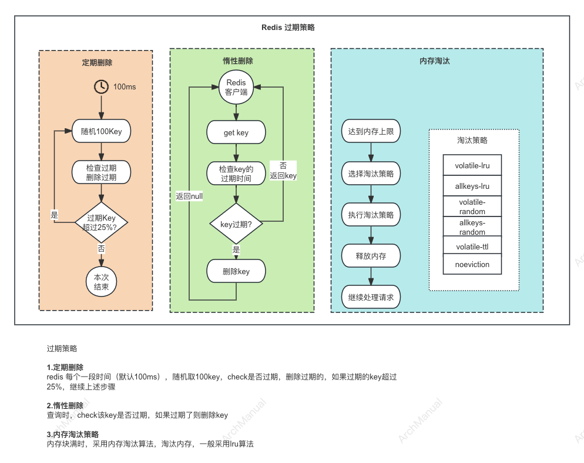

# Redis 过期策略
Redis 的过期策略主要是指管理和删除那些设定了过期时间的键，以确保内存的有效使用和数据的及时清理。
具体来说，Redis 有三种主要的过期策略：定期删除（Scheduled Deletion）、惰性删除（Lazy Deletion）和内存淘汰策略（Eviction Policies）。

## 1. 定期删除
Redis 的定期删除策略（Scheduled Deletion）的步骤如下：

1. **设置定期任务**：
    - Redis 会在后台线程中设置一个定期任务，用于扫描和删除过期键。这个任务会在特定的时间间隔内执行，默认每 100 毫秒运行一次。

2. **随机抽样检查**：
    - 在每次定期任务执行时，Redis 会从已设置过期时间的键中随机抽取一部分键进行检查，而不是一次性检查所有键。这样可以减少对 CPU 的负载。

3. **检查键的过期状态**：
    - 对于抽取的每一个键，Redis 会检查该键的过期时间。如果发现某个键已经过期，Redis 就会立即删除该键。

4. **重复检查**：
    - 如果在一次扫描中发现了删除的健的占比超过了设置的阈值(比如：25%），那么 Redis 会继续进行下一轮的随机抽样检查，直到在一次扫描中没有找到任何过期的键为止。

5. **调节扫描频率和负载**：
    - 为了防止定期删除任务占用过多的 CPU 资源，Redis 会根据上一次扫描中删除的过期键的数量来动态调整下一次扫描的强度。比如，如果上一次扫描删除了大量的过期键，那么下一次扫描的键数量可能会减少，反之亦然。

## 2. 惰性删除

Redis 的惰性删除策略（Lazy Deletion）的步骤如下：

1. **访问键时检查过期状态**：
   - 当客户端对 Redis 发起读操作（如 `GET`）或写操作（如 `SET`）时，Redis 首先会检查被访问的键是否设置了过期时间。

2. **获取当前时间**：
   - Redis 获取当前的系统时间，用来与键的过期时间进行比较。

3. **比较过期时间**：
   - 如果键的过期时间早于当前时间，说明该键已经过期。

4. **删除过期键**：
   - 如果键已经过期，Redis 会立即删除该键，并返回一个特殊的响应（如返回 `nil` 表示键不存在，或其他与操作类型相关的结果）。

5. **处理未过期键**：
   - 如果键未过期，Redis 会继续正常处理客户端的请求，返回键的值或执行相应的写操作。

### 示例
假设客户端向 Redis 发起一个 `GET` 操作来读取键 `mykey` 的值，惰性删除的详细步骤如下：

1. **客户端发送 `GET mykey`**：
   - 客户端向 Redis 发送 `GET mykey` 命令。

2. **Redis 接收请求并查找键**：
   - Redis 接收到请求后，查找键 `mykey`。

3. **检查过期时间**：
   - Redis 发现 `mykey` 设置了过期时间，获取当前时间。

4. **比较当前时间和过期时间**：
   - Redis 比较当前时间和 `mykey` 的过期时间。
      - 如果 `mykey` 的过期时间是 `2024-06-01 12:00:00`，当前时间是 `2024-06-01 12:01:00`，则 `mykey` 已经过期。
      - 如果当前时间是 `2024-06-01 11:59:00`，则 `mykey` 未过期。

5. **删除过期键或返回值**：
   - 如果 `mykey` 已经过期，Redis 立即删除 `mykey`，并返回 `nil` 表示键不存在。
   - 如果 `mykey` 未过期，Redis 返回 `mykey` 的值。

## 3. 内存淘汰
Redis 的内存淘汰策略（Eviction Policies）是指当 Redis 实例的内存使用达到配置的最大上限时，采取的一系列措施来删除现有的键，以腾出空间给新的数据。

以下是 Redis 内存淘汰策略的详细说明：

### 删除策略

### 1. **volatile-lru（使用 LRU 算法删除设置了过期时间的键）**

- **描述**：从设置了过期时间的键中，使用 LRU（Least Recently Used，最近最少使用）算法删除最不常用的键。
- **应用场景**：适用于需要在有过期时间的键中保持最常用的数据的情况。

### 2. **allkeys-lru（使用 LRU 算法删除所有键）**

- **描述**：从所有键中，使用 LRU 算法删除最不常用的键。
- **应用场景**：适用于希望在所有数据中保持最常用的数据的情况，而不考虑键是否设置了过期时间。

### 3. **volatile-random（随机删除设置了过期时间的键）**

- **描述**：从设置了过期时间的键中，随机删除键。
- **应用场景**：适用于希望简单地随机删除有过期时间的键，以释放内存的情况。

### 4. **allkeys-random（随机删除所有键）**

- **描述**：从所有键中，随机删除键。
- **应用场景**：适用于希望简单地随机删除键，以释放内存的情况。

### 5. **volatile-ttl（删除设置了过期时间且剩余存活时间最短的键）**

- **描述**：从设置了过期时间的键中，删除剩余存活时间（TTL，Time to Live）最短的键。
- **应用场景**：适用于希望首先删除那些即将过期的键，以尽量保留长时间有效数据的情况。

### 6. **noeviction（不删除任何键）**

- **描述**：当内存使用达到上限时，不删除任何键，直接返回错误。
- **应用场景**：适用于希望严格控制内存使用，不希望自动删除任何键的情况。通常用于希望 Redis 只作为缓存或持久存储的一部分，并在达到内存上限时明确地处理错误。

### 具体操作步骤
以下是 Redis 内存淘汰策略的具体操作步骤：

1. **达到内存上限**：
   - Redis 实例的内存使用达到配置的最大上限（由配置参数 `maxmemory` 设置）。

2. **选择淘汰策略**：
   - Redis 根据配置的淘汰策略（由 `maxmemory-policy` 参数设置）来决定如何释放内存。

3. **执行淘汰策略**：
   - 根据选定的策略，Redis 选择要删除的键：
      - **LRU 算法**：Redis 使用近似 LRU 算法，维护一个候选键列表，并删除最不常用的键。
      - **随机删除**：Redis 从符合条件的键中随机选择并删除。
      - **TTL 最短**：Redis 删除剩余存活时间最短的键。
      - **无淘汰**：Redis 不删除键，直接返回错误（如 `OOM command not allowed`）。

4. **释放内存**：
   - 删除选中的键，释放内存。

5. **继续处理请求**：
   - 如果删除的键足以腾出足够的空间，Redis 继续处理客户端请求；否则，重复执行淘汰策略，直到满足内存要求或返回错误。

### 示例

假设 Redis 配置了 `maxmemory` 为 100MB，`maxmemory-policy` 为 `allkeys-lru`，当前内存使用已达到 100MB：

1. **客户端发送 `SET mykey value`**：
   - Redis 接收到 `SET mykey value` 请求。

2. **检测内存使用**：
   - Redis 发现内存使用已达上限，触发淘汰策略。

3. **选择淘汰策略 `allkeys-lru`**：
   - Redis 使用 LRU 算法，从所有键中选择最不常用的键。

4. **删除最不常用的键**：
   - Redis 删除 LRU 列表中的最不常用键，如 `oldkey1` 和 `oldkey2`。

5. **释放内存并处理请求**：
   - 删除键后释放足够内存，Redis 继续处理 `SET mykey value` 请求，并成功存储新键 `mykey`。

## 4. 三种策略相互配合

### 配合工作

1. **正常情况下**：
   - **定期删除** 和 **惰性删除** 是主要的过期数据清理手段。
   - 定期删除在后台自动清理一部分过期键，减少内存占用。
   - 惰性删除确保每次访问时，过期键都能被及时清理，保证数据的有效性。

2. **内存压力增大时**：
   - 当内存使用达到配置的最大上限时，触发 **内存淘汰策略**。
   - 内存淘汰策略根据配置的策略（如 LRU、随机删除等）选择并删除部分键，以释放内存。
   - 在这种情况下，定期删除和惰性删除继续工作，但主要任务是由内存淘汰策略来完成。

3. **高效配合**：
   - 定期删除和惰性删除保证大部分过期键能够在不影响系统性能的情况下被清理。
   - 内存淘汰策略则在内存压力过大时提供额外的保护，确保系统不会因为内存不足而出现问题。
   - 这种多层次的内存管理机制，保证了 Redis 的高效和稳定运行。

### 示例场景

假设 Redis 实例设置了 `maxmemory` 为 100MB，淘汰策略为 `allkeys-lru`：

1. **系统正常运行**：
   - 定期删除任务每 100 毫秒运行一次，随机检查一些设置了过期时间的键，删除过期键。
   - 客户端访问键时，惰性删除机制检查键是否过期，过期键立即删除。

2. **内存使用达到 90MB**：
   - 定期删除和惰性删除继续工作，但由于某些键没有被及时访问或定期任务未覆盖，内存使用仍在增长。

3. **内存使用达到 100MB**：
   - 触发内存淘汰策略 `allkeys-lru`，Redis 删除最近最少使用的键，释放内存。
   - 继续接受并处理新的客户端请求，确保系统正常运行。

