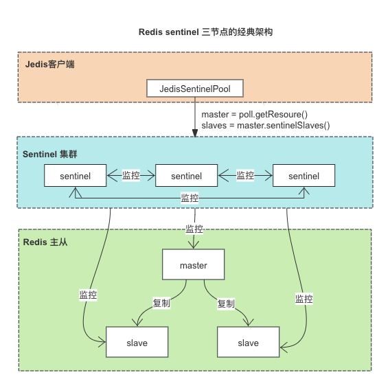
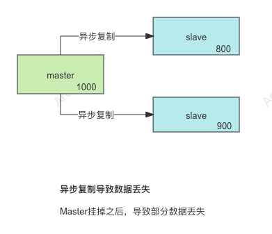
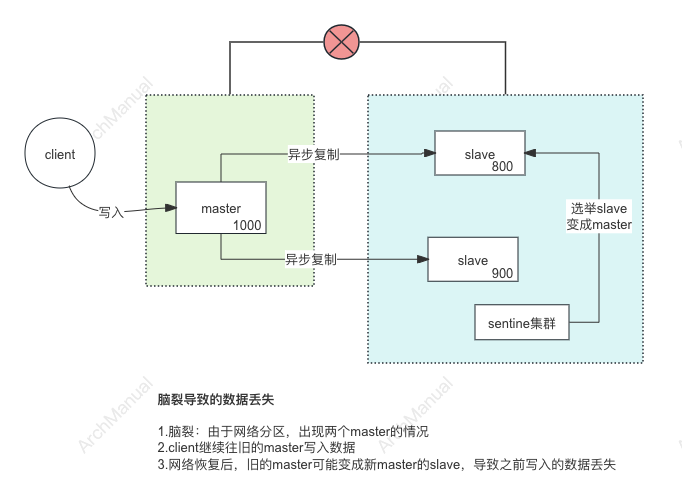

# Redis 高可用
Redis 高可用性（High Availability）是指在 Redis 系统中实现持续的可用性，即使在发生硬件故障或其他意外情况下，系统仍能保持运行。


## 1 常用方案
为了实现 Redis 的高可用性，以下是几种常用方案：

### 1.1 使用 Redis Sentinel
Redis Sentinel 是一个自带的高可用性解决方案，适用于需要自动故障转移和监控的场景。它的主要优点是易于配置和管理。后文重点介绍

#### 优点：
- 自动故障转移：当主节点故障时，Sentinel 可以自动选举一个从节点作为新的主节点。
- 监控和通知：持续监控 Redis 实例并在故障时发送通知。
- 简单配置：可以在现有的 Redis 主从架构上轻松添加 Sentinel。

#### 推荐配置示例：
- 三个或更多 Sentinel 节点来保证故障检测的可靠性。
- 主节点与从节点的配置根据业务需求调整同步策略。

### 1.2 使用 Redis Cluster
Redis Cluster 提供分布式存储和高可用性，是官方推荐的用于大规模数据和高并发场景的解决方案。

#### 优点：
- 数据分片：自动将数据分散到多个节点上，提高存储和处理能力。
- 自动故障转移：主节点故障时，从节点自动提升为主节点。
- 扩展性强：可以方便地添加节点来扩展集群容量。

#### 推荐配置示例：
- 至少三个主节点和三个从节点（每个主节点至少一个从节点），以确保在某个节点故障时仍能保持高可用性。
- 配置合适的分片策略，确保数据均匀分布。

### 1.3 使用 Kubernetes 和 Redis Operator
在云原生环境中，使用 Kubernetes 和 Redis Operator 可以实现自动化的 Redis 部署、管理和高可用性。

#### 优点：
- 自动化部署：使用 Kubernetes 的 StatefulSet 和 Redis Operator 简化 Redis 集群的部署和管理。
- 弹性伸缩：可以根据负载情况自动调整 Redis 实例的数量。
- 集成云原生工具：与 Kubernetes 的监控、日志和网络策略等工具集成，实现更高的可靠性和可管理性。

#### 推荐配置示例：
- 使用 Helm Chart 部署 Redis Operator，自动管理 Redis 集群的生命周期。
- 配置 Persistent Volume (PV) 来持久化数据，防止数据丢失。

### 1.4 使用 Redis Enterprise
Redis Enterprise 是 Redis Labs 提供的商业解决方案，适用于对高可用性、性能和支持有更高要求的企业级应用。

#### 优点：
- 多活部署：支持在多个数据中心间实现高可用性和灾难恢复。
- 高性能：优化的内存管理和持久化策略，提供更高的性能和稳定性。
- 企业级支持：专业的技术支持和服务。

#### 推荐配置示例：
- 根据业务需求选择适合的部署模式（单数据中心、多数据中心等）。
- 利用 Redis Enterprise 提供的自动分片和故障转移机制，实现高可用性和高性能。

### 选择适合的高可用方案
选择 Redis 高可用性方案时，应根据具体的业务需求、规模和技术栈来做出决策。以下是一些考虑因素：
- **业务规模和数据量**：对于小规模应用，可以选择 Sentinel；对于大规模应用，推荐使用 Redis Cluster。
- **故障转移时间和可靠性要求**：Redis Cluster 和 Redis Enterprise 提供更快和更可靠的故障转移。
- **部署环境**：在云原生环境中，使用 Kubernetes 和 Redis Operator 可以带来更多的管理和自动化优势。
- **预算和支持需求**：企业级应用可以考虑 Redis Enterprise，以获得专业支持和更高性能。

## 2 Redis Sentinel 原理

下面重点介绍一下Redis Sentinel。

Redis Sentinel 是 Redis 提供的一种高可用性解决方案，专门用于监控 Redis 实例并在主节点故障时自动进行故障转移。



### 2.1 主要功能

1. **监控**：
    - Sentinel 会持续监控主从实例的运行状态，包括检测实例是否处于运行状态、响应时间是否正常等。
    - 如果检测到主节点故障，Sentinel 会将其标记为下线。

2. **通知**：
    - 当检测到某个节点故障时，Sentinel 可以通过发布/订阅机制通知系统管理员或应用程序。
    - 还可以配置外部报警系统（如电子邮件、短信）以便及时响应故障。

3. **自动故障转移**：
    - 当主节点发生故障时，Sentinel 集群会选举出一个新的主节点，并将其他从节点重新配置为同步新主节点的数据。
    - 在选举过程中，Sentinel 会根据从节点的优先级、复制落后程度等因素选择最合适的从节点作为新的主节点。

4. **配置管理**：
    - Sentinel 会自动更新并传播新的主从配置，以确保所有客户端能够正确连接到新的主节点。
    - 通过配置文件或 API 动态调整 Sentinel 的行为。

### 2.2 Redis Sentinel 节点集群
Redis Sentinel 是一个独立的进程，通常以哨兵节点（Sentinel nodes）形式部署在独立的服务器上。

哨兵节点通过配置文件指定需要监控的主节点地址及端口。

Sentinel 本身也是集群部署，通过集群部署来对Redis集群选举新的Master。
- 集群中的Sentinel 通过投票决定是否master故障
- 如果Master发生的故障，集群中的Sentinel 投票选举新的master 
- Sentinel集群中的哨兵至少3个（经典的3个哨兵节点集群）

### 2.3 Redis Sentinel 集群自动发现机制

Redis Sentinel 集群中的自动发现机制是确保 Sentinel 实例能够相互发现并通信，以实现故障检测和自动故障转移的关键部分

#### 哨兵集群自动发现机制

##### 1. Sentinel 配置中的 `sentinel monitor`

在每个 Sentinel 实例的配置文件中，通过 `sentinel monitor` 命令指定要监控的 Redis 主节点。这是 Sentinel 自动发现机制的起点。

示例配置：

```ini
sentinel monitor mymaster 192.168.1.1 6379 2
```

这条配置命令告诉 Sentinel 实例监控主节点 `192.168.1.1:6379`，并设置法定人数为 2。

##### 2. Sentinel 实例之间的相互发现

Sentinel 实例通过以下几种方式实现相互发现和通信：

**发布/订阅机制（Pub/Sub）**

- 每个 Sentinel 实例都会在启动时向 Redis 主节点订阅频道 `__sentinel__:hello`。
- Sentinel 实例定期向该频道发布自身的信息，包括 IP 地址、端口、运行 ID 等。

**实例信息共享**

- Sentinel 实例在接收到来自其他 Sentinel 实例的发布消息后，会将这些实例的信息记录下来。
- 当新的 Sentinel 实例加入时，它会立即开始发布自身信息，同时接收并记录其他 Sentinel 实例的信息。

**PING/PONG 机制**

- Sentinel 实例会定期发送 PING 命令到已知的其他 Sentinel 实例，以检测其状态。
- 被 PING 的 Sentinel 实例会返回 PONG 响应，表明其正常运行。

##### 3. 动态更新 Sentinel 配置

- 当一个 Sentinel 实例发现新的 Sentinel 实例后，会更新自身的配置，并通过 `SENTINEL SENTINELS` 命令将该信息传播给其他 Sentinel 实例。
- 新加入的 Sentinel 实例会自动获取并记录集群中其他 Sentinel 实例的信息。

#### 示例流程

以下是一个简单的示例，说明 Sentinel 实例之间如何自动发现和通信：

1. **初始配置**：
   - Sentinel1 配置了监控主节点 `192.168.1.1:6379`。
   - Sentinel2 配置了相同的监控目标。
   - Sentinel3 配置了相同的监控目标。

2. **启动 Sentinel 实例**：
   - 当 Sentinel1 启动时，订阅频道 `__sentinel__:hello` 并开始发布自身信息。
   - Sentinel2 和 Sentinel3 启动后，也订阅同一频道并发布自身信息。

3. **Sentinel 信息交换**：
   - Sentinel1 接收到 Sentinel2 和 Sentinel3 的发布消息，记录其信息。
   - 同样，Sentinel2 和 Sentinel3 也接收到其他 Sentinel 实例的信息并记录。

4. **保持信息同步**：
   - 每个 Sentinel 实例定期发送 PING 命令，确保其他 Sentinel 实例正常运行。
   - 通过发布/订阅机制，Sentinel 实例能够动态更新和维护最新的 Sentinel 集群信息。

#### 配置示例

以下是三个 Sentinel 实例的配置文件示例：

##### sentinel1.conf

```ini
port 26379
daemonize yes
logfile "/var/log/redis/sentinel1.log"
sentinel monitor mymaster 192.168.1.1 6379 2
sentinel down-after-milliseconds mymaster 5000
sentinel failover-timeout mymaster 10000
sentinel parallel-syncs mymaster 1
```

##### sentinel2.conf

```ini
port 26380
daemonize yes
logfile "/var/log/redis/sentinel2.log"
sentinel monitor mymaster 192.168.1.1 6379 2
sentinel down-after-milliseconds mymaster 5000
sentinel failover-timeout mymaster 10000
sentinel parallel-syncs mymaster 1
```

##### sentinel3.conf

```ini
port 26381
daemonize yes
logfile "/var/log/redis/sentinel3.log"
sentinel monitor mymaster 192.168.1.1 6379 2
sentinel down-after-milliseconds mymaster 5000
sentinel failover-timeout mymaster 10000
sentinel parallel-syncs mymaster 1
```

#### 测试 Sentinel 自动发现

1. **启动所有 Sentinel 实例**：

   ```sh
   redis-sentinel /path/to/sentinel1.conf
   redis-sentinel /path/to/sentinel2.conf
   redis-sentinel /path/to/sentinel3.conf
   ```

2. **检查 Sentinel 集群状态**：

   连接到任意一个 Sentinel 实例，查看其他 Sentinel 实例的信息：

   ```sh
   redis-cli -p 26379 SENTINEL sentinels mymaster
   ```

   输出应列出其他 Sentinel 实例的信息。

3. **模拟故障和故障转移**：

   停止 Redis 主节点并观察 Sentinel 实例的故障转移过程。查看 Sentinel 日志确认故障转移是否成功。


### 2.4 故障检测
Redis Sentinel 使用两种状态来描述 Redis 实例的可用性：

`SDOWN`（Subjectively Down，主观下线）和 `ODOWN`（Objectively Down，客观下线）。

这两种状态的转换机制对于理解 Redis Sentinel 的故障检测和故障转移过程至关重要。

#### SDOWN 和 ODOWN 的定义

- **SDOWN（主观下线）**：这是 Sentinel 单个实例对 Redis 节点的主观判断。即某个 Sentinel 认为该 Redis 节点不可用，但这种判断仅仅是该 Sentinel 的“个人观点”。
- **ODOWN（客观下线）**：这是 Sentinel 集群的共同判断。即多个 Sentinel 一致认为该 Redis 节点不可用，这时该节点被标记为客观下线，触发故障转移机制。

#### SDOWN 和 ODOWN 的转换机制

**1. SDOWN 状态的检测**

- Sentinel 会定期（默认每秒）向每个被监控的 Redis 节点发送 PING 命令。
- 如果某个 Redis 节点在指定时间内（由配置参数 `down-after-milliseconds` 决定）未能响应 PING 命令，则 Sentinel 会将该节点标记为 SDOWN。
- 这个时间间隔由 Sentinel 配置文件中的 `sentinel down-after-milliseconds` 参数指定。例如：
  ```ini
  sentinel down-after-milliseconds mymaster 5000
  ```
  表示如果 Redis 节点在 5 秒内未响应 PING 命令，该节点将被标记为 SDOWN。

**2. SDOWN 转换为 ODOWN**

当一个 Redis 节点被标记为 SDOWN 后，Sentinel 会向其他 Sentinel 发送询问，确认是否它们也认为该节点不可用。

如果达到了配置文件中指定的法定人数（即多数 Sentinel 实例都认为该节点不可用），则该节点被标记为 ODOWN。具体的规则如下：

- 1.满足quorum：最少多少个哨兵认为master挂了
- 2.满足majority：集群中哨兵节点的多数哨兵还在run（2:2,3:2,4:2,5:3)
- 3.如果 quorum < majority，比如 5 个哨兵，majority 就是 3，quorum 设置为 2，那么就 3 个哨兵授权就可以执行切换。
- 4.如果 quorum >= majority，那么必须 quorum 数量的哨兵都授权，比如 5 个哨兵，quorum 是 5，那么必须 5 个哨兵都同意授权，才能执行切换

**3. ODOWN 转换为 SDOWN**

- 如果 Redis 节点恢复响应，Sentinel 会检测到，并将该节点的状态从 ODOWN 转换为 SDOWN。
- 此时，Sentinel 会重新评估该节点的状态，如果恢复正常，最终会从 SDOWN 状态恢复到正常运行状态。


### 2.5 故障转移

Redis Sentinel 的故障转移（Failover）过程是确保 Redis 集群高可用性的关键部分。

当主节点（master）故障时，Sentinel 会自动将从节点（slave）提升为新的主节点，并重新配置集群。以下是 Redis Sentinel 故障转移的详细过程和相关配置。


#### 1. 故障检测

Sentinel 实例通过 PING 命令定期检测 Redis 实例的状态。如果主节点在配置的时间内未能响应 PING 命令，则 Sentinel 会将其标记为主观下线（SDOWN）。

```ini
sentinel down-after-milliseconds mymaster 5000
```

如果多个 Sentinel 实例都认为主节点不可用（达到法定人数），则主节点会被标记为客观下线（ODOWN）。

```ini
sentinel monitor mymaster 192.168.1.1 6379 2
```

#### 2. 选举领袖 Sentinel

一旦主节点被标记为 ODOWN，Sentinel 实例会进行领袖选举。选举采用简单的 Raft 算法，所有 Sentinel 实例投票选出一个领袖 Sentinel，负责执行故障转移。

#### 3. 选择新的主节点

领袖 Sentinel 会从现有的从节点中选择一个最适合的节点提升为新的主节点。选择的标准包括：

- 从节点的优先级（通过 `slave-priority` 配置）。
- 数据复制的延迟时间（复制落后的数据量）。
- 节点的连接状态和响应时间。

#### 4. 提升从节点为主节点

选定新的主节点后，领袖 Sentinel 会向该节点发送 `SLAVEOF NO ONE` 命令，提升其为主节点。

```ini
sentinel parallel-syncs mymaster 1
```

该配置项定义了在故障转移过程中有多少个从节点可以同时与新主节点进行同步。

#### 5. 重新配置集群

新主节点确定后，其他从节点会被重新配置为从新的主节点进行数据同步。所有 Sentinel 实例都会更新自己的配置，指向新的主节点。

#### 6. 通知客户端

Sentinel 会通知所有连接的客户端更新主节点信息，客户端可以通过 Sentinel API 获取新的主节点地址：

```sh
redis-cli -p 26379 SENTINEL get-master-addr-by-name mymaster
```
### 2.6 领导者选举

Redis Sentinel 的领导者选举过程是确保在故障转移过程中有一个 Sentinel 实例能够承担领导角色，负责选举新的主节点和协调故障转移的关键步骤。

注意：
- 领导者选举：是选举 Sentinel 集群中那个Sentinel实例是领导者的过程。这个领导者负责主从节点切换和故障转移。
- 选择新的主节点：是Sentinel领导者在Redis 的Slave节点列表中，选择一个提升为Master节点的过程。

#### 领导者选举过程

##### 1. 检测主节点故障

当 Sentinel 集群中的 Sentinel 实例检测到主节点出现故障（被标记为客观下线 ODOWN）时，领导者选举过程开始。

##### 2. 选举投票

每个 Sentinel 实例都会尝试向其他 Sentinel 实例发送 `SENTINEL is-master-down-by-addr` 命令，询问它们是否也认为主节点已经下线。这个命令包含以下信息：
- 主节点的地址和端口。
- 当前 Sentinel 的 `runid`。
- 当前的 `configuration epoch`。

##### 3. 投票规则

Sentinel 实例在收到 `SENTINEL is-master-down-by-addr` 命令后，会根据以下规则进行投票：
- 每个 Sentinel 实例只能在同一 `configuration epoch` 中投票一次。
- Sentinel 实例会将自己的 `runid` 和 `configuration epoch` 发送给其他 Sentinel 实例，以参与投票。

##### 4. 投票计数

Sentinel 实例会统计来自其他 Sentinel 实例的投票。当某个 Sentinel 实例获得超过半数以上（即法定人数）的投票时，它就会被选举为领导者。

##### 5. 领导者确认

一旦一个 Sentinel 实例被选举为领导者，它会执行以下操作：
- 增加 `configuration epoch`。
- 选择一个最适合的从节点作为新的主节点。
- 执行故障转移，提升从节点为新的主节点。

#### 领导者选举详细步骤

1. **开始选举**：
   - 主节点被标记为 ODOWN。
   - Sentinel 实例 A 向其他 Sentinel 实例发送 `SENTINEL is-master-down-by-addr` 命令，请求选票。

2. **接收选票**：
   - Sentinel 实例 B、C、D 等收到请求后，检查当前 `configuration epoch` 是否已投票。
   - 如果尚未投票，则发送投票给 Sentinel 实例 A。

3. **统计选票**：
   - Sentinel 实例 A 统计收到的选票数量。
   - 如果获得超过半数以上的选票，Sentinel 实例 A 被选举为领导者。

4. **确认领导者**：
   - Sentinel 实例 A 增加 `configuration epoch`。
   - 通过 `SENTINEL announce-epoch` 命令向其他 Sentinel 实例宣布新的 `configuration epoch` 和领导者身份。

5. **执行故障转移**：
   - 领导者 Sentinel 选择一个最适合的从节点作为新的主节点。
   - 向新的主节点发送 `SLAVEOF NO ONE` 命令，提升其为主节点。
   - 向其他从节点发送 `SLAVEOF <new-master-ip> <new-master-port>` 命令，重新配置从节点。

###  2.7 选择新的主节点
Redis Sentinel 通过一个选举算法来决定在主节点（master）失效时，哪个从节点（slave）将被提升为新的主节点。

Sentinel 在执行故障转移时，会从现有的从节点中选择一个最适合的节点提升为新的主节点。以下是选择新主节点的具体算法和步骤：

1. **从节点过滤**：
   - 首先过滤掉无法与主节点进行同步的从节点，包括以下情况：
      - 节点下线（无响应）。
      - 节点在 `down-after-milliseconds` 时间内无响应。
      - 节点的复制进度落后过多。

2. **按优先级排序**：
   - 每个从节点都有一个 `slave-priority` 参数，优先选择 `slave-priority` 值最低的从节点。
   - 可以通过在从节点的配置文件中设置该参数：
     ```ini
     slave-priority 100
     ```
   - 优先级越低的从节点越有可能被选为新的主节点。

3. **按复制偏移量排序**：
   - 在优先级相同的情况下，选择复制偏移量最大的从节点（即数据与主节点最同步的从节点）。
   - 复制偏移量越大，表明从节点与主节点的数据同步得越好。

4. **按运行 ID 排序**：
   - 如果复制偏移量也相同，按从节点的运行 ID 进行排序，选择运行 ID 最小的从节点。

## 3 Redis Sentinel 经典部署架构

在 Redis Sentinel 架构中，经典的高可用配置通常包括一个主节点（master）、两个从节点（slave），以及三个 Sentinel 实例。

这种配置能够提供基本的高可用性和故障转移机制。下面是详细的配置步骤和示例。

### 3.1 环境准备

假设我们有三台服务器：
- Server 1: `192.168.1.1`
- Server 2: `192.168.1.2`
- Server 3: `192.168.1.3`

我们将分别在这三台服务器上部署 Redis 主节点、从节点和 Sentinel 实例。

### 3.2  配置 Redis 主从架构

#### 在 Server 1 上配置主节点

创建主节点的配置文件 `redis-master.conf`：

```ini
port 6379
bind 0.0.0.0
daemonize yes
logfile "/var/log/redis/redis-master.log"
dbfilename "dump-master.rdb"
```

启动主节点：

```sh
redis-server /path/to/redis-master.conf
```

#### 在 Server 2 上配置从节点

创建从节点的配置文件 `redis-slave1.conf`：

```ini
port 6379
bind 0.0.0.0
daemonize yes
logfile "/var/log/redis/redis-slave1.log"
dbfilename "dump-slave1.rdb"
slaveof 192.168.1.1 6379
```

启动从节点：

```sh
redis-server /path/to/redis-slave1.conf
```

#### 在 Server 3 上配置另一个从节点

创建从节点的配置文件 `redis-slave2.conf`：

```ini
port 6379
bind 0.0.0.0
daemonize yes
logfile "/var/log/redis/redis-slave2.log"
dbfilename "dump-slave2.rdb"
slaveof 192.168.1.1 6379
```

启动从节点：

```sh
redis-server /path/to/redis-slave2.conf
```

### 3.3  配置和启动 Sentinel 实例

#### 在 Server 1 上配置 Sentinel

创建 Sentinel 配置文件 `sentinel1.conf`：

```ini
port 26379
daemonize yes
logfile "/var/log/redis/sentinel1.log"
sentinel monitor mymaster 192.168.1.1 6379 2
sentinel down-after-milliseconds mymaster 5000
sentinel failover-timeout mymaster 10000
sentinel parallel-syncs mymaster 1
```

启动 Sentinel：

```sh
redis-sentinel /path/to/sentinel1.conf
```

#### 在 Server 2 上配置 Sentinel

创建 Sentinel 配置文件 `sentinel2.conf`：

```ini
port 26379
daemonize yes
logfile "/var/log/redis/sentinel2.log"
sentinel monitor mymaster 192.168.1.1 6379 2
sentinel down-after-milliseconds mymaster 5000
sentinel failover-timeout mymaster 10000
sentinel parallel-syncs mymaster 1
```

启动 Sentinel：

```sh
redis-sentinel /path/to/sentinel2.conf
```

#### 在 Server 3 上配置 Sentinel

创建 Sentinel 配置文件 `sentinel3.conf`：

```ini
port 26379
daemonize yes
logfile "/var/log/redis/sentinel3.log"
sentinel monitor mymaster 192.168.1.1 6379 2
sentinel down-after-milliseconds mymaster 5000
sentinel failover-timeout mymaster 10000
sentinel parallel-syncs mymaster 1
```

启动 Sentinel：

```sh
redis-sentinel /path/to/sentinel3.conf
```

### 3.4  验证 Sentinel 集群

#### 查看 Sentinel 状态

在任意一个 Sentinel 实例上，执行以下命令查看当前的主节点信息：

```sh
redis-cli -p 26379 SENTINEL get-master-addr-by-name mymaster
```

输出应为主节点的 IP 和端口，例如：

```
1) "192.168.1.1"
2) "6379"
```

#### 查看所有 Sentinel 实例

在任意一个 Sentinel 实例上，执行以下命令查看所有 Sentinel 实例的状态：

```sh
redis-cli -p 26379 SENTINEL sentinels mymaster
```

输出应列出其他 Sentinel 实例的信息：

```
1) 1) "name"
   2) "192.168.1.2:26379"
   3) "ip"
   4) "192.168.1.2"
   5) "port"
   6) "26379"
   ...
2) 1) "name"
   2) "192.168.1.3:26379"
   3) "ip"
   4) "192.168.1.3"
   5) "port"
   6) "26379"
   ...
```

### 3.5 测试故障转移

#### 停止主节点

在 Server 1 上停止 Redis 主节点：

```sh
redis-cli -p 6379 shutdown
```

#### 观察 Sentinel 日志

在 Sentinel 实例的日志文件中，查看故障转移过程。日志文件路径在 Sentinel 配置文件中指定，例如 `/var/log/redis/sentinel1.log`。

#### 验证新主节点

使用 Sentinel API 获取新的主节点地址：

```sh
redis-cli -p 26379 SENTINEL get-master-addr-by-name mymaster
```

输出应显示新的主节点 IP 和端口。

#### 验证新主节点角色

连接到新的主节点，验证其角色：

```sh
redis-cli -p [new-master-port]
INFO replication
```

输出应显示角色为 `master`。

### 3.6 配置客户端自动发现新主节点

客户端需要配置为通过 Sentinel 自动发现新主节点。使用 Redis 提供的 Sentinel API 获取当前主节点信息：

```sh
redis-cli -p 26379 SENTINEL get-master-addr-by-name mymaster
```

这将返回当前主节点的 IP 和端口，客户端应使用此信息连接到 Redis 服务。

## 4 Redis Sentinel 架构下 数据丢失的一些场景

在 Redis Sentinel 架构下，即使有自动化的高可用性和故障转移机制，也存在数据丢失的可能性 。

理解这些场景有助于在设计和使用 Redis 时更好地防范和应对。以下列举两个数据丢失的情景：

### 4.1 异步复制
在 Redis Sentinel 架构中，异步复制是导致数据丢失的一个主要原因。

异步复制意味着主节点在接受写操作后并不会立即等待从节点的确认，而是继续处理其他操作。

这样在主节点宕机时，尚未同步到从节点的数据就有可能丢失。

**异步复制导致数据丢失的原因**



#### 1. 写操作的异步传播

在 Redis 中，默认情况下，主节点会异步地将写操作传播到从节点：
1. 客户端向主节点发送写操作（例如 `SET key value`）。
2. 主节点立即向客户端返回确认，表示操作已完成。
3. 主节点异步地将写操作传播到从节点。
4. 从节点接收到写操作并更新数据。

#### 2. 主节点宕机时的数据丢失

如果在写操作已完成但尚未传播到从节点之前，主节点发生宕机，写操作的数据将丢失。这种情况在以下场景中尤为明显：
1. **突发故障**：主节点在接受写操作后立即宕机，导致数据未能及时同步到从节点。
2. **高负载延迟**：在高负载环境下，从节点可能无法及时处理所有的写操作，导致数据滞后。

**异步复制导致的数据丢失示例**

假设主节点和两个从节点之间的异步复制：

1. 客户端向主节点发送一条写操作：
   ```sh
   SET key "value1"
   ```
2. 主节点将写操作记录到本地并立即返回确认：
   ```sh
   OK
   ```
3. 主节点尝试将写操作异步地传播到从节点，但在传播完成前发生宕机。

此时，从节点尚未接收到 `SET key "value1"` 的操作，导致数据丢失。

### 4.2 脑裂

脑裂（Split-Brain）是分布式系统中一个严重的问题，它指的是集群中的节点由于网络分区或其他原因，无法相互通信，导致系统出现多个主节点。

这种情况下，各个分区的节点会认为自己是唯一的主节点并继续接受写操作，导致数据不一致和数据丢失的风险。

**脑裂导致数据丢失的机制**



#### 1. 分区和多个主节点

- 当网络分区（Network Partition）发生时，Sentinel 集群中的节点无法彼此通信。
- 各个分区中的 Sentinel 实例可能会认为主节点已经失效，并提升从节点为新的主节点。
- 结果是，在不同的网络分区内，会出现多个主节点。

#### 2. 数据不一致

- 客户端向不同的主节点发送写操作，这些操作不能被同步到另一个分区的主节点。
- 当网络分区恢复时，不同分区的主节点会发现数据不一致。
- 需要手动干预以合并数据，通常会丢失一部分数据。

#### 3. 冲突写入和数据丢失

- 在网络分区期间，各分区的主节点独立处理写操作。
- 网络恢复后，合并冲突的写操作时，可能会因为数据覆盖等原因导致数据丢失。

### 4.3 防范措施

#### 使用 `min-slaves-to-write` 和 `min-slaves-max-lag`

- 确保主节点在接受写操作时，至少有一定数量的从节点能够同步并且延迟在可接受范围内。
- 通过限制写操作，防止在网络分区时主节点继续接受写入，降低数据不一致的风险。

示例配置：
```ini
min-slaves-to-write 2
min-slaves-max-lag 10
```
这确保了主节点只有在至少有2个从节点同步延迟不超过10秒的情况下才会接受写操作。
