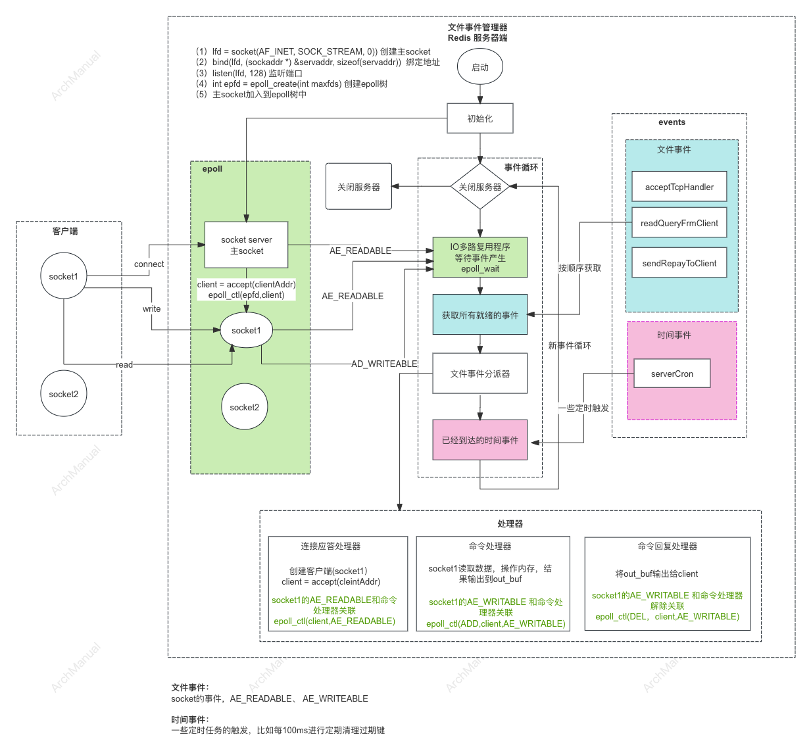

# Redis IO模型
Redis IO模型 使用的是基于 Reactor 模式的 I/O 多路复用模型。这个模型通过单线程事件循环来处理所有的客户端请求和响应。


## 基本模式

### 1. Reactor 模式

Reactor 模式是一种用于处理并发 I/O 操作的设计模式。它包含以下几个组件：
- **多路复用器（Multiplexer）**：负责监听多个 I/O 事件，如读、写、连接等。
- **事件处理器（Event Handler）**：处理特定事件的回调函数。

### 2. Redis 的 I/O 多路复用

Redis 使用操作系统提供的 I/O 多路复用机制，如 `select`、`poll`、`epoll` 或 `kqueue`。这些机制可以在单个线程中监视多个文件描述符，以便在任何一个描述符准备好进行 I/O 操作时通知应用程序。

#### 主要步骤：

1. **事件循环初始化**：创建和初始化事件循环及相应的多路复用器。
2. **事件注册**：将客户端套接字上的读写事件注册到多路复用器。
3. **事件等待**：调用多路复用器的方法，如 `select` 或 `epoll_wait`，等待事件发生。
4. **事件分发**：当事件发生时，多路复用器会返回就绪的文件描述符列表。
5. **事件处理**：根据事件类型调用相应的事件处理器（读事件、写事件等）。
6. **响应客户端**：将处理结果返回给客户端。

## 基本原理
Redis 的 I/O 模型实现原理，需要深入了解其事件驱动框架和多路复用机制。



### 1. 事件驱动框架

Redis 的事件驱动框架主要由以下几个组件组成：

- **事件循环（Event Loop）**：这是事件驱动模型的核心，负责管理所有的 I/O 事件。
- **事件类型（Event Types）**：Redis 主要处理两种事件：文件事件（File Events）和时间事件（Time Events）。
- **事件处理器（Event Handlers）**：每个事件类型都有相应的事件处理器。

Redis 使用 `aeEventLoop` 结构体来管理事件循环，包含了文件事件和时间事件的注册、取消、处理等功能。

### 2. I/O 多路复用

Redis 使用操作系统提供的 I/O 多路复用机制，如 `select`、`poll`、`epoll`（Linux）或 `kqueue`（BSD系统），这些系统调用允许一个线程同时监视多个文件描述符。

#### 多路复用器（Multiplexer）

在 Redis 中，多路复用器通过 `aeApi` 结构体进行抽象，并根据操作系统的不同实现选择不同的多路复用策略：

- **ae_select.c**：基于 `select` 系统调用。
- **ae_epoll.c**：基于 `epoll` 系统调用。
- **ae_kqueue.c**：基于 `kqueue` 系统调用。

### 3. Redis 的事件处理流程

Redis 的事件处理流程大致如下：

#### 事件循环初始化

```c
aeEventLoop *aeCreateEventLoop(int setsize) {
    aeEventLoop *eventLoop = zmalloc(sizeof(*eventLoop));

    // 初始化事件循环
    eventLoop->events = zmalloc(sizeof(aeFileEvent)*setsize);
    eventLoop->fired = zmalloc(sizeof(aeFiredEvent)*setsize);
    eventLoop->setsize = setsize;
    eventLoop->timeEventHead = NULL;
    eventLoop->timeEventNextId = 0;
    eventLoop->stop = 0;

    // 初始化多路复用API
    if (aeApiCreate(eventLoop) == -1) {
        zfree(eventLoop->events);
        zfree(eventLoop->fired);
        zfree(eventLoop);
        return NULL;
    }

    return eventLoop;
}
```

#### 事件注册

```c
int aeCreateFileEvent(aeEventLoop *eventLoop, int fd, int mask,
                      aeFileProc *proc, void *clientData) {
    if (fd >= eventLoop->setsize) return AE_ERR;

    aeFileEvent *fe = &eventLoop->events[fd];
    if (aeApiAddEvent(eventLoop, fd, mask) == -1)
        return AE_ERR;

    fe->mask |= mask;
    if (mask & AE_READABLE) fe->rfileProc = proc;
    if (mask & AE_WRITABLE) fe->wfileProc = proc;
    fe->clientData = clientData;

    return AE_OK;
}
```

#### 事件等待

```c
int aeApiPoll(aeEventLoop *eventLoop, struct timeval *tvp) {
    int retval, numevents = 0;

    retval = epoll_wait(eventLoop->apidata->epfd, eventLoop->apidata->events,
                        eventLoop->setsize, 
                        tvp ? (tvp->tv_sec*1000 + tvp->tv_usec/1000) : -1);

    if (retval > 0) {
        int j;

        numevents = retval;
        for (j = 0; j < numevents; j++) {
            int mask = 0;
            struct epoll_event *e = eventLoop->apidata->events+j;

            if (e->events & EPOLLIN) mask |= AE_READABLE;
            if (e->events & EPOLLOUT) mask |= AE_WRITABLE;
            if (e->events & EPOLLERR) mask |= AE_WRITABLE;
            if (e->events & EPOLLHUP) mask |= AE_WRITABLE;

            eventLoop->fired[j].fd = e->data.fd;
            eventLoop->fired[j].mask = mask;
        }
    }

    return numevents;
}
```

#### 事件处理

```c
void aeProcessEvents(aeEventLoop *eventLoop, int flags) {
    int processed = 0, numevents;

    if (!(flags & AE_TIME_EVENTS) && !(flags & AE_FILE_EVENTS)) return;

    if (eventLoop->maxfd != -1) {
        numevents = aeApiPoll(eventLoop, tvp);
        for (j = 0; j < numevents; j++) {
            aeFileEvent *fe = &eventLoop->events[eventLoop->fired[j].fd];
            int mask = eventLoop->fired[j].mask;
            int fd = eventLoop->fired[j].fd;
            int rfired = 0;

            if (fe->mask & mask & AE_READABLE) {
                rfired = 1;
                fe->rfileProc(eventLoop,fd,fe->clientData,mask);
            }
            if (fe->mask & mask & AE_WRITABLE) {
                if (!rfired || fe->wfileProc != fe->rfileProc)
                    fe->wfileProc(eventLoop,fd,fe->clientData,mask);
            }
            processed++;
        }
    }

    if (flags & AE_TIME_EVENTS)
        processed += processTimeEvents(eventLoop);

    return processed;
}
```

## 单线程的优势

- **避免锁竞争**：由于 Redis 运行在单线程中，所有操作都是原子的，不需要加锁机制来保护共享资源，简化了实现。
- **CPU 缓存友好**：在单线程中，数据访问模式更加线性，减少了 CPU 缓存失效，提高了缓存命中率。
- **性能**：由于 Redis 的大部分操作是内存操作，并且操作系统的多路复用机制非常高效，单线程模型能够提供足够高的性能。
- **原子性**：单线程模型确保每个命令是原子执行的，不会出现数据竞争问题。

