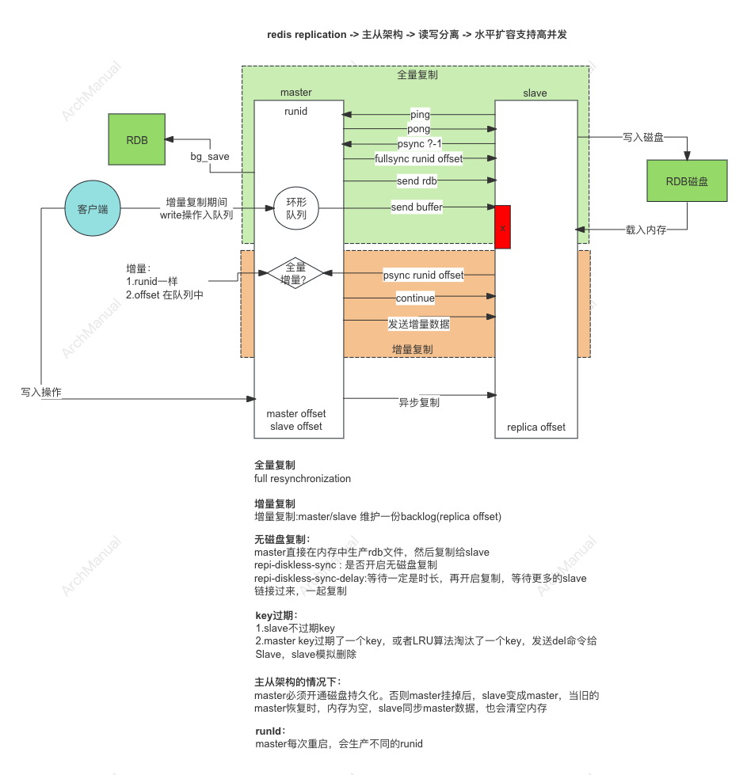

# Redis 主从复制
Redis 的主从复制（Replication）是其高可用性和扩展性的重要特性之一。它允许你在多个Redis服务器之间同步数据，从而提高数据的可用性和读取性能。

## 基本概念

- **主节点（Master）**：处理写操作和大多数读操作，数据的主要存储位置。
- **从节点（Slave）**：复制主节点的数据，通常用于负载均衡，分担读操作的压力。

## 工作原理

Redis 主从复制的原理和步骤：



### 1. 配置主从节点

#### 主节点配置
主节点的配置通常不需要特别设置，只需保证正常运行。一般的 Redis 配置文件（redis.conf）中，不需要额外设置。

#### 从节点配置
从节点需要配置为从主节点进行复制，可以在配置文件中设置：

```plaintext
replicaof <masterip> <masterport>
```

例如，如果主节点的 IP 地址是 192.168.1.100，端口是 6379，那么在从节点的配置文件中可以设置：

```plaintext
replicaof 192.168.1.100 6379
```

你也可以在运行时使用命令行设置从节点：

```plaintext
redis-cli SLAVEOF 192.168.1.100 6379
```

### 2. 启动主从节点

启动主节点和从节点。启动后，从节点会自动连接到主节点并开始复制数据。

### 3. 初始同步过程

当从节点第一次连接到主节点时，会发生以下过程：

#### a. 发送 `PSYNC` 命令
从节点向主节点发送 `PSYNC` 命令。根据主节点和从节点的情况，主节点会决定是进行部分同步还是完整同步。

#### b. 完整同步（Full Synchronization）
如果是第一次连接或从节点的数据与主节点不一致，则进行完整同步。

- **生成 RDB 快照**：主节点创建一个 RDB 快照文件，该文件包含了当前数据库的所有数据。
- **发送 RDB 文件**：主节点将 RDB 文件发送给从节点，从节点接收并加载该文件。
- **同步增量数据**：在 RDB 文件传输过程中，主节点会将所有新的写操作命令存储在一个复制缓冲区中。在 RDB 文件传输完成后，主节点会将复制缓冲区中的命令发送给从节点，从节点应用这些命令。

### 4. 持续同步过程

在初始同步完成后，主从节点会进入持续同步状态：

- **命令传播**：主节点的每个写操作命令都会发送给所有的从节点，从节点接收并应用这些命令，以确保数据一致。
- **复制心跳**：主节点和从节点之间会定期发送心跳消息，以维持连接状态，并检测彼此是否在线。

### 5. 断线重连过程

如果主从节点之间的连接中断，当连接恢复时，从节点会尝试重新同步数据：

#### a. 部分重新同步（Partial Resynchronization）
如果从节点之前的复制偏移量（Replication Offset）仍然在主节点的复制缓冲区中，则可以进行部分重新同步，只需要同步断线期间的数据。

- **发送 `PSYNC` 命令**：从节点发送带有之前复制偏移量的 `PSYNC` 命令。
- **同步增量数据**：主节点根据偏移量发送增量数据，从节点应用这些数据。

#### b. 完整重新同步
如果从节点的数据过旧或主节点的复制缓冲区已被覆盖，则进行完整重新同步，过程与初始同步类似。

### 6. 故障转移

Redis Sentinel 可以用来监控主从架构，并在主节点发生故障时，自动进行故障转移：

- **监控主节点**：Sentinel 实例会定期检查主节点和从节点的健康状态。
- **主节点故障检测**：如果 Sentinel 检测到主节点不可用，会进行多次确认以避免误判。
- **选举新主节点**：在确认主节点故障后，Sentinel 会选举一个从节点作为新的主节点。
- **通知客户端**：Sentinel 会将新主节点的信息通知给所有相关的 Redis 客户端。

通过以上详细的步骤和原理说明，你可以更好地理解和配置 Redis 的主从复制，以实现高可用和负载均衡。

## 优势

- **高可用性**：主节点故障时，从节点可以接管，提高系统的可用性。
- **负载均衡**：从节点分担读操作的负载，提高系统的整体性能。
- **数据备份**：从节点的数据副本可以用于数据恢复，增强数据安全性。

## 主从架构下Key的过期

在 Redis 主从复制架构中，键的过期（expiration）处理需要考虑到主节点和从节点之间的一致性。

### 过期键的处理

#### 1. 过期时间的设置
当在主节点上设置键的过期时间时，主节点会将该过期时间通过复制命令传递给从节点。这意味着从节点会接收到相同的过期时间设置。

```plaintext
Master:
SET mykey "value"
EXPIRE mykey 60  # 设置 mykey 在 60 秒后过期

Replication:
Master -> Slave: SET mykey "value"
Master -> Slave: EXPIRE mykey 60
```

#### 2. 主节点处理键过期
主节点有两种方式处理键过期：
- **惰性删除**：当客户端尝试访问某个键时，Redis 检查该键是否已经过期。如果过期，则删除该键并返回空。
- **主动删除**：Redis 会定期扫描设置了过期时间的键，并删除已过期的键。

#### 3. 从节点处理键过期
从节点不会独立处理键的过期，而是依赖主节点的过期处理机制。具体来说：
- 从节点不会主动删除键，即使它检测到某个键已经过期。
- 当主节点删除一个过期键时，会向从节点发送相应的删除命令。

```plaintext
Master:
mykey expired -> DEL mykey

Replication:
Master -> Slave: DEL mykey
```

这种机制确保了主从节点之间的数据一致性。

### 过期处理示例

假设有一个主节点和一个从节点，以下是处理过期键的具体步骤：

1. **设置过期时间**
   在主节点上设置键的过期时间：

   ```plaintext
   Master: SET mykey "value"
   Master: EXPIRE mykey 60
   ```

   这会通过复制命令传递到从节点：

   ```plaintext
   Master -> Slave: SET mykey "value"
   Master -> Slave: EXPIRE mykey 60
   ```

2. **键过期处理**
    - **惰性删除**：如果在 60 秒后，某个客户端访问 `mykey`：

      ```plaintext
      Client: GET mykey
      ```

      主节点检查 `mykey` 已经过期：

      ```plaintext
      Master: DEL mykey
      Master -> Slave: DEL mykey
      ```

    - **主动删除**：即使没有客户端访问，Redis 的定期扫描机制也会在后台删除过期键：

      ```plaintext
      Master: 定期扫描 -> DEL mykey
      Master -> Slave: DEL mykey
      ```

### 优化过期键处理

#### 配置参数
可以通过配置文件中的参数优化过期键的处理：

- **`hz`**：定义了 Redis 主动处理过期键的频率。默认值是 10，表示每秒钟处理 10 次。

  ```plaintext
  hz 10
  ```

- **`active-expire-effort`**：控制主动过期键删除的力度，值为 1-10，值越大表示 Redis 会花费更多时间主动删除过期键。

  ```plaintext
  active-expire-effort 1
  ```
  
## 主从架构下，主节点不开启磁盘持久化，会有什么问题？
在 Redis 主从架构下，如果主节点不开启磁盘持久化（RDB 或 AOF），会有以下问题：

### 1. 数据丢失风险

如果主节点的持久化未开启，当主节点崩溃或重启时，内存中的所有数据将会丢失。这意味着任何未同步到从节点的数据都将永久丢失。

### 2. 主节点重启后的数据恢复问题

当主节点没有持久化机制时，它重启后将无法从磁盘恢复数据。这样会导致主节点重启后是一个空数据库，需要重新从从节点进行全量同步。这不仅增加了主节点的启动时间，还会增加网络和系统的负载。

### 3. 从节点的数据一致性问题

在主节点持久化关闭的情况下，如果主节点发生崩溃并丢失数据，重启后通过从节点进行数据恢复时，可能会出现以下问题：
- **数据丢失**：从节点的最新数据在主节点崩溃前没有同步完成，导致主节点恢复后数据不完整。
- **数据不一致**：如果多个从节点的数据状态不同（由于不同步状态或延迟），主节点恢复时可能会引入不一致的数据。

### 4. 故障转移后的数据可靠性问题

在使用 Redis Sentinel 进行故障转移时，如果主节点没有持久化，主节点崩溃后从节点被提升为新的主节点，旧主节点的数据将无法恢复。这可能导致故障转移后的新主节点数据不完整或不一致。

### 实际场景分析

以下是几种常见场景的分析：

#### 场景 1：主节点崩溃，无磁盘持久化

假设主节点崩溃且没有持久化，重启后主节点为空数据。

```plaintext
主节点 -> 崩溃 -> 重启 -> 空数据
```

从节点需要重新同步整个数据集，这不仅增加了恢复时间，还可能导致数据不一致：

```plaintext
从节点 -> 全量同步 -> 主节点
```

#### 场景 2：故障转移，无磁盘持久化

在 Redis Sentinel 监控下，主节点崩溃，Sentinel 将某个从节点提升为新主节点：

```plaintext
主节点 -> 崩溃
Sentinel -> 提升从节点为新主节点
```

旧主节点重启后，数据无法恢复，只能作为新的从节点重新同步数据：

```plaintext
旧主节点 -> 重启 -> 空数据 -> 从新主节点同步
```

#### 场景 3：常规操作，无磁盘持久化

在日常操作中，任何主节点的重启都需要从从节点进行全量同步：

```plaintext
主节点 -> 重启 -> 空数据 -> 从节点全量同步
```

这会增加操作的复杂性和系统负载。

### 解决方案和建议

为了避免上述问题，建议在 Redis 主从架构中，至少开启以下配置：

#### 主节点配置

即使从性能角度考虑关闭持久化，在大多数情况下，还是建议开启至少一种持久化方式（RDB 或 AOF），以确保数据的可靠性。

```plaintext
# RDB 配置
save 900 1
save 300 10
save 60 10000
dbfilename dump.rdb

# AOF 配置
appendonly yes
appendfilename "appendonly.aof"
appendfsync everysec
```

#### 从节点配置

从节点的持久化配置可以与主节点一致，确保即使在故障转移后，新主节点的数据也能持久化。

```plaintext
# RDB 配置
save 900 1
save 300 10
save 60 10000
dbfilename dump.rdb

# AOF 配置
appendonly yes
appendfilename "appendonly.aof"
appendfsync everysec

# 复制配置
replicaof <masterip> <masterport>
```