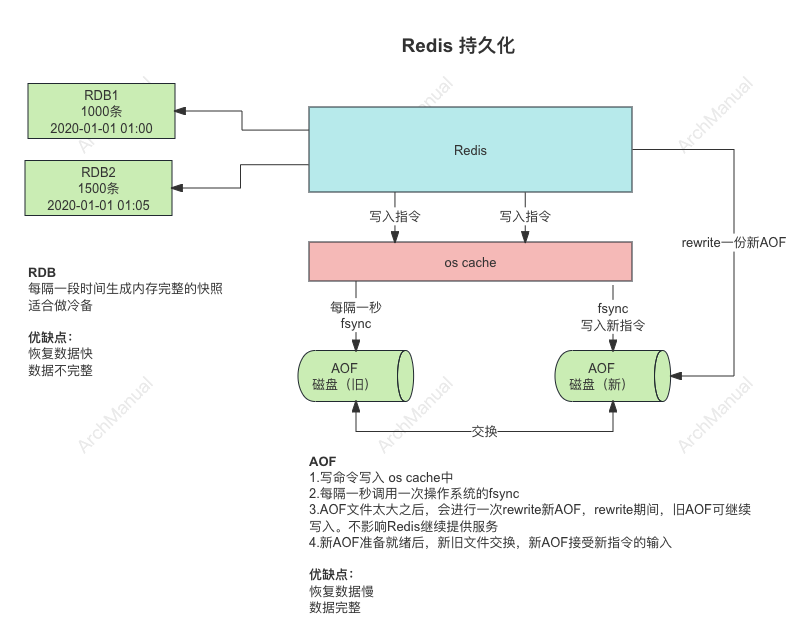

# Redis

Redis 提供了两种主要的持久化机制：快照（Snapshotting）和追加文件（Append-Only File，AOF），以及这两者相结合的混合持久化。

## 持久化的好处

Redis 的持久化机制带来了许多好处，主要体现在数据安全性、系统恢复能力、数据分析和审计、操作灵活性等方面。
### 1. 数据安全性

- **防止数据丢失**：通过将数据定期保存到磁盘上，持久化机制可以确保在系统崩溃、断电或其他意外情况发生时，内存中的数据不会全部丢失。
- **高数据一致性**：通过适当的持久化策略，尤其是结合使用 RDB 和 AOF，可以在数据安全性和一致性之间取得平衡，减少数据丢失的风险。

### 2. 系统恢复能力

- **快速恢复**：持久化文件可以帮助系统在故障后快速恢复数据，从而尽快恢复服务，减少停机时间。
- **灾难恢复**：在发生严重系统故障或灾难时，通过定期备份的持久化文件，可以恢复到最近的可用状态，确保业务的连续性。

### 3. 数据分析和审计

- **历史数据分析**：AOF 文件记录了所有的写操作日志，可以用于回溯和分析系统操作历史，有助于数据分析和业务洞察。
- **操作审计**：通过审查持久化文件中的操作记录，可以进行系统操作的审计，检测和追踪潜在的问题和异常操作。

### 4. 操作灵活性

- **多种策略选择**：Redis 提供了 RDB 和 AOF 两种持久化机制，可以根据具体需求选择合适的持久化策略，或者结合使用以获得最佳效果。
- **配置灵活**：持久化机制可以根据业务需求进行灵活配置，平衡系统性能和数据安全性。例如，可以通过设置 `appendfsync` 参数调整 AOF 的同步频率。

### 5. 备份和数据迁移

- **定期备份**：通过定期生成的 RDB 文件，可以方便地进行数据备份，防止数据丢失。
- **数据迁移**：持久化文件可以用于将数据迁移到其他服务器或数据中心，简化数据迁移过程，确保数据一致性和完整性。

### 6. 运维和管理

- **简化运维**：持久化文件可以自动管理数据的备份和恢复，减少运维人员的手动操作和维护成本。
- **容灾恢复**：在灾难恢复场景中，持久化文件是恢复数据的基础，确保业务的高可用性。

### 7. 提高系统稳定性

- **防止缓存雪崩**：通过持久化机制，Redis 可以在故障发生后快速恢复数据，避免缓存失效导致的数据库压力激增（即缓存雪崩），确保系统的稳定运行。

## 不做持久化可能带来的风险

如果 Redis 没有做持久化，可能会带来一系列严重的问题，特别是在高可用性和数据安全性方面。

### 1. 数据丢失

**问题**：
当 Redis 实例发生崩溃、服务器重启或其他意外断电等情况时，所有存储在内存中的数据都会丢失。

**原因**：
Redis 是一个内存数据库，所有数据存储在内存中。如果没有持久化机制将数据保存到磁盘，那么在内存丢失的情况下，数据无法恢复。

### 2. 雪崩效应

**问题**：
在一个高并发的系统中，如果 Redis 崩溃且没有持久化数据，会导致大量的缓存失效，请求直接打到数据库或下游系统，可能导致这些系统无法承受瞬间激增的请求量，导致整个系统崩溃。

**原因**：
Redis 常用于缓存层，承担了大量读写请求。如果缓存失效，请求会回流到后端数据库或其他服务，造成这些服务压力骤增。

### 3. 数据不一致性

**问题**：
如果 Redis 作为数据库使用而没有持久化机制，在发生故障后重启会导致数据不一致。例如，用户的交易记录等重要数据可能无法恢复，导致业务逻辑出错。

**原因**：
缺乏持久化的数据在内存中丢失后，无法恢复到故障前的状态，造成业务逻辑上的数据不一致。

### 4. 难以恢复和诊断问题

**问题**：
没有持久化文件（RDB 或 AOF），在 Redis 崩溃后无法重放历史操作记录来恢复数据，增加了问题诊断和系统恢复的难度。

**原因**：
持久化文件可以记录历史操作，有助于恢复数据和分析问题。缺乏这些文件，恢复和分析工作难以进行。

### 5. 运维成本增加

**问题**：
在没有持久化机制的情况下，任何形式的重启或维护操作都需要手动处理数据恢复，增加了运维的复杂性和成本。

**原因**：
运维人员需要手动处理数据的备份和恢复，增加了维护系统的复杂性和时间成本。


## 持久化的方式



### 1 Redis 快照

Redis 快照（Snapshotting）的原理主要涉及以下几个步骤：

#### 快照原理

1. **触发条件**：
   快照可以通过配置文件中的 `save` 命令进行定时触发，也可以通过手动执行 `BGSAVE` 或 `SAVE` 命令来触发。`BGSAVE` 会在后台异步生成快照，而 `SAVE` 会在前台同步生成快照。

2. **创建子进程**：
   当触发快照时，Redis 会通过 `fork` 创建一个子进程。这个子进程是原 Redis 进程的副本，拥有相同的内存数据。

3. **写入快照文件**：
   子进程创建后，父进程（主 Redis 进程）继续处理客户端请求，而子进程将当前的内存数据写入到一个临时文件中。这个临时文件的格式是 RDB 文件格式，包含了 Redis 数据集的序列化数据。

4. **数据持久化**：
   子进程完成数据写入后，会将临时文件重命名为实际的 RDB 文件。重命名操作是原子性的，确保不会出现部分写入的情况。

5. **清理子进程**：
   完成快照操作后，子进程会退出。父进程会通过等待子进程的结束信号来确认快照操作的完成。如果在快照过程中出现错误，Redis 会进行相应的错误处理。

#### 快照过程中的细节

- **内存使用**：在 `fork` 创建子进程的过程中，Redis 采用写时复制（Copy-On-Write）机制。父进程和子进程共享相同的内存页，只有当父进程需要修改某个内存页时，才会复制该页。这种机制可以最大限度地减少内存开销。

- **性能影响**：在 `fork` 子进程的过程中，Redis 的性能可能会受到一定影响，尤其是在内存占用较大的情况下。创建子进程和写入 RDB 文件的过程都会消耗系统资源。

#### 快照的优缺点

**优点：**
- **恢复速度快**：RDB 文件包含完整的数据集，加载速度较快，适合大规模数据的恢复。
- **占用空间小**：相比 AOF 文件，RDB 文件通常更小，适合用于备份。

**缺点：**
- **数据丢失风险**：由于快照是周期性的，如果 Redis 崩溃，可能会丢失最近一次快照后的所有数据。
- **性能开销**：快照过程中的 `fork` 操作和数据写入可能会影响 Redis 的性能，尤其是在高并发场景下。

#### 示例配置

以下是一个典型的 Redis 快照配置：
```plaintext
save 900 1
save 300 10
save 60 10000
```
该配置表示：
- 每 900 秒内至少有 1 个 key 发生变化时进行一次快照。
- 每 300 秒内至少有 10 个 key 发生变化时进行一次快照。
- 每 60 秒内至少有 10000 个 key 发生变化时进行一次快照。

### 2 追加文件（AOF）

Redis 的追加文件（Append-Only File，AOF）持久化机制通过记录每一个写操作来实现数据持久化。

#### AOF 原理

1. **记录命令**：
   每当 Redis 执行一条写命令（如 `SET`、`DEL` 等）时，这条命令会被追加到 AOF 文件中。命令以 Redis 协议格式保存，可以被 Redis 解析和执行。

2. **同步策略**：
   AOF 文件的写入可以通过不同的同步策略进行控制：
    - `appendfsync always`：每次有新命令追加到 AOF 文件时，都会立即调用 `fsync` 将数据同步到磁盘。这种方式提供了最强的数据安全性，但性能较差。
    - `appendfsync everysec`：每秒调用一次 `fsync` 将数据同步到磁盘。折衷了性能和数据安全性，大多数情况下使用这种方式。
    - `appendfsync no`：不主动调用 `fsync`，而是依赖操作系统决定何时将数据同步到磁盘。这种方式性能最好，但数据安全性最差。

3. **重写机制**：
   随着时间的推移，AOF 文件会越来越大。为了避免文件过大影响性能，Redis 提供了 AOF 重写机制（Rewrite）。重写过程中，Redis 会创建一个新的 AOF 文件，该文件包含数据集的当前状态，而不是每一条写命令。重写过程如下：
    - Redis 创建一个子进程来执行 AOF 重写。
    - 子进程会读取当前内存中的数据，并生成一个新的 AOF 文件。
    - 在重写过程中，父进程继续处理客户端请求，并将新的写操作同时记录到旧的 AOF 文件和一个缓冲区中。
    - 子进程完成新的 AOF 文件写入后，会将缓冲区中的新命令追加到新文件中，确保数据的一致性。
    - 最后，Redis 将新的 AOF 文件替换旧的 AOF 文件。

4. **数据恢复**：
   当 Redis 启动时，会读取 AOF 文件，并按照文件中的命令顺序重放这些命令，以恢复数据集的状态。

#### 优缺点

**优点：**
- **高数据安全性**：通过适当的同步策略，AOF 可以保证在极少数据丢失的情况下进行持久化。
- **灵活性**：可以通过不同的同步策略平衡性能和数据安全性。

**缺点：**
- **文件较大**：AOF 文件通常比 RDB 文件大，重放命令时间较长。
- **性能开销**：频繁的磁盘写操作会对性能产生影响，尤其是在同步策略为 `always` 时。

#### 配置示例

以下是一个典型的 AOF 配置示例：
```plaintext
appendonly yes
appendfilename "appendonly.aof"
appendfsync everysec
```
该配置表示：
- 启用 AOF 持久化机制。
- AOF 文件名为 `appendonly.aof`。
- 每秒进行一次同步操作。

#### 典型的 AOF 使用场景

AOF 适用于需要高数据安全性且可以容忍较大文件的场景，例如：
- 需要实时保存写操作的系统。
- 需要在发生故障时尽可能减少数据丢失的系统。


### 3 混合持久化
混合持久化（Hybrid Persistence）是 Redis 6.0 引入的一种持久化机制，它结合了 RDB 和 AOF 的优点。

通过这种机制，Redis 可以利用 RDB 的快速加载速度和 AOF 的高数据安全性，实现高效且可靠的持久化。

#### 混合持久化的工作原理

混合持久化机制通过以下方式工作：

1. **创建快照**：在执行 AOF 重写时，Redis 首先会创建一个 RDB 快照文件。这一步类似于传统的 RDB 持久化。

2. **记录增量数据**：在生成 RDB 快照的同时，Redis 会将新的写操作记录到一个增量 AOF 文件中。这确保了在快照生成后发生的所有写操作都被记录下来。

3. **合并文件**：最后，Redis 将 RDB 快照和增量 AOF 文件合并为一个混合持久化文件。这种文件格式首先包含一个 RDB 快照部分，紧接着是一个 AOF 部分。

4. **恢复数据**：在恢复数据时，Redis 会先加载 RDB 部分，然后应用 AOF 部分的增量数据，从而恢复到最新的状态。

#### 配置混合持久化

在 Redis 中启用混合持久化非常简单，只需要在配置文件中设置 `aof-use-rdb-preamble` 参数即可。

以下是一个典型的 Redis 配置示例，启用了混合持久化：

```plaintext
# RDB 配置
save 900 1
save 300 10
save 60 10000
rdbcompression yes
dbfilename dump.rdb
dir /var/lib/redis

# AOF 配置
appendonly yes
appendfilename "appendonly.aof"
appendfsync everysec
auto-aof-rewrite-percentage 100
auto-aof-rewrite-min-size 64mb
aof-use-rdb-preamble yes
```

#### 配置说明

- **RDB 配置**：与传统的 RDB 配置相同，设置保存快照的条件、压缩、文件名和存储路径等。
- **AOF 配置**：
    - `appendonly yes`：启用 AOF 持久化。
    - `appendfilename "appendonly.aof"`：指定 AOF 文件的名称。
    - `appendfsync everysec`：设置 AOF 同步策略为每秒同步一次。
    - `auto-aof-rewrite-percentage 100` 和 `auto-aof-rewrite-min-size 64mb`：配置 AOF 重写策略。
    - `aof-use-rdb-preamble yes`：启用混合持久化。

#### 混合持久化的优点

1. **快速恢复**：由于混合持久化文件的前半部分是 RDB 格式，加载速度快，适合大数据集的快速恢复。
2. **高数据安全性**：增量 AOF 部分记录了 RDB 快照后发生的所有写操作，确保数据的完整性和安全性。
3. **存储效率**：相比纯 AOF 文件，混合持久化文件的大小更小，因为 RDB 部分的序列化效率更高。
