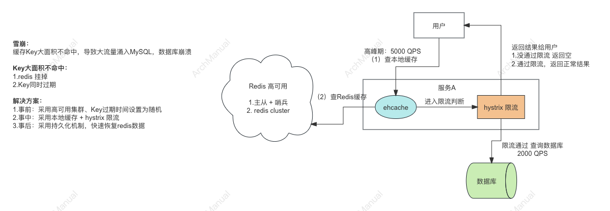
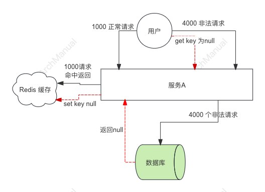

# Redis 使用中常见问题

在使用Redis过程中，可能会遇到各种问题。以下是一些常见问题及其解决方案：

## 一、 缓存雪崩（Cache Avalanche）

**问题描述：**
Redis 雪崩（Redis Cache Avalanche）是指当缓存中大量的缓存失效或者突然不可用时，大量请求直接打到后端数据库，导致数据库压力剧增，甚至可能崩溃的现象。

这个问题主要出现在高并发系统中，当大量缓存数据在同一时间过期或者缓存服务器宕机时尤为严重。

**Redis 雪崩的常见原因：**

- 缓存集中过期：如果大量缓存数据设置了相同或接近的过期时间，当这些缓存同时过期时，大量请求会同时打到后端数据库。
- 缓存服务器宕机：当缓存服务器宕机或不可用时，所有请求都会直接打到后端数据库。
- 热点数据失效：热门数据在缓存中失效，会导致大量请求直接打到数据库，数据库压力骤增。

**解决方案：**

为了防止Redis缓存雪崩（Cache Avalanche）问题，可以设计一套多层次的防护方案架构。

以下是一个综合性的方案架构，涵盖了多种技术和策略来应对可能的雪崩情况：


### 1. 缓存层设计

#### 1.1 随机化过期时间
设置缓存数据的过期时间时，加入一定的随机性，避免大量缓存数据在同一时间过期。

**示例代码：**
```python
import random
import redis

cache_expire_time = 3600  # 基础过期时间，单位为秒
random_expire_time = random.randint(0, 600)  # 随机增加0到600秒的时间
total_expire_time = cache_expire_time + random_expire_time

redis_client.setex(key, total_expire_time, value)
```

#### 1.2 热点数据永不过期
对一些非常热点的数据，设置永不过期，并在后台定时刷新这些数据。

**示例代码：**
```python
while True:
    # 获取热点数据
    value = fetch_hot_data_from_db()
    redis_client.set(key, value)  # 设置不过期的缓存
    time.sleep(refresh_interval)  # 定时刷新
```

#### 1.3 多级缓存
在应用层和分布式缓存之间增加本地缓存层，进一步减少对后端数据库的直接访问。

**示例架构：**
```
[用户请求] -> [本地缓存] -> [分布式缓存（Redis）] -> [后端数据库]
```

### 2. 请求层设计

#### 2.1 互斥锁（Mutex）
在缓存失效时，通过加锁机制来控制只有一个线程去加载数据和更新缓存，其他线程等待锁释放后再访问缓存。

**示例代码：**
```python
import threading

lock = threading.Lock()

def get_data(key):
    value = redis_client.get(key)
    if value is None:
        with lock:
            # 再次检查缓存，防止多个线程进入
            value = redis_client.get(key)
            if value is None:
                # 加载数据并更新缓存
                value = fetch_data_from_db()
                redis_client.setex(key, expire_time, value)
    return value
```

#### 2.2 请求合并
在缓存失效的瞬间，将多个对同一数据的请求合并为一个请求，减少对数据库的访问次数。

**示例代码：**
```python
pending_requests = {}

def get_data(key):
    if key in pending_requests:
        return pending_requests[key].result()
    else:
        future = concurrent.futures.Future()
        pending_requests[key] = future
        try:
            value = redis_client.get(key)
            if value is None:
                value = fetch_data_from_db()
                redis_client.setex(key, expire_time, value)
            future.set_result(value)
        finally:
            del pending_requests[key]
        return future.result()
```

### 3. 数据层设计

#### 3.1 数据预热
在系统启动或定期运行时，将一部分常用或重要的数据预先加载到缓存中，避免首次请求未命中缓存。

**示例代码：**
```python
def cache_warming():
    hot_keys = get_hot_keys_from_db()
    for key in hot_keys:
        value = fetch_data_from_db(key)
        redis_client.setex(key, expire_time, value)

# 在系统启动时或定期调用
cache_warming()
```

#### 3.2 限流降级
在缓存失效的情况下，使用限流机制保护数据库，或者降级处理，返回默认值或提示用户稍后重试。

**示例代码：**
```python
def get_data_with_rate_limit(key):
    if is_rate_limited():
        return get_default_value()
    try:
        value = redis_client.get(key)
        if value is None:
            value = fetch_data_from_db()
            redis_client.setex(key, expire_time, value)
        return value
    except Exception:
        return get_default_value()
```

### 4. 运维监控

#### 4.1 监控和报警
对缓存命中率、数据库访问量等关键指标进行监控，并设置报警阈值，及时发现和处理潜在问题。

**示例架构：**
- 使用Prometheus、Grafana等工具监控缓存和数据库的指标。
- 设置报警规则，当缓存命中率低于一定值或数据库访问量超出预期时，触发报警。


## 二、 缓存击穿（Cache Breakdown）

**问题描述：**
缓存中的热点数据在失效的瞬间，有大量请求并发地访问该数据，直接打到后端数据库，造成数据库压力骤增。

**解决方案：**

- **热点数据永不过期**：对某些热点数据设置永不过期，或者在接近过期时自动刷新缓存。同时启动一个更新程序，对缓存数据定期更新。
- **随机化过期时间**：或者设计过期时间随机，不要在同一时间大量苏轩。


## 三、 缓存穿透（Cache Penetration）

**问题描述：**
查询的数据既不在缓存中，也不在数据库中，每次请求都会直接访问数据库，给数据库带来很大压力。

**解决方案：**

为了防止Redis缓存穿透（Cache Penetration）问题，可以设计一个全面的解决方案架构。以下是一个详细的方案架构，涵盖了多种技术和策略来应对缓存穿透问题：


### 1. 缓存层设计

#### 1.1 缓存空值
对于查询数据库后确认不存在的数据，将空结果（如null或特定的占位符）缓存起来，设置一个短暂的过期时间，以避免频繁查询同一个不存在的数据。

**示例代码：**
```python
def get_data(key):
    value = redis_client.get(key)
    if value is None:
        value = fetch_data_from_db(key)
        if value is None:
            redis_client.setex(key, 60, "NULL")  # 缓存空值1分钟
        else:
            redis_client.setex(key, 3600, value)  # 正常数据缓存1小时
    elif value == "NULL":
        return None
    return value
```

#### 1.2 布隆过滤器
在缓存层前增加布隆过滤器，用于快速判断一个数据是否存在，从而拦截对不存在数据的查询请求。

**示例架构：**
```python
from pybloom_live import BloomFilter

# 初始化布隆过滤器
bloom = BloomFilter(capacity=100000, error_rate=0.001)

# 在数据写入数据库时更新布隆过滤器
def add_to_bloom_filter(key):
    bloom.add(key)

# 查询时使用布隆过滤器
def get_data(key):
    if key not in bloom:
        return None
    value = redis_client.get(key)
    if value is None:
        value = fetch_data_from_db(key)
        if value is None:
            redis_client.setex(key, 60, "NULL")
        else:
            redis_client.setex(key, 3600, value)
    elif value == "NULL":
        return None
    return value
```

### 2. 请求层设计

#### 2.1 参数校验
对请求的参数进行合理性校验，防止恶意请求进入系统。

**示例代码：**
```python
def validate_request_params(params):
    if not params.get('key'):
        raise ValueError("Invalid parameters")
    # 其他参数校验逻辑
    return True

def get_data(params):
    if validate_request_params(params):
        key = params['key']
        return fetch_data(key)
    return None
```

#### 2.2 限流策略
对请求进行限流，防止短时间内大量恶意请求对系统造成冲击。

**示例代码：**
```python
from ratelimit import limits, sleep_and_retry

@sleep_and_retry
@limits(calls=100, period=60)
def fetch_data(key):
    # 数据获取逻辑
    return get_data_from_cache_or_db(key)

def get_data(key):
    try:
        return fetch_data(key)
    except Exception as e:
        return get_default_value()
```

### 3. 数据层设计

#### 3.1 数据预热
在系统启动或定期运行时，将一部分常用或重要的数据预先加载到缓存中，避免首次请求未命中缓存。

**示例代码：**
```python
def cache_warming():
    hot_keys = get_hot_keys_from_db()
    for key in hot_keys:
        value = fetch_data_from_db(key)
        if value is not None:
            redis_client.setex(key, 3600, value)

# 在系统启动时或定期调用
cache_warming()
```

#### 3.2 数据库负载保护
在缓存未命中的情况下，增加数据库访问的保护机制，防止数据库被瞬时大量请求压垮。

**示例代码：**
```python
import threading

lock = threading.Lock()

def get_data(key):
    value = redis_client.get(key)
    if value is None:
        with lock:
            # 再次检查缓存，防止多个线程进入
            value = redis_client.get(key)
            if value is None:
                value = fetch_data_from_db(key)
                if value is None:
                    redis_client.setex(key, 60, "NULL")
                else:
                    redis_client.setex(key, 3600, value)
    elif value == "NULL":
        return None
    return value
```

### 4. 运维监控

#### 4.1 监控和报警
对缓存命中率、数据库访问量等关键指标进行监控，并设置报警阈值，及时发现和处理潜在问题。

**示例架构：**
- 使用Prometheus、Grafana等工具监控缓存和数据库的指标。
- 设置报警规则，当缓存命中率低于一定值或数据库访问量超出预期时，触发报警。

通过以上多层次的防护方案架构，可以有效减少Redis缓存穿透的发生，提高系统的稳定性和性能。

## 四、 内存不足

**问题描述：**
当Redis使用的内存超过系统限制或配置的最大内存时，可能导致Redis进程被杀掉或者数据被淘汰。

**解决方案：**
- **合理设置最大内存**：通过配置`maxmemory`参数设置Redis可使用的最大内存。
- **淘汰策略**：通过配置`maxmemory-policy`参数设置数据淘汰策略，如LRU（Least Recently Used）、LFU（Least Frequently Used）、TTL（Time to Live）等。
- **数据压缩**：对存储的数据进行压缩，减少内存占用。
- **定期清理**：定期清理过期或不常用的数据，释放内存。

## 五、 数据持久化问题

**问题描述：**
在使用RDB或AOF进行数据持久化时，可能会遇到数据丢失或文件损坏等问题。

**解决方案：**
- **合理配置RDB和AOF**：根据业务需求，合理配置RDB快照频率和AOF同步策略，平衡性能和数据安全。
- **多副本备份**：定期备份RDB文件和AOF文件，并保存在不同的存储介质上，防止单点故障。
- **数据恢复**：在数据文件损坏时，可以使用备份文件进行数据恢复。

## 六、 性能问题

**问题描述：**
在高并发或大数据量场景下，Redis可能出现性能瓶颈。

**解决方案：**
- **水平扩展**：使用Redis Cluster进行水平扩展，将数据分布在多个节点上，提高并发处理能力。
- **Pipeline和批量操作**：使用Pipeline和批量操作，减少网络开销，提高操作效率。
- **合理使用数据结构**：根据业务需求选择合适的数据结构，避免使用复杂度较高的数据结构和操作。
- **监控和优化**：使用监控工具（如Redis Monitor、Prometheus等）监控Redis性能，及时发现和解决性能瓶颈。

## 七、数据一致性问题

**问题描述：**
在主从复制或分布式环境下，可能会出现数据不一致的问题。

**解决方案：**
- **强一致性配置**：在主从复制场景下，配置强一致性选项，如`wait`命令确保写操作被从节点确认。
- **数据同步监控**：使用监控工具定期检查主从数据一致性，及时发现并修复不一致问题。
- **合理选择一致性模型**：根据业务需求选择合适的一致性模型，权衡一致性、可用性和性能。

