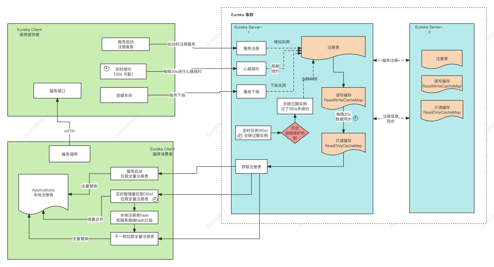
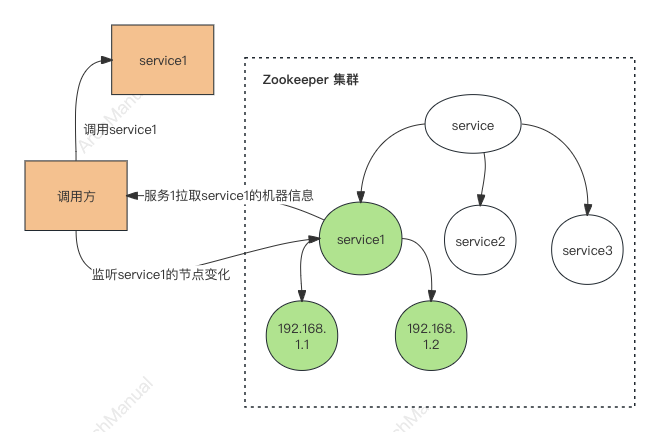
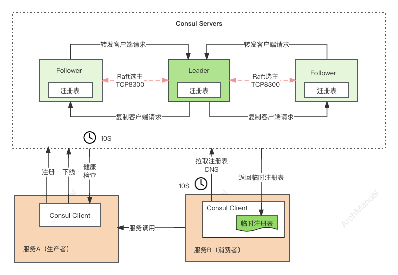

# 注册发现

注册发现（Service Registration and Discovery）是微服务架构中一个非常重要的组成部分，主要用于管理微服务间的地址和状态信息，以便服务间能够相互发现和调用。

使用注册发现机制，可以大大提高微服务架构的灵活性和可维护性，是构建动态、可伸缩、高可用系统的关键技术之一。常见的注册发现工具和平台包括Eureka、Consul、Zookeeper和Nacos等

## 场景

一些常见的应用场景：

1. **云原生应用部署**：在云原生环境中，服务实例会频繁地进行扩容、缩容、更新和迁移。注册发现机制能够实时更新服务状态和位置信息，保证服务间调用的正确性和高效性。

2. **负载均衡**：通过注册发现机制，调用方可以获取到所有可用服务实例的列表，进而实现客户端负载均衡或服务端负载均衡，提高系统的可用性和伸缩性。

3. **故障检测和自愈**：注册中心可以定期检测服务实例的健康状态，一旦发现实例异常，可以及时从服务列表中剔除，避免流量被路由到异常实例上。同时，可以触发自愈机制，自动替换故障实例。

4. **服务版本管理和灰度发布**：在进行服务更新时，可以利用注册发现机制对不同版本的服务实例进行管理，实现灰度发布，逐步将流量切换到新版本上，减少更新带来的风险。

5. **服务配置中心集成**：注册发现不仅可以管理服务的地址信息，还可以与配置中心集成，实现服务配置的动态更新和管理。当服务配置发生变化时，可以自动通知到服务实例，实现配置的热更新。

6. **跨云和多云环境**：对于部署在不同云平台或多个云环境中的服务，注册发现机制可以提供统一的服务访问入口，简化跨云和多云环境下的服务调用和管理。

## 功能性要求

实现注册发现机制时，需要满足一些功能性要求来确保系统的高可用性、稳定性和灵活性。以下是一些关键的功能性要求：

1. **服务注册**：支持服务实例在启动时自动注册到注册中心，包括服务的地址、端口、健康检查接口等信息。服务注册应该是自动的，以减少人为错误和提高效率。

2. **服务注销**：当服务实例停止时，能够自动或手动从注册中心注销，确保不会有流量被路由到已经停止的实例上。

3. **服务发现**：客户端可以通过注册中心查询到当前可用的服务实例列表，包括实例的地址和端口等信息，以便进行服务调用。

4. **健康检查**：注册中心需要定期对服务实例进行健康检查，以确定实例是否可用。支持自定义健康检查策略，如HTTP、TCP或自定义脚本检查等。

5. **故障恢复**：在服务实例发生故障时，注册发现机制应能自动剔除不健康的实例，并且支持故障恢复机制，如重试、备用实例调用等策略，以保证服务的连续性和可用性。

6. **负载均衡**：注册发现机制应支持多种负载均衡策略，如随机、轮询、权重、最少连接数等，以便客户端可以根据实际情况选择最适合的策略。

7. **服务同步**：在分布式部署的场景中，注册中心可能会有多个节点，需要确保服务注册信息在各个节点之间能够快速、准确地同步。

8. **安全性**：注册中心和服务通信过程中需要保证数据的安全性，支持加密通信、身份认证和授权等机制，防止未授权访问和数据泄露。

9. **灵活性和可扩展性**：支持服务的动态注册和注销，以及注册中心的水平扩展，以适应服务规模的变化和高并发场景。

10. **配置管理和服务治理**：除了基本的注册发现功能外，还可以集成服务配置管理、流量管理、服务链路追踪等高级功能，实现全面的服务治理。

## 方案
### 1. Eureka
Eureka是Netflix开发的服务发现框架，是Spring Cloud体系中的重要组成部分。它实现了服务注册和发现的机制，帮助微服务架构中的服务实例相互发现和通信。Eureka主要由两个组件构成：Eureka Server和Eureka Client。

#### Eureka Server

Eureka Server充当服务注册中心的角色。它接收来自服务实例的注册请求，将实例信息存储在内存中，以便服务消费者可以查询。Eureka Server提供了REST API，供客户端注册服务实例信息、查询可用服务、注销服务等操作。

#### Eureka Client

Eureka Client是一个Java客户端，用于简化与Eureka Server的交互。服务提供者在启动时，通过Eureka Client向Eureka Server注册自己的服务信息（如IP地址、端口、健康检查URL等）。服务消费者则可以通过Eureka Client来发现可用的服务提供者并进行调用。

#### 实现原理

1. **服务注册**：当服务实例启动时，它使用Eureka Client向Eureka Server发送一个注册请求，包含自身的元数据（服务名、IP地址、端口、健康检查信息等）。Eureka Server接收到注册信息后，将其存储在内存中。

2. **服务续约**：为了维护服务实例的可用性，Eureka Client会定期（默认30秒）向Eureka Server发送心跳来续约。如果Eureka Server在一定时间内（默认90秒）没有接收到某个实例的心跳，它将会从注册表中移除该实例。

3. **服务下线**：当服务实例需要正常关闭时，它会向Eureka Server发送一个下线请求，Eureka Server随即将该实例从注册表中移除。

4. **服务发现**：服务消费者使用Eureka Client查询Eureka Server以获取服务提供者的信息。Eureka Client拥有一个本地缓存，用于存储所有可用服务实例的信息，它会定期（默认每30秒）更新这个缓存。

5. **自我保护模式**：为了防止因网络问题导致Eureka Server瞬间丢失大量服务实例信息，Eureka Server有一个自我保护机制。如果在一定时间内心跳续约的比例低于阈值（默认85%），Eureka Server将会进入自我保护模式，暂时不会删除任何服务实例，直到恢复正常。

通过这样的机制，Eureka实现了服务的注册、发现和健康检查，支持服务的高可用和负载均衡。
Eureka的设计哲学之一是“宁可保守，不要错误地注销任何服务实例”，这也是其自我保护模式的核心思想。

#### 优点

1. **自我保护模式**：Eureka的自我保护模式确保了在网络分区故障发生时，不会立即注销服务实例，保证了服务调用的稳定性。
2. **负载较轻**：Eureka Server不负责服务间的请求转发，只负责维护服务实例的注册信息，使得Server端负载相对较轻。
3. **简单易用**：与Spring Cloud集成良好，易于使用和配置。
4. **支持多种服务发现模式**：支持基于HTTP和DNS两种服务发现方式。

#### 缺点

1. **一致性问题**：Eureka采用了AP（可用性和分区容错性）原则，而非CP（一致性和分区容错性），在极端情况下可能会出现注册信息的一致性问题。
2. **自我保护模式的双刃剑**：虽然自我保护模式可以在网络分区故障时保护服务实例不被错误剔除，但同时也可能导致不健康的服务实例继续接受流量。
3. **社区支持减弱**：Netflix宣布Eureka 2.0计划停止，对Eureka的未来发展和长期支持产生了一定的影响。

### 2. Zookeeper 作为注册中心

在 ZooKeeper 中进行服务注册，实际上就是在 ZooKeeper 中创建了一个 znode节点。该节点存储了该服务的 IP、端口、调用方式（协议、序列化方式）等。

该节点承担着最重要的职责。它由服务提供者（发布服务时）创建，以供服务消费者获取节点中的信息，从而定位到服务提供者真正网络拓扑位置以及得知如何调用。

#### 实现原理

1. **服务注册**：服务提供者启动时，会将其服务名称、IP 地址注册到配置中心；
2. **服务发现**：服务消费者在第一次调用服务时，会通过注册中心找到相应的服务的 IP 地址列表并缓存到本地，以供后续使用。
3. **服务调用**：当消费者调用服务时，不会再去请求注册中心，而是直接通过负载均衡算法从 IP 列表中获取一个服务提供者的服务器调用服务； 
4. **服务下线**：当服务提供者的某台服务器宕机或下线时，相应的 IP 会从服务提供者 IP 列表中移除。 服务消费者会去监听相应路径（/service/service1），一旦路径上的数据有任务变化（增加或减少），ZooKeeper 只会发送一个事件类型和节点信息给关注的客户端，而不会包括具体的变更内容。
   收到变更通知的客户端需要自己去拉变更的数据。推更新通知，拉具体更新内容。
5. **服务下线**：当服务提供者的某台服务器上线时，注册中心会将新的服务 IP 地址列表发送给服务消费者机器，缓存在消费者本机；
6. **心跳监测**:ZooKeeper 提供了“心跳检测”功能：它会定时向各个服务提供者发送一个请求（实际上建立的是一个 socket 长连接）。如果长期没有响应，服务中心就认为该服务提供者已经“挂了”，并将其剔除。

#### 优点

高可用性、强一致性、分布式配置管理、以及良好的社区支持

#### 缺点

较高的资源消耗（尤其是在大规模服务场景下）、复杂的集群部署和维护、以及对临时节点的依赖可能导致网络抖动时服务列表的不稳定

### 3. Nacos 

以下内容来自[Nacos官网](https://nacos.io/docs/latest/what-is-nacos/)

#### 原理

1. **服务 (Service)**: 服务是指一个或一组软件功能（例如特定信息的检索或一组操作的执行），其目的是不同的客户端可以为不同的目的重用（例如通过跨进程的网络调用）。Nacos 支持主流的服务生态，如 Kubernetes Service、gRPC|Dubbo RPC Service 或者 Spring Cloud RESTful Service。

2. **服务注册中心 (Service Registry)**: 服务注册中心，它是服务，其实例及元数据的数据库。服务实例在启动时注册到服务注册表，并在关闭时注销。服务和路由器的客户端查询服务注册表以查找服务的可用实例。服务注册中心可能会调用服务实例的健康检查 API 来验证它是否能够处理请求。

3. **服务元数据 (Service Metadata)**: 服务元数据是指包括服务端点(endpoints)、服务标签、服务版本号、服务实例权重、路由规则、安全策略等描述服务的数据。

4. **服务提供方 (Service Provider)**: 是指提供可复用和可调用服务的应用方。

5. **服务消费方 (Service Consumer)**: 是指会发起对某个服务调用的应用方。

#### 特性

**1. 服务发现和服务健康监测**

Nacos 支持基于 DNS 和基于 RPC 的服务发现。服务提供者使用 原生SDK、OpenAPI、或一个独立的Agent TODO注册 Service 后，服务消费者可以使用DNS TODO 或HTTP&API查找和发现服务。

Nacos 提供对服务的实时的健康检查，阻止向不健康的主机或服务实例发送请求。Nacos 支持传输层 (PING 或 TCP)和应用层 (如 HTTP、MySQL、用户自定义）的健康检查。 对于复杂的云环境和网络拓扑环境中（如 VPC、边缘网络等）服务的健康检查，Nacos 提供了 agent 上报模式和服务端主动检测2种健康检查模式。Nacos 还提供了统一的健康检查仪表盘，帮助您根据健康状态管理服务的可用性及流量。

**2. 动态配置服务**

动态配置服务可以让您以中心化、外部化和动态化的方式管理所有环境的应用配置和服务配置。

动态配置消除了配置变更时重新部署应用和服务的需要，让配置管理变得更加高效和敏捷。

配置中心化管理让实现无状态服务变得更简单，让服务按需弹性扩展变得更容易。

Nacos 提供了一个简洁易用的UI (控制台样例 Demo) 帮助您管理所有的服务和应用的配置。Nacos 还提供包括配置版本跟踪、金丝雀发布、一键回滚配置以及客户端配置更新状态跟踪在内的一系列开箱即用的配置管理特性，帮助您更安全地在生产环境中管理配置变更和降低配置变更带来的风险。

**3. 动态 DNS 服务**

动态 DNS 服务支持权重路由，让您更容易地实现中间层负载均衡、更灵活的路由策略、流量控制以及数据中心内网的简单DNS解析服务。动态DNS服务还能让您更容易地实现以 DNS 协议为基础的服务发现，以帮助您消除耦合到厂商私有服务发现 API 上的风险。

Nacos 提供了一些简单的 DNS APIs TODO 帮助您管理服务的关联域名和可用的 IP 列表.

**4. 服务及其元数据管理**

Nacos 能让您从微服务平台建设的视角管理数据中心的所有服务及元数据，包括管理服务的描述、生命周期、服务的静态依赖分析、服务的健康状态、服务的流量管理、路由及安全策略、服务的 SLA 以及最首要的 metrics 统计数据。

### 4. Consul

Consul是由HashiCorp公司开发的一款开源工具，用于实现分布式系统的服务发现和配置。Consul使用了一种分布式一致性协议，称为Raft，来管理其内部状态。它支持服务的健康检查，以及键值存储，多数据中心，以及服务间的安全通信。下面详细介绍Consul的架构原理及其优缺点。

#### 架构原理

1. **服务注册**: 每个服务实例在启动时向Consul注册自己，包括服务名称、服务地址、端口号以及健康检查信息。这些信息被存储在Consul的服务目录中。服务注册可以通过Consul提供的API、配置文件或使用Consul提供的客户端库进行。

2. **健康检查**: 注册服务时，可以指定健康检查的参数，Consul会定期执行这些健康检查来确保服务实例可用。只有健康的服务实例会被包含在服务发现的结果中，从而确保服务调用时的可靠性。

3. **服务发现**: 服务发现是Consul的核心功能，允许客户端查询Consul获取其他服务的位置信息。这可以通过DNS接口或HTTP API完成。例如，一个服务需要调用另一个服务时，它会查询Consul获取该服务的当前健康实例的地址和端口号。
- **通过DNS**：Consul提供了内置的DNS服务器，服务之间可以通过解析`<服务名>.service.consul`的形式进行服务发现。这种方式可以非常容易地与现有的应用程序集成，不需要修改应用程序代码。
- **通过HTTP API**：Consul的HTTP API提供了更灵活的服务查询能力，允许服务根据各种条件（如服务标签）查询服务实例的详细信息。使用HTTP API时，通常需要在应用程序中集成Consul的客户端库。

4. **服务调用**: 获取到目标服务的地址和端口号后，服务消费者就可以直接通过网络调用目标服务了。服务间的通信方式取决于应用程序的架构，可以是HTTP REST、gRPC、TCP等。

#### 优点

1. **简单易用**：Consul的安装和配置相对简单，提供了丰富的文档和社区支持。
2. **灵活的服务发现**：支持HTTP和DNS两种发现方式，适应不同的应用需求。
3. **强大的健康检查**：多种健康检查机制确保了服务的稳定性。
4. **跨数据中心**：原生支持多数据中心，适合大规模分布式系统。
5. **安全性**：提供ACL和TLS加密，保证服务间通信的安全。

#### 缺点

1. **资源消耗**：运行Consul需要额外的资源消耗，特别是在大规模集群中。
2. **学习曲线**：虽然上手相对容易，但深入理解和精通所有功能可能需要时间和努力。
3. **在极端情况下的一致性问题**：虽然基于Raft协议，但在网络分区极端情况下仍可能面临一致性挑战。

### 5. Etcd

etcd 实现服务注册与发现的原理是基于其作为一个分布式、可靠的键值存储系统的能力。在微服务架构中，服务注册与发现是核心组件之一，允许服务动态地发现网络中其他服务的位置。这里是如何使用 etcd 来实现服务注册与发现的基本原理：

#### 服务注册

1. **服务启动时注册**：当一个服务实例启动时，它会将自己的地址信息（如IP地址和端口）作为键值对注册到 etcd 中。键通常包括服务名称和服务实例的唯一标识符，值则是服务实例的地址信息。

2. **心跳机制维持注册状态**：服务实例在 etcd 中注册后，需要周期性地更新其租约（lease）来维持其在 etcd 中的注册状态。这种心跳机制确保了只有健康和可访问的服务实例才会被发现。如果服务实例停止发送心跳（可能是因为崩溃或网络问题），其注册信息将会从 etcd 中自动过期并删除。

#### 服务发现

1. **查询服务**：当一个服务需要与其他服务进行通信时，它会查询 etcd，查找目标服务的地址信息。这通常涉及到查找具有特定前缀的所有键，这个前缀对应于目标服务的名称。

2. **观察变更**：服务可以在 etcd 中注册观察者（watcher），对特定的键或前缀进行监听，以便在服务注册信息发生变更时立即获得通知。这使得服务能够动态地响应网络中服务实例的增加或减少，实现负载均衡和容错。

#### 实现细节

- **键值结构**：etcd 中的键值结构非常适合存储服务的注册信息。键可以是服务的名称加上实例标识符，值则包含了实例的地址和其他元数据。

- **租约机制**：etcd 的租约机制允许服务实例在注册时获取一个租约，并周期性地更新这个租约来维持其注册状态。如果更新租约的操作失败（比如服务实例崩溃），租约将过期，etcd 会自动删除该服务实例的注册信息，这样消费者在查询服务时不会得到已经不可用的服务实例地址。

- **一致性保证**：使用 etcd 的好处之一是它基于 Raft 算法，提供了强一致性保证。这意味着一旦服务的注册信息被更新，所有查询 etcd 的客户端都会看到最新的数据，这对于需要高一致性保证的服务发现机制非常重要。

#### 优点

1. **强一致性**：etcd使用Raft一致性算法来同步数据，确保分布式系统中的所有节点能够看到一致的数据视图。这对于需要强一致性保证的服务发现场景非常重要。

2. **高可用性和容错性**：通过在多个节点上复制数据，etcd能够在部分节点失败时继续提供服务，保证了高可用性。这对于构建可靠的微服务架构至关重要。

3. **简单的API和易于集成**：etcd提供了简单的HTTP/JSON和gRPC API，方便各种编程语言的应用程序集成和使用。此外，它的客户端库支持多种语言，使得集成更加容易。

4. **灵活的观察机制**：etcd的观察机制允许服务实时响应配置变更和其他服务的上线或下线，支持构建动态可伸缩的应用。

5. **安全性**：etcd支持传输层安全（TLS）加密通信和基于角色的访问控制，帮助保护敏感数据和管理访问权限。

#### 缺点

1. **运维复杂性**：虽然etcd本身设计简洁，但在大规模部署和管理时，保证集群的稳定性和性能可能需要较高的运维技能。

2. **资源消耗**：为了保证高可用性和一致性，etcd需要在多个节点上复制数据，这可能导致较高的网络带宽和存储资源消耗。

3. **性能考量**：尽管etcd的性能在大多数用例下是足够的，但在高吞吐量或低延迟的场景下，强一致性的代价可能会影响整体性能。

## 工具

推荐

- [Eureka](https://github.com/Netflix/eureka)
- [Nacos](https://github.com/alibaba/nacos)

其他

- [Zookeeper](https://github.com/apache/zookeeper)
- [Consul](https://github.com/hashicorp/consul)
- [Etcd](https://github.com/etcd-io/etcd)