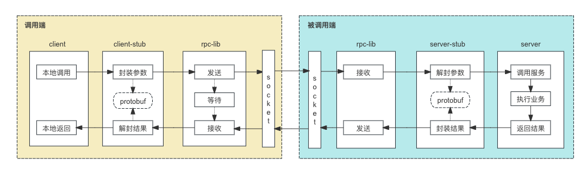
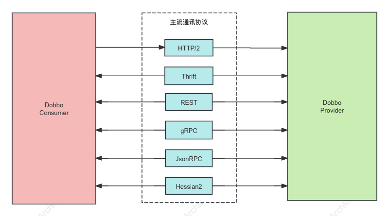

# 服务调用

**服务调用**是指一个软件系统通过某种通信协议请求另一个软件系统提供特定服务的过程。
这一过程涉及服务提供者（Provider）和服务消费者（Consumer）之间的信息交换，通常通过网络或本地通信机制来实现。
服务调用是分布式系统和微服务架构中的核心概念，能够实现不同系统或组件之间的协作和功能整合。

## 优缺点
### 优点

1. **模块化开发**：
    - **可复用性**：服务可以被多个应用或系统调用，减少重复开发。
    - **分而治之**：系统可以拆分为多个独立的服务，便于维护和扩展。

2. **灵活性和扩展性**：
    - **动态扩展**：可以根据需要增加或替换服务，而不影响其他部分。
    - **跨平台支持**：不同平台和语言的系统可以通过标准协议（如HTTP、gRPC）进行互操作。

3. **高可用性和容错性**：
    - **负载均衡**：通过分布式部署和负载均衡提高系统的可用性。
    - **故障隔离**：服务之间相互独立，某个服务的故障不会影响整个系统。

4. **开发效率**：
    - **快速迭代**：通过调用现有的服务和API，可以加快开发速度，专注于核心业务逻辑。
    - **专注于业务**：开发团队可以专注于各自领域的业务逻辑，而不是整个系统的复杂性。

5. **异步处理**：
    - **提高性能**：通过消息队列和事件驱动实现异步处理，提升系统响应速度和处理能力。
    - **解耦合**：异步调用使得系统更加松耦合，易于维护和扩展。

### 缺点

1. **复杂性增加**：
    - **架构复杂性**：分布式系统和微服务架构需要更多的管理和协调工作。
    - **开发难度**：开发、测试和部署分布式服务比单体应用更加复杂。

2. **性能开销**：
    - **网络延迟**：每次服务调用都会带来网络延迟，影响系统性能。
    - **资源消耗**：频繁的服务调用可能导致高资源消耗，需要优化和管理。

3. **故障传播**：
    - **依赖关系**：服务之间的依赖关系可能导致故障传播，一个服务的失败可能影响到其他依赖它的服务。
    - **重试机制**：处理服务调用失败的重试机制可能进一步增加系统负担。

4. **安全风险**：
    - **数据安全**：服务调用涉及数据传输，需要确保数据的保密性和完整性，防止未授权访问。
    - **认证和授权**：需要实现复杂的认证和授权机制，确保只有合法用户和系统可以访问服务。

5. **监控和调试难度**：
    - **分布式监控**：对分布式系统的服务调用进行监控和调试变得更加复杂，需要专业的工具和技术支持。
    - **日志管理**：分布式服务的日志管理和分析需要更加系统化和自动化的解决方案。

## 调用方式

根据不同的应用场景和技术实现，广义的服务调用的方式主要有以下几种：

### 1. 远程过程调用 (RPC)
远程过程调用允许一个程序调用另一台计算机上的服务，就像调用本地函数一样。常用的RPC框架有：

#### 1.1 gRPC

gRPC（gRPC Remote Procedure Calls）是一个高性能、开源的RPC框架，由Google开发。
gRPC基于HTTP/2协议和Protocol Buffers（protobuf）数据序列化协议，提供了多种编程语言的支持。其主要特性包括高性能、语言无关、流式处理、双向通信等。

##### 1.1.1 核心组件

1. **Protocol Buffers**：gRPC使用Protocol Buffers（protobuf）作为其接口定义语言（IDL）和数据序列化格式。
开发者通过定义.proto文件来描述服务接口和消息结构，然后使用protobuf编译器生成客户端和服务器端的代码。

2. **HTTP/2**：gRPC基于HTTP/2协议，提供了高效的多路复用、头部压缩和服务器推送等特性，显著提升了通信性能和效率。

3. **四种通信模式**：
   - **Unary RPC**：客户端发送一个请求，服务器返回一个响应。
   - **Server Streaming RPC**：客户端发送一个请求，服务器返回一个数据流。
   - **Client Streaming RPC**：客户端发送一个数据流，服务器返回一个响应。
   - **Bidirectional Streaming RPC**：客户端和服务器之间进行双向数据流通信。

##### 1.1.2 gRPC 的架构

**1.本地调用**：调用端发起本地调用，本地调用的请求经过客户端 Stub进行封装。

**2.封装参数**：gRPC 会给对应的服务接口名生成一个代理类，即客户端 Stub。客户端Stub的作用是屏蔽掉 RPC 调用的具体底层细节，使得用户无感知的调用远程服务。
客户端Stub 会将当前调用的方法的方法名、参数类型、实参数等根据protobuf协议组装成网络传输的消息体。

**3.发送**：客户端Stub 封装后的消息体会序列化二进制之后，通过Socket发送给RPC服务端。然后socket进入`等待`状态。

**4.接收**：被调用端通过socket接收到数据之后，将数据传递给服务端stub。

**5.解封参数**：服务端stub收到数据之后，根据protobuf协议解封方法名、参数等信息。

**6.调用服务**：根据解析出来的方法名、参数等信息调用本地的方法，执行具体的业务逻辑。

**7.结果返回**：执行完业务逻辑之后，将结果返回。

**8.封装结果**：按照protobuf协议将结果数据进行封装。

**9.结果发送**：将封装后的结果数据通过socket返回给客户端。

**10.结果接受**：客户端socket从 `等待`状态被唤醒，开始接收服务端的结果数据。

**11.结果解封**：收到数据之后，按照protobuf协议将结果数据解封，得到客户端可以识别的结果。

**12.本地返回**：客户端拿到可以识别的结果之后，进行后续的逻辑处理。至此完成一个完成的gRPC调用流程。


##### 1.1.3 代码示例(java)

以下是一个简单的gRPC代码示例，展示如何定义服务并实现客户端和服务器。

**1. 定义.proto文件**

首先，创建一个名为`calculator.proto`的文件，定义服务和消息结构：

```proto
syntax = "proto3";

package calculator;

// 定义请求和响应消息
message AddRequest {
  int32 a = 1;
  int32 b = 2;
}

message AddResponse {
  int32 result = 1;
}

// 定义计算器服务
service Calculator {
  rpc Add (AddRequest) returns (AddResponse);
}
```

**2. 生成代码**

使用Protocol Buffers编译器生成Java代码：

```bash
protoc --java_out=. --grpc-java_out=. calculator.proto
```

**3. 实现服务器端代码**

创建一个简单的gRPC服务器，处理加法请求。假设我们使用Java：

CalculatorService.java

```java
import io.grpc.Server;
import io.grpc.ServerBuilder;
import io.grpc.stub.StreamObserver;

import java.io.IOException;

public class CalculatorService extends CalculatorGrpc.CalculatorImplBase {

    @Override
    public void add(AddRequest request, StreamObserver<AddResponse> responseObserver) {
        int a = request.getA();
        int b = request.getB();
        int result = a + b;

        AddResponse response = AddResponse.newBuilder()
                .setResult(result)
                .build();

        responseObserver.onNext(response);
        responseObserver.onCompleted();
    }

    public static void main(String[] args) throws IOException, InterruptedException {
        Server server = ServerBuilder.forPort(50051)
                .addService(new CalculatorService())
                .build();

        server.start();
        System.out.println("Server started, listening on " + server.getPort());
        server.awaitTermination();
    }
}
```

**4. 实现客户端代码**

创建一个简单的gRPC客户端，调用加法服务：

CalculatorClient.java

```java
import io.grpc.ManagedChannel;
import io.grpc.ManagedChannelBuilder;

public class CalculatorClient {
    public static void main(String[] args) {
        ManagedChannel channel = ManagedChannelBuilder.forAddress("localhost", 50051)
                .usePlaintext()
                .build();

        CalculatorGrpc.CalculatorBlockingStub stub = CalculatorGrpc.newBlockingStub(channel);

        AddRequest request = AddRequest.newBuilder()
                .setA(10)
                .setB(20)
                .build();

        AddResponse response = stub.add(request);

        System.out.println("Result: " + response.getResult());

        channel.shutdown();
    }
}
```
#### 1.2 Dubbo

Dubbo 是一个高性能的 RPC（Remote Procedure Call，远程过程调用）框架，广泛应用于微服务架构中，用于实现服务之间的调用和通信。



Dubbo 从设计上不绑定任何一款特定通信协议，HTTP/2、REST、gRPC、JsonRPC、Thrift、Hessian2 等几乎所有主流的通信协议，Dubbo 框架都可以提供支持。 

这样的 Protocol 设计模式给构建微服务带来了最大的灵活性，开发者可以根据需要如性能、通用型等选择不同的通信协议，不再需要任何的代理来实现协议转换，甚至你还可以通过 Dubbo 实现不同协议间的迁移。

- Dubbo Protocol 被设计支持扩展，您可以将内部私有协议适配到 Dubbo 框架上，进而将私有协议接入 Dubbo 体系，以享用 Dubbo 的开发体验与服务治理能力。比如 Dubbo3 的典型用户阿里巴巴，就是通过扩展支持 HSF 协议实现了内部 HSF 框架到 Dubbo3 框架的整体迁移。

- Dubbo 还支持多协议暴露，您可以在单个端口上暴露多个协议，Dubbo Server 能够自动识别并确保请求被正确处理，也可以将同一个 RPC 服务发布在不同的端口（协议），为不同技术栈的调用方服务。

- Dubbo 提供了两款内置高性能 Dubbo2、Triple (兼容 gRPC) 协议实现，以满足部分微服务用户对高性能通信的诉求，两者最开始都设计和诞生于阿里巴巴内部的高性能通信业务场景。 Dubbo2 协议是在 TCP 传输层协议之上设计的二进制通信协议
Triple 则是基于 HTTP/2 之上构建的支持流式模式的通信协议，并且 Triple 完全兼容 gRPC 但实现上做了更多的符合 Dubbo 框架特点的优化。

Dubbo 对通信协议的支持具有以下特点：
- 不绑定通信协议
- 提供高性能通信协议实现
- 支持流式通信模型
- 不绑定序列化协议
- 支持单个服务的多协议暴露
- 支持单端口多协议发布
- 支持一个应用内多个服务使用不同通信协议

#### 1.3 JSON-RPC

JSON-RPC 是一种轻量级的远程过程调用（RPC）协议，使用 JSON 作为数据传输格式。它通过网络在客户端和服务器之间传递方法调用和返回结果。
JSON-RPC 简化了跨网络的远程方法调用。以

##### 工作流程

1. **客户端调用**：
   - 客户端程序调用本地的一个代理对象方法，实际上是想调用远程服务器上的方法。

2. **请求组装**：
   - 代理对象将方法调用及其参数转换为 JSON 格式的请求消息。请求消息包括方法名、参数列表、JSON-RPC 版本和请求 ID。

3. **发送请求**：
   - 组装好的 JSON 请求消息通过 HTTP、WebSocket 等传输协议发送到远程服务器。

4. **服务器处理**：
   - 服务器接收到请求消息后，解析 JSON 数据，提取出方法名和参数。
   - 服务器根据方法名找到对应的方法，并用提取的参数进行调用。

5. **响应组装**：
   - 方法调用完成后，服务器将结果或异常信息封装成 JSON 格式的响应消息。响应消息包括结果、JSON-RPC 版本和请求 ID。

6. **发送响应**：
   - 服务器将 JSON 格式的响应消息通过网络返回给客户端。

7. **客户端处理响应**：
   - 客户端接收到响应消息后，解析 JSON 数据，提取出调用结果或异常信息。
   - 最后将结果返回给客户端程序。

##### 示例

简单的 JSON-RPC 请求和响应的示例：

**请求示例**
```json
{
  "jsonrpc": "2.0",
  "method": "subtract",
  "params": [42, 23],
  "id": 1
}
```

**响应示例**
```json
{
  "jsonrpc": "2.0",
  "result": 19,
  "id": 1
}
```

#####  关键组成部分

1. **请求对象**：
   - `jsonrpc`: JSON-RPC 版本号，必须是 "2.0"。
   - `method`: 方法名，表示客户端希望调用的远程方法。
   - `params`: 参数列表，可以是位置参数数组或命名参数对象。
   - `id`: 请求 ID，用于匹配请求和响应。

2. **响应对象**：
   - `jsonrpc`: JSON-RPC 版本号，必须是 "2.0"。
   - `result`: 方法调用的返回结果，如果方法调用成功。
   - `error`: 错误对象，如果方法调用失败。
   - `id`: 请求 ID，用于匹配请求和响应。

**错误处理**

JSON-RPC 定义了标准的错误对象，包含以下字段：
- `code`: 错误码，一个数字表示错误类型。
- `message`: 错误消息，一个简短的描述。
- `data`: 附加的错误数据，可选字段，提供额外的错误信息。

错误示例

```json
{
  "jsonrpc": "2.0",
  "error": {
    "code": -32601,
    "message": "Method not found"
  },
  "id": 1
}
```

##### 优点和缺点

**优点**：
- 简单易用，基于 JSON，解析和生成效率高。
- 支持多种传输协议，如 HTTP、WebSocket 等。
- 支持批量请求和通知（无需响应的请求）。

**缺点**：
- 不支持复杂的数据结构和类型，扩展性有限。
- 安全性需要通过传输协议（如 HTTPS）和身份验证机制来保障。

JSON-RPC 是一种高效的远程过程调用协议，适用于轻量级和中小规模的分布式系统。它的简洁性和高效性使其在现代 web 服务和微服务架构中得到了广泛应用。


#### 1.4 Thrift

Apache Thrift 是一个跨语言的 RPC（Remote Procedure Call，远程过程调用）框架，由 Facebook 开发，并捐赠给 Apache 基金会。
Thrift 提供了高效的二进制通信协议和序列化机制，支持多种编程语言，适用于大规模分布式系统。

##### Thrift 基本原理

1. **IDL（接口描述语言）**：
   - Thrift 使用一种专门的语言（IDL）来定义服务接口和数据类型。IDL 文件描述了服务的所有方法及其参数和返回值。
   - 例如，一个简单的 IDL 文件可能如下：
     ```thrift
     service Calculator {
       i32 add(1: i32 num1, 2: i32 num2),
       i32 subtract(1: i32 num1, 2: i32 num2)
     }
     ```

2. **代码生成**：
   - 使用 Thrift 编译器将 IDL 文件编译成目标语言的代码。这些代码包括服务接口的客户端和服务器端的实现框架。
   - 例如，生成 Java 代码：
     ```bash
     thrift --gen java calculator.thrift
     ```

3. **客户端调用**：
   - 客户端程序使用 Thrift 生成的代码创建服务的客户端对象。
   - 客户端对象通过网络调用远程服务器上的方法，并接收返回结果。
   - 例如，在 Java 中：
     ```java
     TTransport transport = new TSocket("localhost", 9090);
     transport.open();

     TProtocol protocol = new TBinaryProtocol(transport);
     Calculator.Client client = new Calculator.Client(protocol);

     int result = client.add(5, 3);
     System.out.println("Result: " + result);

     transport.close();
     ```

4. **服务器处理**：
   - 服务器程序实现 Thrift 生成的服务接口，并启动服务器以监听客户端请求。
   - 例如，在 Java 中：
     ```java
     public class CalculatorHandler implements Calculator.Iface {
       @Override
       public int add(int num1, int num2) {
         return num1 + num2;
       }

       @Override
       public int subtract(int num1, int num2) {
         return num1 - num2;
       }
     }

     public static void main(String[] args) {
       try {
         CalculatorHandler handler = new CalculatorHandler();
         Calculator.Processor processor = new Calculator.Processor(handler);

         TServerTransport serverTransport = new TServerSocket(9090);
         TServer server = new TSimpleServer(new TServer.Args(serverTransport).processor(processor));

         System.out.println("Starting the server...");
         server.serve();
       } catch (Exception e) {
         e.printStackTrace();
       }
     }
     ```

##### 关键组成部分

1. **Thrift 文件（.thrift）**：
   - 定义服务接口和数据类型的 IDL 文件。

2. **Thrift 编译器**：
   - 将 Thrift 文件编译成目标语言的代码。

3. **传输层（Transport）**：
   - 定义数据在客户端和服务器之间传输的方式，如 TSocket（阻塞式）、TFramedTransport（分帧传输）等。

4. **协议层（Protocol）**：
   - 定义数据的序列化和反序列化方式，如 TBinaryProtocol（二进制协议）、TCompactProtocol（压缩协议）等。

5. **服务器（Server）**：
   - 定义服务器的实现方式，如 TSimpleServer（单线程）、TThreadPoolServer（线程池）、TNonblockingServer（非阻塞式）等。

##### 优点和缺点

**优点**：
- **跨语言支持**：Thrift 支持多种编程语言，包括 Java、C++、Python、Go 等，方便不同语言的系统进行互操作。
- **高效的二进制协议**：Thrift 使用高效的二进制协议进行数据传输，性能优于基于文本的协议。
- **丰富的传输和协议选项**：Thrift 提供多种传输和协议选项，适应不同的应用场景和性能需求。
- **自动生成代码**：Thrift 编译器自动生成服务接口的客户端和服务器端代码，减少了开发工作量。

**缺点**：
- **学习曲线**：需要学习 Thrift 的 IDL 和使用方法，对初学者有一定的学习曲线。
- **依赖性**：需要依赖 Thrift 编译器和生成的代码，对开发环境有一定要求。
- **二进制协议调试不便**：二进制协议虽然高效，但不如文本协议易于调试和分析。

Thrift 适用于大规模、高性能的分布式系统，通过其跨语言支持和高效的通信机制，简化了服务之间的调用和通信。

### 2. **Web服务**
Web 服务是一种允许不同应用程序通过网络相互通信和交换数据的技术。Web 服务通常基于标准的协议和格式，如 HTTP、SOAP、REST 和 JSON。以下是 Web 服务的基本原理和服务调用的工作流程。

#### 基本原理

Web 服务的核心思想是通过标准的协议和数据格式，使得不同的系统能够互操作。Web 服务通常分为两类：SOAP 和 RESTful。

1. **SOAP（Simple Object Access Protocol）**：
   - 基于 XML 的消息协议。
   - 支持复杂的操作和消息模式。
   - 使用 WSDL（Web Services Description Language）描述服务接口。
   - 典型应用于企业级和跨组织的复杂系统集成。

2. **RESTful（Representational State Transfer）**：
   - 基于 HTTP 协议和标准的 CRUD 操作（Create, Read, Update, Delete）。
   - 使用简单的 URL 和 HTTP 方法（GET, POST, PUT, DELETE）进行操作。
   - 返回格式通常是 JSON 或 XML。
   - 更轻量级，适合互联网应用和微服务架构。

#### 服务调用流程

以下描述了 RESTful Web 服务调用的典型流程：

1. **定义 API 接口**：
   - 定义服务端提供的资源和操作。
   - 例如，一个用户服务 API 可能包含以下端点：
      - `GET /users` 获取所有用户。
      - `GET /users/{id}` 根据 ID 获取特定用户。
      - `POST /users` 创建新用户。
      - `PUT /users/{id}` 更新特定用户。
      - `DELETE /users/{id}` 删除特定用户。

2. **客户端请求**：
   - 客户端应用程序构建 HTTP 请求。
   - 请求通常包括：URL、HTTP 方法、请求头和请求体（对于 POST 和 PUT 请求）。

3. **发送请求**：
   - 客户端通过网络（通常是互联网）将 HTTP 请求发送到服务器。

4. **服务器处理**：
   - 服务器接收到请求后，解析 URL 和 HTTP 方法，调用相应的处理函数。
   - 处理函数执行相应的业务逻辑，可能涉及数据库操作、业务计算等。

5. **构建响应**：
   - 服务器将处理结果封装成 HTTP 响应。
   - 响应包括：状态码、响应头和响应体（通常是 JSON 或 XML 格式的数据）。

6. **发送响应**：
   - 服务器将 HTTP 响应发送回客户端。

7. **客户端处理响应**：
   - 客户端接收到响应后，解析状态码和响应体。
   - 根据响应的状态码确定操作是否成功，并处理响应数据。

#### 示例

以下是一个使用 JavaScript 和 Fetch API 调用 RESTful Web 服务的示例：

```javascript
// 定义请求 URL
const url = 'https://api.example.com/users';

// GET 请求获取所有用户
fetch(url)
  .then(response => response.json())
  .then(data => console.log(data))
  .catch(error => console.error('Error:', error));

// POST 请求创建新用户
const newUser = {
  name: 'John Doe',
  email: 'john.doe@example.com'
};

fetch(url, {
  method: 'POST',
  headers: {
    'Content-Type': 'application/json'
  },
  body: JSON.stringify(newUser)
})
  .then(response => response.json())
  .then(data => console.log(data))
  .catch(error => console.error('Error:', error));
```

#### 优点和缺点

**优点**：
- **跨平台**：基于标准的协议和数据格式，不同系统可以互操作。
- **灵活性**：支持多种数据格式和传输协议。
- **可扩展性**：易于扩展新的服务和功能。
- **易用性**：RESTful 风格简单明了，易于理解和使用。

**缺点**：
- **性能开销**：由于使用 HTTP 协议，可能存在一定的性能开销。
- **安全性**：需要额外的机制（如 HTTPS、身份验证、授权）来保证安全性。
- **状态管理**：RESTful 服务通常是无状态的，需要在客户端管理状态。

Web 服务通过标准化的协议和数据格式，实现了不同系统之间的互操作和数据交换，广泛应用于现代分布式系统和微服务架构中。

### 3. **消息队列**
消息队列是一种用于在分布式系统中实现异步通信和解耦的机制。消息队列允许不同的应用程序通过消息的形式进行通信，而无需直接调用彼此的服务。以下是消息队列服务调用的基本原理和工作流程。

#### 基本原理

消息队列系统通常包括以下组件：

1. **消息生产者（Producer）**：
   - 生成并发送消息的应用程序或服务。

2. **消息消费者（Consumer）**：
   - 接收并处理消息的应用程序或服务。

3. **消息代理（Broker）**：
   - 负责接收、存储和分发消息的中间件。常见的消息代理有 RabbitMQ、Apache Kafka、ActiveMQ 等。

消息生产者将消息发送到消息代理，消息代理将消息存储并分发给订阅了该消息的消费者。消费者处理接收到的消息，实现异步通信。

#### 工作流程

以下描述了典型的消息队列服务调用流程：

1. **消息生产者发送消息**：
   - 生产者将消息发送到消息队列。消息可以包含需要处理的数据或指示特定操作的信息。

2. **消息代理存储消息**：
   - 消息代理接收到消息后，将其存储在队列中，等待消费者处理。

3. **消息消费者订阅队列**：
   - 消费者订阅消息队列，等待接收新消息。

4. **消息分发**：
   - 消息代理根据消费者的订阅，将消息分发给相应的消费者。

5. **消费者处理消息**：
   - 消费者接收到消息后，进行相应的处理，如更新数据库、调用其他服务等。

6. **确认处理（可选）**：
   - 消费者处理完消息后，向消息代理发送确认，告知消息已被成功处理。消息代理可以选择删除该消息或将其标记为已处理。

#### 示例

以下是一个使用 RabbitMQ 进行消息队列服务调用的示例：

##### 生产者（Producer）

```python
import pika

# 连接到 RabbitMQ 服务器
connection = pika.BlockingConnection(pika.ConnectionParameters('localhost'))
channel = connection.channel()

# 声明一个队列
channel.queue_declare(queue='hello')

# 发送消息到队列
channel.basic_publish(exchange='', routing_key='hello', body='Hello, World!')
print(" [x] Sent 'Hello, World!'")

# 关闭连接
connection.close()
```

##### 消费者（Consumer）

```python
import pika

# 连接到 RabbitMQ 服务器
connection = pika.BlockingConnection(pika.ConnectionParameters('localhost'))
channel = connection.channel()

# 声明一个队列
channel.queue_declare(queue='hello')

# 定义回调函数处理消息
def callback(ch, method, properties, body):
    print(f" [x] Received {body}")

# 订阅队列
channel.basic_consume(queue='hello', on_message_callback=callback, auto_ack=True)

print(' [*] Waiting for messages. To exit press CTRL+C')
channel.start_consuming()
```

#### 优点和缺点

**优点**：
- **解耦**：消息生产者和消费者之间没有直接依赖关系，可以独立开发和部署。
- **异步处理**：消息队列允许异步处理，提高系统的响应速度和吞吐量。
- **弹性扩展**：可以轻松增加生产者和消费者的数量，支持系统的水平扩展。
- **可靠性**：通过消息持久化和确认机制，确保消息不会丢失。

**缺点**：
- **复杂性**：引入消息队列增加了系统的复杂性，需要额外的运维和监控。
- **延迟**：消息队列引入的异步处理可能导致一定的延迟，不适合所有场景。
- **一致性**：在分布式系统中，处理消息的顺序和一致性需要特别注意。

#### 适用场景

消息队列广泛应用于各种分布式系统和微服务架构中，包括但不限于：
- **异步任务处理**：如订单处理、邮件发送、日志记录等。
- **负载均衡**：通过消息队列分发任务，平衡各个消费者的负载。
- **事件驱动架构**：实现事件驱动的系统，通过消息队列通知和处理事件。
- **数据流处理**：如实时数据分析、日志收集和处理等。

通过消息队列，系统可以实现高效的异步通信和解耦，增强系统的弹性和扩展性。

### 4. **GraphQL**
GraphQL 是一种用于 API 的查询语言，以及一个用于通过单个端点获取数据的运行时环境。与传统的 REST API 相比，GraphQL 提供了更灵活和高效的数据查询方式。以下是 GraphQL 服务调用的基本原理和工作流程。

### 基本原理

1. **Schema（模式）**：
   - GraphQL 的核心是其模式（Schema），它定义了 API 的结构，包括查询类型、变更类型和订阅类型。模式明确规定了客户端可以查询的数据以及可以进行的操作。

2. **查询（Query）**：
   - 客户端通过查询请求获取数据。查询语句指定了所需的数据字段，服务器根据模式解析查询并返回相应的数据。

3. **变更（Mutation）**：
   - 变更用于修改服务器端的数据。变更请求可以创建、更新或删除数据，并且可以返回修改后的数据。

4. **订阅（Subscription）**：
   - 订阅允许客户端订阅特定事件，当这些事件发生时，服务器会主动推送数据给客户端。这对于实时应用非常有用。

### 工作流程

1. **定义 Schema**：
   - 定义 API 的结构，包括数据类型、查询类型和变更类型。

2. **编写查询或变更**：
   - 客户端编写查询或变更语句，指定需要的数据或要执行的操作。

3. **发送请求**：
   - 客户端通过 HTTP POST 请求将查询或变更发送到 GraphQL 服务器。

4. **解析请求**：
   - 服务器根据模式解析查询或变更，执行相应的操作。

5. **返回结果**：
   - 服务器将结果封装为 JSON 格式并返回给客户端。

### 示例

以下是使用 JavaScript 和 Apollo Client 进行 GraphQL 服务调用的示例。

#### 服务端示例（使用 Node.js 和 Apollo Server）

**安装依赖**：
```bash
npm install apollo-server graphql
```

**定义 Schema 和 Resolver**：
```javascript
const { ApolloServer, gql } = require('apollo-server');

// 定义 Schema
const typeDefs = gql`
  type Query {
    hello: String
    user(id: ID!): User
  }

  type Mutation {
    createUser(name: String!): User
  }

  type User {
    id: ID!
    name: String!
  }
`;

// 模拟数据
let users = [];
let idCounter = 1;

// 定义 Resolvers
const resolvers = {
  Query: {
    hello: () => 'Hello, world!',
    user: (parent, args) => users.find(user => user.id === args.id),
  },
  Mutation: {
    createUser: (parent, args) => {
      const user = { id: idCounter++, name: args.name };
      users.push(user);
      return user;
    },
  },
};

// 创建 Apollo Server 实例
const server = new ApolloServer({ typeDefs, resolvers });

// 启动服务器
server.listen().then(({ url }) => {
  console.log(`Server ready at ${url}`);
});
```

#### 客户端示例（使用 Apollo Client）

**安装依赖**：
```bash
npm install @apollo/client graphql
```

**编写客户端代码**：
```javascript
import { ApolloClient, InMemoryCache, gql } from '@apollo/client';
import { HttpLink } from 'apollo-link-http';
import fetch from 'cross-fetch';

// 创建 Apollo Client 实例
const client = new ApolloClient({
  link: new HttpLink({ uri: 'http://localhost:4000', fetch }),
  cache: new InMemoryCache()
});

// 查询数据
const GET_HELLO = gql`
  query {
    hello
  }
`;

client.query({ query: GET_HELLO })
  .then(result => console.log(result))
  .catch(error => console.error(error));

// 变更数据
const CREATE_USER = gql`
  mutation createUser($name: String!) {
    createUser(name: $name) {
      id
      name
    }
  }
`;

client.mutate({ mutation: CREATE_USER, variables: { name: 'John Doe' } })
  .then(result => console.log(result))
  .catch(error => console.error(error));
```

### 优点和缺点

**优点**：
- **灵活性**：客户端可以精确指定所需的数据，减少冗余数据传输。
- **强类型**：Schema 明确规定了数据结构，提供了类型安全性。
- **单一端点**：所有请求都通过单一端点发送，简化了 API 管理。
- **高效性**：通过批量查询和减少冗余请求，提高了网络效率。

**缺点**：
- **复杂性**：设置和维护 Schema 以及解析器（resolvers）增加了复杂性。
- **性能问题**：复杂查询可能导致服务器性能问题，需要优化和缓存策略。
- **学习曲线**：对于不熟悉 GraphQL 的开发者，需要一定的学习时间。

### 应用场景

GraphQL 适用于以下场景：
- **复杂数据查询**：需要从多个资源中获取不同的数据。
- **实时应用**：通过订阅实现实时数据更新。
- **移动应用**：减少移动设备的网络请求量，提高响应速度。
- **微服务架构**：整合多个微服务的数据接口，通过单一端点提供统一的 API。

通过 GraphQL，系统能够实现更灵活和高效的数据查询和变更，特别适用于需要高度交互和复杂数据需求的应用。

## 工具
- [gRPC](https://grpc.io/)
- [Dubbo](https://cn.dubbo.apache.org/zh-cn/)
- [JSON-RPC](https://www.jsonrpc.org/)
- [Thrift](https://thrift.apache.org/)
- [GraphQL](https://graphql.org/)