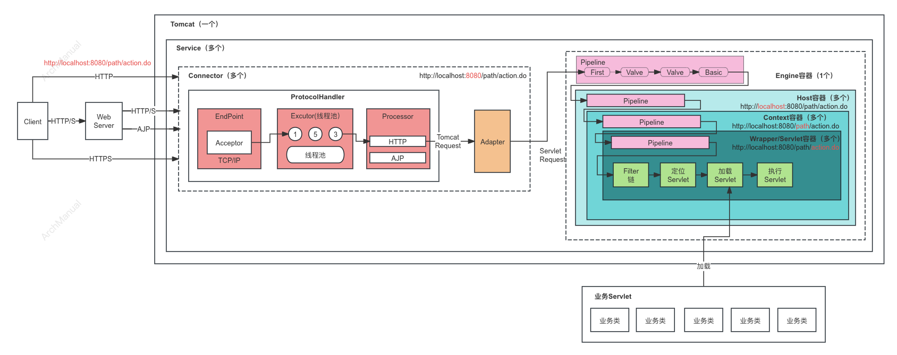
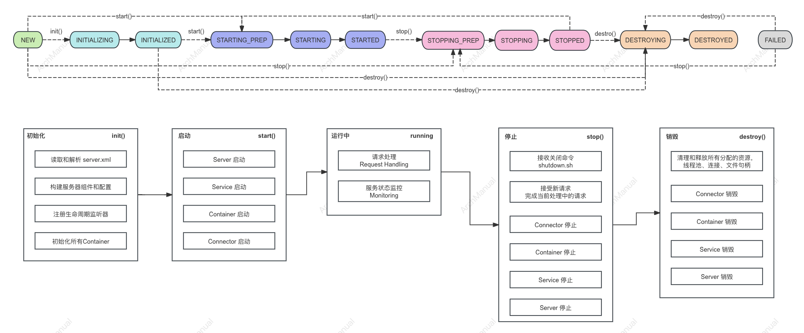
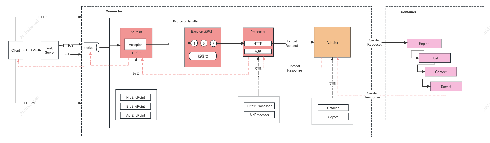
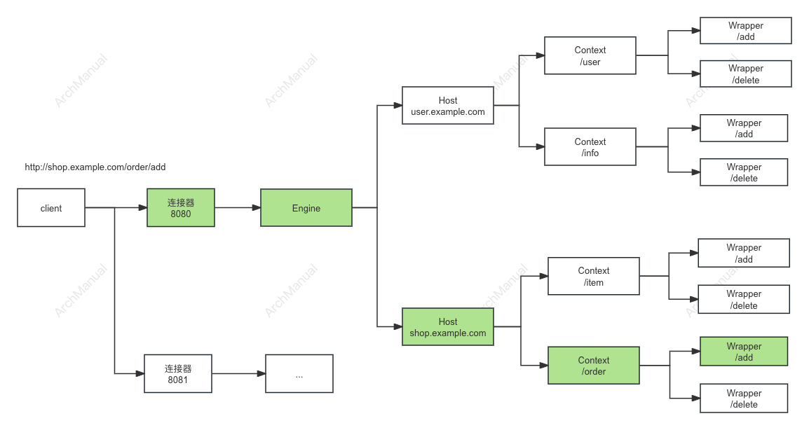

# 应用服务器
Java 应用服务器是专门用来运行基于Java技术的Web应用程序的服务器。

这些服务器支持Java EE（Java Platform, Enterprise Edition）规范，提供了多种服务，如事务管理、Java Naming and Directory Interface (JNDI)、数据库连接、Web服务以及其他业务逻辑处理功能。

## J2EE 规范
Java 应用服务器需要支持的J2EE（Java 2 Platform, Enterprise Edition）规范，以确保它能够运行企业级的Java应用程序。

以下是一些关键的J2EE规范：

1. **Servlet规范**：
    - Servlet是Java EE应用的核心，用于处理客户端的请求并生成响应。

2. **JavaServer Pages（JSP）规范**：
    - JSP允许开发者嵌入Java代码到HTML页面中，生成动态网页内容。

3. **JavaServer Faces（JSF）规范**：
    - JSF是一个用于构建用户界面的框架，简化了Web应用程序的开发。

4. **Enterprise JavaBeans（EJB）规范**：
    - EJB提供了构建可重用和分布式业务逻辑组件的机制，支持事务、持久性和安全性等企业级特性。

5. **Java Persistence API（JPA）规范**：
    - JPA用于对象关系映射（ORM），简化了Java对象和数据库表之间的数据持久化。

6. **Java Message Service（JMS）规范**：
    - JMS提供了消息传递机制，支持异步通信和松耦合的应用集成。

7. **Java Transaction API（JTA）规范**：
    - JTA用于管理分布式事务，确保数据的一致性和完整性。

8. **Java Naming and Directory Interface（JNDI）规范**：
    - JNDI提供了命名和目录服务，用于查找和检索资源如数据库连接、EJB等。

9. **JavaMail API**：
    - JavaMail API用于处理电子邮件的发送、接收和处理。

10. **Java API for RESTful Web Services（JAX-RS）规范**：
    - JAX-RS用于构建基于REST架构的Web服务。

11. **Java API for XML Web Services（JAX-WS）规范**：
    - JAX-WS用于构建基于SOAP的Web服务。

12. **Java Authentication and Authorization Service（JAAS）规范**：
    - JAAS提供了认证和授权服务，确保应用程序的安全性。

这些规范组成了Java EE平台的基础，支持构建和运行复杂的企业级Java应用程序。 
常见的Java应用服务器如Apache Tomcat、JBoss EAP、IBM WebSphere、Oracle WebLogic等，都实现并支持这些J2EE规范。

## Java 开源应用服务器

### 1. Tomcat
Tomcat 是一个开源的Servlet容器，由Apache软件基金会开发。虽然它通常被视为一个轻量级应用服务器，实际上它是一个Web服务器和Java Servlet容器的结合体。

#### 1.1核心组件

Apache Tomcat 的核心组件包括 Server、Service、Connector、Engine、Host 和 Context。
这些组件各自承担不同的职责，共同协作处理客户端请求。

以下是对这些核心组件及其在请求处理中的具体作用的详细描述：

1. **Server**
    - **描述**：表示整个 Tomcat 服务器实例。
    - **职责**：启动和关闭 Tomcat 服务器，包含一个或多个 Service 元素。
    - **处理**：负责管理整个服务器的生命周期。

2. **Service**
    - **描述**：表示一个服务，包括一个 Engine 和一个或多个 Connector。
    - **职责**：协调 Connector 和 Engine 之间的工作。
    - **处理**：将来自 Connector 的请求传递给 Engine。

3. **Connector**
    - **描述**：负责接收客户端的请求并将其传递给 Engine。
    - **职责**：处理客户端与服务器之间的通信。支持多种协议，如 HTTP 和 AJP。
    - **处理**：
        1. 接收客户端的 HTTP/AJP 请求。
        2. 解析请求行、请求头等信息。
        3. 将解析后的请求对象传递给 Engine。
4. **Engine**
    - **描述**：处理具体请求的核心组件，包含多个 Host。
    - **职责**：管理和处理具体的请求，将请求分配给正确的 Host。
    - **处理**：
        1. 接收来自 Connector 的请求。
        2. 根据请求的主机名选择适当的 Host 进行处理。

5. **Host**
    - **描述**：表示一个虚拟主机，可以支持多个域名或多个应用。
    - **职责**：管理一个或多个 Context。
    - **处理**：
        1. 接收来自 Engine 的请求。
        2. 根据请求的 URI 选择合适的 Context。

6. **Context**
    - **描述**：表示一个 Web 应用，每个 Web 应用都在其自己的 Context 中运行。
    - **职责**：管理 Web 应用的生命周期，处理特定的请求。
    - **处理**：
        1. 接收来自 Host 的请求。
        2. 根据请求的路径将请求分发给对应的 Servlet。
        3. Servlet 处理请求并生成响应。

#### 1.2 Server的生命周期

Tomcat 服务器的生命周期由几个关键阶段组成，每个阶段由不同的组件和配置文件共同管理。

##### 1.2.1 Server 生命周期的主要阶段

1. **初始化 (Initialization)**：
   - **Server Configuration**：读取和解析 `server.xml` 配置文件，构建 Tomcat 服务器实例的组件和配置。
   - **Lifecycle Listener**：注册生命周期监听器，监听服务器启动、停止等事件。
   - **Container Initialization**：初始化所有 `Container`（如 `Host` 和 `Context`），加载和初始化部署的 Web 应用。

2. **启动 (Startup)**：
   - **Server Start**：调用 `Server` 的 `start` 方法，启动整个 Tomcat 实例。
   - **Service Start**：依次启动每个 `Service`，包括启动 `Engine`、`Host` 和 `Context`。
   - **Connector Start**：启动每个 `Connector`，监听指定的端口，准备接收客户端请求。

3. **运行 (Running)**：
   - **Request Handling**：在运行阶段，Tomcat 处理客户端的请求。`Connector` 接收请求并将其传递给 `Engine`，`Engine` 进一步将请求分配给 `Host` 和 `Context`，最后由 `Servlet` 处理请求并生成响应。
   - **Monitoring**：监控服务器的运行状态，包括性能、连接数、错误日志等。可以使用 JMX (Java Management Extensions) 进行管理和监控。

4. **停止 (Shutdown)**：
   - **Graceful Shutdown**：Tomcat 接收关闭命令（通常是通过 `shutdown.sh` 或 `shutdown.bat` 脚本），停止接受新请求并完成当前处理中的请求。
   - **Connector Stop**：停止每个 `Connector`，关闭端口监听，断开所有活动连接。
   - **Service Stop**：依次停止每个 `Service`，停止其包含的所有组件（如 `Engine`、`Host`、`Context`）。
   - **Server Stop**：调用 `Server` 的 `stop` 方法，停止整个 Tomcat 实例，释放所有资源。

5. **销毁 (Destroy)**：
   - **Resource Cleanup**：清理和释放所有分配的资源，包括线程池、数据库连接、文件句柄等。
   - **Component Destruction**：销毁所有组件（如 `Server`、`Service`、`Engine`、`Host`、`Context`），使其进入未初始化状态。

##### 1.2.2 生命周期中的主要方法和类

1. **Lifecycle Interface**：所有支持生命周期的组件都实现了 `Lifecycle` 接口，包括 `start()` 和 `stop()` 方法。
   - **start()**：启动组件，使其进入运行状态。
   - **stop()**：停止组件，使其进入停止状态。

2. **StandardServer**：实现了 `Server` 接口，管理整个服务器的生命周期。
   - **start()**：启动服务器，依次启动所有包含的 `Service`。
   - **stop()**：停止服务器，依次停止所有包含的 `Service`。

3. **StandardService**：实现了 `Service` 接口，管理服务的生命周期。
   - **start()**：启动服务，依次启动所有包含的 `Connector` 和 `Container`。
   - **stop()**：停止服务，依次停止所有包含的 `Connector` 和 `Container`。

4. **StandardEngine**、**StandardHost**、**StandardContext**：分别实现了 `Engine`、`Host` 和 `Context` 接口，管理各自的生命周期。

##### 1.2.3 生命周期事件监听器

Tomcat 支持生命周期事件监听器（LifecycleListener），允许开发者监听和处理生命周期事件，
如 `before_start`、`start`、`after_start`、`before_stop`、`stop` 和 `after_stop`。

这些监听器可以用来在组件的生命周期中执行特定的操作，如日志记录、资源初始化和清理等。

##### 1.2.4 生命周期示例

###### 启动流程：

1. **初始化服务器配置**：从 `server.xml` 加载配置文件。
2. **创建 Server 对象**：创建 `StandardServer` 实例。
3. **初始化 Services**：创建并初始化 `StandardService` 实例。
4. **启动 Connectors**：启动 HTTP、AJP 等 `Connector`，开始监听端口。
5. **初始化并启动 Engine**：创建并启动 `StandardEngine`。
6. **初始化并启动 Hosts 和 Contexts**：创建并启动 `StandardHost` 和 `StandardContext`，加载和初始化所有 Web 应用。

###### 停止流程：

1. **接收停止命令**：通过脚本或管理工具发送停止命令。
2. **关闭 Connectors**：停止 HTTP、AJP 等 `Connector`，关闭端口监听。
3. **停止 Services**：停止 `StandardService` 实例，依次停止所有包含的组件。
4. **停止 Server**：停止 `StandardServer` 实例，释放所有资源。
5. **清理资源**：清理和释放所有分配的资源。

#### 1.3 Connector 工作流程

在 Tomcat 中，Connector 组件是负责接收客户端请求并将其传递给其他内部组件进行处理的关键部分。

Connector 的工作流程涉及多个子组件和概念，包括 EndPoint、Executor、Processor、Adapter、TomcatRequest 和 ServletRequest。

以下是这些概念的详细说明及其在工作流程中的作用。

##### 相关概念

1. **EndPoint**：
   - **描述**：负责底层的网络通信，处理连接的建立、读写操作等。
   - **类型**：常见的有 NioEndPoint、AprEndPoint、BioEndPoint。
   - **职责**：管理 Socket 连接，监听端口并接受新的连接。

2. **Executor**：
   - **描述**：线程池管理器，处理连接的线程管理。
   - **职责**：分配和管理线程，用于处理客户端请求的并发执行。

3. **Processor**：
   - **描述**：处理请求的实际工作单元。
   - **职责**：解析请求数据，生成 Tomcat 内部的请求和响应对象，处理业务逻辑。
   - **类型**：有 Http11Processor、AjpProcessor 等。

4. **Adapter**：
   - **描述**：连接 Coyote 和 Catalina 的适配器。
   - **职责**：将低层次的请求转换为高级的 Servlet 请求，传递给 Engine 进行处理。

5. **TomcatRequest**：
   - **描述**：Tomcat 内部表示 HTTP 请求的对象。
   - **职责**：封装客户端请求的所有数据，包括请求行、请求头、请求体等。

6. **ServletRequest**：
   - **描述**：标准的 Servlet API 中定义的请求对象。
   - **职责**：提供给应用程序使用的请求对象，封装了 TomcatRequest 的信息。

##### Connector 工作流程

以下是 Tomcat 的 Connector 接收和处理请求的详细流程：

1. **接受连接**：
   - **EndPoint** 监听指定的端口，当有新的客户端连接时，建立连接并分配一个 Socket。
   - 具体实现上，NioEndPoint 使用 Java NIO 的非阻塞 IO 处理，AprEndPoint 使用 Apache Portable Runtime 库，BioEndPoint 使用传统的阻塞 IO。

2. **分配线程**：
   - **Executor**（如果配置）从线程池中分配一个线程来处理这个新的连接。
   - 如果没有配置 Executor，则由 Connector 自己管理线程。

3. **读取请求**：
   - **Processor** 使用分配的线程，从 EndPoint 读取请求数据。它负责解析 HTTP 请求行、请求头和请求体。
   - 解析后的数据被封装到 **TomcatRequest** 对象中。

4. **生成请求和响应对象**：
   - **Processor** 创建 **TomcatRequest** 和 **TomcatResponse** 对象，封装解析后的请求数据。
   - **TomcatRequest** 包含请求的所有细节，如 URI、头信息、参数等。

5. **适配器处理**：
   - **Adapter** 将 **TomcatRequest** 和 **TomcatResponse** 转换为 **ServletRequest** 和 **ServletResponse** 对象。
   - **Adapter** 调用 Catalina 的 **Engine**，将请求传递给相应的 **Host**、**Context** 和 **Servlet** 进行处理。

6. **业务逻辑处理**：
   - **Servlet** 根据请求执行具体的业务逻辑，通过 **ServletRequest** 获取请求信息，并通过 **ServletResponse** 生成响应。
   - 处理结果通过 **ServletResponse** 传递回 **TomcatResponse**。

7. **返回响应**：
   - **Processor** 接收 **Servlet** 处理结果，并将响应数据写回到客户端。
   - **EndPoint** 负责将响应数据通过 Socket 发送回客户端。

8. **关闭连接**：
   - 处理完请求后，根据连接的类型（如 HTTP 1.1 的 Keep-Alive）决定是否保持连接，或者关闭连接。

#### 1.4 请求处理流程

以一个示例请求 `http://shop.example.com/order/add` 为例，Tomcat 的处理流程如下：

1. **Connector 接收请求**：
    - HTTP Connector 接收请求并解析出主机名 `shop.example.com` 和 URI `/order/add`。
    - 将解析后的请求对象传递给 Engine。

2. **Engine 选择 Host**：
    - Engine 根据请求的主机名 `shop.example.com` 选择对应的 Host。
    - 将请求传递给选择的 Host。

3. **Host 选择 Context**：
    - Host 根据请求的 URI `/order/add` 选择合适的 Context，假设匹配 `/order` 的 Context。
    - 将请求传递给选择的 Context。

4. **Context 处理请求**：
    - Context 根据请求的路径 `/add` 选择对应的 Servlet。
    - Servlet 处理请求，根据业务逻辑生成响应。

5. **响应返回路径**：
    - Servlet 将生成的响应传递给 Context。
    - Context 将响应传递给 Host。
    - Host 将响应传递给 Engine。
    - Engine 将响应传递给 Connector。
    - Connector 将响应发送回客户端。

#### 1.5 优缺点

##### 优点

1. **开源和免费**：
   - **开源**：Tomcat 是 Apache 软件基金会的开源项目，源代码公开，用户可以自由使用、修改和分发。
   - **免费**：无需支付任何许可费用，非常适合个人和小型企业使用。

2. **轻量级**：
   - **轻量级**：相对于其他企业级应用服务器（如 WebLogic、WebSphere），Tomcat 更加轻量级，资源占用少，启动速度快，适合开发和测试环境。

3. **易于配置和管理**：
   - **简单配置**：Tomcat 的配置文件（如 `server.xml`、`web.xml`）结构清晰，配置简单易懂。
   - **管理工具**：提供图形化的管理控制台和命令行工具，便于服务器的管理和监控。

4. **广泛支持**：
   - **社区支持**：拥有一个活跃的开发者社区，提供丰富的文档、教程和支持。
   - **广泛使用**：Tomcat 是全球最广泛使用的 Java Web 服务器之一，具有良好的兼容性和可靠性。

5. **高性能**：
   - **性能优化**：Tomcat 经过多年的发展和优化，能够处理高并发的请求，性能表现优异。
   - **非阻塞 IO**：支持 NIO（非阻塞 IO），能够更高效地处理大量并发连接。

6. **灵活性**：
   - **模块化设计**：Tomcat 的架构设计灵活，用户可以根据需求加载和配置不同的组件，如连接器、处理器等。
   - **嵌入式使用**：可以很容易地嵌入到其他 Java 应用中，作为嵌入式服务器运行。

##### 缺点

1. **功能相对有限**：
   - **企业级特性**：相比于 WebLogic、WebSphere 等企业级应用服务器，Tomcat 的企业级特性（如高级安全、事务管理、分布式会话管理等）相对较少。

2. **管理和监控工具不足**：
   - **内置工具**：Tomcat 的内置管理和监控工具相对简单，可能无法满足大型企业应用的需求。
   - **第三方工具**：需要依赖第三方工具或插件来增强管理和监控能力。

3. **配置复杂性**：
   - **高级配置**：尽管基本配置简单，但对于高级配置（如 SSL、集群配置、连接池管理等），需要深入理解和更多的配置工作。

4. **安全性**：
   - **默认安全性**：默认配置下，Tomcat 的安全性可能不如一些商业服务器。用户需要仔细配置安全选项以确保服务器的安全性。
   - **更新和补丁**：需要及时应用安全更新和补丁，以防止潜在的安全漏洞。

5. **缺乏商业支持**：
   - **商业支持**：虽然有一些公司提供商业支持，但相比于 WebLogic、WebSphere 等，Tomcat 的商业支持选项相对较少。

Tomcat 是一个功能强大、灵活、轻量级的 Java Web 服务器，适合开发、测试和小型到中型应用的生产环境。
它的开源和免费特性使其广受欢迎，特别是在预算有限的项目中。

### 2.Jetty
Jetty 是一个开源的、轻量级的 Java Web 服务器和 Servlet 容器。

它支持 HTTP/2、WebSocket 和 Servlet 等技术，常用于嵌入式系统、云计算环境和高性能 Web 应用。

#### 2.1 核心组件

1. **Server**
   - **描述**：Jetty 服务器的核心类，负责管理整个服务器的生命周期，包括启动和停止服务器。
   - **职责**：配置和启动各种连接器和处理器，管理服务器的线程和资源。

2. **Connector**
   - **描述**：负责管理客户端与服务器之间的网络连接。
   - **类型**：
      - **ServerConnector**：支持 HTTP/1.1 和 HTTP/2 的连接器。
      - **SslConnector**：支持 SSL/TLS 加密的连接器。
   - **职责**：接受客户端连接，读取请求并将其传递给处理器。

3. **Handler**
   - **描述**：处理 HTTP 请求并生成响应的组件。
   - **类型**：
      - **ContextHandler**：管理上下文（Context），可以为不同的 URL 路径分配不同的处理器。
      - **ServletHandler**：处理 Servlet 请求。
      - **ResourceHandler**：处理静态资源请求。
   - **职责**：根据请求的 URL 和上下文，选择合适的处理器来处理请求。

4. **ServletContextHandler**
   - **描述**：特殊的 ContextHandler，用于处理 Servlet 请求。
   - **职责**：配置和管理 Servlet 以及相关的过滤器和监听器。

5. **SessionHandler**
   - **描述**：管理 HTTP 会话。
   - **职责**：创建、维护和销毁会话，为每个请求提供会话管理功能。

6. **Request and Response**
   - **描述**：封装 HTTP 请求和响应的数据结构。
   - **职责**：Request 封装了客户端的请求信息，Response 封装了服务器的响应信息。

7. **ThreadPool**
   - **描述**：管理服务器的线程池。
   - **类型**：默认实现为 `QueuedThreadPool`。
   - **职责**：分配和管理线程，用于处理并发请求。

#### 2.2 架构原理

Jetty 的架构设计以模块化和高性能为目标，以下是其架构的主要部分及工作原理：

1. **Server and Connector**：
   - **Server**：Jetty 的核心类，负责管理服务器的生命周期。启动时，Server 会初始化并启动所有配置的 Connector。
   - **Connector**：负责管理网络连接。典型的 ServerConnector 使用 Java NIO 进行非阻塞 IO 操作，接受客户端连接并创建请求对象。

2. **Handler and HandlerCollection**：
   - **Handler**：处理 HTTP 请求的核心组件。Jetty 提供了多种 Handler，如 ServletHandler、ContextHandler、ResourceHandler 等。
   - **HandlerCollection**：允许将多个 Handler 组合在一起，按照顺序处理请求。常见的组合方式有 HandlerCollection、ContextHandlerCollection 和 HandlerList。

3. **Request and Response**：
   - **Request**：封装客户端请求的所有信息，包括请求行、头信息、参数等。
   - **Response**：封装服务器响应的所有信息，包括状态码、头信息、响应体等。

4. **ServletContext and Servlet**：
   - **ServletContextHandler**：特殊的 ContextHandler，用于处理 Servlet 请求。它管理 Servlet 的生命周期、映射 URL 到具体的 Servlet 以及处理 Servlet 的初始化参数和上下文参数。
   - **Servlet**：实际处理请求的类，实现特定的业务逻辑。Servlet 由 ServletHandler 管理。

5. **Session Management**：
   - **SessionHandler**：管理 HTTP 会话。负责创建、维护和销毁会话，并为每个请求提供会话管理功能。

6. **ThreadPool**：
   - **QueuedThreadPool**：Jetty 的默认线程池实现。负责管理线程的创建和销毁，并为每个请求分配线程进行处理。

#### 2.3 工作流程

1. **启动服务器**：
   - Server 实例化并配置各种组件（如 Connector 和 Handler）。
   - 调用 Server 的 `start()` 方法，启动服务器并开始监听端口。

2. **接受请求**：
   - Connector 接受客户端的连接，并创建 Request 和 Response 对象。
   - Request 对象封装客户端请求信息，Response 对象用于生成服务器响应。

3. **处理请求**：
   - Connector 将 Request 对象传递给 Server，Server 按照配置的 Handler 链处理请求。
   - 每个 Handler 按顺序处理请求，最终由特定的 Servlet 或 ResourceHandler 生成响应。

4. **生成响应**：
   - Servlet 或其他 Handler 处理请求并生成响应，设置响应状态码、头信息和响应体。
   - Response 对象封装响应数据，并通过 Connector 发送回客户端。

5. **关闭服务器**：
   - 调用 Server 的 `stop()` 方法，停止服务器，关闭所有连接并释放资源。

Jetty 是一个广泛使用的 Java Web 服务器和 Servlet 容器，具有许多优点，但也有一些缺点。以下是 Jetty 的优缺点的详细分析：

#### 2.4 优缺点

##### 优点

1. **轻量级和嵌入式支持**：
   - **轻量级**：Jetty 设计简洁，内存和资源占用少，非常适合用于资源受限的环境。
   - **嵌入式支持**：可以很容易地嵌入到 Java 应用程序中，不需要独立的服务器进程。这使得 Jetty 非常适合用于微服务架构和开发测试环境。

2. **高性能**：
   - **高吞吐量和低延迟**：Jetty 的非阻塞 IO (NIO) 实现能够处理大量并发请求，具有高吞吐量和低延迟的特点。
   - **HTTP/2 和 WebSocket 支持**：Jetty 原生支持 HTTP/2 和 WebSocket，适合需要高性能网络通信的应用。

3. **灵活和模块化**：
   - **模块化设计**：Jetty 采用模块化架构，用户可以根据需要加载和配置不同的模块，灵活定制服务器功能。
   - **可扩展性**：提供丰富的扩展点，开发者可以轻松地扩展和定制 Jetty 的功能。

4. **易于配置和使用**：
   - **简洁的配置**：Jetty 的配置文件简洁易懂，支持 XML 和程序化配置，使用方便。
   - **快速启动和停止**：Jetty 的启动和停止速度很快，适合频繁重启和快速开发迭代的场景。

5. **社区和支持**：
   - **活跃的社区**：Jetty 拥有活跃的开发社区和丰富的文档资源，用户可以获得及时的支持和帮助。
   - **商业支持**：一些公司（如 Webtide）提供商业支持和咨询服务，满足企业级用户的需求。

##### 缺点

1. **功能相对有限**：
   - **与大型应用服务器相比**：相比于 Tomcat、JBoss EAP 和 WebLogic 等大型应用服务器，Jetty 的功能相对较少，特别是在企业级特性和管理工具方面。

2. **复杂的高级配置**：
   - **高级配置**：虽然 Jetty 的基本配置简单易用，但对于一些高级配置和优化（如自定义线程池、复杂的 SSL 配置等），可能需要更深入的理解和更多的配置工作。

3. **缺乏全面的企业级特性**：
   - **企业级特性**：Jetty 缺乏一些企业级特性，如内置的分布式会话管理、全面的事务支持和高级安全特性。这些功能通常需要额外的第三方组件或自定义开发。

4. **默认配置安全性**：
   - **安全性**：默认配置下，Jetty 可能不如一些商业服务器在安全性方面做得全面。用户需要仔细配置安全选项以确保服务器的安全性。

Jetty 是一个轻量级、高性能、易于嵌入和配置的 Java Web 服务器，适合用于微服务架构、嵌入式系统和需要高并发处理的应用场景。
它的灵活性和模块化设计使其非常适合快速开发和部署。然而，对于需要全面企业级特性和管理工具的应用，Jetty 可能不是最理想的选择。

### 其他开源应用服务器
1. **WildFly（以前称为JBoss AS）**
   - **特点**：功能强大、模块化设计、支持全套Java EE规范。
   - **流行度**：在企业级应用中相当流行。

2. **GlassFish**
   - **特点**：由Oracle支持，完整的Java EE实现，支持最新的Java EE规范。
   - **流行度**：广泛使用，特别是在需要最新Java EE特性的项目中。

3. **Apache Geronimo**
   - **特点**：完整的Java EE实现，支持各种Apache项目的集成。
   - **流行度**：使用较少，但在特定社区中有应用。

## 商业应用服务器

1. **IBM WebSphere Application Server**
   - **特点**：企业级特性、强大的管理工具、良好的性能和稳定性。
   - **流行度**：非常流行，特别是在大型企业和金融机构中。

2. **Oracle WebLogic Server**
   - **特点**：企业级特性、与Oracle数据库和中间件产品的良好集成、强大的管理和监控工具。
   - **流行度**：在大型企业和使用Oracle技术栈的环境中非常流行。

3. **Red Hat JBoss Enterprise Application Platform（JBoss EAP）**
   - **特点**：基于开源的WildFly，具有企业级支持和增强功能。
   - **流行度**：流行于需要商业支持的企业级应用中。

## 工具
- [Tomcat](https://tomcat.apache.org/)
- [Jetty](https://eclipse.dev/jetty/)