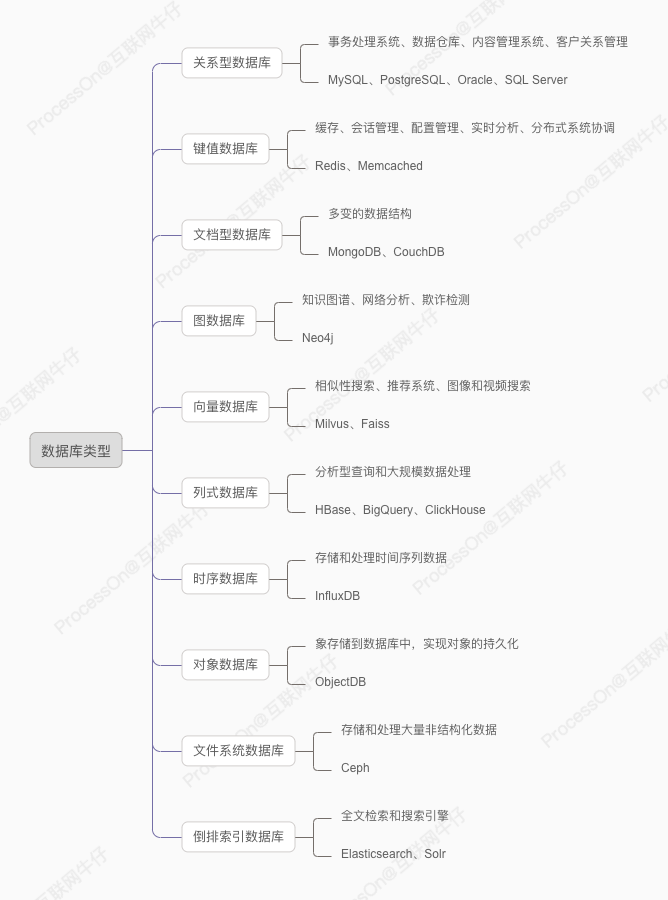

# 数据库种类

根据存储方式的不同，数据库可以分为不同种类。每种类型的数据库，都有各自使用场景以及不同的产品。



## 关系型数据库

关系型数据库（RDBMS）基于关系模型，通过表（Table）的形式来组织数据，并通过主键、外键等机制来管理表之间的关系。

### 核心概念

1. **数据存储结构**：
    - **表（Tables）**：数据以行（记录）和列（字段）的形式存储在表中。
    - **模式（Schema）**：定义了表的结构，包括字段的名称、数据类型和约束条件。

2. **关系（Relationships）**：
    - **主键（Primary Key）**：唯一标识表中的每一行。
    - **外键（Foreign Key）**：用于建立表与表之间的关系。

3. **SQL（结构化查询语言）**：
    - 用于查询、插入、更新和删除数据，以及管理数据库结构。
    - 例如：SELECT、INSERT、UPDATE、DELETE 等操作。

4. **事务（Transactions）**：
    - 事务是一组逻辑操作单元，具有ACID特性（原子性、一致性、隔离性、持久性）。
    - 事务管理确保数据的一致性和完整性。

5. **并发控制（Concurrency Control）**：
    - 通过锁（Locks）和多版本并发控制（MVCC）来管理并发访问，确保数据一致性和隔离性。

6. **存储引擎（Storage Engine）**：
    - 负责数据的物理存储和检索。
    - 不同的数据库管理系统使用不同的存储引擎（如 InnoDB、WAL）。

### 使用场景

1. **事务处理系统**：需要高一致性和可靠性的场景，如银行系统、订单处理系统。
2. **数据仓库**：用于存储和分析大量结构化数据。
3. **内容管理系统（CMS）**：用于管理和发布内容。
4. **客户关系管理（CRM）系统**：管理客户信息和交互记录。
5. **企业资源规划（ERP）系统**：集成和管理企业的业务流程和数据。

### 对应产品

1. **MySQL**：
    - 开源，广泛使用，适合中小型应用。
2. **PostgreSQL**：
    - 开源，功能强大，适合需要复杂数据处理的应用。
3. **Oracle Database**：
    - 商业产品，功能丰富，广泛应用于大型企业。
4. **Microsoft SQL Server**：
    - 商业产品，与微软生态系统集成良好。
5. **SQLite**：
    - 嵌入式数据库，轻量级，适合移动应用和嵌入式系统。

### 代码示例

以下是一个使用 MySQL 数据库的简单 Python 应用示例，展示了如何创建表、插入数据、查询数据。

```python
import mysql.connector

# 连接到数据库
db = mysql.connector.connect(
    host="localhost",
    user="yourusername",
    password="yourpassword",
    database="testdb"
)

cursor = db.cursor()

# 创建表
cursor.execute("CREATE TABLE IF NOT EXISTS users (id INT AUTO_INCREMENT PRIMARY KEY, name VARCHAR(255), email VARCHAR(255))")

# 插入数据
sql = "INSERT INTO users (name, email) VALUES (%s, %s)"
val = ("John Doe", "john@example.com")
cursor.execute(sql, val)

db.commit()

print(cursor.rowcount, "record inserted.")

# 查询数据
cursor.execute("SELECT * FROM users")
result = cursor.fetchall()

for row in result:
    print(row)

# 关闭连接
db.close()
```

### 解释

1. **连接到数据库**：使用 `mysql.connector.connect` 方法连接到 MySQL 数据库。
2. **创建表**：使用 `CREATE TABLE` SQL 语句创建一个名为 `users` 的表，包含 `id`、`name` 和 `email` 列。
3. **插入数据**：使用 `INSERT INTO` SQL 语句向 `users` 表插入一条记录。
4. **查询数据**：使用 `SELECT * FROM` SQL 语句查询 `users` 表中的所有记录，并打印每一行。
5. **关闭连接**：操作完成后关闭数据库连接。

## 键值数据库

键值数据库（Key-Value Store）是一种NoSQL数据库，它通过键（Key）-值（Value）的方式存储数据。每个键唯一标识一个值，可以快速存取数据。

### 核心概念

1. **简单的数据模型**：
    - **键（Key）**：唯一标识数据的标识符，可以是字符串、数字或其他数据类型。
    - **值（Value）**：与键关联的数据，可以是任意数据类型（如字符串、JSON对象、二进制数据等）。

2. **高效的查找**：
    - 键值数据库使用哈希表或树形数据结构来存储和查找数据，查找操作通常是O(1)时间复杂度，非常高效。
    - 通过键快速访问对应的值，无需复杂的查询语法。

3. **分布式存储**：
    - 许多键值数据库支持分布式存储，将数据分布在多个节点上，提高数据的可用性和扩展性。
    - 通过一致性哈希等技术实现数据的分布和负载均衡。

4. **高可用性和持久性**：
    - 支持数据复制和持久化，确保数据在系统故障时不会丢失。
    - 通过主从复制、日志记录等机制实现数据的高可用性和持久性。

### 使用场景

键值数据库适用于以下场景：

1. **缓存**：用于存储频繁访问的数据，提高读取性能，如网页缓存、会话存储等。
2. **会话管理**：用于存储用户会话信息，如用户登录状态、购物车等。
3. **配置管理**：用于存储应用程序的配置参数，如服务注册和发现、配置中心等。
4. **实时分析**：用于存储和处理实时数据，如点击流数据、传感器数据等。
5. **分布式系统协调**：用于分布式系统中的锁、队列、元数据存储等。

### 对应产品

1. **Redis**：
    - 开源的内存键值数据库，支持丰富的数据结构（字符串、哈希、列表、集合等），高性能、高可用。
2. **Amazon DynamoDB**：
    - AWS 提供的完全托管的键值和文档数据库，具有高扩展性和高可用性。
3. **Riak**：
    - 开源分布式键值数据库，具有高可用性和容错性。
4. **Aerospike**：
    - 高性能分布式键值数据库，适用于实时数据处理和分析。
5. **Memcached**：
    - 高性能的内存缓存系统，常用于提高动态Web应用的响应速度。

### 应用示例

以下是一个使用 Redis 的简单 Python 应用示例，展示了如何设置键值对、获取值和删除键。

```python
import redis

# 连接到 Redis 服务器
client = redis.StrictRedis(host='localhost', port=6379, db=0)

# 设置键值对
client.set('name', 'Alice')
client.set('age', 30)

# 获取值
name = client.get('name').decode('utf-8')
age = int(client.get('age'))

print(f"Name: {name}, Age: {age}")

# 删除键
client.delete('name')
client.delete('age')

# 检查键是否存在
if not client.exists('name') and not client.exists('age'):
    print("Keys 'name' and 'age' have been deleted")
```

### 解释

1. **连接到 Redis 服务器**：使用 `redis.StrictRedis` 连接到本地的 Redis 服务器。
2. **设置键值对**：使用 `set` 方法设置键 `name` 的值为 `Alice`，键 `age` 的值为 `30`。
3. **获取值**：使用 `get` 方法获取键 `name` 和 `age` 的值，并进行类型转换和打印。
4. **删除键**：使用 `delete` 方法删除键 `name` 和 `age`。
5. **检查键是否存在**：使用 `exists` 方法检查键是否存在，并打印结果。

## 文档型数据库

文档型数据库是一种NoSQL数据库，它以文档的形式存储数据。每个文档是一个自包含的数据单元，通常以JSON、BSON、XML或类似格式表示。

### 核心概念

1. **数据存储结构**：
    - **文档（Documents）**：文档是基本的存储单元，类似于关系型数据库中的行，但具有更复杂和灵活的结构。
    - **集合（Collections）**：文档存储在集合中，集合相当于关系型数据库中的表，但集合内的文档结构可以是不同的。

2. **模式灵活性（Schema Flexibility）**：
    - 文档型数据库不要求固定的模式，可以存储结构不同的文档。这使得它非常灵活，能够适应快速变化的数据需求。

3. **嵌套结构**：
    - 文档可以包含嵌套的子文档和数组，适合表示复杂的层次结构数据。

4. **索引（Indexes）**：
    - 支持对文档中的字段创建索引，以加快查询速度。

5. **查询和操作**：
    - 提供强大的查询语言，支持丰富的查询条件、聚合操作和全文搜索。
    - 可以使用多种方法来插入、更新、删除和检索文档。

### 使用场景

文档型数据库适用于以下场景，尤其多变的数据结构：

1. **内容管理系统（CMS）**：需要存储和管理大量多样化的内容，如文章、博客、评论等。
2. **电商平台**：产品目录、用户信息、订单等数据具有多变的结构。
3. **日志和事件存储**：处理和存储大量结构化和半结构化的日志数据。
4. **实时分析和大数据处理**：需要快速处理和分析大量数据的应用。
5. **社交媒体和网络应用**：用户生成的内容具有多变的结构。

### 对应产品

1. **MongoDB**：
    - 最流行的文档型数据库，使用BSON格式存储文档，提供丰富的查询和聚合功能。
2. **CouchDB**：
    - 使用JSON格式存储文档，支持强大的分布式处理和冲突解决机制。
3. **RethinkDB**：
    - 实时数据库，支持实时更新和查询，非常适合实时应用。
4. **ArangoDB**：
    - 多模型数据库，支持文档、图形和键值存储，具有灵活的查询语言。

### 应用示例

以下是一个使用 MongoDB 的简单 Python 应用示例，展示了如何创建集合、插入文档、查询文档。

```python
from pymongo import MongoClient

# 连接到 MongoDB
client = MongoClient('localhost', 27017)

# 选择数据库
db = client['testdb']

# 选择集合
collection = db['users']

# 插入文档
user = {"name": "John Doe", "email": "john@example.com", "age": 30}
collection.insert_one(user)

# 查询文档
result = collection.find_one({"name": "John Doe"})
print(result)

# 更新文档
collection.update_one({"name": "John Doe"}, {"$set": {"age": 31}})

# 删除文档
collection.delete_one({"name": "John Doe"})

# 关闭连接
client.close()
```

### 解释

1. **连接到 MongoDB**：使用 `MongoClient` 连接到 MongoDB 服务器。
2. **选择数据库和集合**：选择名为 `testdb` 的数据库和 `users` 集合。
3. **插入文档**：使用 `insert_one` 方法向 `users` 集合插入一个文档。
4. **查询文档**：使用 `find_one` 方法根据条件查询 `users` 集合中的一个文档。
5. **更新文档**：使用 `update_one` 方法更新符合条件的文档。
6. **删除文档**：使用 `delete_one` 方法删除符合条件的文档。
7. **关闭连接**：操作完成后关闭数据库连接。

## 图数据库

图数据库是一种NoSQL数据库，专门用于存储和管理图形结构的数据。图由节点（Vertices）和边（Edges）组成，节点表示实体，边表示实体之间的关系。

### 核心概念

1. **节点（Vertices）**：
    - 节点是图的基本单元，表示实体，例如人、地方、物品等。
    - 每个节点可以有多个属性（Properties），描述其特征。

2. **边（Edges）**：
    - 边连接两个节点，表示节点之间的关系，例如朋友关系、交易关系等。
    - 每条边也可以有多个属性，描述其特征。

3. **图（Graph）**：
    - 整个图由节点和边组成，表示一个复杂的关系网络。
    - 图数据库通过图数据模型存储和管理这些节点和边。

4. **索引（Indexes）**：
    - 图数据库通过索引来加速节点和边的查找。
    - 一些图数据库支持全图扫描和遍历以提高查询性能。

5. **查询语言**：
    - 图数据库通常使用专门的查询语言，如 Cypher（用于 Neo4j）、Gremlin（用于 Apache TinkerPop）、SPARQL（用于 RDF 图数据库）等。

### 使用场景

图数据库适用于以下场景：

1. **社交网络**：管理用户和关系网络，如朋友、关注者等。
2. **推荐系统**：通过分析用户与产品之间的关系进行推荐。
3. **网络分析**：分析网络结构和路径，如电信网络、运输网络等。
4. **知识图谱**：表示和查询复杂的知识结构和关系。
5. **欺诈检测**：通过分析交易和账户之间的关系检测欺诈行为。

### 对应产品

1. **Neo4j**：
    - 最流行的图数据库，使用 Cypher 查询语言，适用于各种图数据应用。
2. **Amazon Neptune**：
    - AWS 提供的完全托管图数据库服务，支持 Gremlin 和 SPARQL。
3. **ArangoDB**：
    - 多模型数据库，支持图、文档和键值存储。
4. **JanusGraph**：
    - 分布式图数据库，适合处理大规模图数据。
5. **OrientDB**：
    - 多模型数据库，支持图、文档、键值和对象存储。

### 应用示例

以下是一个使用 Neo4j 的简单 Python 应用示例，展示了如何创建节点和边、查询数据。

```python
from neo4j import GraphDatabase

# 连接到 Neo4j 数据库
uri = "bolt://localhost:7687"
driver = GraphDatabase.driver(uri, auth=("neo4j", "password"))

def create_friendship(tx, name1, name2):
    tx.run("MERGE (a:Person {name: $name1}) "
           "MERGE (b:Person {name: $name2}) "
           "MERGE (a)-[:FRIEND]->(b)",
           name1=name1, name2=name2)

def find_friends(tx, name):
    result = tx.run("MATCH (a:Person)-[:FRIEND]->(b:Person) "
                    "WHERE a.name = $name "
                    "RETURN b.name", name=name)
    for record in result:
        print(record["b.name"])

# 创建节点和边
with driver.session() as session:
    session.write_transaction(create_friendship, "Alice", "Bob")
    session.write_transaction(create_friendship, "Alice", "Charlie")

# 查询数据
with driver.session() as session:
    print("Friends of Alice:")
    session.read_transaction(find_friends, "Alice")

# 关闭连接
driver.close()
```

### 解释

1. **连接到 Neo4j**：使用 `GraphDatabase.driver` 方法连接到 Neo4j 数据库。
2. **创建节点和边**：使用 `MERGE` 语句创建或查找名为 `Alice` 和 `Bob` 的节点，并创建 `FRIEND` 关系。
3. **查询数据**：使用 `MATCH` 语句查找 `Alice` 的朋友，并打印朋友的名字。
4. **关闭连接**：操作完成后关闭数据库连接。

## 向量数据库

向量数据库是一种专门用于存储、检索和管理高维向量数据的数据库系统。

### 核心概念

1. **向量表示（Vector Representation）**：
    - 数据以向量的形式存储，每个向量是一个高维数值数组，表示数据点在多维空间中的位置。
    - 向量通常通过机器学习模型生成，例如通过词嵌入模型（如 Word2Vec、BERT）将文本转换为向量，或通过卷积神经网络（CNN）将图像转换为向量。

2. **相似性搜索（Similarity Search）**：
    - 向量数据库通过计算向量之间的相似性（如欧氏距离、余弦相似度）来检索相似的向量。
    - 常见的相似性搜索算法包括暴力搜索、局部敏感哈希（LSH）、向量量化（VQ）等。

3. **索引结构（Indexing Structure）**：
    - 向量数据库使用高效的索引结构来加速相似性搜索，例如KD树、球树（Ball Tree）、HNSW（Hierarchical Navigable Small World）等。
    - 索引结构在构建时需要平衡搜索效率和索引构建时间。

4. **向量存储（Vector Storage）**：
    - 数据库需要高效地存储大量高维向量，通常会优化存储布局和压缩技术以减少存储空间和提高访问速度。

### 使用场景

向量数据库适用于以下场景：

1. **推荐系统**：根据用户行为和偏好，使用向量相似性检索推荐相似的产品、内容或服务。
2. **图像和视频搜索**：通过向量化图像和视频内容，实现以图搜图、相似图像和视频检索。
3. **自然语言处理**：通过向量化文本，进行相似文本搜索、问答系统和文档推荐等应用。
4. **生物信息学**：在基因组数据中，进行相似基因序列的搜索和分析。
5. **金融数据分析**：对股票、市场数据等进行相似性分析和聚类。

### 对应产品

1. **Milvus**：
    - 开源向量数据库，专为大规模向量数据存储和相似性搜索设计。
2. **Pinecone**：
    - 商业向量数据库服务，提供托管向量搜索和管理解决方案。
3. **Weaviate**：
    - 开源向量数据库，支持基于向量的搜索和知识图谱。
4. **Faiss**：
    - Facebook AI Research 开发的高效向量相似性搜索库，适合大规模数据集。
5. **Annoy**：
    - Spotify 开发的高维向量相似性搜索库，适合内存中的大规模数据集。

### 应用示例

以下是一个使用 Milvus 的简单 Python 应用示例，展示了如何创建集合、插入向量、进行相似性搜索。

```python
from pymilvus import connections, FieldSchema, CollectionSchema, DataType, Collection

# 连接到 Milvus
connections.connect("default", host="localhost", port="19530")

# 定义字段
fields = [
    FieldSchema(name="id", dtype=DataType.INT64, is_primary=True),
    FieldSchema(name="embedding", dtype=DataType.FLOAT_VECTOR, dim=128)
]

# 创建集合
schema = CollectionSchema(fields)
collection = Collection(name="example_collection", schema=schema)
collection.create_index("embedding", index_params={"index_type": "IVF_FLAT", "metric_type": "L2", "params": {"nlist": 128}})

# 插入向量
import numpy as np
vectors = np.random.random([10, 128]).astype(np.float32)
ids = [i for i in range(10)]
collection.insert([ids, vectors])

# 向量相似性搜索
query_vectors = vectors[:1]
search_params = {"metric_type": "L2", "params": {"nprobe": 10}}
results = collection.search(query_vectors, "embedding", search_params, limit=3)

for result in results:
    for hit in result:
        print(f"ID: {hit.id}, Distance: {hit.distance}")

# 断开连接
connections.disconnect("default")
```

### 解释

1. **连接到 Milvus**：使用 `connections.connect` 方法连接到 Milvus 数据库。
2. **定义字段**：定义集合的模式，包括主键 `id` 和向量 `embedding`。
3. **创建集合**：使用定义的模式创建一个集合 `example_collection`。
4. **插入向量**：生成随机向量数据并插入集合中。
5. **向量相似性搜索**：对查询向量进行相似性搜索，返回与查询向量最相似的向量ID和距离。
6. **断开连接**：操作完成后断开数据库连接。

## 列式数据库

列式数据库（Columnar Database）是一种以列为单位存储数据的数据库系统，特别适合于分析型查询和大规模数据处理。

### 核心概念

1. **列存储结构**：
   - 数据按列而不是按行存储，每列的数据存放在一起，这种存储方式优化了I/O操作。
   - 列式存储使得对单列的读取操作更加高效，因为只需要读取相关列的数据，而不是整行数据。

2. **数据压缩**：
   - 由于同一列的数据类型相同且相似度高，列式数据库可以进行高效的压缩，减少存储空间并加快数据读取速度。
   - 常见的压缩算法包括RLE（Run-Length Encoding）、字典编码、位图编码等。

3. **向量化处理**：
   - 列式数据库利用向量化处理技术，在单指令多数据（SIMD）架构上对数据进行批量处理，提高查询效率。
   - 向量化处理能够同时操作一列中的多个值，显著提高处理速度。

4. **延迟写入（Late Materialization）**：
   - 查询时延迟读取和处理数据，直到确定需要返回的列和数据范围，从而减少不必要的I/O操作。

5. **并行处理**：
   - 列式数据库通常支持大规模并行处理（MPP），能够利用多核处理器和分布式计算资源，加快查询速度。

### 使用场景

列式数据库适用于以下场景：

1. **数据仓库和在线分析处理（OLAP）**：大规模数据的存储和查询分析，如商业智能、报表生成和数据挖掘。
2. **实时数据分析**：需要快速处理和分析实时数据的应用，如监控系统、实时推荐系统。
3. **时间序列数据处理**：处理和分析大量时间序列数据，如物联网数据、金融市场数据。
4. **日志分析**：大规模日志数据的存储和查询，如应用日志、系统日志、访问日志分析。

### 对应产品

1. **Amazon Redshift**：
   - AWS 提供的完全托管的列式数据库服务，适用于大规模数据分析和数据仓库。
2. **Google BigQuery**：
   - Google Cloud 提供的无服务器数据仓库，支持SQL查询，适用于大规模数据分析。
3. **Apache HBase**：
   - 开源的分布式列存储数据库，适用于大规模数据存储和快速查询。
4. **Apache Kudu**：
   - 开源的列式存储引擎，适用于实时数据分析和数据流处理。
5. **ClickHouse**：
   - 开源的列式数据库，设计用于高性能的实时数据分析。

### 应用示例

以下是一个使用 ClickHouse 的简单 Python 应用示例，展示了如何创建表、插入数据、查询数据。

```python
from clickhouse_driver import Client

# 连接到 ClickHouse
client = Client(host='localhost')

# 创建数据库
client.execute('CREATE DATABASE IF NOT EXISTS testdb')

# 使用数据库
client.execute('USE testdb')

# 创建表
client.execute('''
CREATE TABLE IF NOT EXISTS users (
    id UInt32,
    name String,
    age UInt8
) ENGINE = MergeTree()
ORDER BY id
''')

# 插入数据
client.execute('INSERT INTO users (id, name, age) VALUES', [
    (1, 'Alice', 30),
    (2, 'Bob', 25),
    (3, 'Charlie', 35)
])

# 查询数据
result = client.execute('SELECT * FROM users WHERE age > 25')
for row in result:
    print(row)

# 删除表
client.execute('DROP TABLE IF EXISTS users')

# 删除数据库
client.execute('DROP DATABASE IF EXISTS testdb')
```

### 解释

1. **连接到 ClickHouse**：使用 `clickhouse_driver.Client` 连接到 ClickHouse 数据库。
2. **创建数据库**：使用 `CREATE DATABASE` 语句创建一个名为 `testdb` 的数据库。
3. **使用数据库**：使用 `USE` 语句切换到 `testdb` 数据库。
4. **创建表**：使用 `CREATE TABLE` 语句创建一个名为 `users` 的表，定义了 `id`、`name` 和 `age` 列，使用 MergeTree 存储引擎。
5. **插入数据**：使用 `INSERT INTO` 语句向 `users` 表插入几条记录。
6. **查询数据**：使用 `SELECT` 语句查询 `age` 大于 25 的用户，并打印结果。
7. **删除表和数据库**：使用 `DROP TABLE` 和 `DROP DATABASE` 语句删除表和数据库。

## 时序数据库

时序数据库（Time-Series Database, TSDB）是一种专门用于存储和处理时间序列数据的数据库系统。

时间序列数据是按时间顺序排列的一组数据点，常见于金融、物联网（IoT）、监控系统等领域。

### 核心概念


1. **时间序列数据模型**：
   - **时间戳（Timestamp）**：每个数据点都有一个唯一的时间戳，用于标识数据点的时间。
   - **数据点（Data Points）**：每个数据点由时间戳和一个或多个字段组成，字段可以是数值、字符串等。

2. **高效写入**：
   - 时序数据库通常设计为高效处理大量数据点的快速写入，支持高吞吐量的实时数据写入。
   - 数据压缩和批量写入是常见的优化手段。

3. **数据压缩和存储优化**：
   - 时序数据通常具有较高的相似性和重复性，时序数据库使用专门的压缩算法来减少存储空间。
   - 常见的压缩算法包括 Gorilla、Run-Length Encoding、Delta Encoding 等。

4. **查询优化**：
   - 时序数据库优化了时间范围查询、聚合查询和降采样（Downsampling）。
   - 支持多种聚合函数（如平均值、最大值、最小值、求和）和窗口函数。

5. **数据保留策略**：
   - 支持数据生命周期管理（Data Retention Policies），自动删除过期数据。
   - 支持数据降采样，以减少存储空间和提高查询效率。

### 使用场景

时序数据库适用于以下场景：

1. **物联网（IoT）**：采集和分析传感器数据、设备状态和事件数据。
2. **金融市场**：存储和分析股票、期货、外汇等金融市场的交易数据。
3. **监控和告警**：存储和分析系统监控数据、日志数据、应用性能数据，支持实时告警。
4. **电力和能源**：监控和分析电力设备运行状态、能源消耗和生产数据。
5. **医疗健康**：存储和分析患者的健康数据、设备监控数据。

### 对应产品

1. **InfluxDB**：
   - 开源的时序数据库，提供高效的数据写入和查询性能，支持丰富的查询语言。
2. **TimescaleDB**：
   - 基于 PostgreSQL 的时序数据库，提供时序数据扩展，支持 SQL 查询。
3. **OpenTSDB**：
   - 基于 HBase 的时序数据库，设计用于处理大规模时序数据。

### 应用示例

以下是一个使用 InfluxDB 的简单 Python 应用示例，展示了如何创建数据库、插入数据、查询数据。

```python
from influxdb import InfluxDBClient

# 连接到 InfluxDB
client = InfluxDBClient(host='localhost', port=8086)

# 创建数据库
client.create_database('example_db')

# 选择数据库
client.switch_database('example_db')

# 插入数据
json_body = [
    {
        "measurement": "temperature",
        "tags": {
            "location": "office"
        },
        "time": "2023-06-20T23:00:00Z",
        "fields": {
            "value": 23.5
        }
    },
    {
        "measurement": "temperature",
        "tags": {
            "location": "office"
        },
        "time": "2023-06-20T23:01:00Z",
        "fields": {
            "value": 23.7
        }
    }
]

client.write_points(json_body)

# 查询数据
result = client.query('SELECT * FROM temperature WHERE location=\'office\'')

# 打印查询结果
for point in result.get_points():
    print(f"Time: {point['time']}, Value: {point['value']}")

# 删除数据库
client.drop_database('example_db')
```

### 解释

1. **连接到 InfluxDB**：使用 `InfluxDBClient` 连接到 InfluxDB 服务器。
2. **创建数据库**：使用 `create_database` 方法创建一个名为 `example_db` 的数据库。
3. **选择数据库**：使用 `switch_database` 方法切换到 `example_db` 数据库。
4. **插入数据**：创建包含时间戳、测量名称、标签和字段的数据点，并插入到数据库中。
5. **查询数据**：使用 `query` 方法执行 SQL 查询，检索 `temperature` 测量的数据。
6. **打印查询结果**：遍历查询结果并打印时间和温度值。
7. **删除数据库**：使用 `drop_database` 方法删除 `example_db` 数据库。

## 对象数据库

对象数据库（Object Database，ODB）是一种直接支持面向对象编程的数据库系统，通过将对象存储到数据库中，实现对象的持久化。

### 核心概念

1. **对象模型**：
   - 数据以对象的形式存储，对象包括属性（字段）和方法。
   - 支持复杂的数据类型，包括嵌套对象、数组和集合。

2. **对象标识（OID）**：
   - 每个对象都有一个唯一的对象标识符（OID），用于标识和访问对象。
   - OID 类似于关系型数据库中的主键，但在对象数据库中是系统生成的。

3. **对象关系映射（ORM）**：
   - 对象数据库可以通过对象关系映射（ORM）工具与面向对象编程语言集成，直接存储和检索对象。
   - ORM 工具简化了对象和数据库之间的数据转换过程。

4. **事务管理**：
   - 支持事务，保证数据的一致性和完整性。
   - 提供ACID（原子性、一致性、隔离性、持久性）事务特性。

5. **查询语言**：
   - 支持面向对象的查询语言，如OQL（Object Query Language），也可以与SQL集成。

### 使用场景

对象数据库适用于以下场景：

1. **复杂数据模型**：适合具有复杂数据结构的应用，如CAD/CAM、地理信息系统（GIS）、多媒体系统等。
2. **对象持久化**：适合需要将面向对象编程语言中的对象直接持久化的应用，如Java、C++等编程环境中的应用。
3. **实时系统**：适合需要高效对象存储和快速访问的实时系统，如嵌入式系统和控制系统。
4. **数据集成**：适合需要集成多个数据源和复杂数据模型的应用，如企业应用集成（EAI）。

### 对应产品

1. **db4o**：
   - 开源对象数据库，支持Java和.NET平台，易于嵌入应用程序中。
2. **ObjectDB**：
   - 面向Java的高性能对象数据库，支持JPA和JDO标准。
3. **Versant Object Database**：
   - 高性能对象数据库，支持复杂数据模型和高并发访问。
4. **GemStone/S**：
   - 面向Smalltalk的对象数据库，支持分布式对象和事务处理。
5. **ODMG**：
   - 提供对象数据库管理标准，支持多种编程语言和数据库系统。

### 应用示例

以下是一个使用 db4o 的简单 Java 应用示例，展示了如何创建对象、插入数据、查询数据。

```java
import com.db4o.*;
import com.db4o.query.*;

public class Db4oExample {
    public static void main(String[] args) {
        // 打开数据库
        ObjectContainer db = Db4oEmbedded.openFile(Db4oEmbedded.newConfiguration(), "example.db4o");

        try {
            // 插入对象
            Person person = new Person("Alice", 30);
            db.store(person);

            // 查询对象
            Query query = db.query();
            query.constrain(Person.class);
            query.descend("name").constrain("Alice");
            ObjectSet<Person> result = query.execute();

            // 打印查询结果
            for (Person p : result) {
                System.out.println(p);
            }
        } finally {
            // 关闭数据库
            db.close();
        }
    }

    public static class Person {
        private String name;
        private int age;

        public Person(String name, int age) {
            this.name = name;
            this.age = age;
        }

        public String getName() {
            return name;
        }

        public int getAge() {
            return age;
        }

        @Override
        public String toString() {
            return "Person{name='" + name + "', age=" + age + '}';
        }
    }
}
```

### 解释

1. **打开数据库**：使用 `Db4oEmbedded.openFile` 方法打开一个 db4o 数据库文件。
2. **插入对象**：创建一个 `Person` 对象，并使用 `db.store` 方法将其存储到数据库中。
3. **查询对象**：使用 db4o 查询 API 构建查询条件，查询名称为 "Alice" 的 `Person` 对象。
4. **打印查询结果**：遍历查询结果并打印每个 `Person` 对象的信息。
5. **关闭数据库**：操作完成后关闭数据库连接。

## 文件系统数据库

文件系统数据库是一种将文件系统和数据库功能相结合的存储系统。它通常用于管理和检索大量文件和非结构化数据，同时提供数据库的一些高级功能，如索引、查询和事务管理。

### 核心概念

1. **文件和元数据存储**：
   - **文件存储**：实际的文件内容存储在文件系统中，通常以块或对象的形式进行存储。
   - **元数据存储**：文件的元数据（如文件名、大小、创建时间、权限等）存储在数据库中，以便快速检索和管理。

2. **索引和查询**：
   - 文件系统数据库通过索引加速对文件和元数据的查询。
   - 支持丰富的查询功能，允许用户按文件名、类型、日期等属性进行搜索。

3. **事务管理**：
   - 提供事务管理功能，确保文件操作的原子性、一致性、隔离性和持久性（ACID）。

4. **数据一致性**：
   - 保证文件和元数据之间的一致性，通过事务和日志机制防止数据丢失或损坏。

5. **分布式存储**：
   - 文件系统数据库通常设计为分布式系统，能够跨多个节点存储和访问数据，提供高可用性和可扩展性。

### 使用场景

文件系统数据库适用于以下场景：

1. **内容管理系统（CMS）**：存储和管理大量文档、图像、视频等文件。
2. **媒体存储和分发**：管理和分发大规模的音频、视频文件。
3. **备份和归档**：存储和管理大量备份文件和归档数据。
4. **大数据分析**：存储和处理大量非结构化数据，如日志文件、大数据集等。
5. **科学研究**：管理和存储大量实验数据、研究论文、数据集等。

### 对应产品

1. **Hadoop Distributed File System (HDFS)**：
   - 分布式文件系统，支持大规模数据存储和处理。
2. **Amazon S3**：
   - AWS 提供的对象存储服务，支持大规模文件存储和管理。
3. **Google Cloud Storage**：
   - Google 提供的对象存储服务，支持全球范围内的文件存储和访问。
4. **Ceph**：
   - 开源分布式存储系统，支持对象存储、块存储和文件系统存储。
5. **MinIO**：
   - 高性能对象存储服务，兼容Amazon S3 API。

### 应用示例

以下是一个使用 Python 和 MinIO 的简单应用示例，展示了如何上传文件、下载文件和查询文件元数据。

```python
from minio import Minio
from minio.error import S3Error

# 连接到 MinIO
client = Minio(
    "localhost:9000",
    access_key="minioadmin",
    secret_key="minioadmin",
    secure=False
)

# 创建桶
bucket_name = "my-bucket"
if not client.bucket_exists(bucket_name):
    client.make_bucket(bucket_name)
else:
    print(f"Bucket '{bucket_name}' already exists")

# 上传文件
file_path = "example.txt"
client.fput_object(bucket_name, "example.txt", file_path)
print(f"File '{file_path}' uploaded successfully")

# 下载文件
client.fget_object(bucket_name, "example.txt", "downloaded_example.txt")
print("File 'example.txt' downloaded successfully")

# 查询文件元数据
stat = client.stat_object(bucket_name, "example.txt")
print(f"File metadata: {stat}")

# 删除文件
client.remove_object(bucket_name, "example.txt")
print("File 'example.txt' deleted successfully")
```

### 解释

1. **连接到 MinIO**：使用 `Minio` 客户端连接到 MinIO 服务器。
2. **创建桶**：检查是否存在名为 `my-bucket` 的桶，如果不存在则创建该桶。
3. **上传文件**：使用 `fput_object` 方法将本地文件 `example.txt` 上传到桶中。
4. **下载文件**：使用 `fget_object` 方法从桶中下载文件 `example.txt` 并保存为 `downloaded_example.txt`。
5. **查询文件元数据**：使用 `stat_object` 方法获取文件 `example.txt` 的元数据。
6. **删除文件**：使用 `remove_object` 方法删除桶中的文件 `example.txt`。

## 倒排索引数据库

倒排索引数据库是一种专门用于全文检索和搜索引擎的数据库系统。

### 核心概念

1. **倒排索引结构**：
   - **词条（Term）**：倒排索引的基本单位，每个词条表示一个唯一的词。
   - **文档列表（Document List）**：对于每个词条，维护一个文档列表，记录该词条出现在哪些文档中。
   - **位置列表（Position List）**：有时还会记录每个词条在文档中的具体位置，用于实现短语查询和精确匹配。

2. **索引构建**：
   - **解析文档**：将文档内容解析为单独的词条，通常需要进行分词、去停用词、词干提取等预处理。
   - **建立词典**：创建包含所有词条的词典，并为每个词条建立对应的文档列表和位置列表。

3. **查询处理**：
   - **布尔查询**：支持AND、OR、NOT等布尔操作，结合多个词条的倒排索引进行查询。
   - **短语查询**：利用位置列表实现精确的短语匹配。
   - **排序和评分**：基于词频（TF）、逆文档频率（IDF）等算法对查询结果进行排序和评分。

4. **优化和压缩**：
   - 使用各种压缩技术（如字典压缩、位图索引）减少索引存储空间。
   - 优化查询算法，提高查询效率。

### 使用场景

倒排索引数据库适用于以下场景：

1. **搜索引擎**：用于实现大规模文档的全文搜索和快速检索。
2. **内容管理系统（CMS）**：提供内容的全文搜索功能。
3. **日志分析**：对大量日志数据进行全文检索和分析。
4. **电子商务**：提供产品信息的搜索和过滤功能。
5. **数据挖掘**：对文本数据进行分析和挖掘。

### 对应产品

1. **Elasticsearch**：
   - 基于Apache Lucene，广泛应用于日志分析、全文搜索和数据分析。
2. **Apache Solr**：
   - 也是基于Apache Lucene，提供强大的搜索和分析功能。
3. **Whoosh**：
   - 纯Python实现的全文搜索库，适用于小型项目。
4. **Sphinx**：
   - 开源全文搜索引擎，支持多种数据库和全文搜索功能。
5. **Xapian**：
   - 开源全文搜索引擎库，支持多种编程语言绑定。

### 应用示例

以下是一个使用 Elasticsearch 的简单 Python 应用示例，展示了如何创建索引、插入文档、查询数据。

```python
from elasticsearch import Elasticsearch

# 连接到 Elasticsearch
es = Elasticsearch(['http://localhost:9200'])

# 创建索引
index_name = 'example_index'
if not es.indices.exists(index=index_name):
    es.indices.create(index=index_name)
    print(f"Index '{index_name}' created")

# 插入文档
doc = {
    'title': 'Elasticsearch Basics',
    'content': 'Elasticsearch is a distributed, RESTful search and analytics engine.'
}
res = es.index(index=index_name, id=1, document=doc)
print(f"Document inserted: {res['result']}")

# 查询文档
search_query = {
    'query': {
        'match': {
            'content': 'search engine'
        }
    }
}
res = es.search(index=index_name, body=search_query)
print("Search results:")
for hit in res['hits']['hits']:
    print(hit['_source'])

# 删除索引
es.indices.delete(index=index_name)
print(f"Index '{index_name}' deleted")
```

### 解释

1. **连接到 Elasticsearch**：使用 `Elasticsearch` 客户端连接到本地的 Elasticsearch 服务器。
2. **创建索引**：检查是否存在名为 `example_index` 的索引，如果不存在则创建该索引。
3. **插入文档**：创建包含标题和内容的文档，并将其插入到 `example_index` 索引中。
4. **查询文档**：使用 `match` 查询，检索内容包含 "search engine" 的文档，并打印查询结果。
5. **删除索引**：操作完成后删除 `example_index` 索引。
