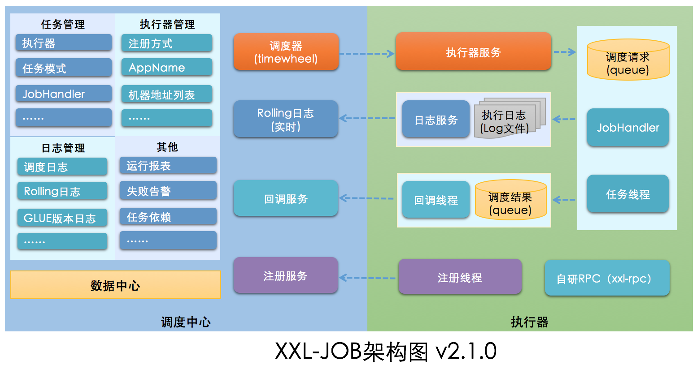
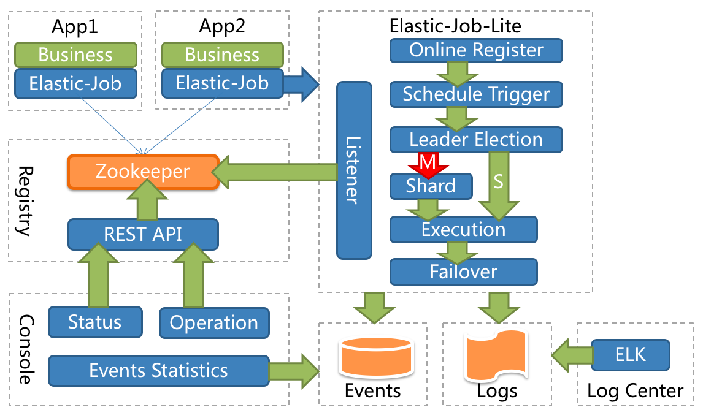
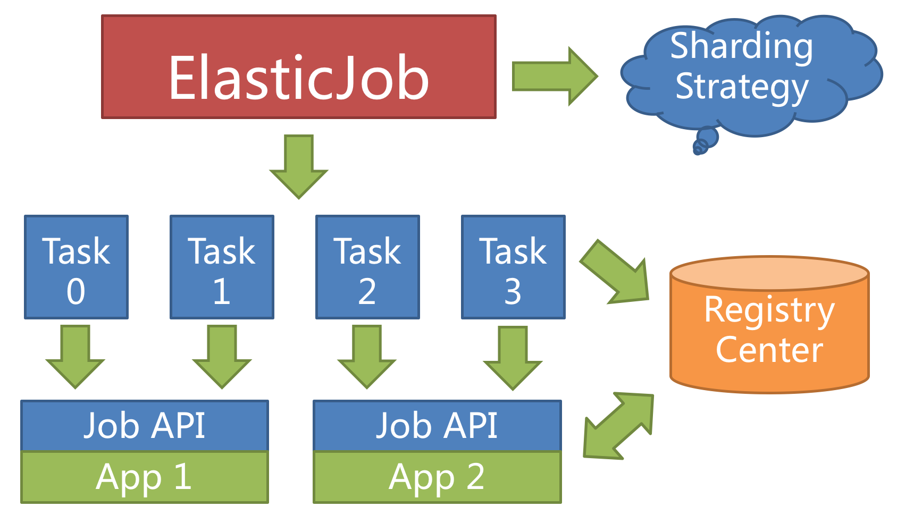
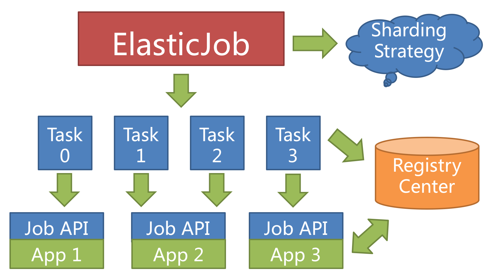
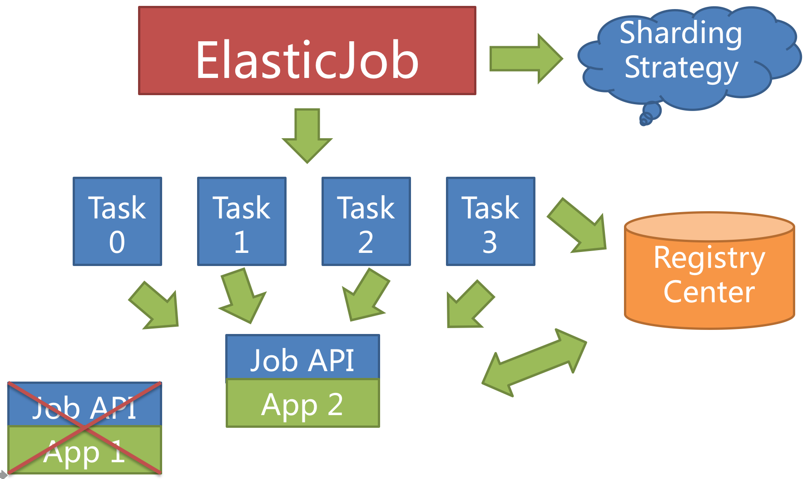
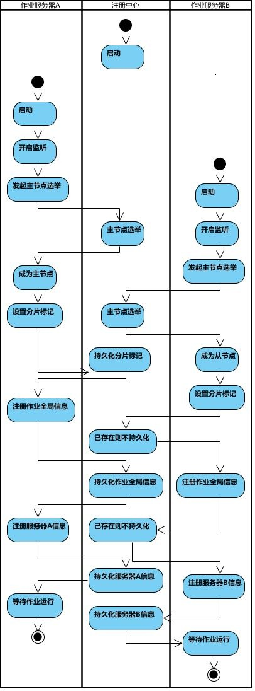
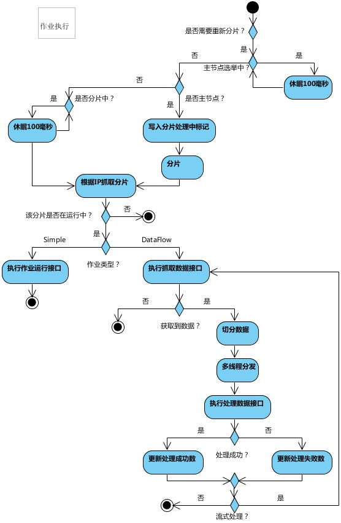
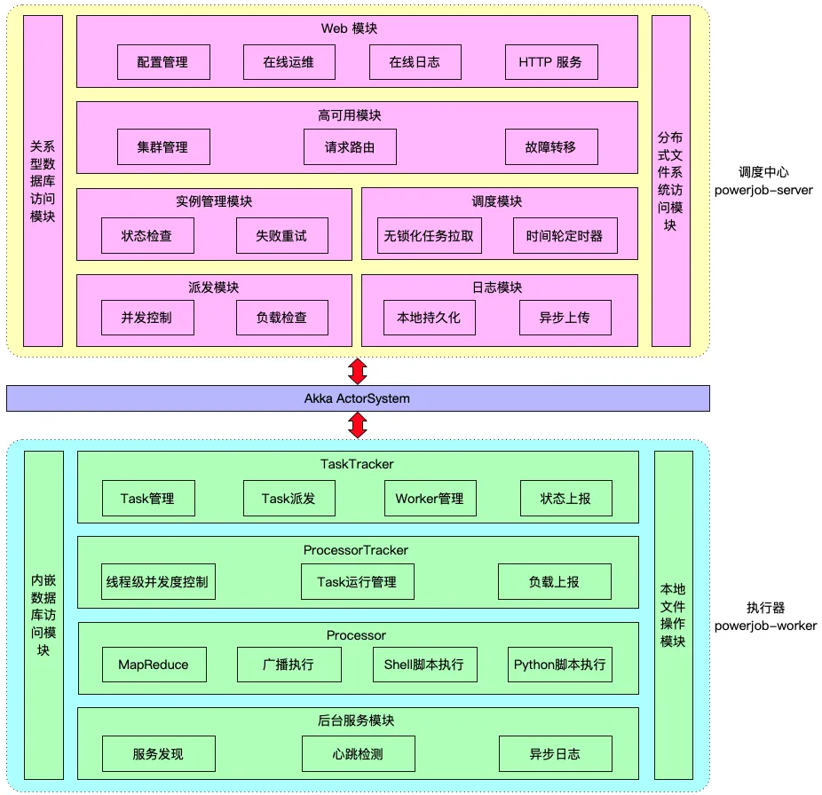
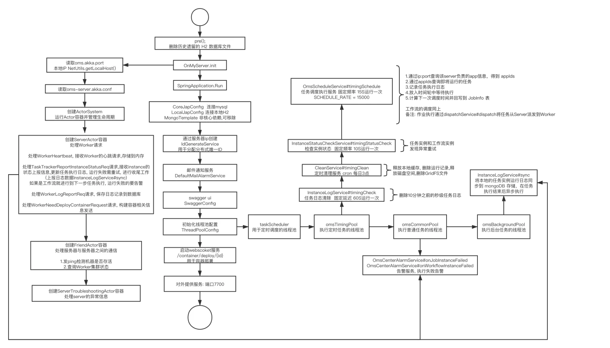
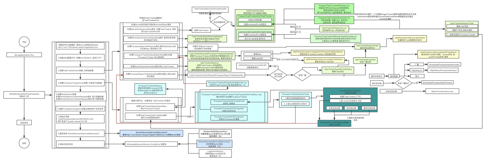

# 任务调度（分布式定时任务）
## 场景

任务调度是指系统在约定的特定时刻自动去执行指定任务的过程。
比如：
- 某新闻App每天上午10点给用户推送最新新闻。
- 某电商系统需要在每天上午 10 点，下午 3 点，晚上 8 点等不同适合发放一批优惠券。
- 某银行系统需要在信用卡到期还款日的前三天每天进行短信提醒。
- 某财务系统需要在每天凌晨 1点 结算前一天的财务数据，统计汇总。
- 某报表系统需要在每天凌晨 1点 读取业务数据生成报表数据。
- 12306 会根据车次的不同，而设置某几个时间点进行分批放票。

## 功能
一个任务调度平台，需要具备有以下几点功能：
- **核心功能**：定时调度、任务管理、日志监控
- **高可用**：集群、分片、失败处理
- **高性能**：分布式锁
- **扩展功能**：可视化运维、多语言、任务编排 
 
## 架构

以 `XXL-JOB` 和  `Elastic-job` 说明分布式任务调度的一些基本工作原理。

### 1. XXL-JOB
以下内容参考自：[xxl-job官网](https://www.xuxueli.com/xxl-job/)

XXL-JOB 是一个轻量级分布式任务调度平台，其设计理念主要是为了简化分布式系统中定时任务的管理和执行。
XXL-JOB 的架构提供了高效的任务调度能力，支持任务的分布式执行，以及故障转移和动态扩展的能力。

#### 1.1 核心组件

1. **调度中心**
    - 调度中心是 XXL-JOB 的核心部分，负责管理任务的注册、存储、调度和监控。它提供了一个用户界面，用于配置和管理任务的执行。
    - 调度中心还负责触发执行器运行相应的任务，并处理执行结果。

2. **执行器**
    - 执行器是任务执行的工作节点。在实际部署时，可以在不同的机器上部署多个执行器实例，以实现任务的分布式执行。
    - 执行器从调度中心接收执行命令，执行具体的任务，并将执行结果反馈给调度中心。

#### 1.2 架构原理

1. **任务调度流程**
    - 用户在调度中心定义任务，包括任务的执行脚本、调度策略（如CRON表达式）、失败处理策略等。
    - 调度中心根据任务配置的时间策略（如CRON表达式），触发任务的执行。
    - 当任务触发时，调度中心选择一个或多个执行器发送执行命令。
    - 执行器接收到执行命令后，开始执行具体的任务逻辑，并将执行结果返回给调度中心。
    - 调度中心接收执行结果，并进行相应的处理，如重试、告警等。

2. **负载均衡与故障转移**
    - XXL-JOB 支持自动记录每个执行器的负载情况，调度中心会根据这些信息智能选择负载较低的执行器执行任务，实现负载均衡。
    - 在执行器出现故障时，调度中心可以自动将任务转移到其他健康的执行器上，实现故障转移。

3. **动态扩展**
    - 执行器支持水平扩展。当任务量增加，导致现有执行器负载过高时，可以简单地增加更多的执行器实例，调度中心会自动识别并利用新增的执行器资源。

4. **高可用性设计**
    - XXL-JOB 调度中心通常部署为集群模式，以避免单点故障。通过数据库共享任务配置和执行记录，任何一个调度中心实例都能处理任务调度和管理。

5. **运行模式**
   - **Bean模式**:每个Bean模式任务都是一个Spring的Bean类实例，它被维护在“执行器”项目的Spring容器中。任务类需要加“@JobHandler(value=”名称”)”注解，因为“执行器”会根据该注解识别Spring容器中的任务。任务类需要继承统一接口“IJobHandler”，任务逻辑在execute方法中开发，因为“执行器”在接收到调度中心的调度请求时，将会调用“IJobHandler”的execute方法，执行任务逻辑。
   
   - **GLUE模式(Java)**:每个 “GLUE模式(Java)” 任务的代码，实际上是“一个继承自“IJobHandler”的实现类的类代码”，“执行器”接收到“调度中心”的调度请求时，会通过Groovy类加载器加载此代码，实例化成Java对象，同时注入此代码中声明的Spring服务（请确保Glue代码中的服务和类引用在“执行器”项目中存在），然后调用该对象的execute方法，执行任务逻辑。
   
   - **脚本模式**:脚本任务的源码托管在调度中心，脚本逻辑在执行器运行。当触发脚本任务时，执行器会加载脚本源码在执行器机器上生成一份脚本文件，然后通过Java代码调用该脚本；并且实时将脚本输出日志写到任务日志文件中，从而在调度中心可以实时监控脚本运行情况；目前支持的脚步语言包括：shell、python、php、nodejs、powershell 等。

6. **分片**
   
   XXL-JOB 的分片原理是任务分片执行的关键机制，它允许任务在多个执行器实例上并行执行，从而提高任务处理的效率和系统的伸缩性。以下是XXL-JOB分片原理的详细解释：  
   - **任务配置**：在XXL-JOB中定义任务时，可以配置分片参数，如分片总数。用户还可以通过自定义参数为每个分片指定特定的行为，例如，处理不同数据集或执行不同逻辑。

   - **触发任务**：当任务触发执行时，调度中心根据任务的分片总数生成相应数量的任务执行请求。每个请求都包含一个分片参数，如分片索引，用于指示该任务是哪个分片。

   - **分配任务**：调度中心将这些分片任务分配给注册在系统中的执行器。分配策略通常基于负载均衡，尽量确保所有执行器的负载相对平衡。

   - **执行任务**：每个执行器接收到分片任务后，根据分片参数执行相应的子任务。例如，分片参数可以决定执行器处理数据库中的哪一部分数据。

   - **汇总结果**：子任务执行完成后，执行结果会反馈给调度中心。根据任务配置，调度中心可能需要对结果进行汇总或直接处理。

   分片的优点  
   - **提高并行度**：分片使得任务可以在多个执行器上并行执行，显著提高任务处理速度。
   - **负载均衡**：通过智能的任务分配算法，分片有助于均衡各个执行器的负载，避免某些执行器过载而其他执行器空闲。
   - **灵活性**：分片任务可以根据业务需要灵活定义，如按地理位置、数据范围或其他业务逻辑进行分片。

### 2. Elastic-job
以下内容参考自：[Elastic-job官网](https://shardingsphere.apache.org/elasticjob/current/cn/overview/)

Elastic-Job 是一个分布式调度框架，由当当网开源，主要用于提高任务调度的可用性和扩展性。

Elastic-Job 的架构设计使其能够很好地处理大规模任务的分布式调度问题。

这个框架主要包括两个版本：Elastic-Job Lite 和 Elastic-Job Cloud，其中 Lite 版本用于轻量级无中心化解决方案，而 Cloud 版本为云环境提供更为强大的资源调度能力。

#### 2.1 核心组件

1. **调度协调器**
   - 调度协调器是整个Elastic-Job的配置中心和注册中心。它基于Zookeeper实现，负责任务的注册、状态存储和集群管理。
   - 调度协调器也负责任务执行状态的反馈，例如任务开始、完成或失败的状态更新。

2. **作业调度器**
   - 作业调度器是Elastic-Job的核心，负责根据配置的CRON表达式或者固定间隔时间触发任务的执行。
   - 它可以处理任务切片和分配，确保分布式环境中的任务均匀分布在不同的服务器上执行。

3. **执行器**
   - 执行器是实际执行任务逻辑的组件。它接收来自作业调度器的调度请求，并执行具体的任务。
   - 执行器可以部署在多个服务器上，支持横向扩展。

#### 2.2 架构原理

**1. 任务分片**

ElasticJob 中任务分片项的概念，使得任务可以在分布式的环境下运行，每台任务服务器只运行分配给该服务器的分片。 随着服务器的增加或宕机，ElasticJob 会近乎实时的感知服务器数量的变更，从而重新为分布式的任务服务器分配更加合理的任务分片项，使得任务可以随着资源的增加而提升效率。

任务的分布式执行，需要将一个任务拆分为多个独立的任务项，然后由分布式的服务器分别执行某一个或几个分片项。

举例说明，如果作业分为 4 片，用两台服务器执行，则每个服务器分到 2 片，分别负责作业的 50% 的负载，如下图所示

**分片项**
ElasticJob 并不直接提供数据处理的功能，而是将分片项分配至各个运行中的作业服务器，开发者需要自行处理分片项与业务的对应关系。 分片项为数字，始于 0 而终于分片总数减 1。

**个性化分片参数**
个性化参数可以和分片项匹配对应关系，用于将分片项的数字转换为更加可读的业务代码。

例如：按照地区水平拆分数据库，数据库 A 是北京的数据；数据库 B 是上海的数据；数据库 C 是广州的数据。 
如果仅按照分片项配置，开发者需要了解 0 表示北京；1 表示上海；2 表示广州。 
合理使用个性化参数可以让代码更可读，如果配置为 0=北京,1=上海,2=广州，那么代码中直接使用北京，上海，广州的枚举值即可完成分片项和业务逻辑的对应关系。

**2. 动态扩展与负载均衡**

ElasticJob 提供最灵活的方式，最大限度的提高执行作业的吞吐量。 
当新增加作业服务器时，ElasticJob 会通过注册中心的临时节点的变化感知到新服务器的存在，并在下次任务调度的时候重新分片，新的服务器会承载一部分作业分片，如下图所示。

将分片项设置为大于服务器的数量，最好是大于服务器倍数的数量，作业将会合理的利用分布式资源，动态的分配分片项。

例如：3 台服务器，分成 10 片，则分片项分配结果为服务器 A = 0,1,2,9；服务器 B = 3,4,5；服务器 C = 6,7,8。
如果服务器 C 崩溃，则分片项分配结果为服务器 A = 0,1,2,3,4; 服务器 B = 5,6,7,8,9。 
在不丢失分片项的情况下，最大限度的利用现有资源提高吞吐量。

**3. 容错和故障恢复**

当作业服务器在运行中宕机时，注册中心同样会通过临时节点感知，并将在下次运行时将分片转移至仍存活的服务器，以达到作业高可用的效果。
本次由于服务器宕机而未执行完的作业，则可以通过失效转移的方式继续执行。如下图所示。

将分片总数设置为 1，并使用多于 1 台的服务器执行作业，作业将会以 1 主 n 从的方式执行。 
一旦执行作业的服务器宕机，等待执行的服务器将会在下次作业启动时替补执行。
开启失效转移功能效果更好，如果本次作业在执行过程中宕机，备机会立即替补执行。

**4. 工作流程**

- 第一台服务器上线触发主服务器选举。主服务器一旦下线，则重新触发选举，选举过程中阻塞，只有主服务器选举完成，才会执行其他任务。
- 某作业服务器上线时会自动将服务器信息注册到注册中心，下线时会自动更新服务器状态。
- 主节点选举，服务器上下线，分片总数变更均更新重新分片标记。
- 定时任务触发时，如需重新分片，则通过主服务器分片，分片过程中阻塞，分片结束后才可执行任务。如分片过程中主服务器下线，则先选举主服务器，再分片。
- 通过上一项说明可知，为了维持作业运行时的稳定性，运行过程中只会标记分片状态，不会重新分片。分片仅可能发生在下次任务触发前。
- 每次分片都会按服务器IP排序，保证分片结果不会产生较大波动。
- 实现失效转移功能，在某台服务器执行完毕后主动抓取未分配的分片，并且在某台服务器下线后主动寻找可用的服务器执行任务。

**5. 核心数据结构**

- `config 节点`:作业配置信息，以 YAML 格式存储。
- `instances 节点`:作业运行实例信息，子节点是当前作业运行实例的主键。 作业运行实例主键由作业运行服务器的 IP 地址和 PID 构成。 作业运行实例主键均为临时节点，当作业实例上线时注册，下线时自动清理。注册中心监控这些节点的变化来协调分布式作业的分片以及高可用。 可在作业运行实例节点写入 TRIGGER 表示该实例立即执行一次。
- `sharding 节点`:作业分片信息，子节点是分片项序号，从零开始，至分片总数减一。 分片项序号的子节点存储详细信息。每个分片项下的子节点用于控制和记录分片运行状态。
- `servers 节点`:作业服务器信息，子节点是作业服务器的 IP 地址。 可在 IP 地址节点写入 DISABLED 表示该服务器禁用。 在新的云原生架构下，servers 节点大幅弱化，仅包含控制服务器是否可以禁用这一功能。 为了更加纯粹的实现作业核心，servers 功能未来可能删除，控制服务器是否禁用的能力应该下放至自动化部署系统。
- `leader 节点`:作业服务器主节点信息，分为 election，sharding 和 failover 三个子节点。 分别用于主节点选举，分片和失效转移处理。

### 3. PowerJob
以下内容参考自官网 [https://www.yuque.com/powerjob/guidence/intro](https://www.yuque.com/powerjob/guidence/intro)
#### 3.1 基本概念
**分组概念**

-appName：应用名称，建议与用户实际接入 PowerJob 的应用名称保持一致，用于业务分组与隔离。一个 appName 等于一个业务集群，也就是实际的一个 Java 项目。

**核心概念**

- 任务（Job）：描述了需要被 PowerJob 调度的任务信息，包括任务名称、调度时间、处理器信息等。
- 任务实例（ JobInstance，简称 Instance）：任务（Job）被调度执行后会生成任务实例（Instance），任务实例记录了任务的运行时信息（任务与任务实例的关系类似于类与对象的关系）。
- 作业（Task）：任务实例的执行单元，一个 JobInstance 存在至少一个 Task，具体规则如下：
   - 单机任务（STANDALONE）：一个 JobInstance 对应一个 Task
   - 广播任务（BROADCAST）：一个 JobInstance 对应 N 个 Task，N为集群机器数量，即每一台机器都会生成一个 Task
   - Map/MapReduce任务：一个 JobInstance 对应若干个 Task，由开发者手动 map 产生
- 工作流（Workflow）：由 DAG（有向无环图）描述的一组任务（Job），用于任务编排。
- 工作流实例（WorkflowInstance）：工作流被调度执行后会生成工作流实例，记录了工作流的运行时信息。

**扩展概念**

- JVM 容器：以 Maven 工程项目的维度组织一堆 Java 文件（开发者开发的众多 Java 处理器），可以通过前端网页动态发布并被执行器加载，具有极强的扩展能力和灵活性。
- OpenAPI：允许开发者通过接口来完成手工的操作，让系统整体变得更加灵活。开发者可以基于 API 便捷地扩展 PowerJob 原有的功能。
- 轻量级任务：单机执行且不需要以固定频率或者固定延迟执行的任务 （>= v4.2.1）
- 重量级任务：非单机执行或者以固定频率/延迟执行的任务 （>= v4.2.1）

**定时任务类型**

- API：该任务只会由 powerjob-client 中提供的 OpenAPI 接口触发，server 不会主动调度。
- CRON：该任务的调度时间由 CRON 表达式指定。
- 固定频率：秒级任务，每隔多少毫秒运行一次，功能与 java.util.concurrent.ScheduledExecutorService#scheduleAtFixedRate 相同。
- 固定延迟：秒级任务，延迟多少毫秒运行一次，功能与 java.util.concurrent.ScheduledExecutorService#scheduleWithFixedDelay 相同。
- 工作流：该任务只会由其所属的工作流调度执行，server 不会主动调度该任务。如果该任务不属于任何一个工作流，该任务就不会被调度。

#### 3.2 核心组件

**Server**

- PowerJob Server 是整个系统的核心，负责任务的调度、分发及监控。它还负责管理和维护所有的元数据，包括任务配置、执行记录等。
- PowerJob Server 通常部署为集群，以支持高可用性和负载均衡。这个集群通过数据库进行数据同步，确保各节点数据的一致性。

**Worker**

- PowerJob Worker 是部署在工作节点上的客户端，负责执行从 Server 分发下来的任务。
- Worker 可以是任意数量的工作节点，它们注册到 Server 并接收任务执行指令。

### 3.3 工作流程

**任务提交与存储**
   - 用户通过 UI 或 API 向 PowerJob Server 提交任务。这些任务配置信息被存储在中心数据库中。
   - 任务可以配置为立即执行、定时执行或者依据CRON表达式周期执行。

**任务调度**
   - PowerJob Server 内部维护一个调度系统，负责解析任务的时间规则（如 CRON 表达式），并在正确的时间触发任务执行。
   - 调度系统会计算出下一次执行时间，并等待到该时间点触发任务。

**任务分发**
   - 一旦任务被触发，Server 会从注册的 Agent 中选择合适的节点来执行任务。选择策略可能包括负载均衡、随机选择等。
   - Server 将任务详情和执行命令发送到选定的 Agent。

**任务执行**
   - 接收到任务的 Agent 会开始执行具体的任务逻辑，这可能涉及到运行脚本、启动应用程序或执行其他计算任务。
   - 任务执行过程中，Agent 会将执行日志和状态实时回报给 Server，用于监控和日志记录。

**结果处理和容错**
   - 任务执行完毕后，结果会被发送回 Server，并记录到数据库中。
   - 如果任务执行失败，Server 可以根据配置进行重试或者触发告警。

## 工具

- [xxl-job](https://github.com/xuxueli/xxl-job)
- [Elastic-job](https://github.com/apache/shardingsphere-elasticjob)
- [powerJob](https://github.com/PowerJob/PowerJob)
- [Saturn](https://github.com/vipshop/Saturn)
- [Quartz](https://github.com/quartz-scheduler/quartz)
