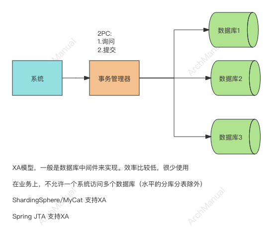
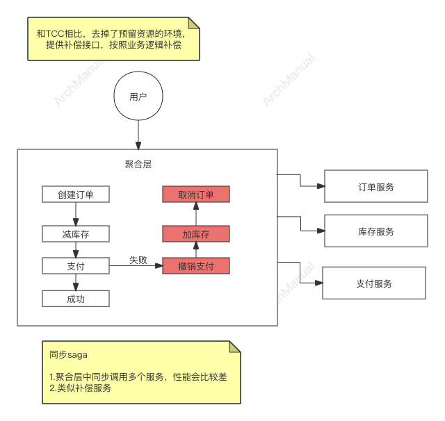
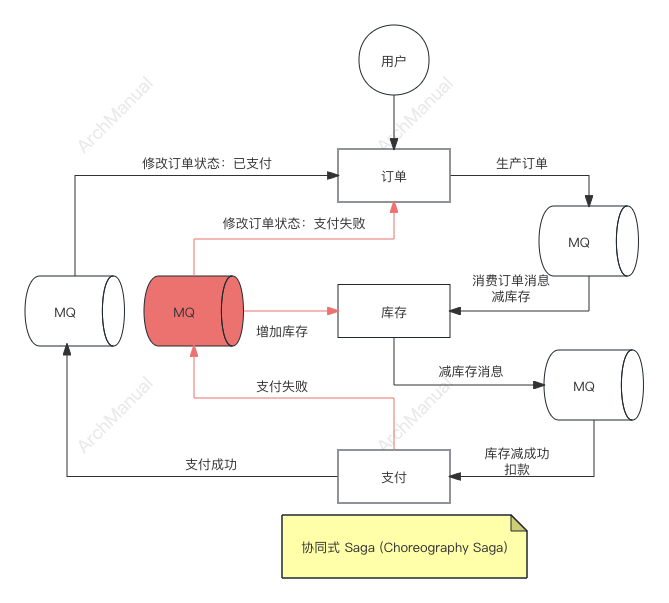
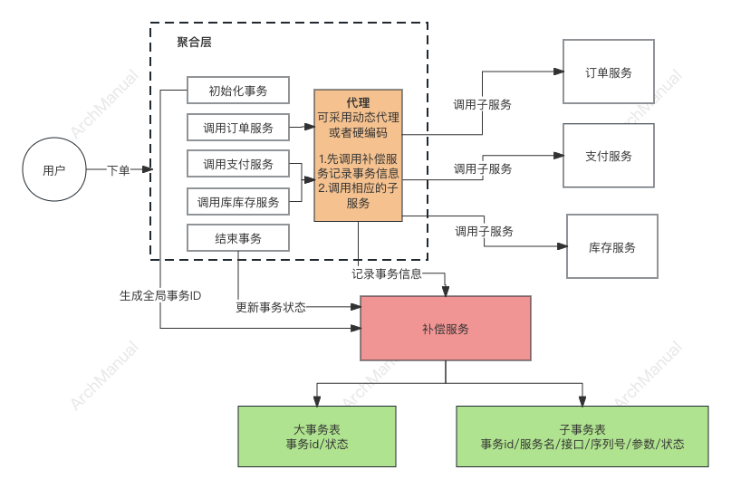
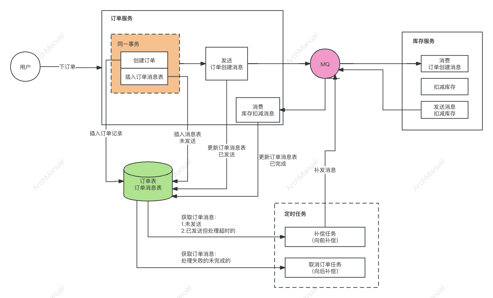
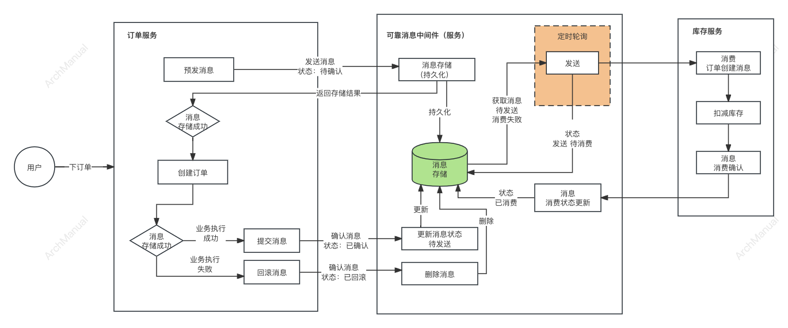

# 分布式事务

分布式事务是一种跨多个计算机系统或数据存储系统进行的事务。
在分布式系统中，各个组件可能分布在不同的服务器上，这些服务器可能位于不同的地理位置。
分布式事务确保了跨多个分布式组件或服务的操作要么全部成功，要么全部失败，从而保持了数据的一致性和完整性。

在一个分布式事务中，涉及的操作可能包括数据库更新、消息传递等，这些操作可能分布在不同的数据库或不同的微服务中。
由于分布式系统的复杂性，实现分布式事务比单个数据库系统的事务要困难得多。
分布式事务需要协调和管理不同系统之间的事务操作，确保所有参与的系统要么一起提交事务，要么一起回滚事务，即便是在面对部分系统失败的情况下也能保持这一点。

## 场景

分布式事务主要用于需要跨多个数据库、系统或网络服务协调工作的场景，以确保数据的一致性和完整性。以下是一些典型的分布式事务使用场景：

1. **跨数据库事务**：在涉及多个数据库的操作中，如果需要在所有数据库中保持数据的一致性，那么就需要使用分布式事务。例如，一个电商平台可能需要同时更新用户信息数据库和订单数据库来处理一个购买操作。

2. **微服务架构**：在微服务架构中，不同的服务可能使用独立的数据库。当一个业务流程需要通过调用多个服务来完成时，这些服务间的操作就需要通过分布式事务来协调，以确保整个业务流程的数据一致性。

3. **银行和金融系统**：银行和其他金融机构在处理跨账户或跨银行转账时，需要确保资金的准确移动和记录。这通常涉及到多个独立的系统和数据库，分布式事务在这些场景下是必不可少的。

4. **供应链管理**：供应链管理涉及多个系统的复杂交互，例如订单处理、库存管理、物流跟踪等。这些操作跨越多个数据库和应用，需要分布式事务来保证整个供应链中数据的一致性和准确性。

5. **电信网络**：电信运营商管理着庞大的网络设备和客户信息数据库。当用户进行呼叫转移、计费服务等操作时，可能需要跨多个系统进行数据更新，这时就需要依赖分布式事务来确保所有系统中数据的同步。

6. **跨云服务的操作**：随着云服务的普及，越来越多的企业采用多云策略，其数据和服务分布在不同的云平台上。在这些跨云服务的操作中，分布式事务可以确保跨平台的数据一致性。

## 功能性要求

实现分布式事务时，有几个核心的功能性要求，以确保跨多个分布式组件或服务的操作的一致性和可靠性。以下是一些主要的功能性要求：

1. **原子性（Atomicity）**：分布式事务需要保证原子性，即事务中的所有操作要么全部完成，要么全部不完成。这意味着，如果事务的任何部分失败，整个事务都需要回滚到事务开始之前的状态。

2. **一致性（Consistency）**：一致性确保事务的执行结果是系统从一个一致的状态转变到另一个一致的状态。即便是在分布式系统的环境下，所有的数据规则和约束也都必须得到满足。

3. **隔离性（Isolation）**：分布式事务需要在执行过程中保持隔离性，以防止并发事务相互干扰。这通常通过锁定事务中涉及的数据项来实现，以避免并发事务的冲突。

4. **持久性（Durability）**：一旦事务被提交，它对数据的更改就是持久的，即使系统发生故障也不会丢失。这通常需要事务系统能够在崩溃后恢复，并保留所有已提交事务的效果。

5. **分布式协调**：因为分布式事务涉及到多个系统或组件，需要一个协调机制来管理这些不同组件间的事务。这包括启动、执行、监控事务的进度，以及在出现故障时执行回滚或恢复操作。

6. **故障恢复**：分布式系统必须具备在出现故障（如网络问题、系统崩溃等）时对事务进行恢复的能力。这包括事务的自动重试、日志记录以便事后分析和恢复，以及失败事务的补偿机制。

7. **性能与可伸缩性**：分布式事务解决方案需要在保证事务ACID特性的同时，也要考虑到系统的性能和可伸缩性。这可能涉及到优化锁策略、减少网络通信开销、以及使用异步处理和批量操作等技术。

8. **跨系统事务支持**：分布式事务往往需要跨越不同的数据库系统、消息队列系统和其他存储/处理系统。因此，分布式事务框架需要能够支持多种类型的系统，并处理它们之间的事务。

## 实现方式
### 1. XA模式（ 两阶段提交 2PC 协议） （不推荐）

XA模式是基于XA规范的分布式事务处理方法，XA规范是由X/Open组织定义的，用于多个数据库或资源管理器之间进行分布式事务协调的标准。

XA模式允许一个全局事务跨多个资源管理器（如数据库、消息队列等），确保所有参与的资源管理器要么全部提交事务，要么全部回滚事务，从而实现分布式事务的原子性。

#### 原理

XA模式的核心是两阶段提交（2PC）协议，该协议包括两个阶段：

1. **准备阶段**（Prepare Phase）：事务协调器（通常是一个分布式事务管理器）向所有参与全局事务的资源管理器发送准备命令，要求它们准备提交事务。每个资源管理器在完成本地事务处理后，将事务数据写入日志（确保持久性），然后响应协调器，表示它已准备好提交或无法提交（如遇到错误）。

2. **提交/回滚阶段**（Commit/Rollback Phase）：如果所有资源管理器都报告已准备好提交，事务协调器则向所有参与者发送提交命令，完成事务。如果有任何一个资源管理器报告准备失败，事务协调器将向所有参与者发送回滚命令，取消事务。

#### 优点

1. **标准化**：XA是一个行业标准，由许多数据库和中间件支持，方便了不同系统间的集成。
2. **一致性保证**：通过两阶段提交确保了事务的原子性和一致性，跨多个资源管理器的操作要么全部成功，要么全部失败。
3. **广泛支持**：多数主流的关系数据库管理系统（RDBMS）和一些消息队列系统都支持XA接口，使得它们可以参与到分布式事务中。

#### 缺点

1. **性能开销**：两阶段提交协议增加了网络通信和锁定资源的时间，对系统性能有较大影响，特别是在高并发场景下。
2. **复杂性**：实现和管理XA事务相对复杂，需要适当的错误处理机制来应对各种异常情况，如网络问题或参与者崩溃等。
3. **资源锁定**：在准备阶段结束直到提交/回滚阶段完成期间，涉及的资源会被锁定，这可能导致长时间的资源锁定，影响系统的并发处理能力。
4. **故障恢复复杂**：如果在两阶段提交过程中出现故障（如协调器崩溃），恢复过程可能相当复杂，需要额外的机制来确保事务最终能够正确地提交或回滚。

虽然XA模式提供了一种标准化和可靠的方式来实现分布式事务，确保了数据的一致性，但其性能开销和实施复杂性也限制了它在某些场景下的应用。不推荐使用

#### 支持XA模式的中间件
- [ShardingSphere](https://github.com/apache/shardingsphere)
- [MyCat](https://github.com/MyCATApache/Mycat-Server)
- [Spring JTA](https://docs.spring.io/spring-boot/docs/2.1.13.RELEASE/reference/html/boot-features-jta.html)

### 2. TCC模式（ 三阶段提交 3PC 协议） 

TCC（Try-Confirm-Cancel）模式是实现分布式事务的一种补偿机制，适用于业务流程复杂、需要长时间运行的事务。
TCC将每个分布式事务分解为三个步骤：尝试（Try）、确认（Confirm）和取消（Cancel）。

#### TCC模式的原理

- **Try 阶段**：预留必要的业务资源，并检查所有参与者是否能够完成事务。这个阶段主要是为后续的Confirm做准备，不会真正执行业务逻辑。

- **Confirm 阶段**：如果所有参与者在Try阶段都成功了，那么就进入Confirm阶段，实际上提交事务，完成业务逻辑。

- **Cancel 阶段**：如果在Try阶段有任何一个参与者失败，那么就会执行Cancel阶段，回滚所有的操作，释放在Try阶段预留的资源。

#### 优点

1. **灵活性高**：TCC模式允许开发者自定义每个阶段的具体操作，提供了高度的灵活性，可以精细控制事务的每个环节。
2. **强一致性**：通过预留资源和确保所有参与者都能提交，TCC模式可以实现分布式事务的强一致性。
3. **适用性广**：适用于业务逻辑复杂和需要长时间运行的事务场景，特别是在微服务架构中。

#### 缺点

1. **实现复杂**：需要为每个参与者实现Try、Confirm和Cancel三个操作，增加了开发和维护的复杂性。
2. **资源锁定时间长**：在Try阶段会预留资源，直到Confirm或Cancel阶段才释放，这可能导致资源锁定时间过长，影响系统的吞吐量和并发能力。
3. **回滚风险**：如果在Confirm阶段之前系统发生故障，可能需要手动介入处理未完成的事务，增加了系统运维的难度。
4. **性能影响**：执行三个阶段的操作可能导致额外的性能开销，特别是在高并发场景下。

#### 开源实现

- [ByteTCC](https://github.com/liuyangming/ByteTCC)：一个基于Java的TCC事务管理器，支持Spring和JTA，并能够与现有的J2EE容器集成。

- [Hmily](https://github.com/dromara/hmily)：另一个Java实现的TCC框架，支持Spring Cloud和Dubbo，适用于微服务架构。

- [Seata](https://github.com/apache/incubator-seata)：阿里巴巴开源的一个分布式事务解决方案，支持多种事务模式，包括TCC。Seata为微服务架构提供了高效的事务管理支持。

- [tcc-transaction](https://github.com/changmingxie/tcc-transaction):是一款开源的微服务架构下的TCC型分布式事务解决方案，致力于提供高性能和简单易用的分布式事务服务

- [easy-transaction](https://github.com/QNJR-GROUP/EasyTransaction):一个分布式事务解决方案统一了TCC、SAGA、FMT（Seata/Fescar 自动补偿）、可靠消息、补偿等的使用。

### 3. Saga模式

分布式事务Saga的实现原理基于一系列本地事务的序列化执行，其中每个本地事务都有能够补偿（撤销）其影响的相应操作。

Saga通过在分布式系统中的不同服务之间顺序地执行这些本地事务来完成一个业务操作，如果在执行过程中某个步骤失败，Saga会执行之前成功步骤的补偿事务来回滚已执行的操作，以此来保证数据的一致性。

#### 工作流程

Saga工作流程可分为以下几个关键步骤：

1. **定义业务操作**：首先将一个复杂的分布式事务拆分为一系列更小、更易于管理的本地事务。每个本地事务都应该有一个对应的补偿事务，用于撤销其所做的操作。

2. **执行本地事务**：Saga按照一定的顺序开始执行这些本地事务。通常，这些事务会按照定义的业务流程顺序执行，以完成整个业务操作。

3. **处理失败**：如果任何本地事务失败，Saga将不会继续执行后续的本地事务。相反，它会开始执行之前已成功事务的补偿事务，按照与原始事务相反的顺序来撤销已完成的操作。

4. **补偿事务**：补偿事务是定义好的操作，用于撤销本地事务的效果。这些补偿操作确保在Saga执行过程中出现失败时，系统能够回滚到一致的状态。

#### 实现方式

Saga在处理分布式事务时，可以采用同步模式或异步模式来实现跨服务的操作，这两种模式在事务的执行流程和服务间的交互方式上有所不同。

##### 3.1 同步模式（Synchronous）

**原理**：

- 在同步模式中，每个步骤或本地事务的执行是顺序进行的，且一个步骤完成后，会直接调用下一个步骤，整个过程是阻塞的。
- 如果某个步骤失败，会立即按照逆序执行之前成功步骤的补偿操作，以回滚已经执行的操作。
- 同步Saga通常需要一个中心协调者（或者应用本身）来顺序执行每个事务步骤，等待每个步骤完成后再决定下一步是执行下一个事务还是执行补偿操作。

**优点**：

- 流程控制简单直观，易于理解和实现。
- 易于监控和调试，因为事务按照固定顺序执行。

**缺点**：

- 执行效率较低，因为每个事务必须等待前一个事务完成后才能执行。
- 系统吞吐量受限，不适合高并发场景。

##### 3.2 异步模式（Asynchronous）

**原理**：

- 在异步模式中，Saga的每个事务步骤可以通过事件或消息队列非阻塞地执行，不需要等待前一个步骤完成后才开始。
- 当一个事务步骤完成时，它会发布一个事件或将消息发送到消息队列中，这个事件或消息将触发下一个事务步骤的执行。
- 如果需要执行补偿操作，相应的补偿事件或消息也会被发布，以触发补偿事务的执行。

**优点**：

- 高效且具有较好的系统吞吐量，因为事务步骤可以并发执行。
- 更适合微服务架构，服务间耦合度低，增强了系统的伸缩性。

**缺点**：

- 实现复杂，需要有效的事件或消息管理系统来确保事务的顺序和补偿机制。
- 难以监控和调试，因为事务的执行不是线性顺序的。

在选择同步还是异步模式时，需要根据具体的业务需求、系统架构以及性能要求来决定。
异步模式虽然在性能和伸缩性方面具有优势，但增加了实现的复杂性和对消息系统的依赖。
同步模式则更加直观简单，但可能会限制系统处理能力。

#### 开源实现
- [Seata](https://github.com/apache/incubator-seata):阿里巴巴开源的一个分布式事务解决方案，支持多种事务模式，包括TCC。Seata为微服务架构提供了高效的事务管理支持。
- [cadence](https://github.com/uber/cadence):由Uber开源的一个分布式编排引擎，支持Saga模式。Cadence提供了复杂业务逻辑的编排和执行，以及故障恢复机制

### 4. 事务补偿服务

通过单独的事务补偿服务来实现分布式事务是一种基于补偿机制的方法，这种方法通过记录每个操作的反向操作（补偿操作）来实现分布式事务的一致性。
这种方式不依赖于传统的分布式事务协议（如两阶段提交），而是通过业务逻辑来保证数据的一致性。

通过单独的事务补偿服务来实现分布式事务提供了一种相对灵活的解决方案，适用于不能接受传统事务协议限制的复杂业务场景。
然而，这种方法要求开发者对业务逻辑有深入的理解，并能够设计有效的补偿机制来确保数据的最终一致性。

#### 原理

1. **聚合层**：聚合层一般是应用层，负责业务逻辑的实现，调用不同的业务服务，来实现整体的事务。业务逻辑开始之前，先初始化事务生成一个全局的事务ID，然后调用各个子业务服务完成各自业务逻辑，最后结束整个事务（更新事务状态）。

2. **代理层**：聚合层调用子服务时，可通过代理层来调用。代理层会先调用补偿服务记录子事务的状态，然后调用具体的子服务。代理的实现可以采用动态代理实现或者硬编码。

3. **补偿服务**：补偿服务负责记录大事务表（事务id、状态）和子事务表（事务ID、服务名、接口、序列号、参数、状态）的状态。并负责调度执行具体的补偿操作。

4. **补偿执行**：补偿的执行分为向前补偿和向后补偿。向前补偿：利用子事务中记录的数据，通过反射获取接口，进行正向补偿。 向后补偿：利用子事务中记录的数，通过反射获取补偿接口，进行反向补偿

5. **补偿接口的定义**：补偿接口和服务接口符合一定的规律，比如服务接口为 createOrder, 补偿接口为 createOrderBack。 通过自定义一个注解，在服务接口上增加这个注解，注解中指定补偿接口

#### 优点

1. **灵活性**：这种方法允许业务逻辑更加灵活，因为它不依赖于严格的事务  模型，更适合复杂的业务场景。

2. **减少锁定资源**：相比于传统的分布式事务协议，这种方法不需要在事务过程中长时间锁定资源，可以提高系统的并发性能。

3. **简化分布式事务管理**：通过避免使用如两阶段提交这样的复杂协议，可以简化分布式事务的管理，降低系统复杂度。

#### 缺点

1. **一致性保证较弱**：这种方法依赖于业务操作的补偿逻辑来保证一致性，如果补偿操作设计不当，可能导致数据一致性问题。

2. **补偿操作复杂**：对于一些操作，特别是那些影响广泛或难以直接撤销的操作，设计有效的补偿逻辑可能会非常复杂。

3. **错误处理复杂**：在某些情况下，补偿操作本身也可能失败，这就需要额外的逻辑来处理这种情况，进一步增加了系统的复杂度。

4. **性能开销**：服务之间同步调用，影响并发度.tong引入独立的补偿服务，增加了通讯成本

### 5. 本地消息表

本地消息表实现分布式事务的原理主要依靠数据库和应用程序共同维护一个本地的消息表，通过这个表来记录需要跨服务执行的操作。
这种方式通常用于保证跨服务调用的最终一致性。这个记录在数据库的消息和发送给消息队列中的消息通过消息id或者业务主键关联起来。

#### 假设场景

假设有一个电商系统，包括订单服务和库存服务。当用户下单购买商品时，系统需要先在订单服务中创建一个订单，然后减少库存服务中对应商品的库存量。
这两个操作涉及不同的服务，需要通过分布式事务来保证数据的一致性。

#### 实现原理

1. **订单服务操作**：
    - 用户提交购买请求。
    - 订单服务在本地数据库中创建一个新订单，并生成一个订单创建成功的事件。
    - 将这个事件记录到本地消息表中，此时消息状态为“未发送”或“待处理”。

2. **消息发送**：
    - 订单服务定期扫描本地消息表，找到所有“未发送”的消息。
    - 对于每条“未发送”的消息，订单服务尝试将消息发送到消息队列中。
    - 一旦消息成功发送到消息队列，订单服务将该消息标记为“已发送”。

3. **库存服务消费消息**：
    - 库存服务监听消息队列，接收到订单创建成功的消息后，开始处理减库存的操作。
    - 库存减少成功后，库存服务发送消息处理成功的确认。

4. **处理确认和失败**：
    - 如果库存服务成功处理了减库存操作并确认，库存服务发送一个确认消息到消息队列中。订单服务接收到这个确认后可以对消息进行进一步的处理，如标记为“已完成”或从本地消息表中删除。
    - 如果在任何步骤中发生失败，如库存减少失败，可以通过补偿机制（如取消订单）来保证数据一致性。

#### 优点

- **解耦服务**：订单服务和库存服务通过消息队列交互，减少了直接调用的耦合。
- **最终一致性**：即使某些步骤失败，也可以通过重试和补偿机制来达到最终的数据一致性。
- **提高可用性**：不同服务之间通过异步消息进行交互，提高了系统的响应速度和吞吐量。

#### 缺点

- **消息管理复杂**：需要额外的机制来保证消息的可靠发送和处理，包括消息状态管理、失败重试等。
- **最终一致性延迟**：在某些场景下，数据不会立即一致，需要一定时间达到最终一致性状态。
- **系统复杂度提高**：引入消息队列和本地消息表增加了系统的复杂度。

### 6. 消息事务（半消息）

半消息（Half Message）/ 事务消息 是一种在实现分布式事务中常用的技术，RocketMQ支持消息事务。

#### 原理

1. **发送半消息**：事务的发起方首先发送一个半消息到消息队列。这个半消息代表着一个待确认的事务，它不会被消费者立即消费。

2. **执行本地事务**：发送半消息后，发起方接着执行本地事务逻辑（如数据库操作）。

3. **消息确认或回滚**：
   - 如果本地事务执行成功，发起方会向消息队列发送一个确认，使得半消息变成可消费的消息。
   - 如果本地事务执行失败，发起方会通知消息队列回滚这个半消息，即删除或标记为不可用，以确保不会对系统造成影响。

4. **消费消息**：一旦半消息被确认，它就会变成普通消息，此时消费者可以从消息队列中消费这个消息并执行相应的业务逻辑。

#### 优点

1. **事务一致性**：半消息机制确保了只有当本地事务成功提交后，消息才会被消费，从而保证了分布式事务的一致性。
2. **高可用性和可靠性**：即使在服务宕机等异常情况下，消息也可以被存储在消息队列中，待服务恢复后继续处理，增强了系统的健壮性。
3. **解耦服务间的直接调用**：通过消息队列中间件，降低了服务间的直接依赖，提高了系统的伸缩性和可维护性。

#### 缺点

1. **实现复杂度**：需要在业务逻辑中嵌入消息的发送、确认和回滚逻辑，增加了实现的复杂度。
2. **最终一致性**：虽然保证了事务的一致性，但是基于异步消息，只能实现最终一致性，而非实时一致性。
3. **资源消耗**：维护半消息状态、处理消息确认和回滚等都需要额外的资源消耗，特别是在高并发场景下对性能和资源有一定的影响。
4. **幂等性处理**：消费者需要处理消息的幂等性，避免重复消费导致的数据不一致问题。

#### 中间件

- [RocketMQ](https://github.com/apache/rocketmq)

## 工具

推荐  
- [RocketMQ](https://github.com/apache/rocketmq)
- [Seata](https://github.com/apache/incubator-seata)
- [ShardingSphere](https://github.com/apache/shardingsphere)
- [MyCat](https://github.com/MyCATApache/Mycat-Server)

其他  
- [cadence](https://github.com/uber/cadence)
- [ByteTCC](https://github.com/liuyangming/ByteTCC)
- [Hmily](https://github.com/dromara/hmily)
- [tcc-transaction](https://github.com/changmingxie/tcc-transaction)
- [easy-transaction](https://github.com/QNJR-GROUP/EasyTransaction)
- [Spring JTA](https://docs.spring.io/spring-boot/docs/2.1.13.RELEASE/reference/html/boot-features-jta.html)