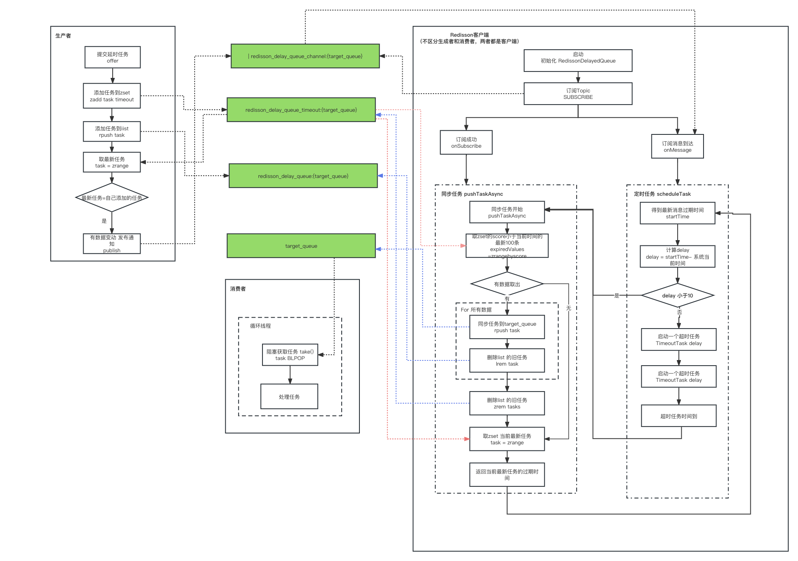

### 延迟任务
#### 场景
- **订单超时自动取消**：延迟任务典型的使用场景是订单超时自动取消。

#### 功能
- **精确的时间控制**：延时任务的时间控制要尽量准确。
- **可靠性**：延时任务的处理要是可靠的，确保所有任务最终都能被执行。这通常要求延时任务的方案使用的中间件最好要具备任务持久化的能力，以防系统故障导致任务丢失。

#### 方案
##### 1.基于消息队列
###### # RabbitMQ TTL + 死信队列
**原理**  

RabbitMQ 可以针对 Queue 和 Message 设置 x-message-tt，来控制消息的生存时间，如果超时，则消息变为 dead letter。
RabbitMQ 的 Queue 可以配置 x-dead-letter-exchange 和 x-dead-letter-routing-key（可选）两个参数，用来控制队列内出现了 dead letter，则按照这两个参数重新路由。  

**两个概念**
- TTL：即消息的存活时间。RabbitMQ可以对队列和消息分别设置TTL，如果对队列设置，则队列中所有的消息都具有相同的过期时间。超过了这个时间，可以认为这个消息就死了，称之为死信。
- DLX（死信Exchange）：一个消息在满足以下条件会进入死信交换机：  
（1）一个消息被Consumer拒收了，并且reject方法的参数里requeue是false。也就是说不会被再次放在队列里，被其他消费者使用。  
（2）TTL到期的消息。  
（3）队列满了被丢弃的消息。  

**流程图**


（1）定义一个BizQueue，用来接收死信消息，多个消费者进行业务消费。  
（2）定义一个死信交换机(DLXExchange)，绑定BizQueue，接收延时队列的消息，并转发给BizQueue。  
（3）定义一组延时队列DelayQueue_xx，分别配置不同的TTL，用来处理固定延时5s、10s、30s等延时等级，并绑定到DLXExchange。  
（4）定义DelayExchange，用来接收业务发过来的延时消息，并根据延时时间转发到不同的延时队列中。

**优缺点**
- 优点
    - 可以支持海量延时消息
    - 支持分布式处理。
- 缺点
    - 不灵活，只能支持固定延时等级。
    - 使用复杂，要配置一堆延时队列。   

###### # RabbitMQ 延迟队列插件(<font color="#dd0000">*推荐</font>)  

**原理**
- 延迟交换类型：该插件引入了一个新的交换类型 - `x-delayed-message`。这种类型的交换机类似于常规的直接（direct）、主题（topic）或扇形（fanout）交换机，但它增加了对消息延迟的支持。
参数`x-delayed-type` 定义了分发方式，可以是：direct、topic、fanout
```java
Map<String, Object> args = new HashMap<String, Object>();
args.put("x-delayed-type", "direct");
channel.exchangeDeclare("my-exchange", "x-delayed-message", true, false, args);
```
- 消息延迟属性：当生产者发送消息到一个延迟类型的交换机时，它可以在消息的头部信息中指定一个延迟时间（通常是以毫秒为单位的）。这是通过设置一个特殊的属性 `x-delay`来实现的。
如果`x-delay`未设置，则消息没有延迟。
```java
byte[] messageBodyBytes = "delayed payload".getBytes("UTF-8");
Map<String, Object> headers = new HashMap<String, Object>();
headers.put("x-delay", 5000);
AMQP.BasicProperties.Builder props = new AMQP.BasicProperties.Builder().headers(headers);
channel.basicPublish("my-exchange", "", props.build(), messageBodyBytes);
```
- 内部存储和调度：当延迟交换机接收到一个带有延迟的消息时，它不会立即将消息路由到绑定的队列中。相反，它会将消息存储在内部的数据结构（[Mnesia 数据库](https://www.erlang.org/doc/man/mnesia.html)，分布式数据库管理系统)）中，并根据其延迟时间进行调度。
- 延迟过期：一旦消息的延迟时间到达，交换机就会将消息路由到适当的队列。从此刻起，消息就变成了可供消费者正常消费的状态。
- 时间精度：延迟的精度和实际的延迟时间可能受到系统负载和RabbitMQ服务器的性能限制。  

**地址**  
[github](https://github.com/rabbitmq/rabbitmq-delayed-message-exchange)

**优缺点**  
- 优点
    - RabbitMQ消息服务可靠性高，消息处理速度快
    - 支持大数据量
    - 支持分布式横向扩展方便。
- 缺点：
    - 最大支持延时时间约为49天，超过这个时间的消息会被立即消费;
    - 超过百万的数据量不要使用(和RabbitMQ自身有关)，内存和CPU使用量急剧上升;
    - 需要确保版本兼容，不要使用过高版本的容易出现问题;

###### # RocketMQ 定时消息(<font color="#dd0000">*推荐</font>)
RocketMQ 4.x 只支持固定时长(1s 5s 10s 30s 1m 2m 3m 4m 5m 6m 7m 8m 9m 10m 20m 30m 1h 2h)的延时消息  
RocketMQ 5.x 支持任意时长的的延时消息，推荐使用

**原理**   

（1）在RocketMQ中，使用了经典的时间轮算法。通过TimerWheel来描述时间轮不同的时刻，通过TimerLog来记录不同时刻的消息。    

（2）TimerWheel中的每一格代表着一个时刻，同时会有一个firstPos指向这个刻度下所有定时消息的首条TimerLog记录的地址，一个lastPos指向这个刻度下所有定时消息最后一条TimerLog的记录的地址。并且，对于所处于同一个刻度的的消息，其TimerLog会通过prevPos串联成一个链表。
  

（3）当需要新增一条记录的时候，例如现在我们要新增一个 “1-4”。那么就将新记录的 prevPos 指向当前的 lastPos，即 “1-3”，然后修改 lastPos 指向 “1-4”。这样就将同一个刻度上面的 TimerLog 记录全都串起来了。
  

**优缺点** 

- 优点：
    - 精度高，支持任意时刻。
    - 使用门槛低，和使用普通消息一样。
- 缺点：
    - 时长的使用限制： 定时和延时消息的msg.setStartDeliverTime参数可设置40天内的任何时刻（单位毫秒），超过40天消息发送将失败。
    - 海量 消息场景，存储成本高： 在海量订单场景中，如果每个订单需要新增一个定时消息，且不会马上消费，额外给MQ带来很大的存储成本。
    - 如果将大量定时消息的定时时间设置为同一时刻，会造成系统压力过大，导致消息分发延迟，影响定时精度。
    
##### 2.基于Redis
###### # Redis Key过期监听

用 Redis 的 Keyspace Notifications。中文翻译就是键空间机制，就是利用该机制可以在 key 失效之后，提供一个回调，实际上是 Redis 会给客户端发送一个消息。是需要 Redis 版本 2.8 以上。

Redis过期通知也是不可靠的，不建议使用。

###### # 定时轮询 zset
利用 Redis 的 zset。zset 是一个有序集合，每一个元素（member）都关联了一个 score，通过 score 排序来取集合中的值。

**原理**  

 

- 添加延时消息
```java
//延迟3秒
Calendar cal1 = Calendar.getInstance();
cal1.add(Calendar.SECOND, 3);
int second3later = (int) (cal1.getTimeInMillis() / 1000);
AppTest.getJedis().zadd("OrderId",second3later,"OID0000001"+i);
```
- 定时轮询消费消息
```java
Jedis jedis = AppTest.getJedis();
while(true){
    Set<Tuple> items = jedis.zrangeWithScores("OrderId", 0, 1);
    if(items == null || items.isEmpty()){
        System.out.println("当前没有等待的任务");
        try {
            Thread.sleep(500);
        } catch (InterruptedException e) {
            // TODO Auto-generated catch block
            e.printStackTrace();
        }
        continue;
    }
    int  score = (int) ((Tuple)items.toArray()[0]).getScore();
    Calendar cal = Calendar.getInstance();
    int nowSecond = (int) (cal.getTimeInMillis() / 1000);
    if(nowSecond >= score){
        String orderId = ((Tuple)items.toArray()[0]).getElement();
        Long num = jedis.zrem("OrderId", orderId);
        if( num != null && num>0){
            consumeMsg(orderId);
        }
    }
}
```
注意此处代码，在并发场景下，删除Key，要判断是否真正删除成功。否则会造成消息的重复消费。
```java
Long num = jedis.zrem("OrderId", orderId);
if( num != null && num>0){
    consumeMsg(orderId);
}
```
- 消息处理
```java
void consumeMsg(orderId){
//具体业务逻辑
}
```

**优缺点**
- 优点  
    - 实现简单，redis内存操作，速度快，性能高，集群扩展方便
    - 可存储大量订单数据，持久化机制使得故障时通过AOF或RDB方式恢复
    - 适合对延迟精度要求不高的业务场景

- 缺点
    - 轮询线程如果不带休眠或休眠时间短，可能导致空轮询，CPU飙高，带休眠时间，休眠多久不好评估，休眠时间过长可能导致延迟不准确。
    - 处理消息异常时可能要实现重试机制
    - 可靠性问题，比如是先删数据在处理订单还是先处理订单再删除数据，处理异常时可能会导致数据丢失。

###### # Redisson 分布式延迟队列 RDelayedQueue (<font color="#dd0000">*推荐</font>)

**原理**
- 数据结构  
Redisson在实现延时队列的过程中用到以下数据结构：  

| key | value | 类型 | 用处 |
|:------|:-------|:------|
| redisson_delay_queue_timeout:{target_queue}	 | 任务 和 到期时间	    | zset         | 消息延时排序功能      |
| redisson_delay_queue:{target_queue}	    	 | 任务的原始顺序存储     	| list          | 如查询、删除指定任务   |
| redisson_delay_queue_channel:{target_queue}	 | 最新消息的到期时间	    | 发布订阅	    | 通知客户端启动同步数据的任务，该任务来获取过期任务存放到target_queue中      |
| target_queue		                             | 过期的任务	            | list          | 获取具体的过期任务 |

- 流程图 


在整个流程图，主要有三个重要角色，Redisson客户端、生产者、消费者。Redis的核心操作都是通过脚本的方式执行Redis命令，确保Redis操作的原子性。

（1）生产者  
生产者发布任务时，调用Redis命令，将Task添加到`redisson_delay_queue_timeout:{target_queue}`、`redisson_delay_queue:{target_queue}`。  
同时判断`redisson_delay_queue_timeout:{target_queue}`中的最新任务是不是自己添加及你去的任务，如果是，则向`redisson_delay_queue_channel:{target_queue}`发布最新的
过期时间。       
核心Redis操作脚本代码如下：
```java
@Override
public RFuture<Void> offerAsync(V e, long delay, TimeUnit timeUnit) {
    if (delay < 0) {
        throw new IllegalArgumentException("Delay can't be negative");
    }
    long delayInMs = timeUnit.toMillis(delay);
    long timeout = System.currentTimeMillis() + delayInMs;
    long randomId = ThreadLocalRandom.current().nextLong();
    return commandExecutor.evalWriteNoRetryAsync(getRawName(), codec, RedisCommands.EVAL_VOID,
            "local value = struct.pack('dLc0', tonumber(ARGV[2]), string.len(ARGV[3]), ARGV[3]);" 
          + "redis.call('zadd', KEYS[2], ARGV[1], value);"
          + "redis.call('rpush', KEYS[3], value);"
          // if new object added to queue head when publish its startTime 
          // to all scheduler workers 
          + "local v = redis.call('zrange', KEYS[2], 0, 0); "
          + "if v[1] == value then "
             + "redis.call('publish', KEYS[4], ARGV[1]); "
          + "end;",
          Arrays.asList(getRawName(), timeoutSetName, queueName, channelName),
          timeout, randomId, encode(e));
}
```
（2）Redisson客户端  
 无论是生产者和还是消费者，都是Redisson的客户端，客户端在启动的时候，会订阅`redisson_delay_queue_channel:{target_queue}`。    
 通过订阅该Topic，会收到订阅成功的通知和新消息到达的通知，这两个通知中会做两个很重要的事情：`定时任务`和`同步任务`。
 - 同步任务（pushTaskAsync）
    - 使用Redis命令`zrangebyscore`，取zset的score小于当前时间的最新100条，复制给 expiredValues
    - 判断expiredValues 是否有数据，有数据，说明有到期数据，则执行具体任务同步的操作，将过期的任务从 `redisson_delay_queue_timeout:{target_queue}` 和 
    `redisson_delay_queue:{target_queue}` 中移除，添加到 `target_queue`中。
    - 任务同步完成后，取 `redisson_delay_queue_timeout:{target_queue}`中最新的Task，将该Task的过期时间发布到Topic中 `redisson_delay_queue_channel:{target_queue}`
```java
@Override
protected RFuture<Long> pushTaskAsync() {
    return commandExecutor.evalWriteAsync(getRawName(), LongCodec.INSTANCE, RedisCommands.EVAL_LONG,
            "local expiredValues = redis.call('zrangebyscore', KEYS[2], 0, ARGV[1], 'limit', 0, ARGV[2]); "
          + "if #expiredValues > 0 then "
              + "for i, v in ipairs(expiredValues) do "
                  + "local randomId, value = struct.unpack('dLc0', v);"
                  + "redis.call('rpush', KEYS[1], value);"
                  + "redis.call('lrem', KEYS[3], 1, v);"
              + "end; "
              + "redis.call('zrem', KEYS[2], unpack(expiredValues));"
          + "end; "
            // get startTime from scheduler queue head task
          + "local v = redis.call('zrange', KEYS[2], 0, 0, 'WITHSCORES'); "
          + "if v[1] ~= nil then "
             + "return v[2]; "
          + "end "
          + "return nil;",
          Arrays.asList(getRawName(), timeoutSetName, queueName),
          System.currentTimeMillis(), 100);
}
```

  - 定时任务（scheduleTask）
     - 得到最新消息过期时间 startTime
     - 计算 `delay`时间，delay = startTime - System.currentTimeMillis()
     - 如果 `delay <= 10` 则执行同步任务
     - 如果 `delay >10` 则 开启一个定时任务，定时任务时间到了之后，执行同步任务
```java
long delay = startTime - System.currentTimeMillis();
if (delay > 10) {
    Timeout timeout = connectionManager.newTimeout(new TimerTask() {                    
        @Override
        public void run(Timeout timeout) throws Exception {
            pushTask();
            
            TimeoutTask currentTimeout = lastTimeout.get();
            if (currentTimeout.getTask() == timeout) {
                lastTimeout.compareAndSet(currentTimeout, null);
            }
        }
    }, delay, TimeUnit.MILLISECONDS);
    if (!lastTimeout.compareAndSet(oldTimeout, new TimeoutTask(startTime, timeout))) {
        timeout.cancel();
    }
} else {
    pushTask();
}
```

（3）消费者   
消费者启动一个线程，循环从 `target_queue` 获取任务，如果任务队列为空，则会阻塞，知道有数据时返回 。
- 阻塞方式从 `target_queue` 获取任务，使用Redis命令 `bpop`
- 获取到任务之后，做具体的任务执行

##### 3.定时轮询
用分布式任务中间件开启一个调度任务，某个一定的时间段执行一次任务，从数据库中获取过期数据，然后执行具体的业务逻辑。 
- 适合场景：时间精度要求不高、数据量不大
- 常用的一些分布式任务调度中间件：
    - [XXL-Job](https://github.com/xuxueli/xxl-job)
    - [Elastic-Job](https://shardingsphere.apache.org/elasticjob/)
**优缺点**
- 优点：这个方案的优点也是比较简单，实现起来比较容易 
- 缺点：时间不精准、无法处理大订单量、对数据库造成压力、分库分表问题。 

##### 4.内存队列
###### # JDK DelayQueue
DelayQueue 是一个 BlockingQueue （无界阻塞）队列，它本质就是封装了一个 PriorityQueue （优先级队列），并加上了延时功能。
DelayQueue 就是一个使用优先队列（PriorityQueue）实现的 BlockingQueue，优先队列的比较基准值是时间。即：  
DelayQueue = BlockingQueue + PriorityQueue + Delayed

使用比较简单
```java
DelayQueue<DelayedTask> delayQueue = new DelayQueue<>();
DelayedTask task1 = new DelayedTask("data 5 seconds", 5L);
DelayedTask task2 = new DelayedTask("data 1 seconds", 1L);
DelayedTask task3 = new DelayedTask("data 3 seconds", 3L);
// 2.向队列中添加延迟执行的任务
delayQueue.put(task1);
delayQueue.put(task2);
delayQueue.put(task3);
// 3.尝试执行任务
log.info("消息发送完成");
// 如果队列中没有到期的元素，take会阻塞等待
while (true) {
    DelayedTask task = delayQueue.take();
    log.info("获取延迟任务：task：{}", task.getData());
}
```
DelayQueue 实现了一个高效的本地延时队列， 但是缺点就是 不支持多节点部署，多节点部署时，不能同步消息，同步消费，也不能持久化

##### 5.时间轮算法
###### Netty的HashedWheelTimer
###### Kafka的TimingWheel
